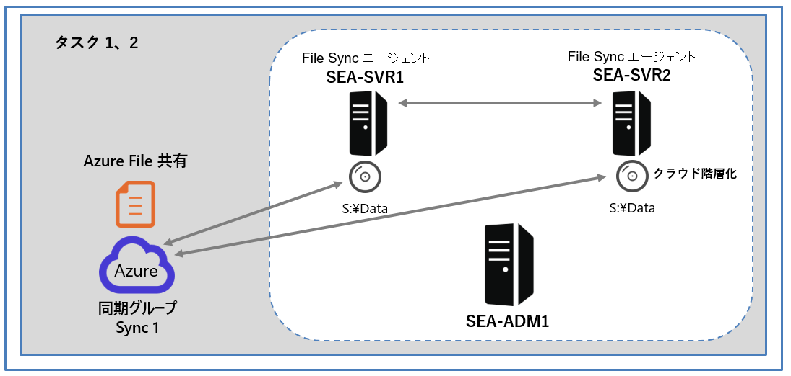

---
lab:
  title: 'ラボ : Azure File Sync の実装'
  module: 'Module 10: Implementing a hybrid file server infrastructure'
---

# <a name="lab-implementing-azure-file-sync"></a>Lab10d: レプリケーションの検証と、クラウドを使った階層化の有効化

## <a name="scenario"></a>シナリオ

DFS レプリケーションが File Sync に正常に置き換えられたことを確認した後、クラウドを使った階層化を有効にします。


## <a name="objectives"></a>目標とタスク

このラボを完了すると、次のことができるようになります。

- レプリケーションを確認し、クラウドを使った階層化を有効にする

この演習の主なタスクは次のとおりです。

1. File Sync を検証する
1. クラウドを使った階層化を有効にする


## <a name="estimated-time-60-minutes"></a>予想所要時間: 10 分

## <a name="architecture"></a>アーキテクチャの図



## <a name="lab-setup"></a>ラボのセットアップ

仮想マシン: **SEA-SVR1**、**SEA-SVR2**、**SEA-ADM1** を使用します。 

1. **SEA-ADM1** を選択します。
1. 次の資格情報を使用してサインインします。

   - ユーザー名: **Contoso\Administrator**
   - パスワード: **Pa55w.rd**

このラボでは、仮想マシンと Azure サブスクリプションを使用します。 


### <a name="task-1-verify-file-sync"></a>タスク 1: File Sync を検証する

1. **SEA-ADM1** で、ファイルエクスプローラーの、 **\\\\SEA-SVR1\\Data** と **\\\\SEA-SVR2\\Data** の内容を表示します。
1. **\\\\SEA-SVR1\\Data** に、任意の名前のファイルを作成します。
1.   **\\\\SEA-SVR2\\Data** にアクセスしているファイルエクスプローラーに切り替え、 前の手順で作成したファイルが表示されることを確認します。

   >**注  : 前の演習で DFS レプリケーションを削除しているため、この結果はFile Sync によって、レプリケートされています。**

### <a name="task-2-enable-cloud-tiering"></a>タスク 2: クラウドを使った階層化を有効にする

1.  SEA-ADM1 のAzure portal に切り替え、 **[Sync1同期グループ]** ページで、サーバーエンドポイントの **SEA-SVR2.Contoso.com** を選択します。

1. **[サーバー エンドポイントのプロパティ]** ウィンドウで、 **[クラウド階層化]** セクションを展開し、 **[クラウド階層化を有効にする]** を選択し、以下の値を設定してから **[保存]** をクリックします。指示がないものは規定値のままで構いません。

   | 設定                                                         | 値   |
   | ------------------------------------------------------------ | ---- |
   | ボリュームの空き領域ポリシー                                 | 90   |
   | 日付ポリシー                                                 | 有効 |
   | 指定した日数内にアクセスまたは変更されたファイルのみをキャッシュする | 14   |

   > 注 : **SEA-SVR2上のファイルは自動的に階層化されます。PowerShell を使用して、このプロセスをトリガーします。**

3. **SEA-ADM1** で、 [スタート] メニューから Windows PowerShell を起動し、以下のコマンドレットを順番に実行します。

   ```powershell
   Enter-PSSession -computername SEA-SVR2
   ```

   ```powershell
   fsutil file createnew S:\Data\report1.docx 254321098
   ```

   ```powershell
   fsutil file createnew S:\Data\report2.docx 254321098
   ```

   ```powershell
   fsutil file createnew S:\Data\report3.docx 254321098
   ```

   ```powershell
   fsutil file createnew S:\Data\report4.docx 254321098
   ```

   ```powershell
   Import-Module "C:\Program Files\Azure\StorageSyncAgent\StorageSync.Management.ServerCmdlets.dll"
   ```

   ```powershell
   Invoke-StorageSyncCloudTiering -Path S:\Data 
   ```

   

4. **SEA-ADM1** で、` \\SEA-SVR2\Data`を表示するファイル エクスプローラーに切り替えます。

5. ファイル エクスプローラー ウィンドウで、 **[タイトル] 列** を右クリックして、 **[More...]** を選択した後、 **[Attributes (属性)]** チェックボックスをオンにします。

6. **[Attributes (属性)] 列** を **[Name (名前)]** 列 の横にドラッグし、ファイルの日付と属性を確認します。


> **注 : [Attributes (属性)] 列 が [L] 、 [M] 、 [O] であるファイルは 、クラウドを使用した階層化が行われたことを表します。**

### <a name="results"></a>結果

この演習を完了すると、機能する File Sync レプリケーションが作成され、クラウドを使った階層化が構成されます。

