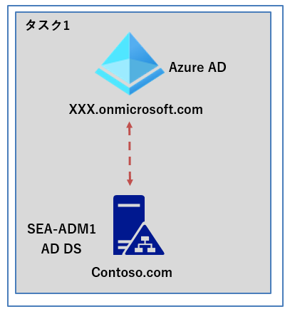
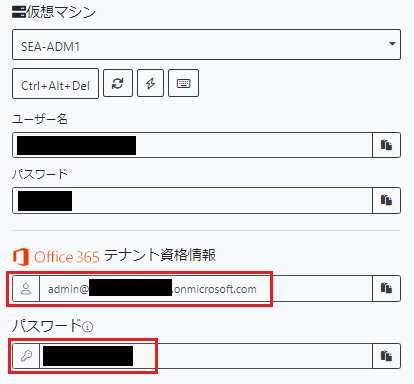
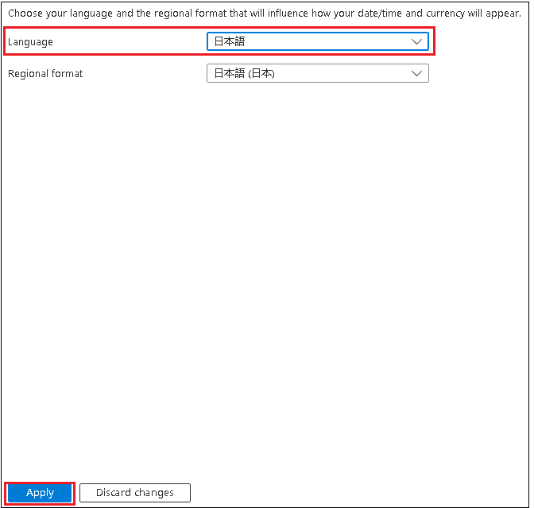
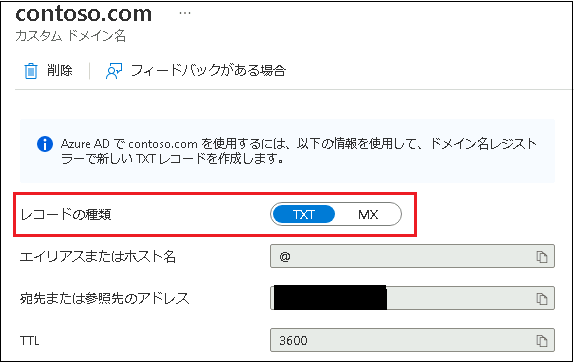

---
lab:
  title: 'ラボ: AD DS と Azure AD の統合の実装'
  module: 'Module 2: Implementing Identity in Hybrid Scenarios'
---

# Lab2a: AD DS 統合のための Azure AD の準備

## シナリオ

Contoso の Azure AD 環境で、オンプレミスの AD DS と統合する準備ができている必要があります。 カスタムAzure AD ドメイン名とグローバル管理者ロールのあるアカウントを作成して検証します。

## 目標とタスク

このラボを完了すると、次のことができるようになります。

- カスタム ドメインの追加や検証を含め、Azure AD とオンプレミス AD DS との統合の準備を行う

この演習の主なタスクは次のとおりです。

1. Azure でカスタム ドメイン名を作成する。
1. グローバル管理者ロールを持つユーザーを作成する。
1. グローバル管理者ロールを持つユーザーのパスワードを変更する。

## 予想所要時間: 10 分

## アーキテクチャの図 

## ラボのセットアップ

使用する仮想マシン: **SEA-ADM1**  

1. **SEA-ADM1** を選択します。
1. **SEA-ADM1** に次の資格情報を使用してサインインします。
   - ユーザー名: **Administrator**
   - パスワード: **Pa55w.rd**
   - ドメイン: **CONTOSO**

このラボでは、仮想マシンと Azure AD テナントを使用します。 

### タスク 1: Azure でカスタム ドメイン名を作成する。

1. **SEA-ADM1** で Microsoft Edge を起動してから、Azure Portal `https://portal.azure.com`に移動します。

1. ラボで提供されている資格情報を使用して、Azure portal にサインインします。

   

   

   **※ログイン時に 「Do this to reduce the number of times you are asked to sign in. (サインインの状態を維持すると、次回もう一度サインインする必要がなくなります。)」というメッセージが表示されますが、[Yes]、[NO]のどちらでも構いません。[NO]を選択すると、毎回認証が求められます。**

   

1. Azure Portalにログインが成功すると、 **「Welcome to Microsoft Azure」** のメッセージが表示されます。 **「Maybe later」** をクリックしツアーを終了させます。

   

   

   **※以下の手順でAzure Portal の言語設定を日本語に変更することができます。**

4. Azure Portal にログイン後、画面右上の歯車マークをクリックします。

5. **[Portal settings | Directories + subscriptions]** 画面の左ナビゲーションペインから **[Language + region]** を選択します。

6. **[Language]** のプルダウンから **[日本語]** を選択し、 **[Apply]** をクリックします。( **「Change language」** の確認メッセージが表示されたら **[OK]** を選択してください。)

7. Azure Portal のメニューが日本語表記に変更されます。

**注: Azure Portal内のすべてのメニューに日本語が適用されるまで、数時間要する場合があります。**

8. Azure portal の検索ボックス内に、**[Azure Active Directory]** と入力します。
9. 検索結果の [サービス] から **[Azure Active Directory]** を選択します。

10.   **[Azure Active Directory]** の左ナビゲーションペインの一覧から **[カスタム ドメイン名]**  を選択します。

11.  **[+ カスタムドメインの追加]** をクリックし、以下のカスタムドメイン名を入力します。

| カスタムドメイン名 | contoso.com |
| ------------------ | ----------- |

カスタムドメイン名を入力したら、 **[ドメインの追加]** をクリックします。

12. ドメインの検証に使用する DNS レコードの種類を確認したら、**[確認] はクリックせず**にそのままウィンドウを閉じます。

> **注: 一般には、DNS レコードを使用してドメインを確認しますが、このラボでは検証済みドメインを使用しません。**

**※カスタムドメインの確認まで出来たら、次の演習に進んでください。**

