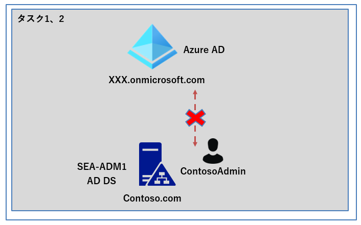
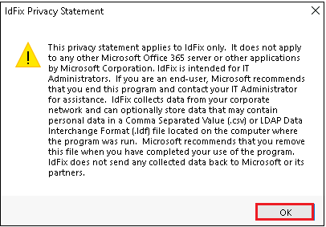

---
lab:
  title: 'ラボ: AD DS と Azure AD の統合の実装'
  module: 'Module 2: Implementing Identity in Hybrid Scenarios'
---

# Lab2b: AD DS と Azure AD の統合の実装

## シナリオ

Microsoft Azure Active Directory (Azure AD) を使用して Azure リソースへのアクセスを認証および承認したことで生じる管理と監視のオーバーヘッドについての懸念に対応するために、あなたは、オンプレミスの Active Directory Domain Services (AD DS) と Azure AD の間の統合をテストし、複数のユーザー アカウントの管理に、オンプレミスとクラウド リソースを組み合わせて使用することに関するビジネス上の懸念に対処できることを検証することにしました。

## 目標

このラボを完了すると、次のことができるようになります。

- IdFix DirSync エラー修復ツールの実行を含め、オンプレミス AD DS と Azure AD の統合の準備を行う。

## 予想所要時間: 10 分

## アーキテクチャの図

## ラボのセットアップ

使用する仮想マシン: **SEA-ADM1**  

1. **SEA-ADM1** を選択します。
1. **SEA-ADM1** に次の資格情報を使用してサインインします。
   - ユーザー名: **Administrator**
   - パスワード: **Pa55w.rd**
   - ドメイン: **CONTOSO**

このラボでは、仮想マシンと Azure AD テナントを使用します。 

## 演習 2: Azure AD 統合のためのオンプレミス AD DS の準備

### シナリオ

あなたは、既存の Active Directory 環境で Azure AD との統合の準備ができていることを確認する必要があります。 そのため、IdFix ツールを実行し、Active Directory ユーザーの UPN が Azure AD テナントのカスタム ドメイン名と一致することを確保します。

この演習の主なタスクは次のとおりです。

1. IdFix をインストールする。
1. IdFix を実行する。

### **事前準備 : ContosoAdminの [Display Name 属性] を確認する。**

1.  **SEA-ADM1** に CONTOSO\Administrator でサインインしている状態で、 **[Server Manager]** を起動し、 **[Tools (ツール)] - [Active Directory Users and Computers (Active Directory ユーザーとコンピューター)]** を選択します。

2.   **[Contoso.com] - [Users]** の順に展開し、「 **ContosoAdmin** 」をダブルクリックしてプロパティを確認します。

   

3.  **[General(全般)]** タブの **[Display Name (表示名)]** の属性が空欄になっていることを確認したら、 [OK] をクリックしてプロパティを閉じます。

   

### タスク 1: IdFix をインストールする

1. **SEA-ADM1** に CONTOSO\Administraor でサインインし Microsoft Edge を起動します。 Microsoft Edge が起動したら、`https://github.com/microsoft/idfix` にアクセスします。

1. **Github** ページを下にスクロールし、 **[ClickOnce Launch]** で、**[launch]** のリンク をクリックします。

   

1. Microsoft Edge のステータスバーに表示される **[Open file]** をクリックします。

   

1. [Application Install - Security Warning] ダイアログボックスで [Install] をクリックします。

   

1. **[ IdFix Privacy Statement ]** ダイアログ ボックスで、免責事項を確認し、**[OK]** を選択します。

   

### タスク 2: IdFix を実行する

1. **IdFix** が起動したら、ウィンドウから **[Query]** を選択します。

   

   **※ [Schema Warning] の警告ダイアログボックスが表示された場合は、 [Yes] をクリックして閉じてください。** 

1. オンプレミス Active Directory のオブジェクトの一覧で **[ERROR]** 列 および **[ATTRIBUTE (属性)]** 列を確認します。 

   

   > **注 :** このシナリオでは、**ContosoAdmin** の **displayName** の値が **空白 (Blank)** となっており、ツールが推奨する値 (ContosoAdmin) が **[UPDATE]** 列に表示されます。
   >
   > **注 : ERROR 列の Blank は、必要な個所(DisplayName) に値が入力されていないことを意味します。** 事前準備で確認した通り、ContosoAdminのDisplayName 属性は未入力の状態のため、入力を促されるエラーが表示されました。

   

1. **IdFix** ウィンドウの、**[ACTION] **ドロップダウン メニューで **[Edit (編集)]** を選択し、**[Apply (適用]** をクリックすると、推奨される値の変更が自動的に実装されます。

   

1. **[Apply Pending (保留中の適用)]** ダイアログボックスが表示されたら、 **[Yes]** をクリックします。

   

1. **IdFix** ウィンドウの、 **[ACTION]** ドロップダウン メニューが **[COMPLETE]** に変更されたことを確認し、ウィンドウを × で閉じます。

   

1. **[Active Directory Users and Computers (Active Directory ユーザーとコンピューター)]** に戻り、ContosoAdminのプロパティを再度確認すると、IdFixツールで更新した、**[Display Name (表示名)]** 属性に **「ContosoAdmin」** と入力されていることが確認できます。確認できたら、**[OK]** をクリックしてプロパティと、 **[Active Directory Users and Computers (Active Directory ユーザーとコンピューター)]** を閉じます。

   

**※ 結果が確認出来たら、次の演習に進んでください。**
