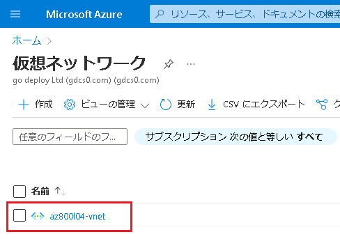
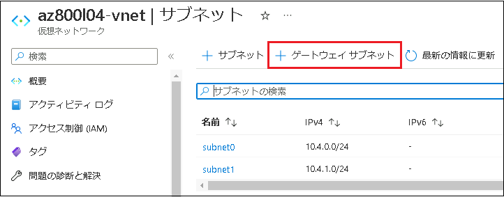

---
lab:
  title: 'ラボ: ハイブリッド シナリオでの Windows Admin Center の使用'
  module: 'Module 4: Facilitating hybrid management'
---

# <a name="lab-using-windows-admin-center-in-hybrid-scenarios"></a>ラボ: ハイブリッド シナリオでの Windows Admin Center の使用

## <a name="scenario"></a>シナリオ

オンプレミスと Microsoft Azure 仮想マシン (VM) でWindows Server を実行するハイブリッド環境で、 Windows Admin Center の機能をテストします。

目標は、マネージド システムの場所に関係なく、Windows Admin Center を一貫して使用できることの確認です。

## <a name="objectives"></a>目標

このラボを完了すると、次のことができるようになります。

- Azure ネットワーク アダプターを使用してハイブリッド接続をテストします。
- Azure で Windows Admin Center ゲートウェイをデプロイします。
- Azure で Windows Admin Center ゲートウェイの機能を検証します。

## <a name="estimated-time-90-minutes"></a>予想所要時間: 90 分

## <a name="lab-setup"></a>ラボのセットアップ

仮想マシン: **SEA-DC1** および **SEA-ADM1** を使用します。


1. **SEA-ADM1** を選択します。

1. 次の資格情報を使用してサインインします。

   - ユーザー名: **Administrator**
   
   - パスワード: **Pa55w.rd**
   
   - ドメイン: **CONTOSO**
   
     

このラボでは、仮想マシンと Azure サブスクリプションを使用します。 

## <a name="exercise-1-provisioning-azure-vms-running-windows-server"></a>演習 1: Windows Server を実行する Azure VM のプロビジョニング

### <a name="scenario"></a>シナリオ

オンプレミス サーバーと Azure 仮想ネットワークの間にハイブリッド接続を確立できることを確認する必要があります。 そのために、Azure Resource Manager テンプレートを使用して、Windows Server を実行する Azure VM をプロビジョニングし、検証します。

この演習の主なタスクは次のとおりです。

1. 事前に作成されたリソース グループを特定する。
1. Azure Resource Manager テンプレートを使用して Azure VM を作成する。


### **タスク 0: ラボ ファイルをダウンロードする**

1.  **SEA-ADM1** に、 **Contoso\Administrator** の資格情報でサインインします。

2.  **SEA-ADM1** の、**[スタート]** を展開し、 **Windows PowerShell(管理者)** を起動します。

3.  **Windows PowerShell** コンソール で次のコマンドレットを実行して、ラボ ファイルの最新バージョンを**SEA-ADM1** にダウンロードします。

   ```powershell
   ([System.Net.WebClient]::new()).DownloadFile('https://github.com/MicrosoftLearning/AZ-800-Administering-Windows-Server-Hybrid-Core-Infrastructure/archive/refs/heads/master.zip', 'C:\Labfiles\master.zip')
   ```

   ```powershell
   Expand-Archive -Path 'C:\Labfiles\master.zip' -DestinationPath 'C:\Labfiles'
   ```

   ```powershell
   Move-item -Path "C:\Labfiles\AZ-800-Administering-Windows-Server-Hybrid-Core-Infrastructure-master\Allfiles\Labfiles\Lab04*" -Destination "C:\Labfiles" -confirm:$false
   ```

> **注: BitsTransfer がエラーを返す場合は、エラーが表示されなくなるまで、コマンドを再実行してください。**

### <a name="task-1-create-an-azure-resource-group-by-using-an-azure-resource-manager-template"></a>タスク 1: 事前に作成されたリソース グループを特定する

1. **SEA-ADM1** で Microsoft Edge を起動し、Azure portal (`https://portal.azure.com`)を参照して、Azure AD のグローバル管理者ロールの資格情報でサインインします。(資格情報は、ラボの **[Home]** タブ内で提供されているものを使用してください。)

   ※Azure Portal にサインイン後は、必要に応じ、言語設定を日本語に変更できます。

1. Azure portal の右上にある **［Cloud Shell］** ペインで PowerShell セッションを開きます。

   

1.  **Bash** または **PowerShell** のいずれかを選択するように求められたら、**PowerShell** を選択します。

   

1. **「ストレージがマウントされていません」**というメッセージが表示されたら、**[* サブスクリプション]** の右にある  **[詳細設定]** を表示をクリックし、以下の項目を変更します。

   ※指示がないものは規定値のままで構いません。

   | 項目                       | 値                                                           |
   | -------------------------- | ------------------------------------------------------------ |
   | **Cloud Shell リージョン** | **米国東部**                                                 |
   | **リソースグループ**       | **既存のものを使用**                                         |
   | **ストレージアカウント**   | **一意であれば、任意の名前で構いません。<br />例 : mystorageaccount** |
   | **共有ファイル**           | **ストレージアカウントで設定した値と同じものを使用**         |

   項目を入力したら、 **[ストレージの作成]** をクリックします。

   ※ストレージの作成には数分かかります。

   **※ストレージの作成に失敗した場合、ストレージアカウントの名前が既に使用されていることが考えられます。ストレージアカウントの名前を別のものにして再度作成を実行してください。**

1. ストレージの作成が完了すると、 Cloud Shell が起動します。

   

1.  Cloud Shell ペインのツールバーで、**[ファイルのアップロード/ダウンロード]** アイコンをクリックし、ドロップダウン メニューで **[アップロード]** を選択します。

   

1. タスク1で準備した、 **C:\Labfiles\Lab04\L04-sub_template.json** ファイルを Cloud Shell ホーム ディレクトリにアップロードします。

   

### <a name="task-2-create-an-azure-vm-by-using-an-azure-resource-manager-template"></a>タスク 2: Azure Resource Manager テンプレートを使用して Azure VM を作成する

1.  Cloud Shell ペインで、**[ファイルのアップロード/ダウンロード]** アイコンをクリックし、ドロップダウン メニューで **[アップロード]** を選択します。Azure Resource Manager テンプレートとテンプレートに対応したパラメーター値が記述された、2つのファイルをアップロードします。

   **C:\\Labfiles\\Lab04\\L04-rg_template.json**

   **C:\\Labfiles\\Lab04\\L04-rg_template.parameters.json**

1.  Cloud Shell ペインで、次のコマンドレットを実行して、このラボで使用する、Windows Server を実行している Azure VM をデプロイします。

   ```powershell
   New-AzResourceGroupDeployment -Name az800l04rgDeployment -ResourceGroupName AZ80x-RG -TemplateFile $HOME/L04-rg_template.json -TemplateParameterFile $HOME/L04-rg_template.parameters.json
   ```

   >**注: Azure VM のデプロイが完了するまで待ってから、次の演習に進んでください。 デプロイには約 5 分程度かかります。**

1. 実行結果の **[ProvisioningState]** が **[Success]** となっていることを確認して、Cloud Shell ペインを閉じます。

1. Azure portalのツール バーに、**「Vnet」**と入力し、結果に表示される **[仮想ネットワーク]** を選択します。 

   

1. **「az800l04-vnet」**という仮想ネットワークがプロビジョニングされていることが確認できます。

   

1.  **「az800l04-vnet」**をクリックし、左のナビゲーションペインの一覧から **[サブネット]** を選択します。

   

1.  **[Subnets]** ページで **[+ Gateway subnet]** を選択します。

   

1.  **[サブネットの追加]** ページで、サブネット アドレス範囲に  **[10.4.3.224/27]** と入力して **[保存]** をクリックします。**※その他の項目は規定値のままで構いません。**

   

9. **「サブネットが正常に追加されました」** という通知が表示されたら、次の演習に進みます。

   

## <a name="exercise-2-implementing-hybrid-connectivity-by-using-the-azure-network-adapter"></a>演習 2: Azure ネットワーク アダプターを使用したハイブリッド接続の実装

### <a name="scenario"></a>シナリオ

オンプレミス サーバーと前の演習でプロビジョニングした Azure VM の間にハイブリッド接続を確立できることを確認する必要があります。 そこで、Windows Admin Center の Azure ネットワーク アダプター機能を使用して検証を行います。

この演習の主なタスクは次のとおりです。

1. Windows Admin Center を Azure に登録する。
1. Azure ネットワーク アダプターを作成する。

### <a name="task-1-register-windows-admin-center-with-azure"></a>タスク 1: Windows Admin Center を Azure に登録する

1. **SEA-ADM1** で Microsoft Edge を起動し、`https://SEA-ADM1.contoso.com` にアクセスします。

1.  **[Windows セキュリティ]** ダイアログ ボックスに次の資格情報を入力し、**[OK]** をクリックします。

   

   - ユーザー名: **CONTOSO\\Administrator**
   - パスワード: **Pa55w.rd**

   ※Windows Admin Center にサインイン後、必要に応じ言語設定を日本語に変更してください。

   

1.  **[すべての接続]** ページで、 **sea-adm1.contoso.com** エントリを選択します。

1.  **sea-adm1.contoso.com** ページの左のナビゲーションペインの一覧から、 **[ネットワーク]** を選択し、 **[ + Azure ネットワーク アダプターの追加 (プレビュー)]** をクリックします。

   

5.  **[ Azure ネットワーク アダプターの追加]** ウィンドウで、 **[ Windows Admin Center を Azure に登録する]** をクリックします。


6.  Windows Admin Center の Azure ペインの **[設定]** ページで、 **[登録]** を選択します。

   

7. **[Windows Admin Center で Azure の使用を開始する]** ウィンドウで、**「2.このコードをコピーします」**  で**[コピー]** を選択します。

   

8. **「3.コードを入力します」**のリンクをクリックし、コードの入力画面に前の手順でコピーしたコードを貼り付け、 **[次へ]** をクリックします。

9.  **[サインイン]** ページで、 Azure サブスクリプションへのサインインに使用したものと同じ資格情報を入力し、**[次へ]** を選択します。対応するパスワードを入力し、**[サインイン]** を選択します。

10.  **「Windows Admin Center にサインインしようとしていますか? 」** という画面に移管したら、**[続行]**を選択します。

11.  **「Welcome Admin Center」** と表示されたら、Microsoft Edge のタブは閉じます。

12.  **[Windows Admin Center で Azure の使用を開始する]**  ウィンドウで、Azure Active Directory アプリケーションが  **[新規作成]** に設定されていることを確認し、 **[接続]** をクリックします。

    

13. 「5. Azureにサインイン」 の手順で [サインイン] をクリックします。

14.  **「Permissions requested (要求されたアクセス許可)」**のポップアップメッセージが表示されたら、 **[Accept (同意する)]** をクリックします。

    **※エラーが発生した場合は、一度登録解除し、再度登録しなおしてください。**

### <a name="task-2-create-an-azure-network-adapter"></a>**タスク 2: Azure ネットワーク アダプターを作成する**

1. **SEA-ADM1** で、Windows Admin Center が表示されている Microsoft Edge ウィンドウを使用して、**sea-adm1.contoso.com** ページを参照し、左のナビゲーションペインの一覧から **[ネットワーク]** を選択します。

1.  Windows Admin Center の **[ネットワーク]** ページで、 **[ + Azure ネットワーク アダプターの追加 (プレビュー)]** エントリを再度選択します。

1.  **[ネットワーク アダプター設定の追加]** ウィンドウで、次の設定を行い、**[作成]** をクリックします(指示がない項目は既定値のままにします)。

   |設定|値|
   |---|---|
   |**サブスクリプション**|**既定で入力されたものを使用**|
   |位置情報|**EastUS**|
   |**仮想ネットワーク**|**az800l04-vnet**|
   |**ゲートウェイ サブネット**|**10.4.3.224/27**|
   |**ゲートウェイ SKU**|**VpnGw1**|
   |**クライアント アドレス空間**|**192.168.0.0/24**|
   |**認証証明書**|**自動生成された自己署名ルート証明書とクライアント証明書**|

   

1.  **SEA-ADM1** で、Azure portal のツール バーに **[仮想ネットワーク ゲートウェイ]** と入力し、結果に表示された **[仮想ネットワークゲートウェイ]** を選択します。

   

   

5.  **[仮想ネットワーク ゲートウェイ]** ページで、**WAC-Created-vpngw-ID_XX** で始まる新しい仮想ネットワーク ゲートウェイが表示されることを確認します。

   

>**注: Azure 仮想ネットワーク ゲートウェイのプロビジョニングには最大 45 分かかります。 プロビジョニングが完全に終了するのを待たず、次の演習に進んでください。**

## <a name="exercise-3-deploying-windows-admin-center-gateway-in-azure"></a>演習 3: Azure での Windows Admin Center ゲートウェイのデプロイ

### <a name="scenario"></a>シナリオ

Windows Admin Center を使用して、Windows Server OS を実行している Azure VM を管理する機能を検証します。 そのために、このラボの最初の演習で実装した Azure 仮想ネットワークに Windows Admin Center ゲートウェイをインストールします。

この演習の主なタスクは次のとおりです。

1. Azure で Windows Admin Center ゲートウェイをインストールする。
1. スクリプト プロビジョニングの結果を確認する。

### <a name="task-1-install-windows-admin-center-gateway-in-azure"></a>タスク 1: Azure で Windows Admin Center ゲートウェイをインストールする

1. **SEA-ADM1** で、Azure portal が表示されているブラウザー ウィンドウに切り替えます。

1. Azure portal の ［Cloud Shell］ ペインで PowerShell セッションを開始します。

1. Cloud Shell ペインで、**C:\\Labfiles\\Lab04\\Deploy-WACAzVM.ps1** ファイルを Cloud Shell ホーム ディレクトリにアップロードします。

1. Cloud Shell ペインから次のコマンドレットを実行し、Windows Admin Center プロビジョニング スクリプトで使用されるAzureRm PowerShell コマンドレットの互換性を有効にします。

   ```powershell
   Enable-AzureRmAlias -Scope Process
   ```

1. Cloud Shell ペインから、次のコマンドを実行して、Windows Admin Center プロビジョニング スクリプトの実行に必要な変数の値を設定します。

   ```powershell
   $rgName = 'AZ80x-RG'
   $vnetName = 'az800l04-vnet'
   $nsgName = 'az800l04-web-nsg'
   $subnetName = 'subnet1'
   $location = 'eastus'
   $pipName = 'wac-public-ip'
   $size = 'Standard_D2s_v3'
   ```

1. 次のコマンドレットを実行して、スクリプト パラメーター変数を設定します。

   ```powershell
   $scriptParams = @{
     ResourceGroupName = $rgName
     Name = 'az800l04-vmwac'
     VirtualNetworkName = $vnetName
     SubnetName = $subnetName
     GenerateSslCert = $true
     size = $size
     PublicIPAddressName = $pipName
     SecurityGroupName = $nsgName
   }
   ```

1. Cloud Shell ペインから次のコマンドレットを実行して、PowerShell リモート処理の証明書検証を無効にします (信頼されていないリポジトリからのインストールを確認するように求められたら、Aを入力して Enter キーを押します)。

   ```powershell
   install-module pswsman
   ```

   ```powershell
   Disable-WSManCertVerification -All
   ```

   

1. 次のコマンドを実行して、プロビジョニング スクリプトを起動します。

   ```powershell
   ./Deploy-WACAzVM.ps1 @scriptParams
   ```

1. ユーザーアカウントの名前を入力するように求められたら、「**Student**」と入力します。

1. ユーザーアカウントのパスワードを入力するように求められたら、「**Pa55w.rd1234**」と入力します。

    >**注: プロビジョニング スクリプトが完了するまで待ちます。 これには 5 分ほどかかる場合があります。**
    >
    >**注: 仮想ネットワークゲートウェイのプロビジョニングが完了していないとエラーとなります。エラーが返ってきた場合は、時間を空け仮想ネットワークゲートウェイのプロビジョニングが完了してから再度、8 の手順のコマンドレットを実行してください。**

1. スクリプトが正常に完了したことを確認し、Windows Admin Center インストールをホストする Azure VM の完全修飾名を含む URL を示す最後のメッセージに注意してください。

    >**注**: Azure VM の完全修飾名を記録します。 このラボで後ほど必要になります。

1. [Cloud Shell] ペインを閉じます。

#### <a name="task-2-review-results-of-the-script-provisioning"></a>タスク 2: スクリプト プロビジョニングの結果を確認する

1. Azure portal で、**AZ800-L0401-RG** リソース グループのページを参照します。
1. **AZ800-L0401-RG** ページの **[概要]** ページで、Azure VM **az800l04-vmwac** が含まれるリソースのリストを確認します。
1. **az800l04-vmwac | Networking** ページの **[受信ポートの規則]** タブで、TCP ポート 5986 で接続を許可する受信ポートの規則、および TCP ポート 443 で接続を許可する受信規則をそれぞれ示すエントリに注目します。

## <a name="exercise-4-verifying-functionality-of-the-windows-admin-center-gateway-in-azure"></a>演習 4: Azure での Windows Admin Center ゲートウェイの機能の確認

### <a name="scenario"></a>シナリオ

必須コンポーネントがすべて揃っている状態で、このラボの最初の演習でプロビジョニングした Azure 仮想ネットワークにデプロイした Azure VM をターゲットとして、WAC 機能をテストします。

この演習の主なタスクは次のとおりです。

1. Azure VM で実行されている Windows Admin Center ゲートウェイに接続する。
1. Azure VM の PowerShell リモート処理を有効にする。
1. Azure VM で実行されている Windows Admin Center ゲートウェイを使用して、Azure VM に接続する。

#### <a name="task-1-connect-to-the-windows-admin-center-gateway-running-in-azure-vm"></a>タスク 1: Azure VM で実行されている Windows Admin Center ゲートウェイに接続する

1. **SEA-ADM1** で Microsoft Edge を起動し、前の演習で特定した、Azure VM を実行している Windows Admin Center ゲートウェイに接続します。
1. メッセージが表示されたら、ユーザー名 **Student** とパスワード **Pa55w.rd1234** でサインインします。
1. Windows Admin Center の [すべての接続] ペインで、**az800l04-vmwac [ゲートウェイ]** を選択します。
1. Windows Admin Center の [概要] ペインを確認します。

#### <a name="task-2-enable-powershell-remoting-on-an-azure-vm"></a>タスク 2: Azure VM の PowerShell リモート処理を有効にする

1. **SEA-ADM1** で、Azure portal が表示されている Microsoft Edge ウィンドウで、**az800l04-vm0** Azure VM のページを参照します。
1. **az800l04-vm0** ページで、Windows リモート管理が無効な場合には **[ファイル名を指定して実行]** 機能で以下のコマンドを実行して有効にします。

   ```powershell
   winrm quickconfig -quiet
   ```

1. **[ファイル名を指定して実行]** 機能で以下のコマンドを実行して、Windows リモート管理受信ポートを開きます。

   ```powershell
   Set-NetFirewallRule -Name WINRM-HTTP-In-TCP-PUBLIC -RemoteAddress Any
   ```

1. **[ファイル名を指定して実行]** 機能で以下のコマンドを実行して、PowerShell リモート処理を有効にします。

   ```powershell
   Enable-PSRemoting -Force -SkipNetworkProfileCheck
   ```

#### <a name="task-3-connect-to-an-azure-vm-by-using-the-windows-admin-center-gateway-running-in-azure-vm"></a>タスク 3: Azure VM で実行されている Windows Admin Center ゲートウェイを使用して、Azure VM に接続する

1. **SEA-ADM1** で、**az800l04-vmwac** Azure VM で実行されている Windows Admin Center ゲートウェイのインターフェイスが表示されている Microsoft Edge ウィンドウで、**az800l04-vm0** という名前を使用してこの Azure VM への接続を追加します。
1. メッセージが表示されたら、ユーザー名 **Student**、パスワード **Pa55w.rd1234** を使用して認証します。
1. VM に正常に接続されたら、Windows Admin Center の **az800l04-vmwac** Azure VM の [概要] ペインを確認します。

## <a name="exercise-5-deprovisioning-the-azure-environment"></a>演習 5: Azure 環境のプロビジョニング解除

### <a name="scenario"></a>シナリオ

Azure 関連の料金を最小限に抑えるため、このラボでプロビジョニングした Azure リソースをプロビジョニング解除します。

この演習の主なタスクは次のとおりです。

1. Cloud Shell で PowerShell セッションを開始する。
1. ラボでプロビジョニングしたすべての Azure リソースを特定する。

#### <a name="task-1-start-a-powershell-session-in-cloud-shell"></a>タスク 1: Cloud Shell で PowerShell セッションを開始する

1. **SEA-ADM1** で、Azure portal が表示されている Microsoft Edge ウィンドウに切り替えます。
1. Azure portal の ［Cloud Shell］ ペインで PowerShell セッションを開きます。

#### <a name="task-2-identify-all-azure-resources-provisioned-in-the-lab"></a>タスク 2: ラボでプロビジョニングしたすべての Azure リソースを特定する

1. [Cloud Shell] ペインで次のコマンドを実行して、このラボで作成されたすべてのリソース グループのリストを表示します。

   ```powershell
   Get-AzResourceGroup -Name 'az800l04*'
   ```

1. 次のコマンドを実行して、このラボで作成したすべてのリソース グループを削除します。

   ```powershell
   Get-AzResourceGroup -Name 'az800l04*' | Remove-AzResourceGroup -Force -AsJob
   ```

   >**注**: このコマンドは非同期で実行されます (-AsJob パラメーターによって決定されます)。 そのため、同じ PowerShell セッション内ですぐに別の PowerShell コマンドを実行できるようになりますが、リソース グループが実際に削除されるまでに数分かかります。

### <a name="results"></a>結果

このラボを完了すると、Contoso の管理容易性とセキュリティの要件を満たす、Windows Server を実行している Azure VM がデプロイおよび構成されました。

### <a name="prepare-for-the-next-module"></a>次のモジュールの準備

次のモジュールの準備が完了したら、ラボを終了します。
