---
lab:
  title: 'ラボ: Windows Server での仮想化の実装と構成'
  module: 'Module 5: Hyper-V virtualization in Windows Server'
---

# Lab5: Windows Server での仮想化の実装と構成

## シナリオ

Contoso は、米国シアトルに本社があるグローバルなエンジニアリングおよび製造会社です。 IT オフィスとデータ センターはシアトルにあり、シアトル及び、シアトル以外もサポートしています。 Contoso では最近、Windows Server サーバーとクライアント インフラストラクチャを展開しました。 

現在使用率が低い物理サーバーが多数あるため、仮想化を展開して環境を最適化する予定です。 あなたは仮想マシン環境の管理に Hyper-V をどのように使用できるか確認するための概念実証を行うことにしました。この演習では、Hyper-V マネージャーと Windows Admin Center を使用して、仮想マシンを作成および構成します。 

## 目標とタスク

このラボを完了すると、次のことができるようになります。

- VM を作成して構成する。

この演習の主なタスクは次のとおりです。

1. Hyper-V 仮想スイッチを作成する
1. 仮想ハード_ディスクを作成する
1. 仮想マシンを作成する
1. Windows Admin Center を使用して仮想マシンを管理する

## 予想所要時間: 20 分

## アーキテクチャの図

## ラボのセットアップ

仮想マシン: **SEA-SVR1**、および **SEA-ADM1** を使用します。

1. **SEA-ADM1** を選択します。
1. 次の資格情報を使用してサインインします。

   - ユーザー名: **Administrator**
   - パスワード: **Pa55w.rd**
   - ドメイン: **CONTOSO**

### タスク 1: Hyper-V 仮想スイッチを作成する

1. **SEA-ADM1** で、**[スタート]** メニューを選択し、 **[Server Manager (サーバー マネージャー)]** を起動します。 

1. サーバー マネージャーの左のナビゲーションペインの一覧から、**[All Servers (すべてのサーバー)]** を選択します。 

1. **[サーバー]** リストで **SEA-SVR1** を選択してから、右クリックをして **[Hyper-V Manager (Hyper-V マネージャー) ]** を起動します。 

   

4. **SEA-SVR1.CONTOSO.COM** が選択された**Hyper-V マネージャー** であることを確認し、 **[Action (操作)]** ウインドウから **[Virtual Switch Manager (仮想スイッチ マネージャー) ]** を起動させます。

5. **[Virtual Switch Manager (仮想スイッチ マネージャー) ]** の **[ Create virtual switch (仮想スイッチの作成)]** ウィンドウで、**[Private (プライベート)]** を選択し、次に **[ Create virtual switch (仮想スイッチの作成)]**  をクリックします。

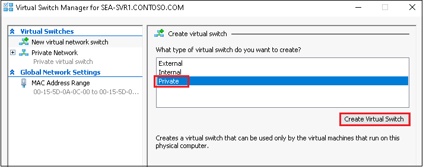

6. **[Virtual Switch Properties (仮想スイッチのプロパティ)]** ボックスで、次の設定を指定し、  **[ OK ]** をクリックします。

| 項目                             | 値                         |
| -------------------------------- | -------------------------- |
| **Name**                         | **Contoso Private Switch** |
| **Connection type (接続の種類)** | **Private network**        |

7. **SEA-SVR1** に次の設定で仮想スイッチを作成します。

- 名前: **Contoso Private Switch**
- 接続の種類: **プライベート ネットワーク**

**※このタスクを完了すると、Hyper-V の仮想スイッチを作成できたことが確認できます。**

### タスク 2: 仮想ハード ディスクを作成する

1. **SEA-ADM1** の  **[Hyper-V Manager (Hyper-V マネージャー)]** の **[Action (操作)]** から、 **[New (新規)]** を選択し、 **[Hard Disk (ハードディスク)]** を選択します。

   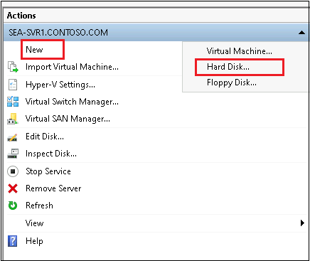

2.  ウィザードが起動し、**「Before you Begin page (開始する前に)」** と表示されたら、**[Next (次へ)]** をクリックします。

3.  **[Choose Disk Format (ディスク フォーマットの選択)]**  画面で、 **[VHD]** を選択し、 **[Next (次へ)]** を選択します。

   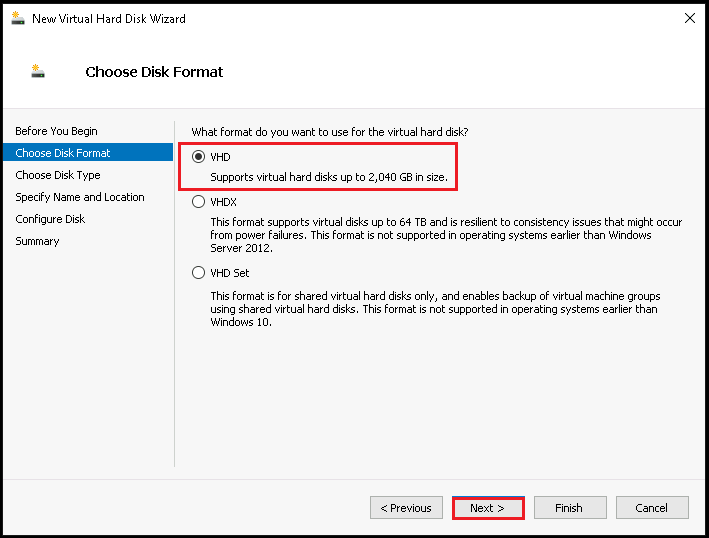

   

4.  **[Choose Disk Type (ディスク フォーマットの選択)]** ページで、 **[ Differencing (差分)]** を選択し、 **[Next (次へ)]** を選択します。

   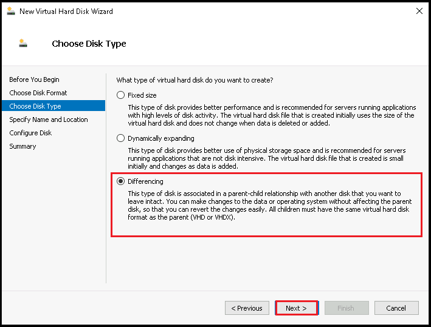

   

5.  **[Specify Name and Location (名前と場所の指定)]** ページで、次の設定を指定し、 **[Next (次へ)]** を選択します。

   | 項目         | 値          |
   | ------------ | ----------- |
   | **Name**     | **SEA-VM1** |
   | **Location** | **C:\Base** |

   

6.  **[Configure Disk (ディスクの構成)]**  ページの **[Location (場所)]** ボックスの **[Browse (参照)]** をクリックして、`C:\Base\BaseImage.vhd` を選択してから、**[Next (次へ)]** をクリックします。

   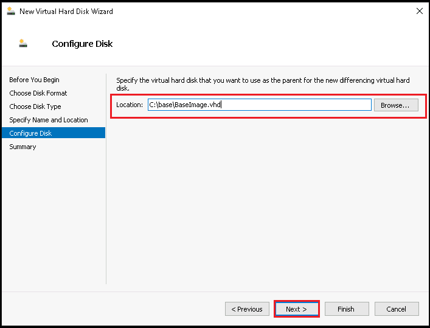

7.  **[Summary (概要)]** ページで、**[Finish (完了)]** を選択します。

**※このタスクを完了すると、差分の仮想ハードディスクが作成されます。**

### タスク 3: 仮想マシンを作成する

1.   **SEA-ADM1** の  **[Hyper-V Manager (Hyper-V マネージャー)]**  の **[Action (操作)]** から、 **[New (新規)]** を選択し、  **[Virtual Machine (仮想マシン)]** を選択します。新しい仮想マシン ウィザードが起動します。

1.  **[Before you Begin page (開始する前に)]** ページで、**[Next (次へ)]** を選択します。

1.  **[Specify Name and Location (名前と場所の指定)]** ページで **[SEA-VM1]** と入力し、 **[Store the virtual machine in a different location (仮想マシンを別の場所に保存する)]** の横にあるチェック ボックスをオンにします。

1. **[Location (場所)]** ボックス の横にある **[Browse (参照)]** から `C:\Base` 選択し、**[Next (次へ)]** を選択します。

   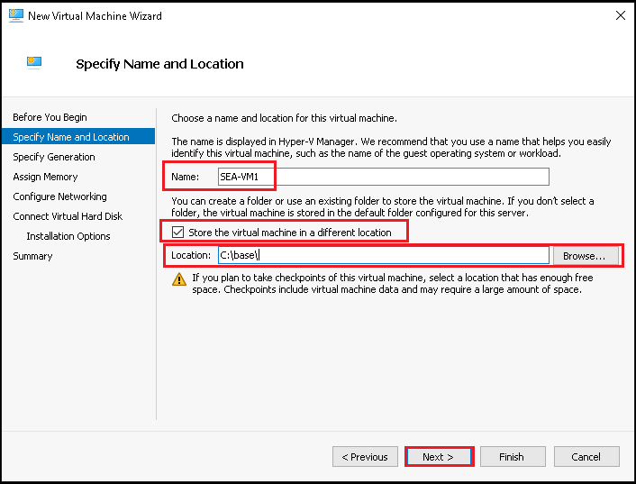

5. **[Specify Generation (世代の指定)]** ページで、 **[Generation 1 (第1世代)]** を選択し、 **[Next (次へ)]** をクリックします。

6. **[Assign Memory (メモリの割り当て)]** ページで **[4096]** と入力し、 **[Next (次へ)]** をクリックします。

7. **[Configure Networking (ネットワークの構成)]** ページで、**[Connection (接続)]** ドロップダウン メニューを選択し、**[Contoso Private Switch]** を選択して、**[Next (次へ)]** をクリックします。

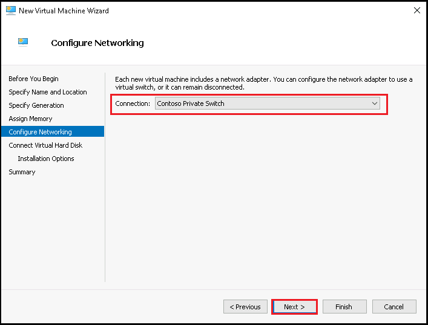

8. **[Connect Virtual Hard Disk (仮想ハード ディスクの接続)]** ページで、**[Use an existing virtual hard disk (既存の仮想ハード ディスクを使用する)]** を選択し、**[Browse (参照)]** を選択します。

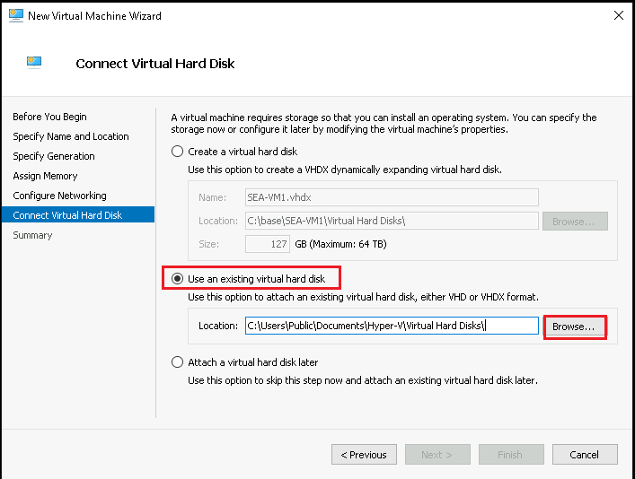

9. **[C:\Base]** を参照したあと、**[SEA-VM1.vhd]** を選択し、 **[Open (開く)]** をクリックして、 **[Next (次へ)]** クリックします。

10. **[Summary (概要)]** ページで、**[Finish (完了)]** をクリックします。仮想マシンのリストに **SEA-VM1** が表示されることを確認してください。

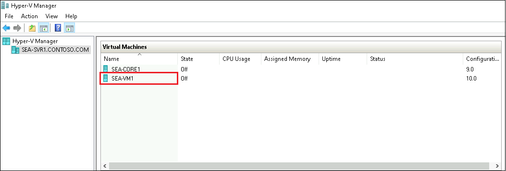

11. **SEA-VM1** を選択し、**[Action (操作)]** ウィンドウで、SEA-VM1の下の  **[Settings (設定)]** を選択します。

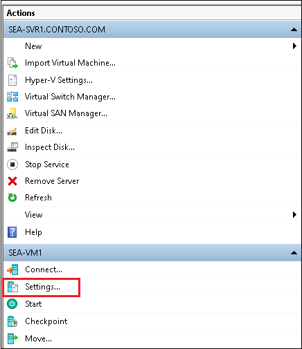

12. **[Hardware]** リストで、**[Memory]** を選択します。

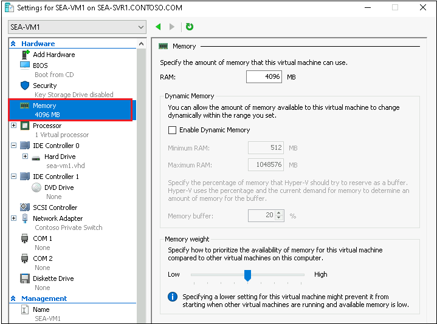

13. **[Dynamic Memory (動的メモリ)]** セクションで、**[Enable Dynamic Memory (動的メモリを有効にする)]** の横にあるチェック ボックスをオンにします。

14. **[Maximum RAM (最大 RAM)]** の横に **[4096]** と入力し、**[OK]** をクリックします。

15. **Hyper-V Manager** を閉じます。

### タスク 4: Windows Admin Center を使用して仮想マシンを管理する

1. **SEA-ADM1** で Microsoft Edge を起動し、`https://SEA-ADM1.contoso.com` で Windows Admin Center に接続します。 

1. **[Windows セキュリティ]** ダイアログ ボックスが表示されたら、次の資格情報を入力し、**[OK]** をクリックします。

   - ユーザー名: **CONTOSO\\Administrator**
   - パスワード: **Pa55w.rd**

   ※Windows Admin Center に接続後、必要に応じ、右上の歯車マークから言語設定を日本語に変更してください。

3. **[すべての接続]** ウィンドウで、 **[ + 追加]** を選択します。

4. **[リソースの追加または作成]** ウィンドウの **[サーバー]** タイルで、 **[追加]** をクリックします。

5. **[サーバー名]** テキスト ボックスに、 **[sea-svr1.contoso.com]** と入力します。

6. **[この接続では別のアカウントを使用する]** オプションを選択し、次の資格情報を入力して、 **[資格情報を含めて追加]** をクリックします。

   | 項目       | 値                        |
   | ---------- | ------------------------- |
   | ユーザー名 | **Contoso\Administrator** |
   | パスワード | **Pa55w.rd**              |

   

   

7. **[すべての接続]** ウィンドウの一覧から、 **[sea-svr1.contoso.com]** を選択し、左ペインの  **[ツール]** リストから、**[仮想マシン]** を選択します。 **[概要]** タブを選択すると、仮想マシンのパフォーマンスなどが確認できるようになっています。

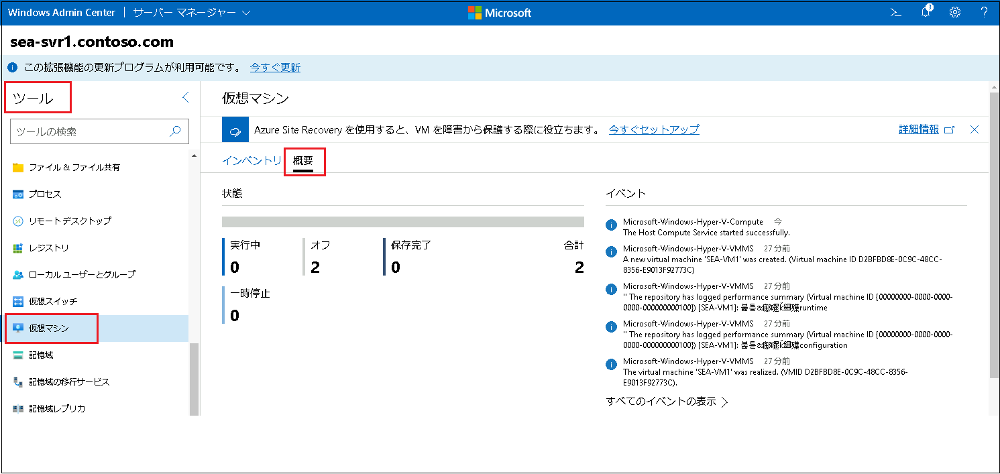

8. **[インベントリ]** タブを選択し、**SEA-VM1** が含まれていることを確認します。

9. **SEA-VM1** を選択した後、**[設定 (歯車マーク)]** を選択し、**[ディスク]** をクリックします。

10. ディスクページの一番下までスクロールし、 **[ + ディスクの追加]** を選択します。

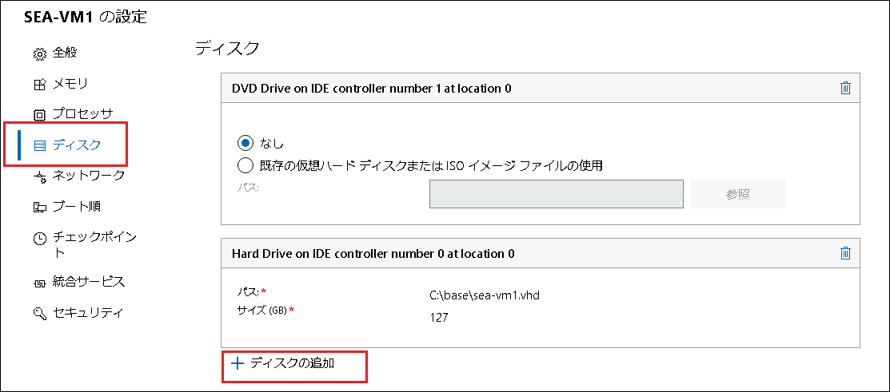

11. **[新しい仮想ハードディスク]** を選択します。

12. **[新しい仮想ハード ディスク]** ウィンドウの **[サイズ (GB)]** テキスト ボックスに **[ 5 ]** と入力し、他の設定を既定値のままにして、 **[作成]** をクリックします。

    

13. **[ディスク設定の保存]** を選択し、**[閉じる]** をクリックします。

14. **SEA-VM1** の **[プロパティ]** ウィンドウに戻り、 **[電源]** を選択し、 **[開始]** をクリックして **SEA-VM1** を開始します。

15. **[プロパティ]** ウィンドウを下にスクロールして、実行中の VM の統計情報を監視できることを確認します。

16. ブラウザを更新し、 **[電源] - [シャットダウン]** の順に選択し、 **[はい]** を選択して確認します。

17. **SEA-VM1** の状態が **[停止]** になったことを確認します。

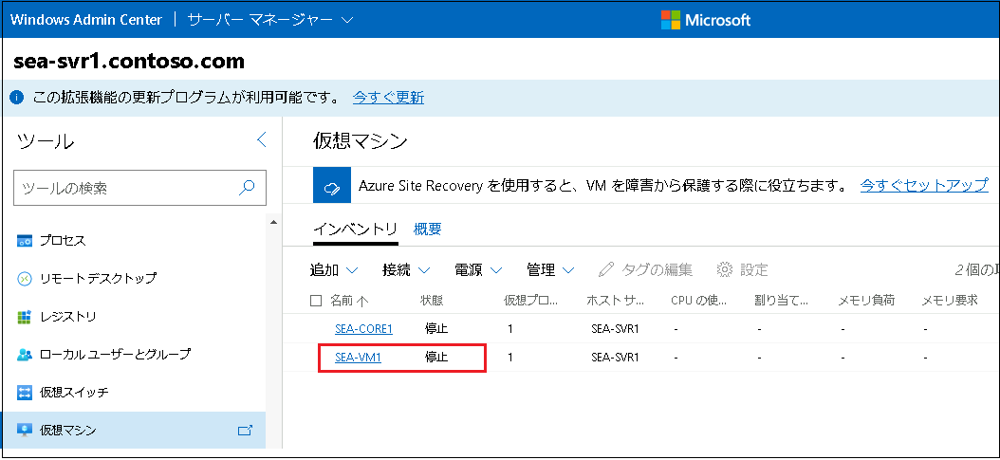

### 結果

このラボを完了すると、Hyper-V マネージャーと Windows Admin Center を使用して、仮想スイッチ、仮想ハード ディスク、仮想マシンの管理したことになります。

