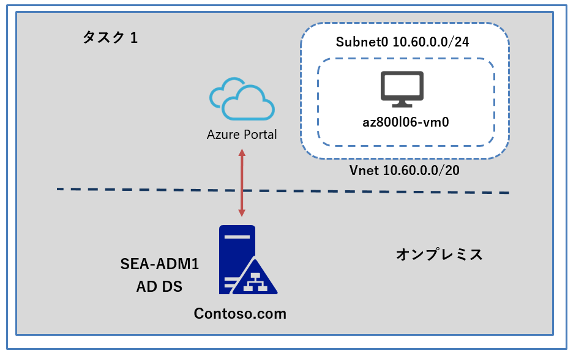

---
lab:
  title: 'ラボ: Azure VM での Windows Server のデプロイと構成'
  module: 'Module 6: Deploying and Configuring Azure VMs'
---

# Lab6a: Azure VM のデプロイ

## シナリオ

Azure ベースの操作を効率化するために、Azure VM へ Windows Server をデプロイして実装することにしました。 デプロイは、情報セキュリティ チームの要件に準拠し、高可用性を含む Contoso, Ltd. の意図されたターゲット運用モデルに準拠する必要があります。

この演習の主なタスクは次のとおりです。

1. Azure portal を使用して Azure VM を作成する。

## 目標とタスク

このラボを完了すると、次のことができるようになります。

- Azure VM を作成する。

この演習の主なタスクは次のとおりです。

1. Azure portal を使用して Azure VMを作成する。

## 予想所要時間: 10 分

## アーキテクチャの図

## ラボのセットアップ

仮想マシン:  **SEA-ADM1** を使用します。

1. **SEA-ADM1** を選択します。
1. 次の資格情報を使用してサインインします。

   - ユーザー名: **Contoso\Administrator**
   - パスワード: **Pa55w.rd**

このラボでは、 仮想マシンと Azure サブスクリプションを使用します。

### タスク 1: Azure portal を使用して Azure VMを作成する

1. **SEA-ADM1** で Microsoft Edge を起動し、Azure portal (`https://portal.azure.com`)を参照して、Azure  プライマリユーザーの資格情報でサインインします。(資格情報は、ラボの **[Home]** タブ内で提供されているものを使用してください。)

2. **SEA-ADM1** のAzure portal で、ツールバーの  **[リソース、サービス、およびドキュメントの検索]** テキスト ボックスで、 **[Virtual machines]** を検索して選択します。

   

   

3. **[仮想マシン]** ページで、 **[ + 作成]** を選択し、 **[ Azure 仮想マシン]** を選択します。

   

   

4. **[仮想マシンの作成]** ページの **[基本]** タブで、次の設定を指定します。指示がないものは規定値のままで構いません。

   > **注 : このタスクでは仮想マシンの作成はしません。 [確認および作成] はクリックしないでください。**

|設定|値|
|---|---|
|サブスクリプション|**予め設定されたものを使用してください**|
|リソース グループ|**AZ800-L060** をプルダウンから選択してください|
|仮想マシン名|**az800l06-vm0**|
|リージョン|**East US (米国東部)**|
|可用性のオプション|**インフラストラクチャの冗長性は必要ありません**|
|セキュリティの種類|**Standard**|
|イメージ|**Windows Server 2022 Datacenter: Azure Edition - Gen2**|
|Azure スポット割引で実行する|**チェックしない**|
|サイズ|**Standard_D2s_v3**|
|ユーザー名|**Student**|
|パスワード|**Pa55w.rd1234**|
|パブリック受信ポート| **RDP (3389) 、 HTTPS (443)**                            |
|既存の Windows Server ライセンスを使用しますか|**チェックしない**|

4.  **[次へ: ディスク > ]** を選択し、**[仮想マシンの作成]** ページの **[ディスク]** タブで次の設定を指定し、その他の設定はすべて既定値のまま、**[次 : ネットワーク]** をクリックします。

   | 設定              | 値                                       |
   | ----------------- | ---------------------------------------- |
   | OS ディスクの種類 | **Standars HDD(ローカル冗長ストレージ)** |

5.  **[仮想マシンの作成]** ページの **[ネットワーク]** タブで、**[仮想ネットワーク]** テキスト ボックスの下にある、 **[新規作成]** をクリックします。

   

   

6.  **[仮想ネットワークの作成]** ページで、次の設定を指定し **[ OK ]** をクリックします。※指示がないものは規定値のままで構いません。

   | 設定           | 値                |
   | -------------- | ----------------- |
   | 名前           | **az800l06-vnet** |
   | アドレス空間   | **10.60.0.0/20**  |
   | サブネット名   | **subnet0**       |
   | サブネット範囲 | **10.60.0.0/24**  |

   

   

7.  **[仮想マシンの作成]** ページに戻り、 **[ネットワーク]** タブで次の設定を指定します。指示がないものは規定値のままで構いません。設定を確認したら、 **[次 :  管理]** をクリックします。

   | 設定                                   | 値                 |
   | -------------------------------------- | ------------------ |
   | パブリック IP                          | **規定値**         |
   | NIC ネットワーク セキュリティ グループ | **Basic**          |
   | 高速ネットワークを有効にする           | **チェックを外す** |

8.  **[管理]** ページでは規定値のまま、 **[次 : Minitoring(監視)]** をクリックします。

9.  **[監視]** では、次の設定を指定します。指示がないものは規定値のままで構いません。

   | 設定                              | 値                                                           |
   | --------------------------------- | ------------------------------------------------------------ |
   | **ブート診断 (Boot diagnostics)** | **マネージドストレージアカウントで有効にする(推奨) (Enable with managed storage account (recommended))** |
   
10.  **[確認および作成]** をクリックし、検証に成功したことを確認してから **[作成]** をクリックします。

>**注:  仮想マシンのデプロイが完了するまでに2～3分程度かかります。完了したことを確認してから次の演習に進んでください。**

結果

このラボを完了すると、 Windows Server を実行している Azure VM がデプロイおよび構成されます。

