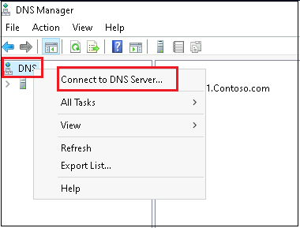
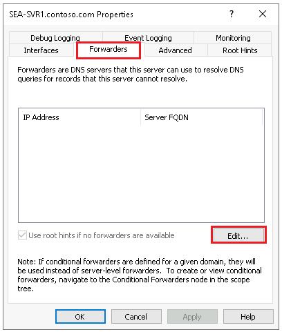
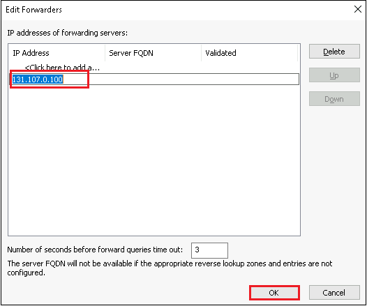

---
lab:
  title: 'ラボ : Windows Server でのネットワーク インフラストラクチャ サービスの実装と構成'
  module: 'Module 7: Network Infrastructure services in Windows Server'
---

# <a name="lab-implementing-and-configuring-network-infrastructure-services-in-windows-server"></a>Lab7b : DNS の展開と構成

## <a name="scenario"></a>シナリオ

Contoso 内の リサーチグループ で働いているスタッフには、テスト環境にDNSのレコードを作成するための DNS サーバーが必要です。 要件として、テスト環境では、Contoso のインターネット DNS 名とリソース レコードを名前解決できる必要があります。 要件を満たすために、インターネット サービス プロバイダー (ISP) への転送を構成し、**SEA-DC1** に **contoso.com** の条件付きフォワーダーを作成します。 また、ユーザーの場所に基づいて異なる IP アドレスの名前解決を必要とするテスト アプリケーションもあるため、 DNS ポリシーを使用して、**testapp.treyresearch.net** (リサーチグループのドメイン)を、本社のユーザーに対して異なる方法で解決するように構成します。


## <a name="objectives"></a>目標とタスク

このラボを完了すると、次のことができるようになります。

- DNS を展開および構成する。

この演習の主なタスクは次のとおりです。

1. DNS 役割をインストールする。
1. DNS ゾーンの作成する。
1. 転送を構成する。
1. 条件付き転送を構成する。
1. DNS ポリシーを構成する。
1. DNS ポリシーの機能を確認する。

## <a name="estimated-time-60-minutes"></a>予想所要時間: 25 分

## <a name="lab-setup"></a>ラボのセットアップ

仮想マシン: **SEA-DC1、SEA-SVR1、SEA-ADM1を使用します。**

1. **SEA-ADM1** を選択します。
1. 次の資格情報を使用してサインインします。

   - ユーザー名: **Administrator**
   - パスワード: **Pa55w.rd**
   - ドメイン: **CONTOSO**

このラボでは、仮想マシンのみを使用します。


### <a name="task-1-install-the-dns-role"></a>タスク 1: DNS 役割をインストールする

1. **SEA-ADM1** で、Windows Admin Center の **sea-svr1.contoso.com** への接続している、 Microsoft Edge ウィンドウに戻ります。

1. **[ツール]** の左ナビゲーションペイン一覧から、 **[役割と機能]** を選択します。

1. **[役割と機能]** ウィンドウで、 **[ DNS サーバー]** チェックボックスを選択し、**[ + インストール]** をクリックします。

   

4. **[役割と機能のインストール]** ウィンドウで、**[はい]** をクリックします。

  ※  **[必要に応じてサーバーを自動的に再起動する]**  のチェックボックスはオフで構いません。

5. DNS Server の役割がインストールされたという通知が確認できてから、タスク2に進んでください。

> **注: 通知メッセージが表示されない場合は、Windows Admin Center の右上にあるベルのマークをクリックして通知メッセージの一覧を確認できます。**

6. Microsoft Edge で表示されている Windows Admin Center のページを更新します。

7. **sea-svr1.contoso.com** ページに戻り、左ナビゲーションペインの **[ツール]** の一覧から  **[ DNS ]** を選択し、詳細ウィンドウで **[インストール]** を選択して **DNS PowerShell ツール** をインストールします。


8. DNS PowerShell ツールがインストールされたことを示す通知が表示されるまで待ちます。

> **※通知メッセージが表示されない場合は、Windows Admin Center の右上にあるベルマーク [通知] アイコンを選択して現在のステータスを確認します。**

9. 通知メッセージが確認できてから、タスク2に進んでください。

### <a name="task-2-create-a-dns-zone"></a>タスク 2: DNS ゾーンを作成する

1. **SEA-ADM1**  の Windows Admin Center の DNS ウィンドウで、  **[ + 新しい DNS ゾーンの作成 (Create a new DNS zone)]** を選択します。

   

1. **[新しい DNS ゾーンの作成  (Create a new DNS zone)]**  ダイアログ ボックスで、次の設定を指定し、 **[Create (作成)]** を選択します。指示がないものは規定値のままで構いません。

   | 設定                               | 値                                                     |
   | ---------------------------------- | ------------------------------------------------------ |
   | Zone type (ゾーンタイプ)           | **Primary**                                            |
   | Zone name (ゾーン名)               | **TreyResearch.net**                                   |
   | Zone file (ゾーンファイル)         | **Create a new file (新しいファイルを作成する)**       |
   | Zone file namre (ゾーンファイル名) | **TreyResearch.net.dns**                               |
   | Dynamic update (動的更新)          | **Do not allow dynamic update (動的更新を許可しない)** |

   

3. DNS ウィンドウに戻り、 **[TreyResearch.net]** を選択してから、**[ + 新しい DNS レコードの作成 (Create a new DNS record)]** を選択します。


4. **[新しい DNS レコードの作成 (Create a new DNS record)]**  ウィンドウで、次の設定を指定し、 **[Create (作成)]** を選択します。指示がないものは規定値のままで構いません。

| 設定                                  | 値                |
| ------------------------------------- | ----------------- |
| DNS record type (DNS レコード タイプ) | **Host (A)**      |
| Record name (レコード名)              | **TestApp**       |
| IP address (IP アドレス)              | **172.30.99.234** |
| Time to live (有効期間)               | **600**           |

※Create associated pointer (PTR) record (関連付けられたポインター (PTR) レコードを作成する)のチェックボックスはオフにしてください。

※レコードが追加されたら、[新しい DNS レコードの作成 (Create a new DNS record)] は [キャンセル] で閉じて構いません。

**TestApp.TreyResarch.net というAレコードが追加されたことが確認できます。**


5. **SEA-ADM1** で、**[スタート] メニュー**を選択し、**[ Windows PowerShell ]** を起動します。

6. Windows PowerShell コンソールで次のコマンドを実行すると、新しい DNS レコードが名前解決を提供することが確認できます。

```powershell
Resolve-DnsName -Server sea-svr1.contoso.com -Name testapp.treyresearch.net
```


### <a name="task-3-configure-forwarding"></a>タスク 3: 転送を構成する

1. **SEA-ADM1** で、**Server Manager** に切り替えます。

1. Server Manager の **[Tools (ツール)]** を展開し、**[ DNS ]** を選択します。

   

1. **[DNS Manager (DNS マネージャー)]** で **[ DNS ]** を選択し、右クリックしてから、 **[ Connect to DNS Server (DNS サーバーに接続)]**  を選択します。

   

4. **[Connect to DNS Server (DNS サーバーに接続)]** ダイアログ ボックスで、 **[ The following computer (次のコンピューター)]**  を選択し、 **SEA-SVR1.contoso.com** と入力したら、 [OK] をクリックします。

   **※connect to the specified computer now (指定したコンピュータに今すぐ接続する) のチェックは外さないでください。**


5. **[DNS Manager (DNS マネージャー)]** で **[SEA-SVR1.contoso.com ]** を選択し、右クリックして、  **[Properties (プロパティ)]** をクリックします。


6. **[SEA-SVR1.contoso.com のProperties]**  ダイアログ ボックスで、 **[Forwarders (フォワーダー)]**  タブを選択し、 **[Edit (編集)]** をクリックします。




7. **[Edit Forwarders (フォワーダーの編集)]** ダイアログ ボックスの  **[IP addresses for forwarding servers (転送サーバーの IP アドレス)]**  ボックスに **[ 131.107.0.100 ]** と入力し、 **[OK]** をクリックします。




8. **[SEA-SVR1.contoso.com のProperties]**  ダイアログ ボックスを**[ OK ]** をクリックして閉じます。

### <a name="task-4-configure-conditional-forwarding"></a>タスク 4: 条件付き転送を構成する

1. **SEA-ADM1** の **[DNS マネージャー]** で、 **SEA-SVR1.contoso.com** を展開し、 **Conditional Forwarders** を選択します。

1.  **[Conditional Forwarders(条件付きフォワーダー) ]** を右クリックして、 **[ New Conditional Forwarder (新しい条件付きフォワーダー) ]**  を選択します。

    


3.  **[New Conditional Forwarder (新しい条件付きフォワーダー) ]** ダイアログ ボックスの **[DNS Domain]** ボックスに、 **[Contoso.com]** と入力します。

4. **[IP addresses of the master servers (マスター サーバーのIP アドレス)]** ボックスに **[172.16.10.10]** と入力し、[OK] をクリックします。

   

   > **注 : 検証エラーが発生する場合がありますが、無視して構いません。**

5. **SEA-ADM1** の **Windows PowerShell** コンソールで、次のコマンドを実行して条件付きフォワーダーが動作していることを確認します。

```powershell
Resolve-DnsName -Server sea-svr1.contoso.com -Name sea-dc1.contoso.com
```

​          

### <a name="task-5-configure-dns-policies"></a>タスク 5: DNS ポリシーを構成する

1. **SEA-ADM1** の Windows Admin Center に接続している、Microsoft Edge に切り替えます。**sea-svr1.contoso.com** に接続している状態で、 **[ツール]** の一覧から **PowerShell** を選択します。

    

1.  プロンプトが表示されたら、**パスワード (Pa55w.rd)** を入力し、リモートセッションを開始します。

1. **Windows PowerShell** プロンプトで、次のコマンドレットを実行して本社のサブネットを作成します。

    ```powershell
    Add-DnsServerClientSubnet -Name "HeadOfficeSubnet" -IPv4Subnet '172.16.10.0/24'
    ```

1. 次のコマンドレットを実行して、本社のゾーン スコープを作成します。

    ```powershell
    Add-DnsServerZoneScope -ZoneName 'TreyResearch.net' -Name 'HeadOfficeScope'
    ```

1. 次のコマンドレットを実行して、本社のスコープの新しいリソース レコードを作成します。

    ```powershell
    Add-DnsServerResourceRecord -ZoneName 'TreyResearch.net' -A -Name 'testapp' -IPv4Address '172.30.99.100' -ZoneScope 'HeadOfficeScope'
    ```

1. 次のコマンドレットを実行して、本社のサブネットとゾーン スコープをリンクする新しいポリシーを作成します。

    ```powershell
    Add-DnsServerQueryResolutionPolicy -Name 'HeadOfficePolicy' -Action ALLOW -ClientSubnet 'eq,HeadOfficeSubnet' -ZoneScope 'HeadOfficeScope,1' -ZoneName 'TreyResearch.net'
    ```

### <a name="task-6-verify-dns-policy-functionality"></a>タスク 6: DNS ポリシー機能を確認する

1. **SEA-ADM1** の **Windows PowerShell** コンソールで、`ipconfig` を実行して、**SEA-ADM1** が **HeadOfficeSubnet (172.16.10.0)** 上にあることを確認します。

    

1. **Windows PowerShell** コンソールで、次のコマンドを実行して DNS ポリシーをテストします。

   ```powershell
   Resolve-DnsName -Server sea-svr1.contoso.com -Name testapp.treyresearch.net
   ```

   > **注: 名前が、HeadOfficePolicy で構成された IP アドレス 172.30.99.100 に解決されることを確認します。**

   

1.  **[Ethernet Status (イーサネット ステータス)]** ウィンドウに戻り、 **[Properties (プロパティ)]** をクリックします。

    


4.  **[Ethernet Properties (イーサネットのプロパティ)]** ダイアログ ボックスで、**[Internet Protocol Version 4 (TCP/IPv4)]**  を選択し、 **[プロパティ (Properties)]** をクリックします。

5. **[Internet Protocol Version 4 (TCP/IPv4)]** ダイアログ ボックスで、現在割り当てられている IP アドレス **( 172.16.10.11 )** を HeadOfficeSubnet の IP アドレス範囲外のIP アドレス **172.16.11.11** に変更し、 **[ OK ]** をクリックします。

   

6. **Windows PowerShell** コンソールに切り替え、次のコマンドレットを実行して DNS ポリシーをテストします。

   ```powershell
   Resolve-DnsName -Server sea-svr1.contoso.com -Name testapp.treyresearch.net
   ```

   > **注:  172.30.99.234 に名前解決されることを確認します。 SEA-ADM1 の IP アドレスが HeadOfficeSubnet 内に存在しなくなったため、これは想定内です。 `testapp.treyresearch.net` をターゲットとする (172.16.10.0/24) の HeadOfficeSubnet からの DNS クエリは、172.30.99.100 に解決されます。 `testapp.treyresearch.net` をターゲットとするこのサブネット外からの DNS クエリは、172.30.99.234 に解決されます。**


7. **SEA-ADM1** の IP アドレスを元の値 ( **172.16.10.11 )** に戻します。

結果

このラボを完了すると、 DNSサーバーを構築し、条件付きフォワーダーを構成しました。また、 DNS ポリシーを使用して親ドメインとは異なる名前解決ができるように構成することができています。


