---
lab:
  title: 'ラボ: Windows Server での記憶域ソリューションの実装'
  module: 'Module 9: File servers and storage management in Windows Server'
---

# <a name="lab-implementing-storage-solutions-in-windows-server"></a>Lab9a: データ重複除去の実装

## <a name="scenario"></a>シナリオ

Contoso,Ltd で使用しているドライブ **M** は使用量が多く、一部のフォルダーには重複するファイルが含まれる可能性があります。 そこであなたは、このボリュームで消費される領域を削減するために、データ重複除去の役割を有効にして構成することにしました。


## <a name="objectives"></a>目標とタスク

このラボを完了すると、次のことができるようになります。

- データ重複除去を実装する。

この演習の主なタスクは次のとおりです。

1. **SEA-SVR3** にデータ重複除去機能をインストールする

1. **SEA-SVR3** のドライブ **M** でデータ重複除去を有効にして構成する

1. ファイルを追加し、重複除去を監視して、データ重複除去をテストする

   

## <a name="estimated-time-90-minutes"></a>予想所要時間: 90 分

## <a name="architecture"></a>アーキテクチャの図


## <a name="lab-setup"></a>ラボのセットアップ

仮想マシン: **SEA-DC1**、**SEA-SVR1**、**SEA-SVR2**、**SEA-SVR3**、**SEA-ADM1** を使用します。 

- 演習 1 - 3 : **SEA-DC1**、**SEA-SVR3**、**SEA-ADM1**
- 演習 4 : **SEA-DC1**、**SEA-SVR1**、**SEA-SVR2**、**SEA-SVR3**、**SEA-ADM1**

1. **SEA-ADM1** を選択します。
1. 次の資格情報を使用してサインインします。

   - ユーザー名: **Administrator**
   - パスワード: **Pa55w.rd**
   - ドメイン: **CONTOSO**

このラボでは、仮想マシンのみを使用します。


### <a name="task-1-install-the-data-deduplication-role-service"></a>タスク 0: ラボのセットアップ

1. **SEA-ADM1** に以下の資格情報でサインインします。

   | 資格情報       | 値                        |
   | -------------- | ------------------------- |
   | **ユーザー名** | **Contoso\Administrator** |
   | **パスワード** | **Pa55w.rd**              |

1.  **[スタート]** メニューをの一覧から **Windows PowerShell** を起動します。

1. 次の Windows PowerShell コマンドレットを実行して、ラボ ファイルの最新バージョンを仮想マシンにダウンロードします。

   ```powershell
   ([System.Net.WebClient]::new()).DownloadFile('https://github.com/MicrosoftLearning/AZ-800-Administering-Windows-Server-Hybrid-Core-Infrastructure/archive/refs/heads/master.zip', 'C:\Labfiles\master.zip')
   ```

   ```powershell
   Expand-Archive -Path 'C:\Labfiles\master.zip' -DestinationPath 'C:\Labfiles'
   ```

   ```powershell
   Move-item -Path "C:\Labfiles\AZ-800-Administering-Windows-Server-Hybrid-Core-Infrastructure-master\Allfiles\Labfiles\Lab09*" -Destination "C:\Labfiles" -confirm:$false
   ```

### <a name="task-1-install-the-data-deduplication-role-service"></a>**タスク 1: データ重複除去役割サービスをインストールする**

1.  **SEA-ADM1** で、**[スタート]** メニューの一覧から、**[ Server Manager (サーバー マネージャー)]** を起動します。

1.  **[ Server Manager (サーバー マネージャー)]** で、右上の **[Manage (管理)]** を展開し、**[Add Roles and Features (役割と機能の追加)]** をクリックします。

1.  Add Roles and Features (役割と機能の追加) ウィザード で、**[Next (次へ)]** を 2 回クリックして、 **[Select destination server (対象サーバーの選択)]** ページまで進みます。

1.  **[Select destination server (対象サーバーの選択)]** ページの **[Server Pool (サーバー プール)]** ウィンドウで、**[SEA-SVR3.Contoso.com]** を選択し、 **[Next (次へ)]** をクリックします。

1.  **[Select server roles (サーバーの役割の選択)]** ページの **[Roles (役割)]** ウィンドウで、 **[File and Storage Services (ファイル サービスと記憶域サービス)]** 項目を展開し、 **[File and iSCSI Services (ファイル サービスと iSCSI サービス)]** 項目を更に展開して、 **[Data Deduplication (データ重複除去)]** 項目を選択し、 **[Next (次へ)]** をクリックします。

   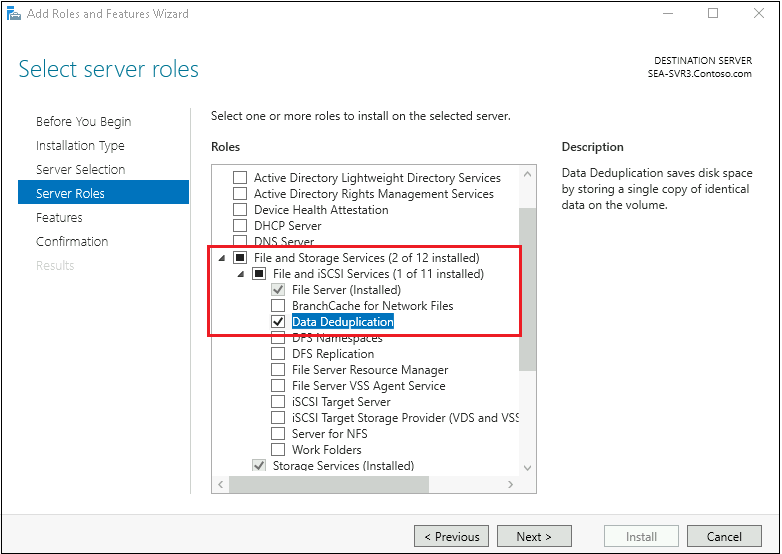


6.  **[Select features (機能の選択)]** ページでは、規定値のまま **[Next (次へ)]** を選択し、 **[Confirm installation selectionsインストール オプションの確認]** ページで **[Install (インストール)]** をクリックします。

7.  役割サービスのインストール中に、 **SEA-ADM1** のタスク バーにある **[エクスプローラー]** アイコンをクリックし、ファイルエクスプローラーを起動します。

8.  ファイル エクスプローラーで、**C ドライブ** を参照します。

9.   C ドライブ配下にある、 **[Labfiles]** ディレクトリを右クリックし、 **[Give access to (アクセス権を付与)]** を展開し **[Specific people (特定のユーザー)]** を選択します。

   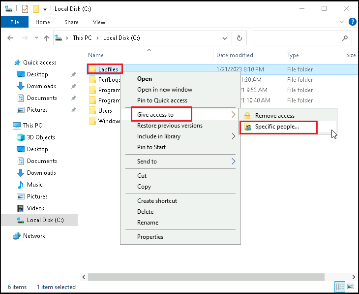


11.  **[ Network access (ネットワーク アクセス)]** ウィンドウのテキスト ボックスに **「Users」** と入力し、 **[Add (追加)]** をクリックします。

    
    
    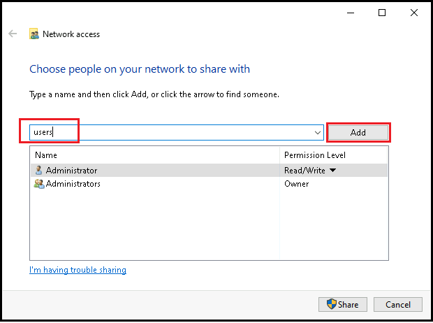


12.   **[ Network access (ネットワーク アクセス)]** ウィンドウに戻り、 **[Share (共有)]** をクリックします。 **[Your folder is shared (フォルダーは共有されています)]** ウィンドウが表示されたら、 **[Done (完了)]** をクリックします。
13.  **[Server Manager]** ウィンドウに戻り、**[Add Roles and Features Wizard installation succeeded (役割と機能の追加ウィザードのインストールが成功しました)]** ページで、**[Close (閉じる)]** をクリックします。

14. **SEA-SVR3** のコンソール セッションに切り替え、パスワード Pa55w.rd を使用して **CONTOSO\\Administrator** としてサインインします。

15.  **SConfig** メニューが表示された場合は、 **[Enter number to select an option]** で **15** と入力し、Enter キーを押して PowerShellコンソール セッションを一度終了します。

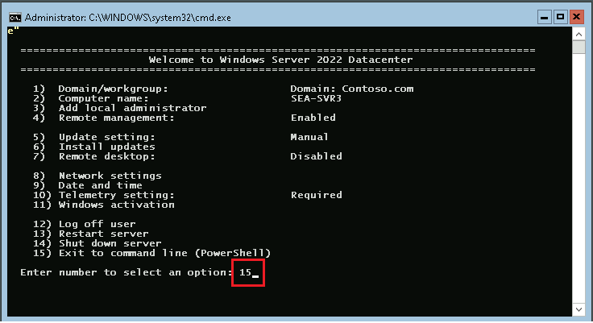


16. Windows PowerShellプロンプトに戻ったら、次のコマンドレットを順番に実行し、ReFS でフォーマットされた新しいドライブを作成します。

    

    ```powershell
    Get-Disk
    ```

    ```powershell
    Initialize-Disk -Number 1
    ```

    ```powershell
    New-Partition -DiskNumber 1 -UseMaximumSize -DriveLetter M
    ```

    ```powershell
    Format-Volume -DriveLetter M -FileSystem ReFS
    ```

17. 次のコマンドレットを順番に実行し、重複排除するサンプル ファイルを作成するスクリプトをSEA-ADM1からコピーして実行し、結果を特定します。

    ```powershell
    New-PSDrive -Name 'X' -PSProvider "FileSystem" -Root '\\SEA-ADM1\Labfiles'
    ```

    ```powershell
    New-Item -Type Directory -Path 'M:\Data' -Force
    ```

    ```powershell
    Copy-Item -Path X:\Lab09\CreateLabFiles.cmd -Destination M:\Data\ -PassThru
    ```

    ```powershell
    Start-Process -FilePath M:\Data\CreateLabFiles.cmd -PassThru
    ```

    ```powershell
    Set-Location -Path M:\Data
    ```

    ```powershell
    Get-ChildItem -Path .
    ```

    ```powershell
    Get-PSDrive -Name M
    ```

> **注: ドライブ M の空き領域をメモしておいてください。**

### <a name="task-2-enable-and-configure-data-deduplication"></a>タスク 2: データ重複除去を有効にして構成する

1. **SEA-ADM1** へのコンソール セッションに切り替えます。

1.  **Server Manager** の **[File and Storage Services (ファイル サービスと記憶域サービス)]** を選択し、左ナビゲーションペインから **[Disks]** をクリックします。

1.  **[Disks]** ペインで、 **SEA-SVR3** のディスクのリストを参照し、**ディスク番号1** を表すエントリを選択します。

   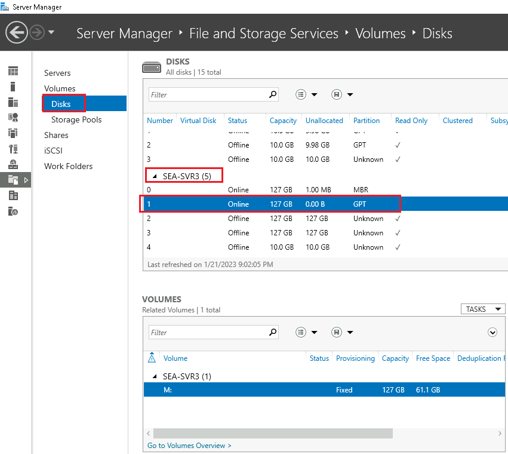


4.  **[VOLUMES (ボリューム)]** ウィンドウで、 **M:** ボリュームを右クリックして、メニューから **[Configure Data Deduplication (データ重複除去の構成)]** を選択します。

   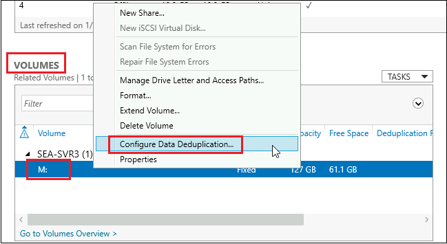


5.  **[Volume (M:) Deduplication Settings (ボリューム (M:) 重複排除設定)]** ウィンドウで以下の値を設定し、 **[OK]** をクリックします。指示がないものは規定値のままで構いません。

   | 設定                                                         | 値                                                           |
   | ------------------------------------------------------------ | ------------------------------------------------------------ |
   | Data Deduplication (データ重複排除)                          | **General purpose file server (汎用ファイル サーバー)**      |
   | Deduplicate files older than (in days) :(日数) より古いファイルの重複除外 | **0**                                                        |
   | Set Deduplication Schedule (重複排除スケジュールの設定)      | **Enable throughput optimization (スループットの最適化を有効にする) のチェックボックスをオン** |

   

### <a name="task-3-test-data-deduplication"></a>タスク 3: データ重複除去をテストする

1. **SEA-ADM1** で、Microsoft Edgeを起動し、ブックマークバーから **[Windows Admin Center]** を起動します。

1.  **[Windows セキュリティ]** ダイアログ ボックスに次の資格情報を入力し、**[OK]** をクリックします。

   - ユーザー名: **CONTOSO\\Administrator**
   - パスワード: **Pa55w.rd**

   ※Windows Admin Center に接続後、必要に応じ、右上の歯車マークから言語設定を日本語に変更してください。

1.  **[すべての接続]** ウィンドウで、 **[ + 追加]** をクリックします。

1.  **[リソースの追加または作成]** ウィンドウの **[サーバー]** タイルで、 **[追加]** をクリックします。

1.  **[サーバー名] テ**キスト ボックスに、 **[sea-svr3.contoso.com]** と入力します。

1. **[この接続では別のアカウントを使用する]** オプションを選択し、次の資格情報を入力して、 **[資格情報を含めて追加]** をクリックします。

- ユーザー名: Contoso\Administrator
- パスワード：Pa55w.rd

7.   **Windows Admin Center** に **sea-svr3.contoso.com**  が追加されたことを確認したら、[すべての接続] ウィンドウから、 **sea-svr3.contoso.com**  を選択します。
8. 左ナビゲーションペインの **[ツール]** から **[PowerShell]** を選択します。
9. プロンプトが表示されたら、**パスワード (Pa55w.rd)** を入力してリモートセッションを開始します。

10. Windows PowerShell コンソールで次のコマンドレットを実行し、重複排除をトリガーします。

    ```powershell
    Start-DedupJob -Volume M: -Type Optimization -Memory 50
    ```

11. **SEA-SVR3** へのコンソール セッションに切り替えます。

    ※パスワード入力が求められたら、パスワード (Pa55w.rd) でサインインしてください。

12. **SEA-SVR3** の **Windows PowerShell** プロンプトで次のコマンドレットを実行して、重複除去されているボリューム上で使用可能なスペースを確認します。

    ```powershell
    Get-PSDrive -Name M
    ```

    > **注: データ重複除去が実装されたため、前に表示された値と現在の値を比較します。2回目の実行結果は、 [Used (GB)] の領域が減り、 [Free (GB)] の領域が増えていることが確認できます。** 
    >
    > **確認できない場合は、データ重複除去のジョブが完了するまで、5～10分程度待ってから再度確認してください。**

13. **SEA-ADM1** へのコンソール セッションに切り替えます。

14. **SEA-ADM1** の **sea-svr3.contoso.com** に接続されている Windows Admin Center の **PowerShell** ツールで重複除去ジョブの状態を確認する次のコマンドレットを実行します。

    ```powershell
    Get-DedupStatus –Volume M: | fl
    ```

    ```powershell
    Get-DedupVolume –Volume M: |fl
    ```

    ```powershell
    Get-DedupMetadata –Volume M: |fl
    ```

15. **SEA-ADM1** で、Server Manager の **[ディスク]** ウィンドウに切り替え、右上隅の **[更新]** をクリックします。

16.  **[VOLUMES]** セクションで **[M:]** を選択し、右クリックして **[Properties (プロパティ)]** を選択します。

17.  [**Volume (M:) Properties]**ウィンドウで、**[Deduplication rate (重複排除率)]** と **[Deduplication savings (重複排除の節約)]** の値を確認します。

    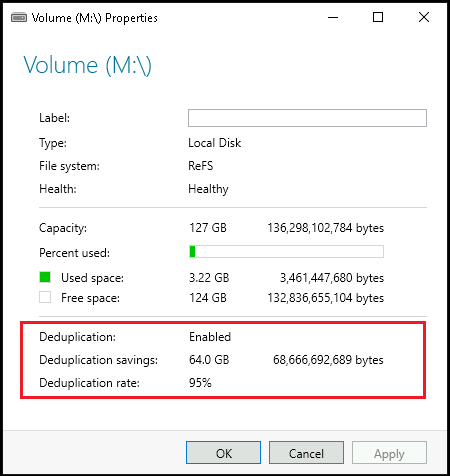

    **※Deduplication (データ重複除去)が有効になっており、ボリュームMでデータ重複除去が行われた結果が確認できます。確認ができたら、プロパティを [OK] で閉じ、次の演習に進んでください。**

    

## <a name="lab-exercise-2-configuring-iscsi-storage"></a>ラボ演習 2: iSCSI 記憶域の構成

### <a name="scenario"></a>シナリオ

Contoso の経営陣は、iSCSI を使用して、一元化された記憶域を構成するコストと複雑さを軽減するオプションを検討しています。 これらを検証するため、あなたは iSCSI ターゲットをインストールして、 iSCSI イニシエーターを構成する必要があります。

この演習の主なタスクは次のとおりです。

1. **SEA-SVR3** に iSCSI をインストールしてターゲットを構成します。
1. **SEA-DC1** (イニシエーター) から iSCSI ターゲットに接続して構成します。
1. iSCSI ディスクの構成を確認します。
1. ディスクの構成を元に戻します。

### <a name="task-1-install-iscsi-and-configure-targets"></a>タスク 1: iSCSI をインストールしてターゲットを構成する

1. **SEA-ADM1** の  [スタート] メニューから **Windows PowerShell** を起動します。PowerShell コンソールで、次のコマンドレットを実行して、**SEA-SVR3** への PowerShell リモート処理セッションを確立します。

   ```powershell
   Enter-PSSession -ComputerName SEA-SVR3
   ```

1. 次のコマンドレットを実行して、**SEA-SVR3** に iSCSI ターゲットをインストールします。

   ※インストールが完了するまでに、1～2分程度かかります。完了してから、次の作業に進んでください。

   ```powershell
   Install-WindowsFeature –Name FS-iSCSITarget-Server –IncludeManagementTools
   ```

1. 次のコマンドレットを実行して、ReFS でフォーマットされた新しいボリュームをディスク 2 に作成します。

   ```powershell
   Initialize-Disk -Number 2
   ```

   ```powershell
   $partition2 = New-Partition -DiskNumber 2 -UseMaximumSize -AssignDriveLetter
   ```

   ```powershell
   Format-Volume -DriveLetter $partition2.DriveLetter -FileSystem ReFS
   ```

   

1. 次のコマンドを実行して、ReFS でフォーマットされた新しいボリュームをディスク 3 に作成します。

   ```powershell
   Initialize-Disk -Number 3
   ```

   ```powershell
   $partition3 = New-Partition -DiskNumber 3 -UseMaximumSize -AssignDriveLetter
   ```

   ```powershell
   Format-Volume -DriveLetter $partition3.DriveLetter -FileSystem ReFS
   ```

   

1. 次のコマンドレットを実行して、iSCSI トラフィックを許可するセキュリティが強化された Windows Defender ファイアウォール規則を構成します。

   ```powershell
   New-NetFirewallRule -DisplayName "iSCSITargetIn" -Profile "Any" -Direction Inbound -Action Allow -Protocol TCP -LocalPort 3260
   ```

   ```powershell
   New-NetFirewallRule -DisplayName "iSCSITargetOut" -Profile "Any" -Direction Outbound -Action Allow -Protocol TCP -LocalPort 3260
   ```

   

1. 次のコマンドレットを実行して、新しく作成したボリュームに割り当てられたドライブ文字を表示します。

   ```powershell
   $partition2.DriveLetter
   ```

   ```powershell
   $partition3.DriveLetter
   ```

   > **注: この手順では、ドライブ文字がそれぞれ E および F であることを前提にしています。上記を実行後、ドライブ文字の割り当てが異なる場合、タスク2以降の手順では、別のドライブ文字を使用して進めてください。**

### <a name="task-2-connect-to-and-configure-iscsi-targets"></a>タスク 2: iSCSI ターゲットに接続して構成する

1. **SEA-ADM1** の **Server Manager** に切り替えます。 **[ File and Storage Services (ファイルサービスと記憶域サービス)]  -  [Disks]** ペイン の順に選択したら、Server Manager の右上にある **[更新]** ボタンをクリックして更新します。

1.  **[DISKS]** で **SEA-SVR3** の **ディスク 2** を選択したら、右クリックして **[Bring Online (オンラインにする)]** をクリックします。**※グレーアウトされて選択できない場合は、既にオンライン状態のためこの手順は不要です。**

1. 同様に、 SEA-SVR3 の ディスク 3を右クリックして  **[Bring Online (オンラインにする)]** をクリックします。**※グレーアウトされて選択できない場合は、既にオンライン状態のためこの手順は不要です。**

1. **SEA-DC1** のディスク構成を確認します。 ブート ボリュームとシステム ボリュームのドライブ **C** だけが含まれていることが確認できます。

1. **サーバー マネージャー**の **[ファイル サービスと記憶域サービス]** で、**[iSCSI]** ペインに切り替えます。 **[Tasks (タスク)]** を選択して、ドロップダウン メニューで **[New iSCSI Virtual Disk (新しい iSCSI 仮想ディスク)]** を選択します。

   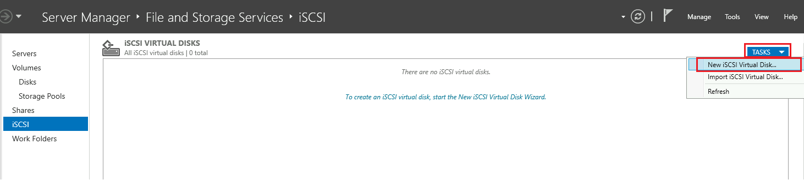

1.  **New iSCSI Virtual Disk Wizard (新しい iSCSI 仮想ディスク) ウィザード**の **[Select iSCSI virtual disk location (iSCSI 仮想ディスクの場所の選択)]** ページで、**SEA-SVR3** サーバーの下にある **E:** を選択し、 **[Next (次へ)]** をクリックします。

   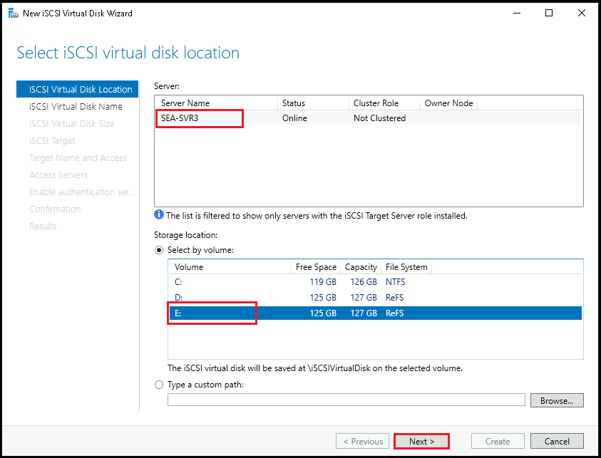

   

1.  **[Specify iSCSI virtual disk name (iSCSI 仮想ディスク名の指定)]** ページで、**[Name (名前)]** テキスト ボックスに**「iSCSIDisk1」**と入力し、**[Next (次へ)]** をクリックします。

1.  **[Specify iSCSI virtual disk sizeiSCSI 仮想ディスク サイズの指定]** ページで、 **[Size (サイズ)]** テキスト ボックスに **5** と入力します。その他の値は規定値のまま、 **[Next (次へ)]** をクリックします。

1.  **[Assign iSCSI target (iSCSI ターゲットの割り当て)]** ページで、  **[New iSCSI target (新しい iSCSI ターゲット)]** ラジオ ボタンが選択されていることを確認し、 **[Next (次へ)]** をクリックします。

1.  **[Specify target name (ターゲット名の指定)]** ページで、 **[Name (名前)]** フィールドに**「iSCSIFarm」**と入力し、 **[Next (次へ)]** をクリックします。

1.  **[Specify access servers (アクセス サーバーの指定)]** ページで、 **[Add (追加)]** ボタンをクリックします。

1.  **[Select a method to identify the initiator (イニシエーターを識別する方法を選択してください)]** ウィンドウで、 **[Browse (参照)]** ボタンを選択します。

1.  **[Select Computer (コンピューターの選択)]** ウィンドウの **[Enter the object name to select (選択するオブジェクト名を入力してください)]** テキスト ボックスに **「SEA-DC1」**と入力し、 **[Check Names (名前の確認)]** を一度クリックしてから、 **[ OK ]** をクリックします。

1. **[Select a method to identify the initiator (イニシエーターを識別する方法を選択してください)]** ウィンドウで、 **[sea-dc1.contoso.com]** が選択されたことを確認し、 **[OK]** をクリックします。

1.  **[Specify access servers (アクセス サーバーの指定)]** ページで、 **[Next (次へ)]** をクリックします。

1.  **[Enable Authentication (認証を有効にする)]** ページで、規定値のまま **[Next (次へ)]** をクリックします。

1.  **[Confirm selections (選択の確認)]** ページで、 **[Create (作成)]** をクリックします。

1.  **[View results (結果の表示)]** ページで、 **[Status]** がすべて **[Completes]** となったことを確認してから、ウィザードを閉じます。

1. SEA-SVR3のボリューム Dで手順6～18を繰り返し、2つめのiSCSI 仮想ディスク (F:) を作成してください。ウィザードでは以下の値を設定します。

   | 設定                                | 値                                         |
   | ----------------------------------- | ------------------------------------------ |
   | Select by volume (ボリュームの選択) | **D**                                      |
   | Name (名前)                         | **iSCSIDisk2**                             |
   | Size (サイズ)                       | **5 GB、Dynamically expanding (動的拡張)** |
   | iSCSI target (ターゲット)           | **iSCSIFarm**                              |

   

20. **SEA-DC1** のコンソール セッションに切り替え、**パスワード (Pa55w.rd)** を使用して **CONTOSO\\Administrator** としてサインインします。

21.  **SConfig** メニューが表示された場合は、 **[Enter number to select an option]** で **15** と入力し、Enter キーを押して PowerShellコンソール セッションを一度終了します。

22.  **Windows PowerShell** プロンプトで、次のコマンドを実行し、iSCSI イニシエーター サービスを開始し、iSCSI イニシエーターの構成を確認します。

    ```powershell
    Start-Service -Name MSiSCSI
    ```

    ```powershell
    iscsicpl
    ```

    > **注: iscsicplコマンドを実行すると、iSCSI イニシエーターのプロパティウィンドウが開きます。**

23.  **[iSCSI Initiator Properties]** ダイアログ ボックスの **[Target (ターゲット)]** テキスト ボックスに**「SEA-SVR3.contoso.com」**と入力し、 **[Quick Connect (クイック接続)]** をクリックします。

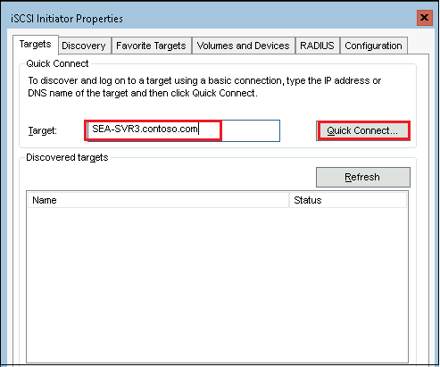

24.  **[Quick Connect (クイック接続)]** ダイアログ ボックスで、検出されたターゲット名が **iqn.1991-05.com.microsoft:sea-svr3-iscscifarm-target** であることを確認し、 **[Done (完了)]** を選択します。

    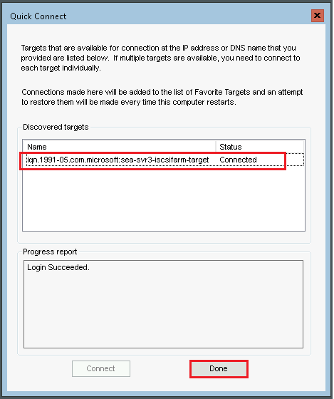

    ※ **[iSCSI Initiator Properties]** ダイアログ ボックスで、 **[ OK ]** をクリックし次のタスクに進みます。

    

### <a name="task-3-verify-iscsi-disk-configuration"></a>タスク 3: iSCSI ディスクの構成を確認する 

1. **SEA-ADM1** へのコンソール セッションに切り替えます。

1. **サーバー マネージャー**で、**[ファイル サービスと記憶域サービス]** の **[ディスク]** ペインを参照し、その表示を更新します。 

1. **SEA-DC1** ディスクの構成を確認し、2 つの **5 GB** ディスクが含まれ、**オフライン**状態であり、 **[Bus Type (バスの種類)]** が **iSCSI** であることを確認します。

   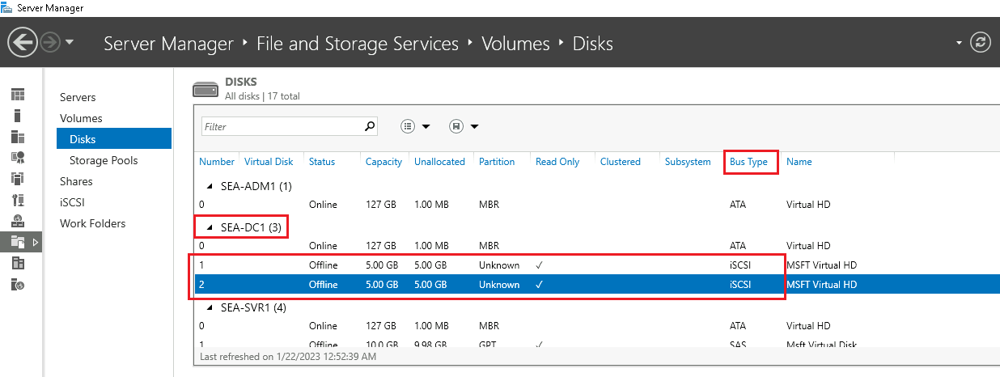

1. **SEA-DC1** のコンソール セッションに切り替えます。 

1. **Windows PowerShell** のプロンプトで次のコマンドレットを実行して、ディスクの構成を表示します。

   ```powershell
   Get-Disk
   ```
   > **注: 1と2のディスクが存在することが確認できます。HealthStatus は [Healthy (正常)]ですが、オフラインです。 オフライン状態のディスクを使用するには、初期化してフォーマットする必要があります。**

1. **SEA-DC1** で、**Windows PowerShell** のプロンプトから次のコマンドレットを実行して、ReFS でフォーマットされたドライブ文字 **E** のボリュームを作成します。

   ```powershell
   Initialize-Disk -Number 1
   ```

   ```powershell
   New-Partition -DiskNumber 1 -UseMaximumSize -DriveLetter E
   ```

   ```powershell
   Format-Volume -DriveLetter E -FileSystem ReFS
   ```

1. 以下のコマンドレットを実行し、ReFS でフォーマットされた2つめの新しいドライブを作成します。

   ```powershell
   Initialize-Disk -Number 2
   ```

   ```powershell
   New-Partition -DiskNumber 2 -UseMaximumSize -DriveLetter D
   ```

   ```powershell
   Format-Volume -DriveLetter D -FileSystem ReFS
   ```

   

1.  **SEA-ADM1** へのコンソール セッションに戻り、Server Manager に切り替えます。右上隅にある **[更新]** ボタンをクリックして、 **[File and Storage Services (ファイル サービスと記憶域サービス)]** の **[DISKS (ディスク)]** ウィンドウを更新します。

1. **SEA-DC1** ディスクの構成を確認し、両方のドライブが**オンライン**になっていることを確認します。

   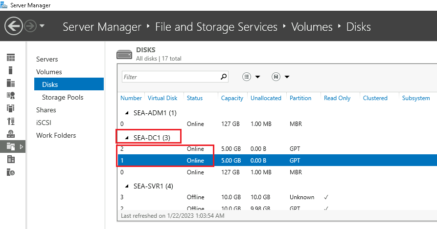

   

### <a name="task-4-revert-disk-configuration"></a>タスク 4: ディスクの構成を元に戻す 

1. **SEA-SVR3** へのコンソール セッションに切り替えます。

1. **Windows PowerShell** のプロンプトで次のコマンドを実行して、**SEA-SVR3** のディスクを元の状態にリセットします。

   ```powershell
   for ($num = 1;$num -le 4; $num++) {Clear-Disk -Number $num -RemoveData -RemoveOEM -ErrorAction SilentlyContinue}
   ```

   > **注 : 実行を確認するプロンプトが表示されたら、 Y と入力して実行してください。** 

   ```powershell
   for ($num = 1;$num -le 4; $num++) {Set-Disk -Number $num -IsOffline $true}
   ```

   > **注: ディスクをリセットする手順は、次の演習のために必ず実行してください。**

## <a name="lab-exercise-3-configuring-redundant-storage-spaces"></a>ラボ演習 3: 冗長記憶域スペースの構成

### <a name="scenario"></a>シナリオ

高可用性のいくつかの要件を満たすため、あなたは記憶域スペースでの冗長性オプションを検証することにしました。 さらに、記憶域プールへの新しいディスクのプロビジョニングを検証したいと考えています。

この演習の主なタスクは次のとおりです。

1. 記憶域プールを作成する。
1. 3 方向ミラー ディスクを基にしてボリュームを作成する。
1. エクスプローラーでボリュームを管理する。
1. 記憶域プールからディスクを切断し、ボリュームの可用性を確認する。
1. 記憶域プールにディスクを追加し、ボリュームの可用性を確認する。
1. ディスクの構成を元に戻す。

> **補足: Windows Server では、記憶域プール内のディスクを切断できません。 削除することのみ可能です。 また、先に新しいディスクを追加してからでないと、3 方向ミラーからディスクを削除することはできません。** 

### <a name="task-1-create-a-storage-pool"></a>タスク 1: 記憶域プールを作成する 

1.  **SEA-ADM1** のコンソールセッションに切り替えて、**Server Manager**の **[File and Storage Services (ファイル サービスと記憶域サービス)]** の **[DISKS (ディスク)]** ペインで右上の **[更新]** ボタンをクリックして更新します。

1.  **[DISKS]** ペインで下にスクロールし、 **SEA-SVR3 ディスク 1 ～ 4** が **[Unknown (不明なパーティション)] 、 [Status(ステータス)] が  [offline (オフライン)]** で一覧表示されていることを確認します。

   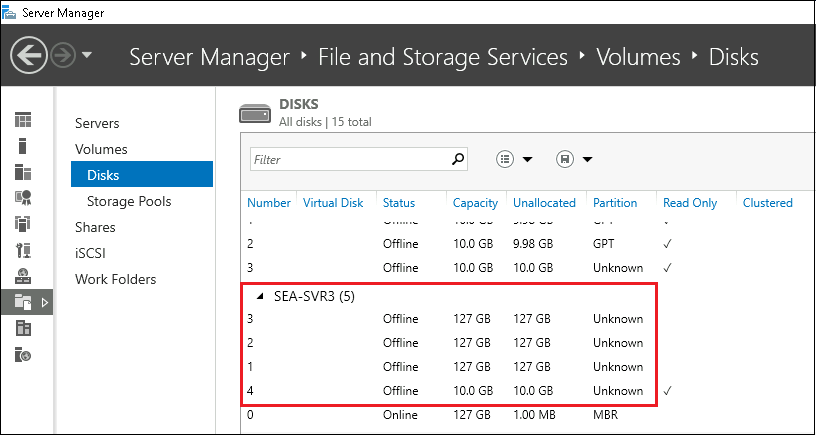

   

1.  1～4 のディスクを順番に選択、右クリックして、 **[Bring Online (オンラインにする)]** オプションをクリックします。 **[Bring Disk Online (ディスクをオンラインにする)]** ウィンドウで **[Yes (はい)]** を選択します。

   > **注 : 4つのディスクをすべてオンライン状態にしてください。**

1.  1～4 のすべてのディスクがオンライン状態で表示されていることを確認したら、**Server Manager** の左ナビゲーション ウィンドウから、 **[Storage Pools (記憶域プール)]** を選択します。

   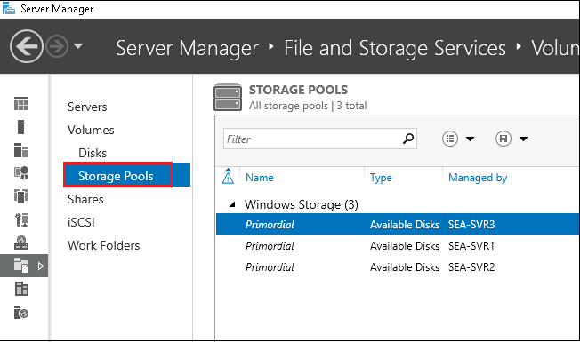


5.  **[STORAGE POOLS (ストレージプール)]** 領域の **[TASKS (タスク)]** を展開し、 **[New Storage Pool (新しいストレージ プール)]** を選択します。

   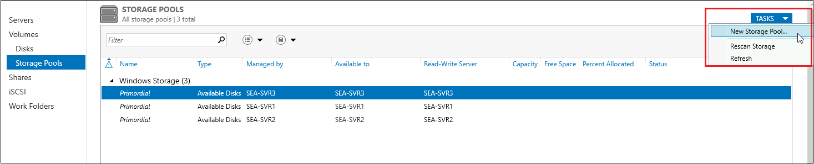


6.  ウィザードが起動したら、**[Before you begin (開始する前に)]** ページで、 **[Next (次へ)]** をクリックします。

7.  **[Specify a storage pool name and subsystem (ストレージ プール名とサブシステムの指定)]** ページで、 **[Name (名前)]** テキスト ボックスに **「SP1」**と入力します。 **[Description (説明)]** テキスト ボックスに、  **「Storage Pool 1」** と入力します。 **[Select the group of available disks (also known as a primordial pool) that you want to use (使用する使用可能なディスク のグループを選択してください)]** リストで、 **SEA-SVR3** エントリを選択し、 **[Next (次へ)]** をクリックします。

   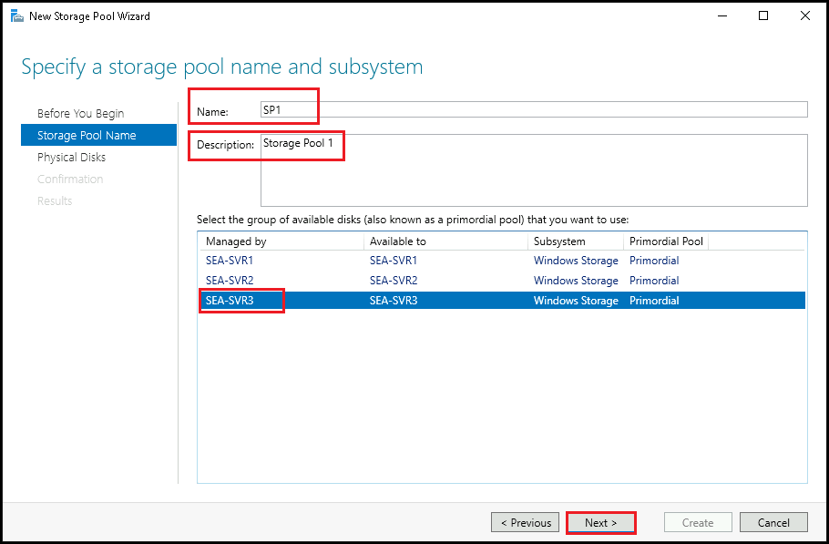


8.  **[Select physical disks for the storage pool  (記憶域プールの物理ディスクの選択)]** ページで、サイズが **127 GB の 3 つのディスクの横にあるチェック ボックスをオン**にし、 **[Next (次へ)]** をクリックします。

   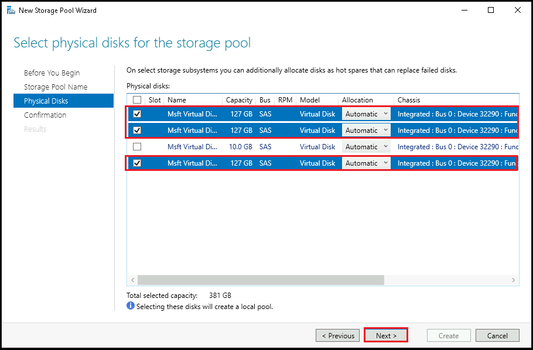


9.  **[Confirm selections (選択の確認)]** ページで設定を確認し、 **[Create (作成)]** をクリックします。 **[Status]** がすべて **[Completed]** となったたら **[Close]** をクリックしてウィザードを終了します。

### <a name="task-2-create-a-volume-based-on-a-three-way-mirrored-disk"></a>タスク 2: 3 方向ミラー ディスクを基にしてボリュームを作成する 

1.  **SEA-ADM1** の**Server Manager** 、 **[Storage Pools (記憶域プール)]** ペインで、タスク1 で作成した記憶域プールの **[ SP1 ]** を選択します。

1.  **[VIRTUAL DISKS (仮想ディスク)]** 領域で **[TASKS]** を展開し、 **[New Virtual Disk (仮想ディスクの作成)]** をクリックします。

   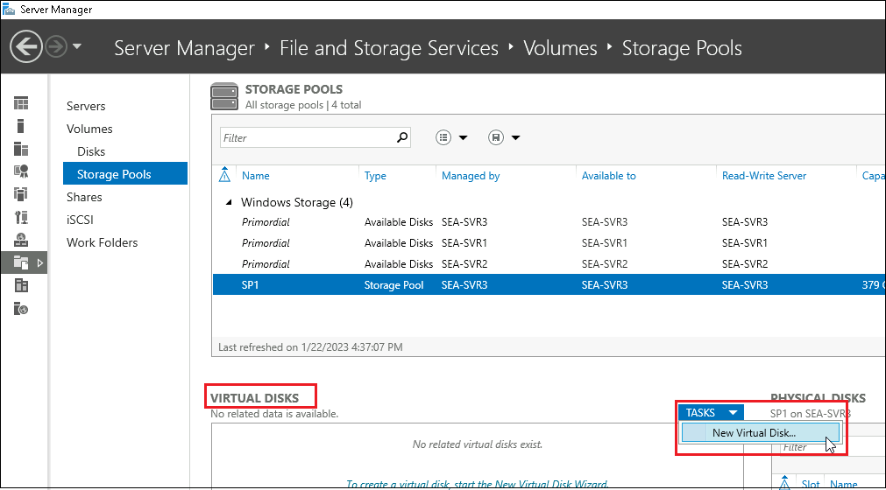


3.  **[Select the storage pool (記憶域プールの選択)]** ダイアログ ボックスで、 **[SP1]** を選択し、 **[OK]** をクリックします。

4.  ウィザードの **[Before you begin (開始する前に)]** ページで、 **[Next (次へ)]** をクリックします。

5.  **[Specify the virtual disk name (仮想ディスク名の指定)]** ページで、 **[Name (名前)]** テキスト ボックスに**「Three-Mirror」**と入力し、 **[Next (次へ)]** をクリックします。**(Description : の項目は入力不要です。)**

6.  **[Specify enclosure resiliency (エンクロージャの復元力の指定)]** ページでは規定値のまま、 **[Next (次へ)]** をクリックします。

7.  **[Select the storage layout (ストレージ レイアウトの選択)]** ページで、 **[Mirror]** を選択し、 **[Next (次へ)]** をクリックします。

8.  **[Specify the provisioning Type (プロビジョニングの入力の指定)]** ページで、 **[Thin]** を選択し、 **[Next (次へ)]** をクリックします。

9.  **[Specify the size of the virtual disk (仮想ディスクのサイズの指定)]** ページで、 **[Specify size (サイズの指定)]** テキスト ボックスに **「25」** と入力し、 **[Next (次へ)]** をクリックします。

10.  **[Confirm selections (選択の確認)]** ページで、 **[ Create a volume when this wizard closes (このウィザードを閉じるときにボリュームを作成する)]**  **チェック ボックスをオフ** にし、 **[Close (閉じる)]** を選択します。

    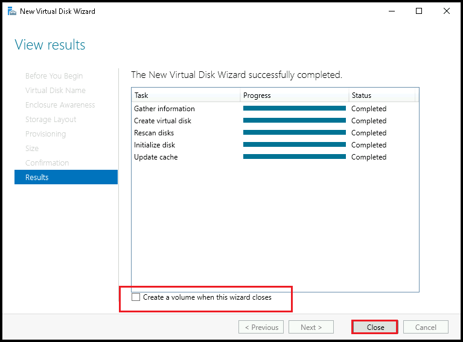


12.  **Server Manager** の ナビゲーションペインの **[Volumes (ボリューム)]** 領域で、 **[TASKS (タスク)]** を選択し、 **[New Volume (新しいボリューム)]** をクリックします。

    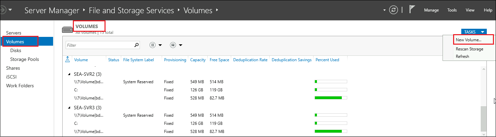


13.  ウィザード の **[Before you begin (開始する前に)]** ページで、 **[Next (次へ)]** をクリックします。
14.  **[Select the server and disk (サーバーとディスクの選択)]** ページで、 **[SEA-SVR3]** を選択し、 **[ Disk 5  Three-Mirror ]** を選択して、 **[Next (次へ)]** をクリックします。
15.  **[Specify the size of the volume (ボリュームのサイズを指定する)]** ページで規定値のまま、 **[Next (次へ)]** をクリックします。
16.  **[Assign to a drive letter or folder (ドライブ文字またはフォルダーへの割り当て)]** ページで、 **[Drive letter (ドライブ文字)]** のプルダウンから、 **[ T ]** を選択して、 **[Next (次へ)]** をクリックします。
17.  **[Select file system settings (ファイル システム設定の選択)]** ページの **[File system (ファイル システム)]** ドロップダウン リストで、 **[ReFS]** を選択します。 **[Volume label (ボリューム ラベル)]** テキスト ボックスに  **「TestData」** と入力し、 **[Next (次へ)]** をクリックします。
18.  **[Confirm selections (選択の確認)]** ページで設定を確認し、 **[Create (作成)]** をクリックします。 **[Status]** がすべて **[Completed]** となったたら **[Close]** をクリックしてウィザードを終了します。


### <a name="task-3-manage-a-volume-in-file-explorer"></a>**タスク 3: エクスプローラーでボリュームを管理する** 

1. **SEA-ADM1**  の [スタート] メニューから Windows PowerShellを起動し、以下のコマンドレットを実行して、**SEA-SVR3** への PowerShell リモート処理セッションを開始します。

   ```powershell
   Enter-PSSession -ComputerName sea-svr3.contoso.com
   ```

1.  次のコマンドレットを実行し、 **SEA-SVR3** に対し、セキュリティが強化された Windows Defender ファイアウォールのすべてのファイルとプリンターの共有規則を有効にします。

   ```
   Enable-NetFirewallRule -Group "@FirewallAPI.dll,-28502"
   ```

1. **SEA-ADM1**  のタスクバーから **エクスプローラー**を起動します。

1.  ファイル エクスプローラーウィンドウのアドレスバーに `\\SEA-SVR3.contoso.com\t$`と入力し、検索します。

1. `\\SEA-SVR3.contoso.com\t$` に**TestData** という名前のフォルダーを新規作成して、フォルダー内に **TestDocument.txt** という名前のドキュメントを新規作成します。

   **※ドキュメントの作成まで完了したら、タスク4に進んでください。**

### <a name="task-4-disconnect-a-disk-from-the-storage-pool-and-verify-volume-availability"></a>タスク 4: 記憶域プールからディスクを切断し、ボリュームの可用性を確認する 

1. **SEA-ADM1** の **Server Manager**を使用して、 **[File and Storage Services (ファイル サービスと記憶域サービス)]** から、 **[Storage Pools (記憶域プール)]** を選択し、 **[SP1]** をクリックします。

1.  **[Physical Disks (物理ディスク)]** ペインで、 **[TASKS (タスク)]** ドロップダウン リストを選択し、 **[Add Physical Disk (物理ディスクの追加)]** を選択します。

   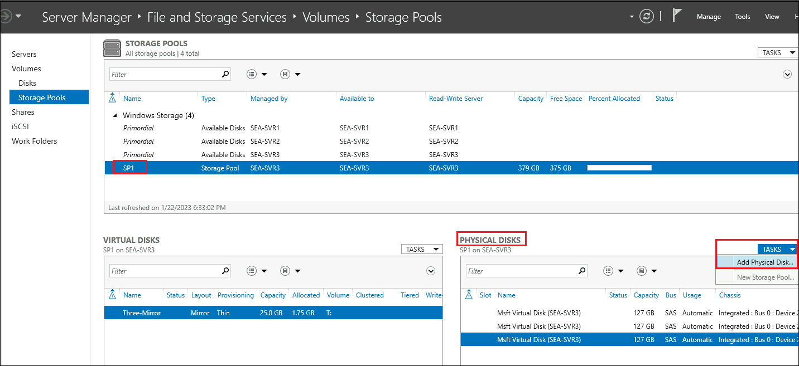

   

1.  **[Add Physical Disk (物理ディスクの追加)]** ダイアログ ボックスの、プールに追加するディスクを表す行で、ディスク名の横にあるチェック ボックスをオンにします。 **[Allocation (割り当て)]** ドロップダウン リストで、 **[Automatic (自動)]** エントリが選択されていることを確認し、 **[OK]** をクリックします。

   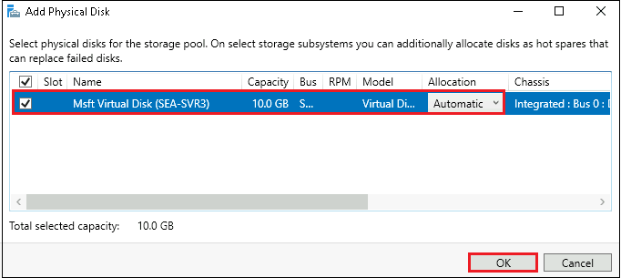

   

1.  **[Physical Disk (物理ディスク)]** ペインに戻り、リストの一番上のディスクを右クリックし、 **[Remove Disk (ディスクの削除)]** をクリックします。

   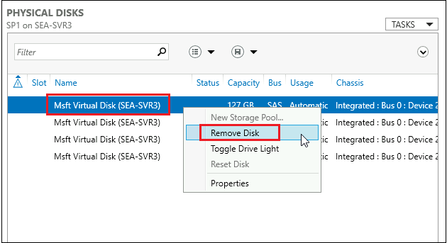

   

1.  **[Remove Physical Disk (物理ディスクの削除)]** ウィンドウで、 **[Yes]** をクリックします。

   > **注 : Windows が影響を受ける仮想ディスクを修復中であることを示すメッセージが表示されたら、 [OK] をクリックしてください。**

1. **SEA-ADM1** でファイルエクスプローラーに戻り、**TestDocument.txt** がまだ使用可能であることを確認します。 

### <a name="task-5-add-a-disk-to-the-storage-pool-and-verify-volume-availability"></a>タスク 5: 記憶域プールにディスクを追加し、ボリュームの可用性を確認する 

1.  **SEA-ADM1** の **[File and Storage Services (ファイル サービスと記憶域サービス)]** から、 **[Storage Pools (記憶域プール)]** を選択し、 **[SP1]** をクリックします。

1.  **[Storage Pools (ストレージプール)]** エントリを選択し、 **[TASKS (タスク)]** ドロップダウン リストで **[Rescan Storage (ストレージの再スキャン)]** をクリックします。

   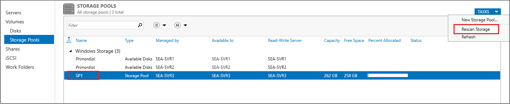


3.  **[Rescan Storage (ストレージの再スキャン)]** ダイアログ ボックスが表示されたら、 **[Yes]** をクリックします。

4.  **[Physical Disks (物理ディスク)]** ペインで **[TASKS (タスク)]** を選択し、ドロップダウン メニューで **[Add Physical Disk (物理ディスクの追加)]** をクリックします。

5.  **[Add Physical Disk (物理ディスクの追加)]** ダイアログ ボックスの、プールに追加するディスクを表す行で、ディスク名の横にあるチェック ボックスをオンにします。 **[Allocation (割り当て)]** ドロップダウン リストで、 **[Automatic (自動)]** エントリが選択されていることを確認し、 **[OK]** をクリックします。

6. **SEA-ADM1** でファイルエクスプローラーに戻り、**TestDocument.txt** がまだ使用可能であることを確認します。

   

### <a name="task-6-revert-disk-configuration"></a>タスク 6: ディスクの構成を元に戻す 

1. **SEA-SVR3** のコンソール セッションに切り替え、パスワード Pa55w.rd を使用して **CONTOSO\\Administrator** としてサインインします。

   > 注 : **SConfig** メニューが表示された場合は、 **[Enter number to select an option]** で **15** と入力し、Enter キーを押して PowerShellコンソール セッションを一度終了します。

1. **Windows PowerShell** のプロンプトで次のコマンドを実行して、**SEA-SVR3** のディスクを元の状態にリセットします。

   > **注 : コマンドレットの実行を確認するプロンプトが表示されたら、 Y を入力して進めてください。**

   ```powershell
   Get-VirtualDisk -FriendlyName 'Three-Mirror' | Remove-VirtualDisk
   ```

   ```powershell
   Get-StoragePool -FriendlyName 'SP1' | Remove-StoragePool
   ```

   ```powershell
   for ($num = 1;$num -le 4; $num++) {Clear-Disk -Number $num -RemoveData -RemoveOEM -ErrorAction SilentlyContinue}
   ```

   ```powershell
   for ($num = 1;$num -le 4; $num++) {Set-Disk -Number $num -IsOffline $true}
   ```

   > **注: ディスクをリセットする手順は、次の演習のために必ず実行してください。**

## <a name="lab-exercise-4-implementing-storage-spaces-direct"></a>ラボ演習 4: 記憶域スペース ダイレクトの実装

### <a name="scenario"></a>シナリオ

あなたは、ローカル記憶域を高可用性記憶域として使用する方法が、組織で実行可能なソリューションかどうかを検証したいと考えています。 以前は、 VM の格納にストレージ エリア ネットワーク (SAN) のみを使用していました。Windows Server の機能を使用すると、ローカル ストレージのみを使用できるようになるため、記憶域スペース ダイレクトを検証用に実装することにしました。

この演習の主なタスクは次のとおりです。

1. 記憶域スペース ダイレクトのインストールを準備します。
1. フェールオーバー クラスターを作成して検証します。
1. 記憶域スペースを直接有効にします。
1. 記憶域プール、仮想ディスク、共有を作成します。
1. 記憶域スペース ダイレクトの機能を確認します。

### <a name="task-1-prepare-for-installation-of-storage-spaces-direct"></a>タスク 1: 記憶域スペース ダイレクトのインストールを準備する 

1.  **SEA-ADM1** のコンソール セッションに戻り、 **Server Manager** の 左ナビゲーションペインで **[ All Servers (すべてのサーバー)]** を選択します。

1.  **SEA-SVR1、SEA-SVR2、SEA-SVR3** の **[Manageability (管理ステータス)]** が **[Onlone (オンライン)]** 状態で、パフォーマンス カウンターが開始されていないことを確認してから続行します。

   ※パフォーマンスカウンターの状態は、 **[ All Servers (すべてのサーバー)]** ページを下にスクロールし、 **[PERFORMANCE]** の状態で **[off]** となっていれば、パフォーマンスカウンターは開始されていません。

1.  **Server Manager** のナビゲーション ウィンドウで、 **[File and Storage Services (ファイル サービスと記憶域サービス)]** を選択し、 **[Disks (ディスク)]** をクリックします。

1.   **[TASKS (タスク)]** を選択し、ドロップダウン メニューで **[Refresh (更新)]** をクリックします。

1.  **[ディスク]** ペインで、下にスクロールし、 **SEA-SVR3** の **1 ～ 4 のディスク**の **[Partition (パーティション)]** 列のそれぞれのエントリが **[Unknown (不明)]** としてリストされていることを確認します。

   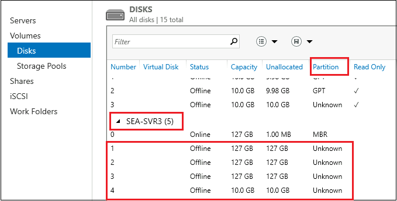


6. 1～4 のディスクを順番に選択、右クリックして、 **[Bring Online (オンラインにする)]** オプションをクリックします。 **[Bring Disk Online (ディスクをオンラインにする)]** ウィンドウで **[Yes (はい)]** を選択します。

   > **注 : 4つのディスクをすべてオンライン状態にしてください。**

7.  6の手順を繰り返し、 **SEA-SVR1、SEA- SVR2** のすべてのディスクをオンラインにします。

8.  EA-ADM1の  **[スタート]** メニューで **[ Windows PowerShell ISE ]** を起動します。

9.  **Windows PowerShell ISE** で、左上の **[File (ファイル)]** メニューを展開し、 **[Open (開く)]** をクリックします。ダイアログ ボックスが表示されたら、 `C:\Labfiles\Lab09`に移動します。

   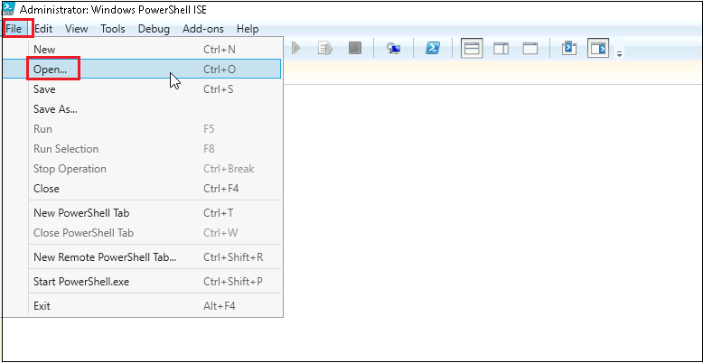


10.  スクリプトファイル、 **Implement-StorageSpacesDirect.ps1** を選択し、 **[Open (開く)]** をクリックします。

11. **Windows PowerShell ISE** で スクリプトの Step 1 の16行目を選択して、 F8 で実行します。

    > **注 : ファイル サーバーの役割とフェールオーバー クラスタリング機能をSEA-SVR1、SEA-SVR2、およびSEA-SVR3 にインストールします。**
    >
    > **注 : インストールが完了するまでに、2～3分程度待ちます。コマンドの実行結果で、 [Exit Code] の結果が [Success] と表示されればインストール完了です。**

12.  Step 1 の 17行目を選択して、 F8 で実行します。

    > **注 : SEA-SVR1、SEA-SVR2、およびSEA-SVR3を再起動します。**

13.   Step 1 の18行目を選択して、 F8 で実行します。

    > **注 : SEA-ADM1にフェールオーバー クラスター マネージャーツールをインストールします。**

    

### <a name="task-2-create-and-validate-the-failover-cluster"></a>タスク 2: フェールオーバー クラスターを作成して検証する 

1. **SEA-ADM1** で、 **Server Manager** に切り替え、右上の [Tools (ツール)] を展開します。一覧から、  **[Failover Cluster Manager (フェールオーバークラスターマネージャー)]**  を選択し、起動するか確認します。

   > **注 : [Failover Cluster Manager (フェールオーバークラスターマネージャー)] が [Tools] の一覧に表示されない、または起動できない場合は、SEA-ADM1 を再起動し、再度確認してください。**

1. **SEA-ADM1** の **Windows PowerShell ISE** に戻り、ステップ 2 の 22行目のコマンドを選択し、 F8 を押して実行します。

   > **注: クラスターの検証テストを実行します。完了するまで 2 分ほど待ち、 テストが成功することを確認してください。警告メッセージが表示されますが、無視して構いません。**
   >
   > **注 : 実行結果の [Success] ステータスが [True] となっていればテストは成功です。**

1. ステップ 3の 27行目を選択し、F8 を押してクラスターを作成します。

   > **注 : 作業が完了するまでに2分程度かかります。完了してから次の作業に進んでください。**

1. スクリプトの実行結果を確認し、**「S2DCluster」** というクラスターが作成されたことを確認し、 **[Failover Cluster Manager (フェールオーバークラスターマネージャー)]**  に切り替えます。

1.  **[Actions (操作)]** ウィンドウで、 **[Connect to Cluster (クラスターに接続)]** を選択します。 **[Cluster Name (クラスター名)]** テキストボックスに **「S2DCluster.Contoso.com」** と入力して、 **[OK]** をクリックします。

   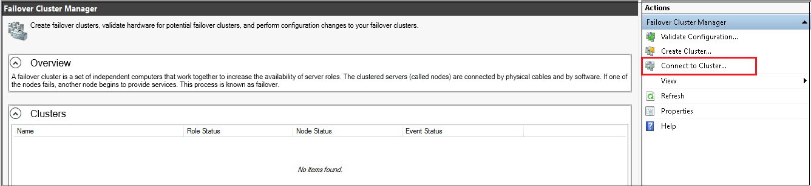

   **※S2DCluster がフェールオーバークラスターマネージャーに追加されたことが確認出来たら、タスク3に進めてください。**

   

### <a name="task-3-enable-storage-spaces-direct"></a>タスク 3: 記憶域スペース ダイレクトを有効にする

1. **SEA-ADM1** の **Windows PowerShell ISE** に切り替え、Step 4 の 32行目を選択して F8 で実行します。

   > **注 : このコマンドを実行すると、新しくインストールしたクラスターで記憶域スペース ダイレクトを有効にします。**
   >
   > **注: ステップが完了するまで待ちます。 これには 1 分ほどかかります。**

1.  Step 5 の 37行目を選択して、F8 で実行します。

   > **注: ステップが完了するまで1 分程度待ちます。 コマンドの実行結果で、FriendlyName 属性の値が S2DStoragePool であることを確認します。**

1.  **[Failover Cluster Manager (フェールオーバー クラスター マネージャー)]** ウィンドウに切り替え、 **[S2DCluster.Contoso.com] - [Storage]**  の順に展開し、 **[Pool]** を選択します。 **Cluster Pool 1** があることを確認してください。

   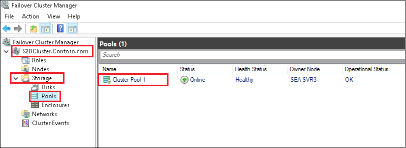

   

1. **Windows PowerShell ISE** に切り替え、Step 6  の 42 行目を選択して F8 で実行します。

   > **注: ステップが完了するまで待ちます。 ** 

1.  **[Failover Cluster Manager (フェールオーバー クラスター マネージャー)]** ウィンドウに切り替え、 **[S2DCluster.Contoso.com] - [Storage]**  の順に展開し、 **[Disks]** を選択します。 **Cluster Virtual Disk (CSV)** があることを確認してください。

   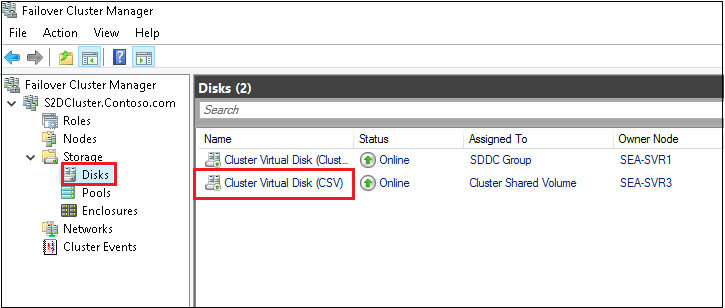 

   

### <a name="task-4-create-a-storage-pool-a-virtual-disk-and-a-share"></a>タスク 4: 記憶域プール、仮想ディスク、共有を作成する

1. **Windows PowerShell ISE** に切り替え、Step 7  の 47行目を選択して F8 で実行します。

   > **注: ステップが完了するまで待ちます。 これにかかる時間は 1 分未満です。** 
   >
   > **注 : ファイル サーバー クラスターの役割を作成します。**
   >
   > **注 : コマンドの実行結果で、 [FriendlyName] 属性が [S2D-SOFS] と定義されていれば、コマンドの実行は成功しています。**

1. **[Failover Cluster Manager (フェールオーバー クラスター マネージャー)]** ウィンドウに切り替え、 **[S2DCluster.Contoso.com] - [Roles]**  の順に展開します。 **S2D-SOFS** が表示されるか確認してください。

1. **Windows PowerShell ISE** に切り替えて、ステップ 8 の 52 ～ 54 行目をまとめて選択し、 F8 で実行します。

   > **注 : ファイル共有を作成します。**
   >
   > **注 : コマンドレットの実行が完了するまで待ちます。**
   >
   > **注 : コマンドの実行結果で、 [Path] 属性が [C:\ClusterStorage\CSV\VM01] と定義されていれば、コマンドの実行は成功しています。**

1.  **[Failover Cluster Manager (フェールオーバー クラスター マネージャー)]** ウィンドウに切り替え、  **[Roles]** の  **[ S2D-SOFS ]** を選択し、 **[Share (共有)]** タブを選択します。

   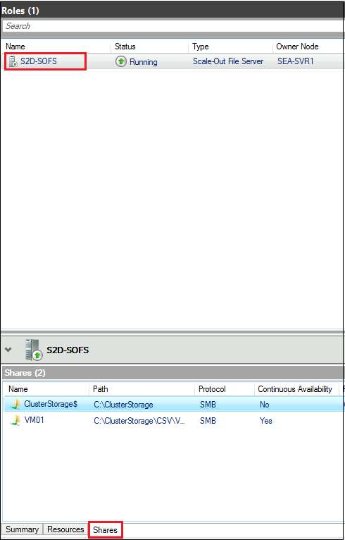

1.  **VM01** という名前の共有が存在することが確認できれば、コマンドレットの実行は正しく終了しています。確認できたら、タスク5に進んでください。

   

### <a name="task-5-verify-storage-spaces-direct-functionality"></a>タスク 5: 記憶域スペース ダイレクトの機能を確認する

1.  **SEA-ADM1** のタスクバーで、ファイル エクスプローラーアイコンをクリックします。

1.  エクスプローラーのアドレス バーに `\\S2D-SOFS.contoso.com\VM01`と入力し、ファイル共有を開きます。

1. ファイル共有上で、 **「VMFolder」** という名前のフォルダーを新規作成します。

1. 

1. **SEA-ADM1** のエクスプローラーで、**\\\\s2d-sofs\\VM01** 共有を開き、**VMFolder** という名前のフォルダーを作成します。

1. **SEA-ADM1** で、**Windows PowerShell ISE** のコンソール ペインから次のコマンドレットを実行して、**SEA-SVR3** をシャットダウンします。

   ```powershell
   Stop-Computer -ComputerName SEA-SVR3 -Force
   ```

1. **Server Manager**に切り替えて、**[All Servers (すべてのサーバー)]** を選択してから、右上の更新ボタンをクリックします。

1.  **SEA-SVR3** エントリに **[Target computer not accessible (ターゲット コンピュータにアクセスできない)]** と表示されていることを確認します。

   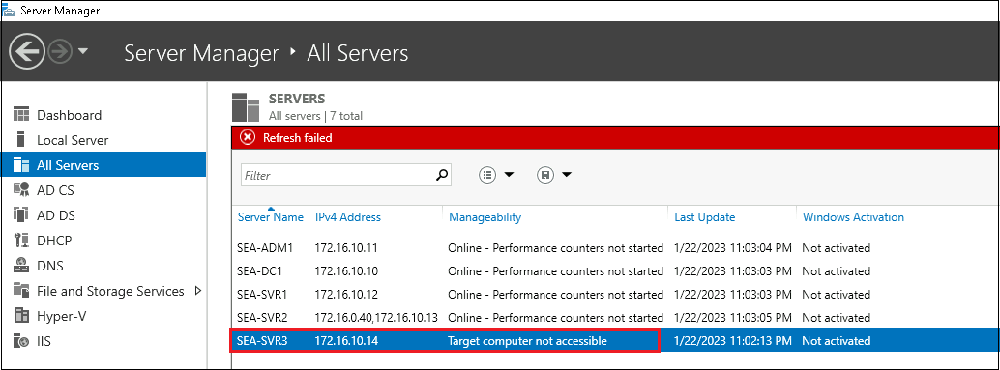


9. ファイル エクスプローラーウィンドウに戻り、 **VMFolder** に引き続きアクセスできることを確認します。

10.  **[Failover Cluster Manager (フェールオーバー クラスター マネージャー)]** に切り替えて、 **[Disks]** を選択し、 **[Cluster Virtual Disk (クラスター仮想ディスク (CSV))]** をクリックします。

11.  **Cluster Virtual Disk (CSV)** の **[Health Status (正常性状態)]** が **[Warning (警告)]** に設定され、 **[Operational Status (動作状態)]** が **[Degraded (低下)]** に設定されていることを確認します。**( Operational StatusはIncomplete (不完全)としてリストされる場合もあります)。**

    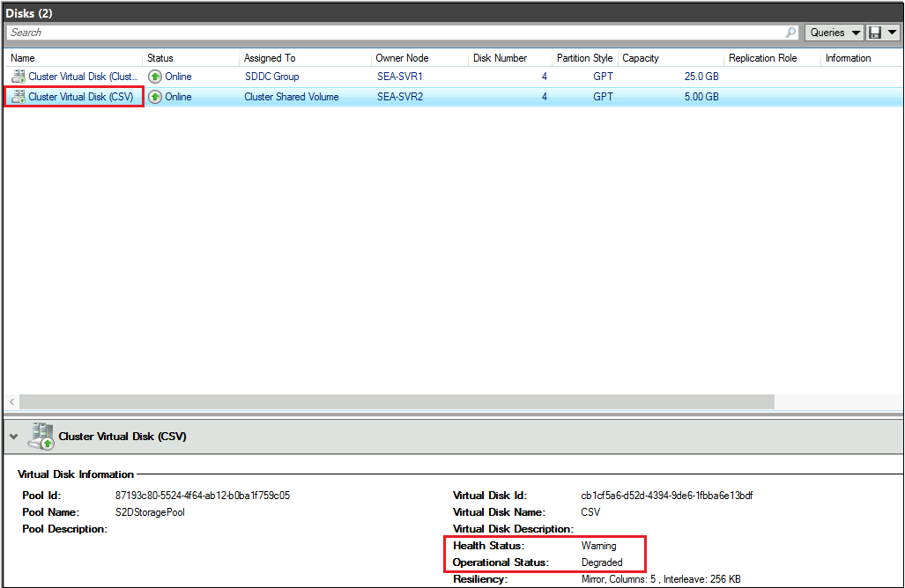


12. **SEA-ADM1** で、Windows Admin Center が表示されている Microsoft Edge ウィンドウに切り替えます。 
13.  **[すべての接続]** ペインを参照し、 **[ + 追加]** をクリックします。
14.  **[リソースの追加または作成]** ウィンドウの **[サーバー クラスター]** ウィンドウで、 **[追加]** を選択します。
15.  **[クラスター名]** テキスト ボックスに、  **「S2DCluster.Contoso.com」** と入力します。
16. **[この接続では別のアカウントを使用する]** オプションを選択し、次の資格情報を入力して、 **[アカウントに接続]** をクリックします。

- ユーザー名: Contoso\Administrator
- パスワード：Pa55w.rd

17.  **[さらにクラスターにサーバーを追加]** の **チェックをオフ** にして、 **[追加]** をクリックします。

    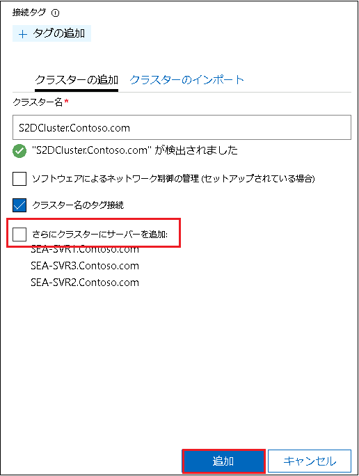


18.  **[すべての接続]** ページに戻り、 **s2dcluster.contoso.com** を選択します。

19.  **ダッシュボード**に、 **SEA-SVR3 に到達できないことを示すアラート**が表示されることを確認します。

    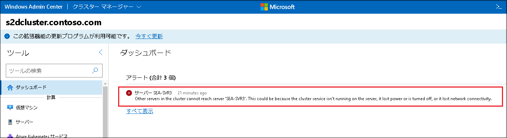

1. Windows Admin Center で、**S2DCluster.Contoso.com** クラスターへの接続を追加します。 

   > **注**: クラスター ノードは、Windows Admin Center で既に使用できるので追加しないでください。 

1. Windows Admin Center のクラスターの [ダッシュボード] ペインで、**SEA-SVR3** に到達できないことを示す警告を確認します。 

1. **SEA-SVR3** へのコンソール セッションに切り替えて、電源を入れます。 

1. 数分待ち、SEA-ADM1 の Windows Admin Center で 警告が自動的に消えることを確認します。

1. Windows Admin Center が表示されているブラウザー ページを更新し、すべてのサーバーが正常であることを確認します。


以上で演習は終了です。お疲れさまでした。


### <a name="results"></a>結果

このラボでは、以下を実施しています。

- データ重複除去の実装をテスト。
- iSCSI 記憶域をインストールして構成する。
- 冗長記憶域スペースを構成する。
- 記憶域スペース ダイレクトの実装をテストする。
