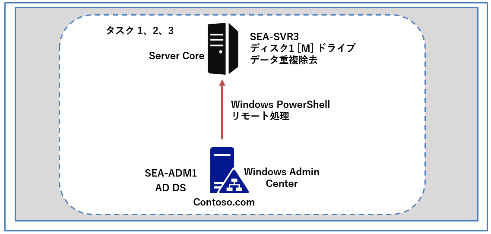
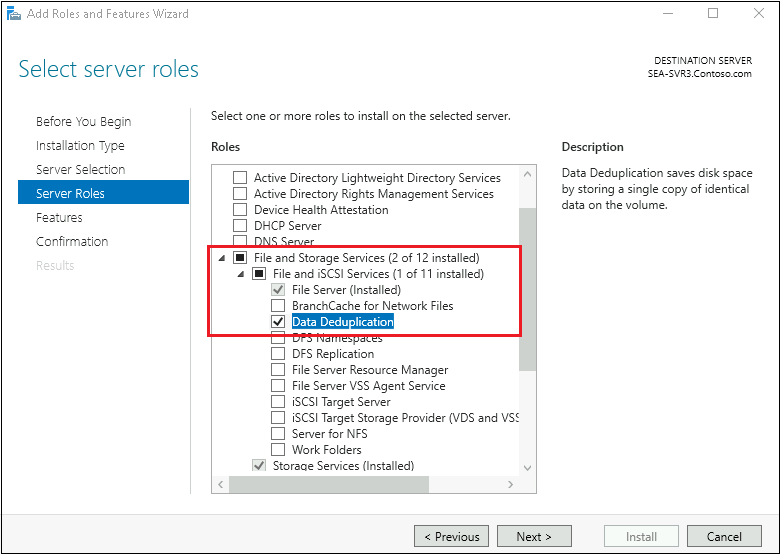

---
lab:
  title: 'ラボ: Windows Server での記憶域ソリューションの実装'
  module: 'Module 9: File servers and storage management in Windows Server'
---

# <a name="lab-implementing-storage-solutions-in-windows-server"></a>Lab9a: データ重複除去の実装

## <a name="scenario"></a>シナリオ

Contoso,Ltd で使用しているドライブ **M** は使用量が多く、一部のフォルダーには重複するファイルが含まれる可能性があります。 そこであなたは、このボリュームで消費される領域を削減するために、データ重複除去の役割を有効にして構成することにしました。


## <a name="objectives"></a>目標とタスク

このラボを完了すると、次のことができるようになります。

- データ重複除去を実装する

この演習の主なタスクは次のとおりです。

1. **SEA-SVR3** にデータ重複除去機能をインストールする

1. **SEA-SVR3** のドライブ **M** でデータ重複除去を有効にして構成する

1. ファイルを追加し、重複除去を監視して、データ重複除去をテストする

   

## <a name="estimated-time-90-minutes"></a>予想所要時間: 15 分

## <a name="architecture"></a>アーキテクチャの図



## <a name="lab-setup"></a>ラボのセットアップ

仮想マシン: **SEA-SVR3**、**SEA-ADM1** を使用します。 

1. **SEA-ADM1** を選択します。
1. 次の資格情報を使用してサインインします。

   - ユーザー名: **Contoso\Administrator**
   - パスワード: **Pa55w.rd**

このラボでは、仮想マシンのみを使用します。


### <a name="task-1-install-the-data-deduplication-role-service"></a>タスク 0: ラボのセットアップ

1. **SEA-ADM1** に以下の資格情報でサインインします。

   | 資格情報       | 値                        |
   | -------------- | ------------------------- |
   | **ユーザー名** | **Contoso\Administrator** |
   | **パスワード** | **Pa55w.rd**              |

1.  **[スタート]** メニューをの一覧から **Windows PowerShell** を起動します。

1. 次の Windows PowerShell コマンドレットを実行して、ラボ ファイルの最新バージョンを仮想マシンにダウンロードします。

   ```powershell
   ([System.Net.WebClient]::new()).DownloadFile('https://github.com/MicrosoftLearning/AZ-800-Administering-Windows-Server-Hybrid-Core-Infrastructure/archive/refs/heads/master.zip', 'C:\Labfiles\master.zip')
   ```

   ```powershell
   Expand-Archive -Path 'C:\Labfiles\master.zip' -DestinationPath 'C:\Labfiles'
   ```

   ```powershell
   Move-item -Path "C:\Labfiles\AZ-800-Administering-Windows-Server-Hybrid-Core-Infrastructure-master\Allfiles\Labfiles\Lab09*" -Destination "C:\Labfiles" -confirm:$false
   ```

### <a name="task-1-install-the-data-deduplication-role-service"></a>**タスク 1: データ重複除去役割サービスをインストールする**

1.  **SEA-ADM1** で、**[スタート]** メニューの一覧から、**[ Server Manager (サーバー マネージャー)]** を起動します。

1.  **[ Server Manager (サーバー マネージャー)]** で、右上の **[Manage (管理)]** を展開し、**[Add Roles and Features (役割と機能の追加)]** をクリックします。

1.  Add Roles and Features (役割と機能の追加) ウィザード で、**[Next (次へ)]** を 2 回クリックして、 **[Select destination server (対象サーバーの選択)]** ページまで進みます。

1.  **[Select destination server (対象サーバーの選択)]** ページの **[Server Pool (サーバー プール)]** ウィンドウで、**[SEA-SVR3.Contoso.com]** を選択し、 **[Next (次へ)]** をクリックします。

1.  **[Select server roles (サーバーの役割の選択)]** ページの **[Roles (役割)]** ウィンドウで、 **[File and Storage Services (ファイル サービスと記憶域サービス)]** 項目を展開し、 **[File and iSCSI Services (ファイル サービスと iSCSI サービス)]** 項目を更に展開して、 **[Data Deduplication (データ重複除去)]** 項目を選択し、 **[Next (次へ)]** をクリックします。

   


6.  **[Select features (機能の選択)]** ページでは、規定値のまま **[Next (次へ)]** を選択し、 **[Confirm installation selectionsインストール オプションの確認]** ページで **[Install (インストール)]** をクリックします。

7.  役割サービスのインストール中に、 **SEA-ADM1** のタスク バーにある **[エクスプローラー]** アイコンをクリックし、ファイルエクスプローラーを起動します。

8.  ファイル エクスプローラーで、**C ドライブ** を参照します。

9.   C ドライブ配下にある、 **[Labfiles]** ディレクトリを右クリックし、 **[Give access to (アクセス権を付与)]** を展開し **[Specific people (特定のユーザー)]** を選択します。

   


10. **[ Network access (ネットワーク アクセス)]** ウィンドウのテキスト ボックスに **「Users」** と入力し、 **[Add (追加)]** をクリックします。


11. **[ Network access (ネットワーク アクセス)]** ウィンドウに戻り、 **[Share (共有)]** をクリックします。 **[Your folder is shared (フォルダーは共有されています)]** ウィンドウが表示されたら、 **[Done (完了)]** をクリックします。
12. **[Server Manager]** ウィンドウに戻り、**[Add Roles and Features Wizard installation succeeded (役割と機能の追加ウィザードのインストールが成功しました)]** ページで、**[Close (閉じる)]** をクリックします。

13. **SEA-SVR3** のコンソール セッションに切り替え、パスワード  **Pa55w.rd**  を使用して **CONTOSO\\Administrator** としてサインインします。

14. **SConfig** メニューが表示された場合は、 **[Enter number to select an option]** で **15** と入力し、Enter キーを押して PowerShellコンソール セッションを一度終了します。


15. Windows PowerShellプロンプトに戻ったら、次のコマンドレットを順番に実行し、ReFS でフォーマットされた新しいドライブを作成します。

> **注 : 以下のコマンドレットを実行すると、1番のディスクに M ドライブが作成されます。**

```powershell
Get-Disk
```

```powershell
Initialize-Disk -Number 1
```

```powershell
New-Partition -DiskNumber 1 -UseMaximumSize -DriveLetter M
```

```powershell
Format-Volume -DriveLetter M -FileSystem ReFS
```

16. 次のコマンドレットを順番に実行し、重複排除するサンプル ファイルを作成するスクリプトをSEA-ADM1からコピーして実行し、結果を特定します。

    ```powershell
    New-PSDrive -Name 'X' -PSProvider "FileSystem" -Root '\\SEA-ADM1\Labfiles'
    ```

    ```powershell
    New-Item -Type Directory -Path 'M:\Data' -Force
    ```

    ```powershell
    Copy-Item -Path X:\Lab09\CreateLabFiles.cmd -Destination M:\Data\ -PassThru
    ```

    ```powershell
    Start-Process -FilePath M:\Data\CreateLabFiles.cmd -PassThru
    ```

    ```powershell
    Set-Location -Path M:\Data
    ```

    ```powershell
    Get-ChildItem -Path .
    ```

    ```powershell
    Get-PSDrive -Name M
    ```

> **注: ドライブ M の空き領域をメモしておいてください。**

### <a name="task-2-enable-and-configure-data-deduplication"></a>タスク 2: データ重複除去を有効にして構成する

1. **SEA-ADM1** へのコンソール セッションに切り替えます。

1.  **Server Manager** の **[File and Storage Services (ファイル サービスと記憶域サービス)]** を選択し、左ナビゲーションペインから **[Disks]** をクリックします。

1.  **[Disks]** ペインで、 **SEA-SVR3** のディスクのリストを参照し、**ディスク番号1** を表すエントリを選択します。

   


4.  **[VOLUMES (ボリューム)]** ウィンドウで、 **M:** ボリュームを右クリックして、メニューから **[Configure Data Deduplication (データ重複除去の構成)]** を選択します。

   


5.  **[Volume (M:) Deduplication Settings (ボリューム (M:) 重複排除設定)]** ウィンドウで以下の値を設定し、 **[OK]** をクリックします。指示がないものは規定値のままで構いません。

   | 設定                                                         | 値                                                           |
   | ------------------------------------------------------------ | ------------------------------------------------------------ |
   | Data Deduplication (データ重複排除)                          | **General purpose file server (汎用ファイル サーバー)**      |
   | Deduplicate files older than (in days) :(日数) より古いファイルの重複除外 | **0**                                                        |
   | Set Deduplication Schedule (重複排除スケジュールの設定)      | **Enable throughput optimization (スループットの最適化を有効にする) のチェックボックスをオン** |

   

### <a name="task-3-test-data-deduplication"></a>タスク 3: データ重複除去をテストする

1. **SEA-ADM1** で、Microsoft Edgeを起動し、ブックマークバーから **[Windows Admin Center]** を起動します。

1. **[Windows セキュリティ]** ダイアログ ボックスに次の資格情報を入力し、**[OK]** をクリックします。

   - ユーザー名: **CONTOSO\\Administrator**
   - パスワード: **Pa55w.rd**

   ※Windows Admin Center に接続後、必要に応じ、右上の歯車マークから言語設定を日本語に変更してください。

3. **[すべての接続]** ウィンドウで、 **[ + 追加]** をクリックします。

4. **[リソースの追加または作成]** ウィンドウの **[サーバー]** タイルで、 **[追加]** をクリックします。

5.  **[サーバー名]** テキスト ボックスに、 **[sea-svr3.contoso.com]** と入力します。

6. **[この接続では別のアカウントを使用する]** オプションを選択し、次の資格情報を入力して、 **[資格情報を含めて追加]** をクリックします。

- ユーザー名: Contoso\Administrator
- パスワード：Pa55w.rd

7. **Windows Admin Center** に **sea-svr3.contoso.com**  が追加されたことを確認したら、[すべての接続] ウィンドウから、 **sea-svr3.contoso.com**  を選択します。

8. 左ナビゲーションペインの **[ツール]** から **[PowerShell]** を選択します。

9. プロンプトが表示されたら、**パスワード (Pa55w.rd)** を入力してリモートセッションを開始します。

10. Windows PowerShell コンソールで次のコマンドレットを実行し、重複排除をトリガーします。

    ```powershell
    Start-DedupJob -Volume M: -Type Optimization -Memory 50
    ```

11. **SEA-SVR3** へのコンソール セッションに切り替えます。

    ※パスワード入力が求められたら、パスワード (Pa55w.rd) でサインインしてください。

12. **SEA-SVR3** の **Windows PowerShell** プロンプトで次のコマンドレットを実行して、重複除去されているボリューム上で使用可能なスペースを確認します。

    ```powershell
    Get-PSDrive -Name M
    ```

    > **注: データ重複除去が実装されたため、前に表示された値と現在の値を比較します。2回目の実行結果は、 [Used (GB)] の領域が減り、 [Free (GB)] の領域が増えていることが確認できます。** 
    >
    > **確認できない場合は、データ重複除去のジョブが完了するまで、5～10分程度待ってから再度確認してください。**

13. **SEA-ADM1** へのコンソール セッションに切り替えます。

14. **SEA-ADM1** の **sea-svr3.contoso.com** に接続されている Windows Admin Center の **PowerShell** ツールで重複除去ジョブの状態を確認する次のコマンドレットを実行します。

    ```powershell
    Get-DedupStatus –Volume M: | fl
    ```

    ```powershell
    Get-DedupVolume –Volume M: |fl
    ```

    ```powershell
    Get-DedupMetadata –Volume M: |fl
    ```

15. **SEA-ADM1** で、Server Manager の **[ディスク]** ウィンドウに切り替え、右上隅の **[更新]** をクリックします。

16. **[VOLUMES]** セクションで **[M:]** を選択し、右クリックして **[Properties (プロパティ)]** を選択します。

17. [**Volume (M:) Properties]**ウィンドウで、**[Deduplication rate (重複排除率)]** と **[Deduplication savings (重複排除の節約)]** の値を確認します。

    

    

    **※Deduplication (データ重複除去)が有効になっており、ボリュームMでデータ重複除去が行われた結果が確認できます。確認ができたら、プロパティを [OK] で閉じ、次の演習に進んでください。**

    

    ### <a name="results"></a>結果

    このラボでは、以下を実施しています。

    - データ重複除去を実装し、検証する。

      
