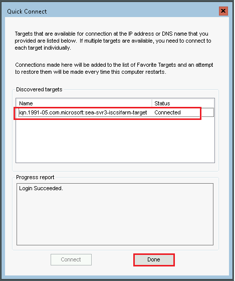

---
lab:
  title: 'ラボ: Windows Server での記憶域ソリューションの実装'
  module: 'Module 9: File servers and storage management in Windows Server'
---

# <a name="lab-implementing-storage-solutions-in-windows-server"></a>Lab9b: iSCSI 記憶域の構成

## <a name="scenario"></a>シナリオ

Contoso の経営陣は、iSCSI を使用して、一元化された記憶域を構成するコストと複雑さを軽減するオプションを検討しています。 これらを検証するため、あなたは iSCSI ターゲットをインストールして、 iSCSI イニシエーターを構成する必要があります。


## <a name="objectives"></a>目標とタスク

このラボを完了すると、次のことができるようになります。

- iSCSI 記憶域を構成する。

この演習の主なタスクは次のとおりです。

1. **SEA-SVR3** に iSCSI をインストールしてターゲットを構成する
1. **SEA-DC1** (イニシエーター) から iSCSI ターゲットに接続して構成する
1. iSCSI ディスクの構成を確認する
1. ディスクの構成を元に戻す

## <a name="estimated-time-90-minutes"></a>予想所要時間: 20分

## <a name="architecture"></a>アーキテクチャの図


## <a name="lab-setup"></a>ラボのセットアップ

仮想マシン: **SEA-DC1**、**SEA-SVR3**、**SEA-ADM1** を使用します。 

1. **SEA-ADM1** を選択します。
1. 次の資格情報を使用してサインインします。

   - ユーザー名: **Administrator**
   - パスワード: **Pa55w.rd**
   - ドメイン: **CONTOSO**

このラボでは、仮想マシンのみを使用します。


### <a name="task-1-install-iscsi-and-configure-targets"></a>タスク 1: iSCSI をインストールしてターゲットを構成する

1. **SEA-ADM1** の  **[スタート]** メニューから **Windows PowerShell** を起動します。PowerShell コンソールで、次のコマンドレットを実行して、**SEA-SVR3** への PowerShell リモート処理セッションを確立します。

   ```powershell
   Enter-PSSession -ComputerName SEA-SVR3
   ```

1. 次のコマンドレットを実行して、**SEA-SVR3** に iSCSI ターゲットをインストールします。

   ※インストールが完了するまでに、1～2分程度かかります。完了してから、次の作業に進んでください。

   ```powershell
   Install-WindowsFeature –Name FS-iSCSITarget-Server –IncludeManagementTools
   ```

1. 次のコマンドレットを実行して、ReFS でフォーマットされた新しいボリュームをディスク 2 に作成します。

   ```powershell
   Initialize-Disk -Number 2
   ```

   ```powershell
   $partition2 = New-Partition -DiskNumber 2 -UseMaximumSize -AssignDriveLetter
   ```

   ```powershell
   Format-Volume -DriveLetter $partition2.DriveLetter -FileSystem ReFS
   ```

   

1. 次のコマンドを実行して、ReFS でフォーマットされた新しいボリュームをディスク 3 に作成します。

   ```powershell
   Initialize-Disk -Number 3
   ```

   ```powershell
   $partition3 = New-Partition -DiskNumber 3 -UseMaximumSize -AssignDriveLetter
   ```

   ```powershell
   Format-Volume -DriveLetter $partition3.DriveLetter -FileSystem ReFS
   ```

   

1. 次のコマンドレットを実行して、iSCSI トラフィックを許可するセキュリティが強化された Windows Defender ファイアウォール規則を構成します。

   ```powershell
   New-NetFirewallRule -DisplayName "iSCSITargetIn" -Profile "Any" -Direction Inbound -Action Allow -Protocol TCP -LocalPort 3260
   ```

   ```powershell
   New-NetFirewallRule -DisplayName "iSCSITargetOut" -Profile "Any" -Direction Outbound -Action Allow -Protocol TCP -LocalPort 3260
   ```

   

1. 次のコマンドレットを実行して、新しく作成したボリュームに割り当てられたドライブ文字を表示します。

   ```powershell
   $partition2.DriveLetter
   ```

   ```powershell
   $partition3.DriveLetter
   ```

   > **注: この手順では、ドライブ文字がそれぞれ E および F であることを前提にしています。上記を実行後、ドライブ文字の割り当てが異なる場合、タスク2以降の手順では、別のドライブ文字を使用して進めてください。**

### <a name="task-2-connect-to-and-configure-iscsi-targets"></a>タスク 2: iSCSI ターゲットに接続して構成する

1. **SEA-ADM1** の **Server Manager** に切り替えます。 **[ File and Storage Services (ファイルサービスと記憶域サービス)]  -  [Disks]** ペイン の順に選択したら、Server Manager の右上にある **[更新]** ボタンをクリックして更新します。

2. **SEA-DC1** のディスク構成を確認します。 ブート ボリュームとシステム ボリュームのドライブ **C** だけが含まれていることが確認できます。

3. **サーバー マネージャー**の **[ファイル サービスと記憶域サービス]** で、**[iSCSI]** ペインに切り替えます。 **[Tasks (タスク)]** を選択して、ドロップダウン メニューで **[New iSCSI Virtual Disk (新しい iSCSI 仮想ディスク)]** を選択します。

   

4. **New iSCSI Virtual Disk Wizard (新しい iSCSI 仮想ディスク) ウィザード**の **[Select iSCSI virtual disk location (iSCSI 仮想ディスクの場所の選択)]** ページで、**SEA-SVR3** サーバーの下にある **E:** を選択し、 **[Next (次へ)]** をクリックします。

   

   

5. **[Specify iSCSI virtual disk name (iSCSI 仮想ディスク名の指定)]** ページで、**[Name (名前)]** テキスト ボックスに **「iSCSIDisk1」** と入力し、**[Next (次へ)]** をクリックします。

6. **[Specify iSCSI virtual disk sizeiSCSI 仮想ディスク サイズの指定]** ページで、 **[Size (サイズ)]** テキスト ボックスに **5** と入力します。その他の値は規定値のまま、 **[Next (次へ)]** をクリックします。

7. **[Assign iSCSI target (iSCSI ターゲットの割り当て)]** ページで、  **[New iSCSI target (新しい iSCSI ターゲット)]** ラジオ ボタンが選択されていることを確認し、 **[Next (次へ)]** をクリックします。

8. **[Specify target name (ターゲット名の指定)]** ページで、 **[Name (名前)]** フィールドに **「iSCSIFarm」** と入力し、 **[Next (次へ)]** をクリックします。

9. **[Specify access servers (アクセス サーバーの指定)]** ページで、 **[Add (追加)]** ボタンをクリックします。

10. **[Select a method to identify the initiator (イニシエーターを識別する方法を選択してください)]** ウィンドウで、 **[Browse (参照)]** ボタンを選択します。

11. **[Select Computer (コンピューターの選択)]** ウィンドウの **[Enter the object name to select (選択するオブジェクト名を入力してください)]** テキスト ボックスに  **「SEA-DC1」** と入力し、 **[Check Names (名前の確認)]** を一度クリックしてから、 **[ OK ]** をクリックします。

12. **[Select a method to identify the initiator (イニシエーターを識別する方法を選択してください)]** ウィンドウで、 **[sea-dc1.contoso.com]** が選択されたことを確認し、 **[OK]** をクリックします。

13. **[Specify access servers (アクセス サーバーの指定)]** ページで、 **[Next (次へ)]** をクリックします。

14. **[Enable Authentication (認証を有効にする)]** ページで、規定値のまま **[Next (次へ)]** をクリックします。

15. **[Confirm selections (選択の確認)]** ページで、 **[Create (作成)]** をクリックします。

16. **[View results (結果の表示)]** ページで、 **[Status]** がすべて **[Completes]** となったことを確認してから、ウィザードを閉じます。

17. SEA-SVR3のボリューム Dで手順6～18を繰り返し、2つめのiSCSI 仮想ディスク  **(F:)**  を作成してください。ウィザードでは以下の値を設定します。

    | 設定                                | 値                                         |
    | ----------------------------------- | ------------------------------------------ |
    | Select by volume (ボリュームの選択) | **D**                                      |
    | Name (名前)                         | **iSCSIDisk2**                             |
    | Size (サイズ)                       | **5 GB、Dynamically expanding (動的拡張)** |
    | iSCSI target (ターゲット)           | **iSCSIFarm**                              |

    

18. **SEA-DC1** のコンソール セッションに切り替え、**パスワード (Pa55w.rd)** を使用して **CONTOSO\\Administrator** としてサインインします。

19. **SConfig** メニューが表示された場合は、 **[Enter number to select an option]** で **15** と入力し、Enter キーを押して PowerShellコンソール セッションを一度終了します。

20. **Windows PowerShell** プロンプトで、次のコマンドを実行し、iSCSI イニシエーター サービスを開始し、iSCSI イニシエーターの構成を確認します。

    ```powershell
    Start-Service -Name MSiSCSI
    ```

    ```powershell
    iscsicpl
    ```

    > **注: iscsicplコマンドを実行すると、iSCSI イニシエーターのプロパティウィンドウが開きます。**

21. **[iSCSI Initiator Properties]** ダイアログ ボックスの **[Target (ターゲット)]** テキスト ボックスに　**「SEA-SVR3.contoso.com」**　と入力し、 **[Quick Connect (クイック接続)]** をクリックします。


24.  **[Quick Connect (クイック接続)]** ダイアログ ボックスで、検出されたターゲット名が **iqn.1991-05.com.microsoft:sea-svr3-iscscifarm-target** であることを確認し、 **[Done (完了)]** を選択します。

​    

    
    
    ※ **[iSCSI Initiator Properties]** ダイアログ ボックスで、 **[ OK ]** をクリックし次のタスクに進みます。


​    

### <a name="task-3-verify-iscsi-disk-configuration"></a>タスク 3: iSCSI ディスクの構成を確認する 

1. **SEA-ADM1** へのコンソール セッションに切り替えます。

1. **サーバー マネージャー**で、**[ファイル サービスと記憶域サービス]** の **[ディスク]** ペインを参照し、その表示を更新します。 

1. **SEA-DC1** ディスクの構成を確認し、2 つの **5 GB** ディスクが含まれ、**オフライン**状態であり、 **[Bus Type (バスの種類)]** が **iSCSI** であることを確認します。

   

1. **SEA-DC1** のコンソール セッションに切り替えます。 

1. **Windows PowerShell** のプロンプトで次のコマンドレットを実行して、ディスクの構成を表示します。

   ```powershell
   Get-Disk
   ```
   > **注: 1と2のディスクが存在することが確認できます。HealthStatus は [Healthy (正常)]ですが、オフラインです。 オフライン状態のディスクを使用するには、初期化してフォーマットする必要があります。**

1. **SEA-DC1** で、**Windows PowerShell** のプロンプトから次のコマンドレットを実行して、ReFS でフォーマットされたドライブ文字 **E** のボリュームを作成します。

   ```powershell
   Initialize-Disk -Number 1
   ```

   ```powershell
   New-Partition -DiskNumber 1 -UseMaximumSize -DriveLetter E
   ```

   ```powershell
   Format-Volume -DriveLetter E -FileSystem ReFS
   ```

1. 以下のコマンドレットを実行し、ReFS でフォーマットされた2つめの新しいドライブを作成します。

   ```powershell
   Initialize-Disk -Number 2
   ```

   ```powershell
   New-Partition -DiskNumber 2 -UseMaximumSize -DriveLetter D
   ```

   ```powershell
   Format-Volume -DriveLetter D -FileSystem ReFS
   ```

   

1.  **SEA-ADM1** へのコンソール セッションに戻り、Server Manager に切り替えます。右上隅にある **[更新]** ボタンをクリックして、 **[File and Storage Services (ファイル サービスと記憶域サービス)]** の **[DISKS (ディスク)]** ウィンドウを更新します。

1. **SEA-DC1** ディスクの構成を確認し、両方のドライブが**オンライン**になっていることを確認します。

   

   

### <a name="task-4-revert-disk-configuration"></a>タスク 4: ディスクの構成を元に戻す 

1. **SEA-SVR3** へのコンソール セッションに切り替えます。

1. **Windows PowerShell** のプロンプトで次のコマンドを実行して、**SEA-SVR3** のディスクを元の状態にリセットします。

   ```powershell
   for ($num = 1;$num -le 4; $num++) {Clear-Disk -Number $num -RemoveData -RemoveOEM -ErrorAction SilentlyContinue}
   ```

   > **注 : 実行を確認するプロンプトが表示されたら、 Y と入力して実行してください。** 

   ```powershell
   for ($num = 1;$num -le 4; $num++) {Set-Disk -Number $num -IsOffline $true}
   ```

   > **注: ディスクをリセットする手順は、次の演習のために必ず実行してください。**


### <a name="results"></a>結果

このラボでは、以下を実施しています。

- iSCSI 記憶域をインストールして構成する。
