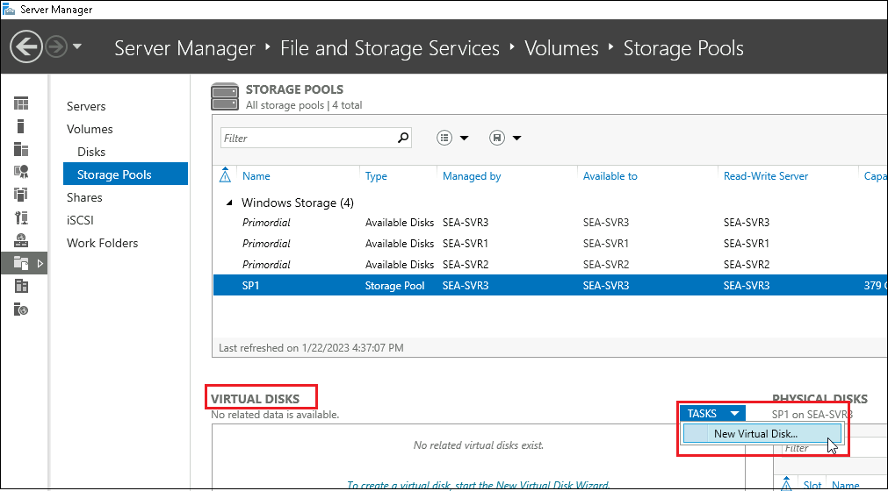
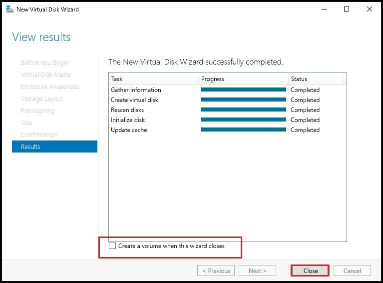
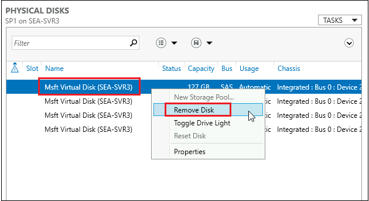
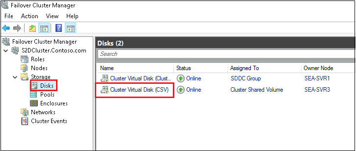
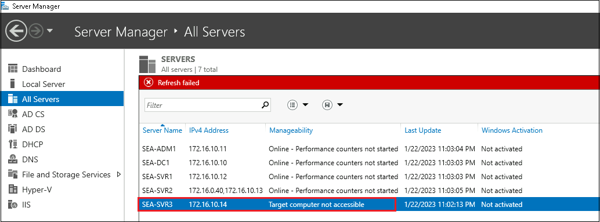

---
lab:
  title: 'ラボ: Windows Server での記憶域ソリューションの実装'
  module: 'Module 9: File servers and storage management in Windows Server'
---

# <a name="lab-implementing-storage-solutions-in-windows-server"></a>Lab9c: 記憶域スペースの構成

## <a name="scenario"></a>シナリオ

高可用性のいくつかの要件を満たすため、あなたは記憶域スペースでの冗長性オプションを検証することにしました。 さらに、記憶域プールへの新しいディスクのプロビジョニングを検証したいと考えています。


## <a name="objectives"></a>目標とタスク

このラボを完了すると、次のことができるようになります。

- 記憶域スペースを構成する。


## <a name="estimated-time-90-minutes"></a>予想所要時間: 20 分

## <a name="architecture"></a>アーキテクチャの図


## <a name="lab-setup"></a>ラボのセットアップ

仮想マシン: **SEA-DC1**、**SEA-SVR1**、**SEA-SVR2**、**SEA-SVR3**、**SEA-ADM1** を使用します。 

1. **SEA-ADM1** を選択します。
1. 次の資格情報を使用してサインインします。

   - ユーザー名: **Administrator**
   - パスワード: **Pa55w.rd**
   - ドメイン: **CONTOSO**

このラボでは、仮想マシンのみを使用します。

この演習の主なタスクは次のとおりです。

1. 記憶域プールを作成する。

1. 3 方向ミラー ディスクを基にしてボリュームを作成する。

1. エクスプローラーでボリュームを管理する。

1. 記憶域プールからディスクを切断し、ボリュームの可用性を確認する。

1. 記憶域プールにディスクを追加し、ボリュームの可用性を確認する。

1. ディスクの構成を元に戻す。

   > **補足: Windows Server では、記憶域プール内のディスクを切断できません。 削除することのみ可能です。 また、先に新しいディスクを追加してからでないと、3 方向ミラーからディスクを削除することはできません。** 


### <a name="task-1-create-a-storage-pool"></a>タスク 1: 記憶域プールを作成する 

1.  **SEA-ADM1** のコンソールセッションに切り替えて、**Server Manager**の **[File and Storage Services (ファイル サービスと記憶域サービス)]** の **[DISKS (ディスク)]** ペインで右上の **[更新]** ボタンをクリックして更新します。

1. **[DISKS]** ペインで下にスクロールし、 **SEA-SVR3 ディスク 1 ～ 4** が **[Unknown (不明なパーティション)] 、 [Status(ステータス)] が  [offline (オフライン)]** で一覧表示されていることを確認します。

   

   

3. 1～4 のディスクを順番に選択、右クリックして、 **[Bring Online (オンラインにする)]** オプションをクリックします。 **[Bring Disk Online (ディスクをオンラインにする)]** ウィンドウで **[Yes (はい)]** を選択します。

   > **注 : 4つのディスクをすべてオンライン状態にしてください。**

4. 1～4 のすべてのディスクがオンライン状態で表示されていることを確認したら、**Server Manager** の左ナビゲーション ウィンドウから、 **[Storage Pools (記憶域プール)]** を選択します。


5. **[STORAGE POOLS (ストレージプール)]** 領域の **[TASKS (タスク)]** を展開し、 **[New Storage Pool (新しいストレージ プール)]** を選択します。


6. ウィザードが起動したら、**[Before you begin (開始する前に)]** ページで、 **[Next (次へ)]** をクリックします。

7. **[Specify a storage pool name and subsystem (ストレージ プール名とサブシステムの指定)]** ページで、 **[Name (名前)]** テキスト ボックスに **「SP1」** と入力します。 **[Description (説明)]** テキスト ボックスに、  **「Storage Pool 1」** と入力します。 **[Select the group of available disks (also known as a primordial pool) that you want to use (使用する使用可能なディスク のグループを選択してください)]** リストで、 **SEA-SVR3** エントリを選択し、 **[Next (次へ)]** をクリックします。


8. **[Select physical disks for the storage pool  (記憶域プールの物理ディスクの選択)]** ページで、サイズが **127 GB の 3 つのディスクの横にあるチェック ボックスをオン**にし、 **[Next (次へ)]** をクリックします。


9. **[Confirm selections (選択の確認)]** ページで設定を確認し、 **[Create (作成)]** をクリックします。 **[Status]** がすべて **[Completed]** となったたら **[Close]** をクリックしてウィザードを終了します。

### <a name="task-2-create-a-volume-based-on-a-three-way-mirrored-disk"></a>タスク 2: 3 方向ミラー ディスクを基にしてボリュームを作成する 

1.  **SEA-ADM1** の**Server Manager** 、 **[Storage Pools (記憶域プール)]** ペインで、タスク1 で作成した記憶域プールの **[ SP1 ]** を選択します。

1.  **[VIRTUAL DISKS (仮想ディスク)]** 領域で **[TASKS]** を展開し、 **[New Virtual Disk (仮想ディスクの作成)]** をクリックします。

   


3. **[Select the storage pool (記憶域プールの選択)]** ダイアログ ボックスで、 **[SP1]** を選択し、 **[OK]** をクリックします。

4. ウィザードの **[Before you begin (開始する前に)]** ページで、 **[Next (次へ)]** をクリックします。

5. **[Specify the virtual disk name (仮想ディスク名の指定)]** ページで、 **[Name (名前)]** テキスト ボックスに **「Three-Mirror」** と入力し、 **[Next (次へ)]** をクリックします。 **(Description : の項目は入力不要です。)** 

6. **[Specify enclosure resiliency (エンクロージャの復元力の指定)]** ページでは規定値のまま、 **[Next (次へ)]** をクリックします。

7. **[Select the storage layout (ストレージ レイアウトの選択)]** ページで、 **[Mirror]** を選択し、 **[Next (次へ)]** をクリックします。

8. **[Specify the provisioning Type (プロビジョニングの入力の指定)]** ページで、 **[Thin]** を選択し、 **[Next (次へ)]** をクリックします。

9. **[Specify the size of the virtual disk (仮想ディスクのサイズの指定)]** ページで、 **[Specify size (サイズの指定)]** テキスト ボックスに **「25」** と入力し、 **[Next (次へ)]** をクリックします。

10. **[Confirm selections (選択の確認)]** ページで、 **[ Create a volume when this wizard closes (このウィザードを閉じるときにボリュームを作成する)]**  **チェック ボックスをオフ** にし、 **[Close (閉じる)]** を選択します。

    


11. **Server Manager** の ナビゲーションペインの **[Volumes (ボリューム)]** 領域で、 **[TASKS (タスク)]** を選択し、 **[New Volume (新しいボリューム)]** をクリックします。


12. ウィザード の **[Before you begin (開始する前に)]** ページで、 **[Next (次へ)]** をクリックします。

13. **[Select the server and disk (サーバーとディスクの選択)]** ページで、 **[SEA-SVR3]** を選択し、 **[ Disk 5  Three-Mirror ]** を選択して、 **[Next (次へ)]** をクリックします。

14. **[Specify the size of the volume (ボリュームのサイズを指定する)]** ページで規定値のまま、 **[Next (次へ)]** をクリックします。

15. **[Assign to a drive letter or folder (ドライブ文字またはフォルダーへの割り当て)]** ページで、 **[Drive letter (ドライブ文字)]** のプルダウンから、 **[ T ]** を選択して、 **[Next (次へ)]** をクリックします。

16. **[Select file system settings (ファイル システム設定の選択)]** ページの **[File system (ファイル システム)]** ドロップダウン リストで、 **[ReFS]** を選択します。 **[Volume label (ボリューム ラベル)]** テキスト ボックスに  **「TestData」** と入力し、 **[Next (次へ)]** をクリックします。

17.  **[Enable Data Description]** ページでは規定値のまま **[Next]** をクリックします。

18. **[Confirm selections (選択の確認)]** ページで設定を確認し、 **[Create (作成)]** をクリックします。 **[Status]** がすべて **[Completed]** となったたら **[Close]** をクリックしてウィザードを終了します。


### <a name="task-3-manage-a-volume-in-file-explorer"></a>**タスク 3: エクスプローラーでボリュームを管理する** 

1. **SEA-ADM1**  の [スタート] メニューから Windows PowerShellを起動し、以下のコマンドレットを実行して、**SEA-SVR3** への PowerShell リモート処理セッションを開始します。

   ```powershell
   Enter-PSSession -ComputerName sea-svr3.contoso.com
   ```

1. 次のコマンドレットを実行し、 **SEA-SVR3** に対し、セキュリティが強化された Windows Defender ファイアウォールのすべてのファイルとプリンターの共有規則を有効にします。

   ```powershell
   Enable-NetFirewallRule -Group "@FirewallAPI.dll,-28502"
   ```

1. **SEA-ADM1**  のタスクバーから **エクスプローラー**を起動します。

1. ファイル エクスプローラーウィンドウのアドレスバーに `\\SEA-SVR3.contoso.com\t$`と入力し、検索します。

1. `\\SEA-SVR3.contoso.com\t$` に**TestData** という名前のフォルダーを新規作成して、フォルダー内に **TestDocument.txt** という名前のドキュメントを新規作成します。

   **※ドキュメントの作成まで完了したら、タスク4に進んでください。**

### <a name="task-4-disconnect-a-disk-from-the-storage-pool-and-verify-volume-availability"></a>タスク 4: 記憶域プールからディスクを切断し、ボリュームの可用性を確認する 

1. **SEA-ADM1** の **Server Manager**を使用して、 **[File and Storage Services (ファイル サービスと記憶域サービス)]** から、 **[Storage Pools (記憶域プール)]** を選択し、 **[SP1]** をクリックします。

1.  **[Physical Disks (物理ディスク)]** ペインで、 **[TASKS (タスク)]** ドロップダウン リストを選択し、 **[Add Physical Disk (物理ディスクの追加)]** を選択します。

   

   

1.  **[Add Physical Disk (物理ディスクの追加)]** ダイアログ ボックスの、プールに追加するディスクを表す行で、ディスク名の横にあるチェック ボックスをオンにします。 **[Allocation (割り当て)]** ドロップダウン リストで、 **[Automatic (自動)]** エントリが選択されていることを確認し、 **[OK]** をクリックします。

   

   

1.  **[Physical Disk (物理ディスク)]** ペインに戻り、リストの一番上のディスクを右クリックし、 **[Remove Disk (ディスクの削除)]** をクリックします。

   

   

1.  **[Remove Physical Disk (物理ディスクの削除)]** ウィンドウで、 **[Yes]** をクリックします。

   > **注 : Windows が影響を受ける仮想ディスクを修復中であることを示すメッセージが表示されたら、 [OK] をクリックしてください。**

1. **SEA-ADM1** でファイルエクスプローラーに戻り、**TestDocument.txt** がまだ使用可能であることを確認します。 

### <a name="task-5-add-a-disk-to-the-storage-pool-and-verify-volume-availability"></a>タスク 5: 記憶域プールにディスクを追加し、ボリュームの可用性を確認する 

1.  **SEA-ADM1** の **[File and Storage Services (ファイル サービスと記憶域サービス)]** から、 **[Storage Pools (記憶域プール)]** を選択し、 **[SP1]** をクリックします。

1.  **[Storage Pools (ストレージプール)]** エントリを選択し、 **[TASKS (タスク)]** ドロップダウン リストで **[Rescan Storage (ストレージの再スキャン)]** をクリックします。

   


3.  **[Rescan Storage (ストレージの再スキャン)]** ダイアログ ボックスが表示されたら、 **[Yes]** をクリックします。

4.  **[Physical Disks (物理ディスク)]** ペインで **[TASKS (タスク)]** を選択し、ドロップダウン メニューで **[Add Physical Disk (物理ディスクの追加)]** をクリックします。

5.  **[Add Physical Disk (物理ディスクの追加)]** ダイアログ ボックスの、プールに追加するディスクを表す行で、ディスク名の横にあるチェック ボックスをオンにします。 **[Allocation (割り当て)]** ドロップダウン リストで、 **[Automatic (自動)]** エントリが選択されていることを確認し、 **[OK]** をクリックします。

6. **SEA-ADM1** でファイルエクスプローラーに戻り、**TestDocument.txt** がまだ使用可能であることを確認します。

   

### <a name="task-6-revert-disk-configuration"></a>タスク 6: ディスクの構成を元に戻す 

1. **SEA-SVR3** のコンソール セッションに切り替え、パスワード Pa55w.rd を使用して **CONTOSO\\Administrator** としてサインインします。

   > 注 : **SConfig** メニューが表示された場合は、 **[Enter number to select an option]** で **15** と入力し、Enter キーを押して PowerShellコンソール セッションを一度終了します。

1. **Windows PowerShell** のプロンプトで次のコマンドを実行して、**SEA-SVR3** のディスクを元の状態にリセットします。

   > **注 : コマンドレットの実行を確認するプロンプトが表示されたら、 Y を入力して進めてください。**

   ```powershell
   Get-VirtualDisk -FriendlyName 'Three-Mirror' | Remove-VirtualDisk
   ```

   ```powershell
   Get-StoragePool -FriendlyName 'SP1' | Remove-StoragePool
   ```

   ```powershell
   for ($num = 1;$num -le 4; $num++) {Clear-Disk -Number $num -RemoveData -RemoveOEM -ErrorAction SilentlyContinue}
   ```

   ```powershell
   for ($num = 1;$num -le 4; $num++) {Set-Disk -Number $num -IsOffline $true}
   ```

   > **注: ディスクをリセットする手順は、次の演習のために必ず実行してください。**

## <a name="lab-exercise-4-implementing-storage-spaces-direct"></a>ラボ演習 4: 記憶域スペース ダイレクトの実装

### <a name="scenario"></a>シナリオ

あなたは、ローカル記憶域を高可用性記憶域として使用する方法が、組織で実行可能なソリューションかどうかを検証したいと考えています。 以前は、 VM の格納にストレージ エリア ネットワーク (SAN) のみを使用していました。Windows Server の機能を使用すると、ローカル ストレージのみを使用できるようになるため、記憶域スペース ダイレクトを検証用に実装することにしました。

この演習の主なタスクは次のとおりです。

1. 記憶域スペース ダイレクトのインストールを準備します。
1. フェールオーバー クラスターを作成して検証します。
1. 記憶域スペースを直接有効にします。
1. 記憶域プール、仮想ディスク、共有を作成します。
1. 記憶域スペース ダイレクトの機能を確認します。

### <a name="task-1-prepare-for-installation-of-storage-spaces-direct"></a>タスク 1: 記憶域スペース ダイレクトのインストールを準備する 

1.  **SEA-ADM1** のコンソール セッションに戻り、 **Server Manager** の 左ナビゲーションペインで **[ All Servers (すべてのサーバー)]** を選択します。

1.  **SEA-SVR1、SEA-SVR2、SEA-SVR3** の **[Manageability (管理ステータス)]** が **[Onlone (オンライン)]** 状態で、パフォーマンス カウンターが開始されていないことを確認してから続行します。

   ※パフォーマンスカウンターの状態は、 **[ All Servers (すべてのサーバー)]** ページを下にスクロールし、 **[PERFORMANCE]** の状態で **[off]** となっていれば、パフォーマンスカウンターは開始されていません。

1.  **Server Manager** のナビゲーション ウィンドウで、 **[File and Storage Services (ファイル サービスと記憶域サービス)]** を選択し、 **[Disks (ディスク)]** をクリックします。

1.   **[TASKS (タスク)]** を選択し、ドロップダウン メニューで **[Refresh (更新)]** をクリックします。

1.  **[ディスク]** ペインで、下にスクロールし、 **SEA-SVR3** の **1 ～ 4 のディスク**の **[Partition (パーティション)]** 列のそれぞれのエントリが **[Unknown (不明)]** としてリストされていることを確認します。

   


6. 1～4 のディスクを順番に選択、右クリックして、 **[Bring Online (オンラインにする)]** オプションをクリックします。 **[Bring Disk Online (ディスクをオンラインにする)]** ウィンドウで **[Yes (はい)]** を選択します。

   > **注 : 4つのディスクをすべてオンライン状態にしてください。**

7.  6の手順を繰り返し、 **SEA-SVR1、SEA- SVR2** のすべてのディスクをオンラインにします。

8.  EA-ADM1の  **[スタート]** メニューで **[ Windows PowerShell ISE ]** を起動します。

9.  **Windows PowerShell ISE** で、左上の **[File (ファイル)]** メニューを展開し、 **[Open (開く)]** をクリックします。ダイアログ ボックスが表示されたら、 `C:\Labfiles\Lab09`に移動します。

   


10.  スクリプトファイル、 **Implement-StorageSpacesDirect.ps1** を選択し、 **[Open (開く)]** をクリックします。

11. **Windows PowerShell ISE** で スクリプトの Step 1 の16行目を選択して、 F8 で実行します。

    > **注 : ファイル サーバーの役割とフェールオーバー クラスタリング機能をSEA-SVR1、SEA-SVR2、およびSEA-SVR3 にインストールします。**
    >
    > **注 : インストールが完了するまでに、2～3分程度待ちます。コマンドの実行結果で、 [Exit Code] の結果が [Success] と表示されればインストール完了です。**

12.  Step 1 の 17行目を選択して、 F8 で実行します。

    > **注 : SEA-SVR1、SEA-SVR2、およびSEA-SVR3を再起動します。**

13.   Step 1 の18行目を選択して、 F8 で実行します。

    > **注 : SEA-ADM1にフェールオーバー クラスター マネージャーツールをインストールします。**

    

### <a name="task-2-create-and-validate-the-failover-cluster"></a>タスク 2: フェールオーバー クラスターを作成して検証する 

1. **SEA-ADM1** で、 **Server Manager** に切り替え、右上の [Tools (ツール)] を展開します。一覧から、  **[Failover Cluster Manager (フェールオーバークラスターマネージャー)]**  を選択し、起動するか確認します。

   > **注 : [Failover Cluster Manager (フェールオーバークラスターマネージャー)] が [Tools] の一覧に表示されない、または起動できない場合は、SEA-ADM1 を再起動し、再度確認してください。**

1. **SEA-ADM1** の **Windows PowerShell ISE** に戻り、ステップ 2 の 22行目のコマンドを選択し、 F8 を押して実行します。

   > **注: クラスターの検証テストを実行します。完了するまで 2 分ほど待ち、 テストが成功することを確認してください。警告メッセージが表示されますが、無視して構いません。**
   >
   > **注 : 実行結果の [Success] ステータスが [True] となっていればテストは成功です。**

1. ステップ 3の 27行目を選択し、F8 を押してクラスターを作成します。

   > **注 : 作業が完了するまでに2分程度かかります。完了してから次の作業に進んでください。**

1. スクリプトの実行結果を確認し、**「S2DCluster」** というクラスターが作成されたことを確認し、 **[Failover Cluster Manager (フェールオーバークラスターマネージャー)]**  に切り替えます。

1.  **[Actions (操作)]** ウィンドウで、 **[Connect to Cluster (クラスターに接続)]** を選択します。 **[Cluster Name (クラスター名)]** テキストボックスに **「S2DCluster.Contoso.com」** と入力して、 **[OK]** をクリックします。

   

   **※S2DCluster がフェールオーバークラスターマネージャーに追加されたことが確認出来たら、タスク3に進めてください。**

   

### <a name="task-3-enable-storage-spaces-direct"></a>タスク 3: 記憶域スペース ダイレクトを有効にする

1. **SEA-ADM1** の **Windows PowerShell ISE** に切り替え、Step 4 の 32行目を選択して F8 で実行します。

   > **注 : このコマンドを実行すると、新しくインストールしたクラスターで記憶域スペース ダイレクトを有効にします。**
   >
   > **注: ステップが完了するまで待ちます。 これには 1 分ほどかかります。**

1.  Step 5 の 37行目を選択して、F8 で実行します。

   > **注: ステップが完了するまで1 分程度待ちます。 コマンドの実行結果で、FriendlyName 属性の値が S2DStoragePool であることを確認します。**

1.  **[Failover Cluster Manager (フェールオーバー クラスター マネージャー)]** ウィンドウに切り替え、 **[S2DCluster.Contoso.com] - [Storage]**  の順に展開し、 **[Pool]** を選択します。 **Cluster Pool 1** があることを確認してください。

   

   

1. **Windows PowerShell ISE** に切り替え、Step 6  の 42 行目を選択して F8 で実行します。

   > **注: ステップが完了するまで待ちます。 ** 

1.  **[Failover Cluster Manager (フェールオーバー クラスター マネージャー)]** ウィンドウに切り替え、 **[S2DCluster.Contoso.com] - [Storage]**  の順に展開し、 **[Disks]** を選択します。 **Cluster Virtual Disk (CSV)** があることを確認してください。

    

   

### <a name="task-4-create-a-storage-pool-a-virtual-disk-and-a-share"></a>タスク 4: 記憶域プール、仮想ディスク、共有を作成する

1. **Windows PowerShell ISE** に切り替え、Step 7  の 47行目を選択して F8 で実行します。

   > **注: ステップが完了するまで待ちます。 これにかかる時間は 1 分未満です。** 
   >
   > **注 : ファイル サーバー クラスターの役割を作成します。**
   >
   > **注 : コマンドの実行結果で、 [FriendlyName] 属性が [S2D-SOFS] と定義されていれば、コマンドの実行は成功しています。**

1. **[Failover Cluster Manager (フェールオーバー クラスター マネージャー)]** ウィンドウに切り替え、 **[S2DCluster.Contoso.com] - [Roles]**  の順に展開します。 **S2D-SOFS** が表示されるか確認してください。

1. **Windows PowerShell ISE** に切り替えて、ステップ 8 の 52 ～ 54 行目をまとめて選択し、 F8 で実行します。

   > **注 : ファイル共有を作成します。**
   >
   > **注 : コマンドレットの実行が完了するまで待ちます。**
   >
   > **注 : コマンドの実行結果で、 [Path] 属性が [C:\ClusterStorage\CSV\VM01] と定義されていれば、コマンドの実行は成功しています。**

1.  **[Failover Cluster Manager (フェールオーバー クラスター マネージャー)]** ウィンドウに切り替え、  **[Roles]** の  **[ S2D-SOFS ]** を選択し、 **[Share (共有)]** タブを選択します。

   

1.  **VM01** という名前の共有が存在することが確認できれば、コマンドレットの実行は正しく終了しています。確認できたら、タスク5に進んでください。

   

### <a name="task-5-verify-storage-spaces-direct-functionality"></a>タスク 5: 記憶域スペース ダイレクトの機能を確認する

1.  **SEA-ADM1** のタスクバーで、ファイル エクスプローラーアイコンをクリックします。

1.  エクスプローラーのアドレス バーに `\\S2D-SOFS.contoso.com\VM01`と入力し、ファイル共有を開きます。

1. ファイル共有上で、 **「VMFolder」** という名前のフォルダーを新規作成します。

1. 

1. **SEA-ADM1** のエクスプローラーで、**\\\\s2d-sofs\\VM01** 共有を開き、**VMFolder** という名前のフォルダーを作成します。

1. **SEA-ADM1** で、**Windows PowerShell ISE** のコンソール ペインから次のコマンドレットを実行して、**SEA-SVR3** をシャットダウンします。

   ```powershell
   Stop-Computer -ComputerName SEA-SVR3 -Force
   ```

1. **Server Manager**に切り替えて、**[All Servers (すべてのサーバー)]** を選択してから、右上の更新ボタンをクリックします。

1.  **SEA-SVR3** エントリに **[Target computer not accessible (ターゲット コンピュータにアクセスできない)]** と表示されていることを確認します。

   


9. ファイル エクスプローラーウィンドウに戻り、 **VMFolder** に引き続きアクセスできることを確認します。

10.  **[Failover Cluster Manager (フェールオーバー クラスター マネージャー)]** に切り替えて、 **[Disks]** を選択し、 **[Cluster Virtual Disk (クラスター仮想ディスク (CSV))]** をクリックします。

11.  **Cluster Virtual Disk (CSV)** の **[Health Status (正常性状態)]** が **[Warning (警告)]** に設定され、 **[Operational Status (動作状態)]** が **[Degraded (低下)]** に設定されていることを確認します。**( Operational StatusはIncomplete (不完全)としてリストされる場合もあります)。**

    


12. **SEA-ADM1** で、Windows Admin Center が表示されている Microsoft Edge ウィンドウに切り替えます。 
13.  **[すべての接続]** ペインを参照し、 **[ + 追加]** をクリックします。
14.  **[リソースの追加または作成]** ウィンドウの **[サーバー クラスター]** ウィンドウで、 **[追加]** を選択します。
15.  **[クラスター名]** テキスト ボックスに、  **「S2DCluster.Contoso.com」** と入力します。
16. **[この接続では別のアカウントを使用する]** オプションを選択し、次の資格情報を入力して、 **[アカウントに接続]** をクリックします。

- ユーザー名: Contoso\Administrator
- パスワード：Pa55w.rd

17.  **[さらにクラスターにサーバーを追加]** の **チェックをオフ** にして、 **[追加]** をクリックします。

    


18.  **[すべての接続]** ページに戻り、 **s2dcluster.contoso.com** を選択します。

19.  **ダッシュボード**に、 **SEA-SVR3 に到達できないことを示すアラート**が表示されることを確認します。

    

1. Windows Admin Center で、**S2DCluster.Contoso.com** クラスターへの接続を追加します。 

   > **注**: クラスター ノードは、Windows Admin Center で既に使用できるので追加しないでください。 

1. Windows Admin Center のクラスターの [ダッシュボード] ペインで、**SEA-SVR3** に到達できないことを示す警告を確認します。 

1. **SEA-SVR3** へのコンソール セッションに切り替えて、電源を入れます。 

1. 数分待ち、SEA-ADM1 の Windows Admin Center で 警告が自動的に消えることを確認します。

1. Windows Admin Center が表示されているブラウザー ページを更新し、すべてのサーバーが正常であることを確認します。


以上で演習は終了です。お疲れさまでした。


### <a name="results"></a>結果

このラボでは、以下を実施しています。

- データ重複除去の実装をテスト。
- iSCSI 記憶域をインストールして構成する。
- 冗長記憶域スペースを構成する。
- 記憶域スペース ダイレクトの実装をテストする。
