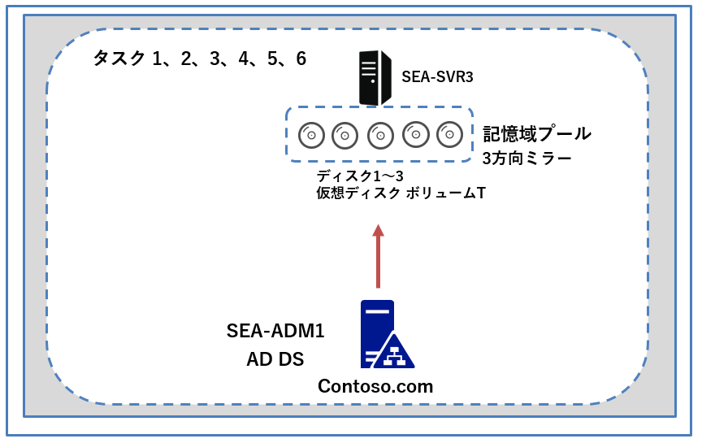

---
lab:
  title: 'ラボ: Windows Server での記憶域ソリューションの実装'
  module: 'Module 9: File servers and storage management in Windows Server'
---

# <a name="lab-implementing-storage-solutions-in-windows-server"></a>Lab9c: 記憶域スペースの構成

## <a name="scenario"></a>シナリオ

高可用性のいくつかの要件を満たすため、あなたは記憶域スペースでの冗長性オプションを検証することにしました。 さらに、記憶域プールへの新しいディスクのプロビジョニングを検証したいと考えています。


## <a name="objectives"></a>目標とタスク

このラボを完了すると、次のことができるようになります。

- 記憶域スペースを構成する

この演習の主なタスクは次のとおりです。

1. 記憶域プールを作成する

1. 3 方向ミラー ディスクを基にしてボリュームを作成する

1. エクスプローラーでボリュームを管理する

1. 記憶域プールからディスクを切断し、ボリュームの可用性を確認する

1. 記憶域プールにディスクを追加し、ボリュームの可用性を確認する

1. ディスクの構成を元に戻す

   > **補足: Windows Server では、記憶域プール内のディスクを切断できません。 削除することのみ可能です。 また、先に新しいディスクを追加してからでないと、3 方向ミラーからディスクを削除することはできません。** 


## <a name="estimated-time-90-minutes"></a>予想所要時間: 20 分

## <a name="architecture"></a>アーキテクチャの図



## <a name="lab-setup"></a>ラボのセットアップ

仮想マシン: **SEA-SVR3**、**SEA-ADM1** を使用します。 

1. **SEA-ADM1** を選択します。
1. 次の資格情報を使用してサインインします。

   - ユーザー名: **Contoso\Administrator**
   - パスワード: **Pa55w.rd**

このラボでは、仮想マシンのみを使用します。

### <a name="task-1-create-a-storage-pool"></a>タスク 1: 記憶域プールを作成する 

1.  **SEA-ADM1** のコンソールセッションに切り替えて、**Server Manager**の **[File and Storage Services (ファイル サービスと記憶域サービス)]** の **[DISKS (ディスク)]** ペインで右上の **[更新]** ボタンをクリックして更新します。

1. **[DISKS]** ペインで下にスクロールし、 **SEA-SVR3 ディスク 1 ～ 4** が **[Unknown (不明なパーティション)] 、 [Status(ステータス)] が  [offline (オフライン)]** で一覧表示されていることを確認します。

   

   

3. 1～4 のディスクを順番に選択、右クリックして、 **[Bring Online (オンラインにする)]** オプションをクリックします。 **[Bring Disk Online (ディスクをオンラインにする)]** ウィンドウで **[Yes (はい)]** を選択します。

   > **注 : 4つのディスクをすべてオンライン状態にしてください。**

4. 1～4 のすべてのディスクがオンライン状態で表示されていることを確認したら、**Server Manager** の左ナビゲーション ウィンドウから、 **[Storage Pools (記憶域プール)]** を選択します。


5. **[STORAGE POOLS (ストレージプール)]** 領域の **[TASKS (タスク)]** を展開し、 **[New Storage Pool (新しいストレージ プール)]** を選択します。


6. ウィザードが起動したら、**[Before you begin (開始する前に)]** ページで、 **[Next (次へ)]** をクリックします。

7. **[Specify a storage pool name and subsystem (ストレージ プール名とサブシステムの指定)]** ページで、 **[Name (名前)]** テキスト ボックスに **「SP1」** と入力します。 **[Description (説明)]** テキスト ボックスに、  **「Storage Pool 1」** と入力します。 **[Select the group of available disks (also known as a primordial pool) that you want to use (使用する使用可能なディスク のグループを選択してください)]** リストで、 **SEA-SVR3** エントリを選択し、 **[Next (次へ)]** をクリックします。


8. **[Select physical disks for the storage pool  (記憶域プールの物理ディスクの選択)]** ページで、サイズが **127 GB の 3 つのディスクの横にあるチェック ボックスをオン**にし、 **[Next (次へ)]** をクリックします。


9. **[Confirm selections (選択の確認)]** ページで設定を確認し、 **[Create (作成)]** をクリックします。 **[Status]** がすべて **[Completed]** となったたら **[Close]** をクリックしてウィザードを終了します。

### <a name="task-2-create-a-volume-based-on-a-three-way-mirrored-disk"></a>タスク 2: 3 方向ミラー ディスクを基にしてボリュームを作成する 

1.  **SEA-ADM1** の**Server Manager** 、 **[Storage Pools (記憶域プール)]** ペインで、タスク1 で作成した記憶域プールの **[ SP1 ]** を選択します。

1.  **[VIRTUAL DISKS (仮想ディスク)]** 領域で **[TASKS]** を展開し、 **[New Virtual Disk (仮想ディスクの作成)]** をクリックします。

   


3. **[Select the storage pool (記憶域プールの選択)]** ダイアログ ボックスで、 **[SP1]** を選択し、 **[OK]** をクリックします。

4. ウィザードの **[Before you begin (開始する前に)]** ページで、 **[Next (次へ)]** をクリックします。

5. **[Specify the virtual disk name (仮想ディスク名の指定)]** ページで、 **[Name (名前)]** テキスト ボックスに **「Three-Mirror」** と入力し、 **[Next (次へ)]** をクリックします。 **(Description : の項目は入力不要です。)** 

6. **[Specify enclosure resiliency (エンクロージャの復元力の指定)]** ページでは規定値のまま、 **[Next (次へ)]** をクリックします。

7. **[Select the storage layout (ストレージ レイアウトの選択)]** ページで、 **[Mirror]** を選択し、 **[Next (次へ)]** をクリックします。

8. **[Specify the provisioning Type (プロビジョニングの入力の指定)]** ページで、 **[Thin]** を選択し、 **[Next (次へ)]** をクリックします。

9. **[Specify the size of the virtual disk (仮想ディスクのサイズの指定)]** ページで、 **[Specify size (サイズの指定)]** テキスト ボックスに **「25」** と入力し、 **[Next (次へ)]** をクリックします。

10. **[Confirm selection(選択の確認)]** ページで、 **[Create(作成)]** をクリックします。

11. **[Confirm selections (選択の確認)]** ページで、 **[ Create a volume when this wizard closes (このウィザードを閉じるときにボリュームを作成する)]**  **チェック ボックスをオフ** にし、 **[Close (閉じる)]** を選択します。

    


11. **Server Manager** の ナビゲーションペインの **[Volumes (ボリューム)]** 領域で、 **[TASKS (タスク)]** を選択し、 **[New Volume (新しいボリューム)]** をクリックします。


12. ウィザード の **[Before you begin (開始する前に)]** ページで、 **[Next (次へ)]** をクリックします。

13. **[Select the server and disk (サーバーとディスクの選択)]** ページで、 **[SEA-SVR3]** を選択し、 **[ Disk 5  Three-Mirror ]** を選択して、 **[Next (次へ)]** をクリックします。

14. **[Specify the size of the volume (ボリュームのサイズを指定する)]** ページで規定値のまま、 **[Next (次へ)]** をクリックします。

15. **[Assign to a drive letter or folder (ドライブ文字またはフォルダーへの割り当て)]** ページで、 **[Drive letter (ドライブ文字)]** のプルダウンから、 **[ T ]** を選択して、 **[Next (次へ)]** をクリックします。

16. **[Select file system settings (ファイル システム設定の選択)]** ページの **[File system (ファイル システム)]** ドロップダウン リストで、 **[ReFS]** を選択します。 **[Volume label (ボリューム ラベル)]** テキスト ボックスに  **「TestData」** と入力し、 **[Next (次へ)]** をクリックします。

17.  **[Enable Data Description]** ページでは規定値のまま **[Next]** をクリックします。

18. **[Confirm selections (選択の確認)]** ページで設定を確認し、 **[Create (作成)]** をクリックします。 **[Status]** がすべて **[Completed]** となったたら **[Close]** をクリックしてウィザードを終了します。


### <a name="task-3-manage-a-volume-in-file-explorer"></a>**タスク 3: エクスプローラーでボリュームを管理する** 

1. **SEA-ADM1**  の [スタート] メニューから Windows PowerShellを起動し、以下のコマンドレットを実行して、**SEA-SVR3** への PowerShell リモート処理セッションを開始します。

   ```powershell
   Enter-PSSession -ComputerName sea-svr3.contoso.com
   ```

1. 次のコマンドレットを実行し、 **SEA-SVR3** に対し、セキュリティが強化された Windows Defender ファイアウォールのすべてのファイルとプリンターの共有規則を有効にします。

   ```powershell
   Enable-NetFirewallRule -Group "@FirewallAPI.dll,-28502"
   ```

1. **SEA-ADM1**  のタスクバーから **エクスプローラー**を起動します。

1. ファイル エクスプローラーウィンドウのアドレスバーに `\\SEA-SVR3.contoso.com\t$`と入力し、検索します。

1. `\\SEA-SVR3.contoso.com\t$` に**TestData** という名前のフォルダーを新規作成して、フォルダー内に **TestDocument.txt** という名前のドキュメントを新規作成します。

   **※ドキュメントの作成まで完了したら、タスク4に進んでください。**

### <a name="task-4-disconnect-a-disk-from-the-storage-pool-and-verify-volume-availability"></a>タスク 4: 記憶域プールからディスクを切断し、ボリュームの可用性を確認する 

1. **SEA-ADM1** の **Server Manager**を使用して、 **[File and Storage Services (ファイル サービスと記憶域サービス)]** から、 **[Storage Pools (記憶域プール)]** を選択し、 **[SP1]** をクリックします。

1. **[Physical Disks (物理ディスク)]** ペインで、 **[TASKS (タスク)]** ドロップダウン リストを選択し、 **[Add Physical Disk (物理ディスクの追加)]** を選択します。

   

   

3. **[Add Physical Disk (物理ディスクの追加)]** ダイアログ ボックスの、プールに追加するディスクを表す行で、ディスク名の横にあるチェック ボックスをオンにします。 **[Allocation (割り当て)]** ドロップダウン リストで、 **[Automatic (自動)]** エントリが選択されていることを確認し、 **[OK]** をクリックします。


4. **[Physical Disk (物理ディスク)]** ペインに戻り、リストの一番上のディスクを右クリックし、 **[Remove Disk (ディスクの削除)]** をクリックします。


5. **[Remove Physical Disk (物理ディスクの削除)]** ウィンドウで、 **[Yes]** をクリックします。

   > **注 : Windows が影響を受ける仮想ディスクを修復中であることを示すメッセージが表示されたら、 [OK] をクリックしてください。**

6. **SEA-ADM1** でファイルエクスプローラーに戻り、**TestDocument.txt** がまだ使用可能であることを確認します。 

### <a name="task-5-add-a-disk-to-the-storage-pool-and-verify-volume-availability"></a>タスク 5: 記憶域プールにディスクを追加し、ボリュームの可用性を確認する 

1.  **SEA-ADM1** の **[File and Storage Services (ファイル サービスと記憶域サービス)]** から、 **[Storage Pools (記憶域プール)]** を選択し、 **[SP1]** をクリックします。

1.  **[Storage Pools (ストレージプール)]** エントリを選択し、 **[TASKS (タスク)]** ドロップダウン リストで **[Rescan Storage (ストレージの再スキャン)]** をクリックします。

   


3.  **[Rescan Storage (ストレージの再スキャン)]** ダイアログ ボックスが表示されたら、 **[Yes]** をクリックします。

4.  **[Physical Disks (物理ディスク)]** ペインで **[TASKS (タスク)]** を選択し、ドロップダウン メニューで **[Add Physical Disk (物理ディスクの追加)]** をクリックします。

5.  **[Add Physical Disk (物理ディスクの追加)]** ダイアログ ボックスの、プールに追加するディスクを表す行で、ディスク名の横にあるチェック ボックスをオンにします。 **[Allocation (割り当て)]** ドロップダウン リストで、 **[Automatic (自動)]** エントリが選択されていることを確認し、 **[OK]** をクリックします。

6. **SEA-ADM1** でファイルエクスプローラーに戻り、**TestDocument.txt** がまだ使用可能であることを確認します。

   

### <a name="task-6-revert-disk-configuration"></a>タスク 6: ディスクの構成を元に戻す 

1. **SEA-SVR3** のコンソール セッションに切り替え、パスワード Pa55w.rd を使用して **CONTOSO\\Administrator** としてサインインします。

   > 注 : **SConfig** メニューが表示された場合は、 **[Enter number to select an option]** で **15** と入力し、Enter キーを押して PowerShellコンソール セッションを一度終了します。

1. **Windows PowerShell** のプロンプトで次のコマンドを実行して、**SEA-SVR3** のディスクを元の状態にリセットします。

   > **注 : コマンドレットの実行を確認するプロンプトが表示されたら、 Y を入力して進めてください。**

   ```powershell
   Get-VirtualDisk -FriendlyName 'Three-Mirror' | Remove-VirtualDisk
   ```

   ```powershell
   Get-StoragePool -FriendlyName 'SP1' | Remove-StoragePool
   ```

   ```powershell
   for ($num = 1;$num -le 4; $num++) {Clear-Disk -Number $num -RemoveData -RemoveOEM -ErrorAction SilentlyContinue}
   ```

   ```powershell
   for ($num = 1;$num -le 4; $num++) {Set-Disk -Number $num -IsOffline $true}
   ```

   > **注: ディスクをリセットする手順は、次の演習のために必ず実行してください。**

### <a name="results"></a>結果

このラボでは、以下を実施しています。

- 記憶域スペースを構成する。
