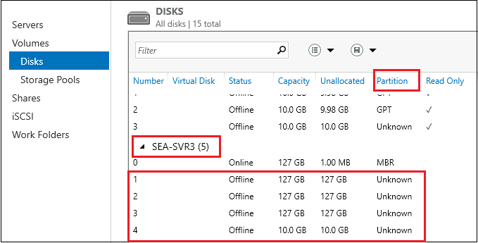
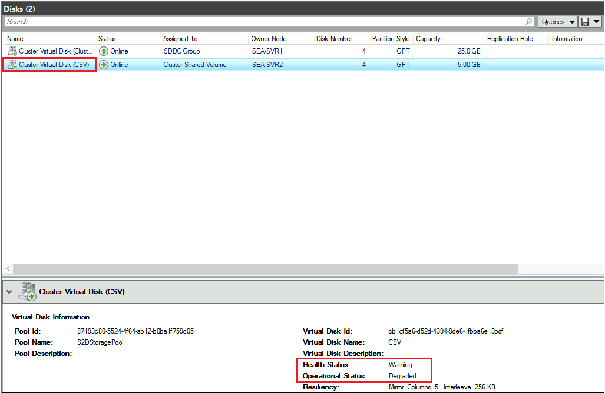
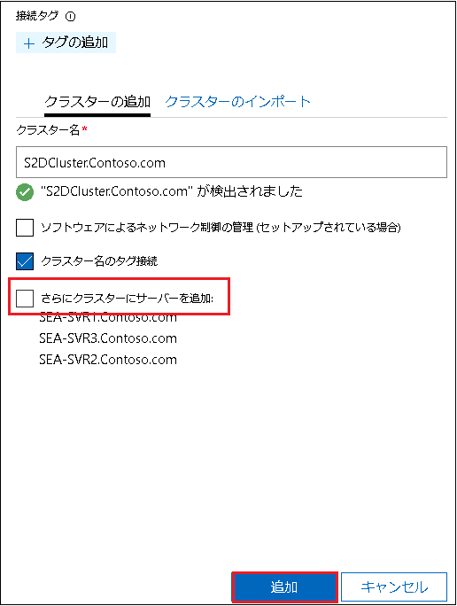

---
lab:
  title: 'ラボ: Windows Server での記憶域ソリューションの実装'
  module: 'Module 9: File servers and storage management in Windows Server'
---

# <a name="lab-implementing-storage-solutions-in-windows-server"></a>Lab9d: 記憶域スペース ダイレクトの実装

## <a name="scenario"></a>シナリオ

あなたは、ローカル記憶域を高可用性記憶域として使用する方法が、組織で実行可能なソリューションかどうかを検証したいと考えています。 以前は、 VM の格納にストレージ エリア ネットワーク (SAN) のみを使用していました。Windows Server の機能を使用すると、ローカル ストレージのみを使用できるようになるため、記憶域スペース ダイレクトを検証用に実装することにしました。


## <a name="objectives"></a>目標とタスク

このラボを完了すると、次のことができるようになります。

- 記憶域スペース ダイレクトを実装する

この演習の主なタスクは次のとおりです。

1. 記憶域スペース ダイレクトのインストールを準備する
1. フェールオーバー クラスターを作成して検証する
1. 記憶域スペースを直接有効にする
1. 記憶域プール、仮想ディスク、共有を作成する
1. 記憶域スペース ダイレクトの機能を確認する

## <a name="estimated-time-90-minutes"></a>予想所要時間: 35 分

## <a name="architecture"></a>アーキテクチャの図


## <a name="lab-setup"></a>ラボのセットアップ

仮想マシン: **SEA-SVR1**、**SEA-SVR2**、**SEA-SVR3**、**SEA-ADM1** を使用します。 

1. **SEA-ADM1** を選択します。
1. 次の資格情報を使用してサインインします。

   - ユーザー名: **Contoso\Administrator**
   - パスワード: **Pa55w.rd**

このラボでは、仮想マシンのみを使用します。


### <a name="task-1-prepare-for-installation-of-storage-spaces-direct"></a>タスク 1: 記憶域スペース ダイレクトのインストールを準備する 

1. **SEA-ADM1** のコンソール セッションに、 Contoso\Administrator でサインインし、 **Server Manager** の 左ナビゲーションペインで **[ All Servers (すべてのサーバー)]** を選択します。

1. **SEA-SVR1、SEA-SVR2、SEA-SVR3** の **[Manageability (管理ステータス)]** が **[Onlone (オンライン)]** 状態で、パフォーマンス カウンターが開始されていないことを確認してから続行します。

   ※パフォーマンスカウンターの状態は、 **[ All Servers (すべてのサーバー)]** ページを下にスクロールし、 **[PERFORMANCE]** の状態で **[off]** となっていれば、パフォーマンスカウンターは開始されていません。

1. **Server Manager** のナビゲーション ウィンドウで、 **[File and Storage Services (ファイル サービスと記憶域サービス)]** を選択し、 **[Disks (ディスク)]** をクリックします。

1. **[TASKS (タスク)]** を選択し、ドロップダウン メニューで **[Refresh (更新)]** をクリックします。

1. **[ディスク]** ペインで、下にスクロールし、 **SEA-SVR3** の **1 ～ 4 のディスク**の **[Partition (パーティション)]** 列のそれぞれのエントリが **[Unknown (不明)]** としてリストされていることを確認します。

   


6. 1～4 のディスクを順番に選択、右クリックして、 **[Bring Online (オンラインにする)]** オプションをクリックします。 **[Bring Disk Online (ディスクをオンラインにする)]** ウィンドウで **[Yes (はい)]** を選択します。

   > **注 : 4つのディスクをすべてオンライン状態にしてください。**

7.  6の手順を繰り返し、 **SEA-SVR1、SEA- SVR2** のすべてのディスクをオンラインにします。

8.  EA-ADM1の  **[スタート]** メニューで **[ Windows PowerShell ISE ]** を起動します。

9.  **Windows PowerShell ISE** で、左上の **[File (ファイル)]** メニューを展開し、 **[Open (開く)]** をクリックします。ダイアログ ボックスが表示されたら、 `C:\Labfiles\Lab09`に移動します。

   


10. スクリプトファイル、 **Implement-StorageSpacesDirect.ps1** を選択し、 **[Open (開く)]** をクリックします。

11. **Windows PowerShell ISE** で スクリプトの Step 1 の16行目を選択して、 F8 キーで実行します。

    > **注 : ファイル サーバーの役割とフェールオーバー クラスタリング機能をSEA-SVR1、SEA-SVR2、およびSEA-SVR3 にインストールします。**
    >
    > **注 : インストールが完了するまでに、2～3分程度待ちます。コマンドの実行結果で、 [Exit Code] の結果が [Success] と表示されればインストール完了です。**

12. Step 1 の 17行目を選択して、 F8 で実行します。

    > **注 : SEA-SVR1、SEA-SVR2、およびSEA-SVR3を再起動します。**

13. Step 1 の18行目を選択して、 F8 で実行します。

    > **注 : SEA-ADM1にフェールオーバー クラスター マネージャーツールをインストールします。**

### <a name="task-2-create-and-validate-the-failover-cluster"></a>タスク 2: フェールオーバー クラスターを作成して検証する 

1. **SEA-ADM1** で、 **Server Manager** に切り替え、右上の  **[Tools (ツール)]**  を展開します。一覧から、  **[Failover Cluster Manager (フェールオーバークラスターマネージャー)]**  を選択し、起動するか確認します。

   > **注 : [Failover Cluster Manager (フェールオーバークラスターマネージャー)] が [Tools] の一覧に表示されない、または起動できない場合は、SEA-ADM1 を再起動し、再度確認してください。**

1. **SEA-ADM1** の **Windows PowerShell ISE** に戻り、ステップ 2 の 22行目のコマンドを選択し、 F8 を押して実行します。

   > **注: クラスターの検証テストを実行します。完了するまで 2 分ほど待ち、 テストが成功することを確認してください。警告メッセージが表示されますが、無視して構いません。**
   >
   > **注 : 実行結果の [Success] ステータスが [True] となっていればテストは成功です。**

1. ステップ 3の 27行目を選択し、F8 を押してクラスターを作成します。

   > **注 : 作業が完了するまでに2分程度かかります。完了してから次の作業に進んでください。**

1. スクリプトの実行結果を確認し、**「S2DCluster」** というクラスターが作成されたことを確認し、 **[Failover Cluster Manager (フェールオーバークラスターマネージャー)]**  に切り替えます。

1.  **[Actions (操作)]** ウィンドウで、 **[Connect to Cluster (クラスターに接続)]** を選択します。 **[Cluster Name (クラスター名)]** テキストボックスに **「S2DCluster.Contoso.com」** と入力して、 **[OK]** をクリックします。

   

   **※S2DCluster がフェールオーバークラスターマネージャーに追加されたことが確認出来たら、タスク3に進めてください。**

   

### <a name="task-3-enable-storage-spaces-direct"></a>タスク 3: 記憶域スペース ダイレクトを有効にする

1. **SEA-ADM1** の **Windows PowerShell ISE** に切り替え、Step 4 の 32行目を選択して F8 で実行します。

   > **注 : このコマンドを実行すると、新しくインストールしたクラスターで記憶域スペース ダイレクトを有効にします。**
   >
   > **注: ステップが完了するまで待ちます。 これには 1 分ほどかかります。**

1. Step 5 の 37行目を選択して、F8 で実行します。

   > **注: ステップが完了するまで1 分程度待ちます。 コマンドの実行結果で、FriendlyName 属性の値が S2DStoragePool であることを確認します。**

1. **[Failover Cluster Manager (フェールオーバー クラスター マネージャー)]** ウィンドウに切り替え、 **[S2DCluster.Contoso.com] - [Storage]**  の順に展開し、 **[Pool]** を選択します。 **Cluster Pool 1** があることを確認してください。

   

   

1. **Windows PowerShell ISE** に切り替え、Step 6  の 42 行目を選択して F8 で実行します。

   >  **注: ステップが完了するまで待ちます。** 

1. **[Failover Cluster Manager (フェールオーバー クラスター マネージャー)]** ウィンドウに切り替え、 **[S2DCluster.Contoso.com] - [Storage]**  の順に展開し、 **[Disks]** を選択します。 **Cluster Virtual Disk (CSV)** があることを確認してください。

    

   

### <a name="task-4-create-a-storage-pool-a-virtual-disk-and-a-share"></a>タスク 4: 記憶域プール、仮想ディスク、共有を作成する

1. **Windows PowerShell ISE** に切り替え、Step 7  の 47行目を選択して F8 で実行します。

   > **注: ステップが完了するまで待ちます。 これにかかる時間は 1 分未満です。** 
   >
   > **注 : ファイル サーバー クラスターの役割を作成します。**
   >
   > **注 : コマンドの実行結果で、 [FriendlyName] 属性が [S2D-SOFS] と定義されていれば、コマンドの実行は成功しています。**

1. **[Failover Cluster Manager (フェールオーバー クラスター マネージャー)]** ウィンドウに切り替え、 **[S2DCluster.Contoso.com] - [Roles]**  の順に展開します。 **S2D-SOFS** が表示されるか確認してください。

1. **Windows PowerShell ISE** に切り替えて、ステップ 8 の 52 ～ 54 行目をまとめて選択し、 F8 で実行します。

   > **注 : ファイル共有を作成します。**
   >
   > **注 : コマンドレットの実行が完了するまで待ちます。**
   >
   > **注 : コマンドの実行結果で、 [Path] 属性が [C:\ClusterStorage\CSV\VM01] と定義されていれば、コマンドの実行は成功しています。**

1. **[Failover Cluster Manager (フェールオーバー クラスター マネージャー)]** ウィンドウに切り替え、  **[Roles]** の  **[ S2D-SOFS ]** を選択し、 **[Share (共有)]** タブを選択します。

   

5. **VM01** という名前の共有が存在することが確認できれば、コマンドレットの実行は正しく終了しています。確認できたら、タスク5に進んでください。

   

### <a name="task-5-verify-storage-spaces-direct-functionality"></a>タスク 5: 記憶域スペース ダイレクトの機能を確認する

1.  **SEA-ADM1** のタスクバーで、ファイル エクスプローラーアイコンをクリックします。

1.  エクスプローラーのアドレス バーに `\\S2D-SOFS.contoso.com\VM01`と入力し、ファイル共有を開きます。

1. ファイル共有上で、 **「VMFolder」** という名前のフォルダーを新規作成します。

1. **SEA-ADM1** で、**Windows PowerShell ISE** のコンソール ペインから次のコマンドレットを実行して、**SEA-SVR3** をシャットダウンします。

   ```powershell
   Stop-Computer -ComputerName SEA-SVR3 -Force
   ```

1. **Server Manager**に切り替えて、**[All Servers (すべてのサーバー)]** を選択してから、右上の更新ボタンをクリックします。

1.  **SEA-SVR3** エントリに **[Target computer not accessible (ターゲット コンピュータにアクセスできない)]** と表示されていることを確認します。

   


9. ファイル エクスプローラーウィンドウに戻り、 **VMFolder** に引き続きアクセスできることを確認します。

10. **[Failover Cluster Manager (フェールオーバー クラスター マネージャー)]** に切り替えて、 **[Disks]** を選択し、 **[Cluster Virtual Disk (クラスター仮想ディスク (CSV))]** をクリックします。

11. **Cluster Virtual Disk (CSV)** の **[Health Status (正常性状態)]** が **[Warning (警告)]** に設定され、 **[Operational Status (動作状態)]** が **[Degraded (低下)]** に設定されていることを確認します。**( Operational StatusはIncomplete (不完全)としてリストされる場合もあります)。**

    

    

12. **SEA-ADM1** で、 Microsoft Edge ウィンドウに切り替え、  Windows Admin Center `https://sea-adm1.contoso.com/` にアクセスします。
13.  **[すべての接続]** ペインを参照し、 **[ + 追加]** をクリックします。
14.  **[リソースの追加または作成]** ウィンドウの **[サーバー クラスター]** ウィンドウで、 **[追加]** を選択します。
15.  **[クラスター名]** テキスト ボックスに、  **「S2DCluster.Contoso.com」** と入力します。
16. **[この接続では別のアカウントを使用する]** オプションを選択し、次の資格情報を入力して、 **[アカウントに接続]** をクリックします。

- ユーザー名: Contoso\Administrator
- パスワード：Pa55w.rd

17. **[さらにクラスターにサーバーを追加]** の **チェックをオフ** にして、 **[追加]** をクリックします。

    

18.  **[すべての接続]** ページに戻り、 **s2dcluster.contoso.com** を選択します。

19. **ダッシュボード**に、 **SEA-SVR3 に到達できないことを示すアラート**が表示されることを確認します。

    

    

1. **SEA-SVR3** へのコンソール セッションに切り替えて、電源を入れます。 

1. 数分待ち、SEA-ADM1 の Windows Admin Center で 警告が自動的に消えることを確認します。

1. Windows Admin Center が表示されているブラウザー ページを更新し、すべてのサーバーが正常であることを確認します。

### <a name="results"></a>結果

このラボでは、以下を実施しています。

- クラスター共有ボリューム(CSV)を作成し、記憶域スペース ダイレクトの実装をテストする。
