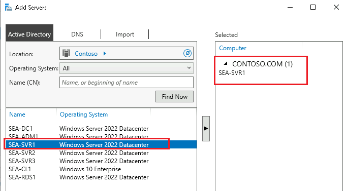
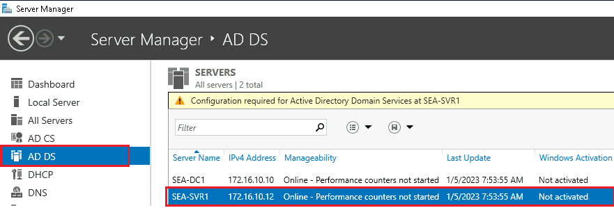
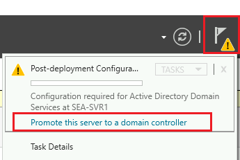
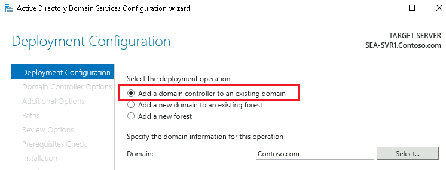
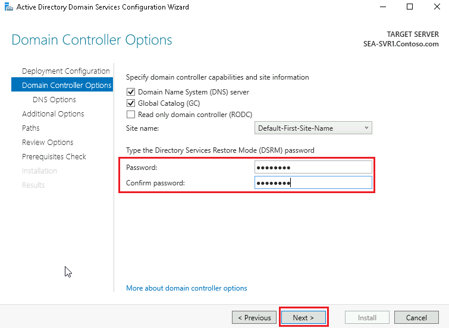
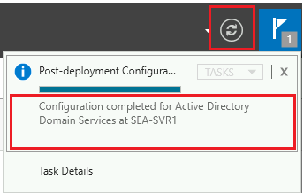

# <a name="lab-answer-key-implementing-identity-services-and-group-policy"></a>Lab01: ID サービスおよびグループ ポリシーの実装

## <a name="exercise-1-deploying-a-new-domain-controller-on-server-core"></a>演習 1: Server Core への新しいドメイン コントローラーの展開

#### <a name="task-1-deploy-ad-ds-on-a-new-windows-server-core-server"></a>タスク 1: Server Core に AD DS を展開する

1. **SEA-ADM1** に以下の資格情報でサインインします。

   | 資格情報       |                            |
   | -------------- | -------------------------- |
   | **ユーザー名** | **Contoso\\Administrator** |
   | **パスワード** | **Pa55w.rd**               |

1. **SEA-ADM1** で **[スタート]** メニューから、**[Windows PowerShell (管理者)]** をクリックします。

1. 以下のWindows PowerShellコマンドレットを実行し、**SEA-SVR1**にAD DS (Active Directory ドメインサービス)の役割をインストールします。

   ```powershell
   Install-WindowsFeature –Name AD-Domain-Services –ComputerName SEA-SVR1
   ```

   **※インストールが完了するまでに数分時間を要します。**

   **※実行結果の[Success]が[True]とかえってくれば、インストール完了です。**

   

1. **SEA-SVR1** に AD DS 役割がインストールされていることを確認するには、**SEA-ADM1**で以下のWindows PowerShell コマンドレットを実行します。

   ```powershell
   Get-WindowsFeature –ComputerName SEA-SVR1
   ```

1. 4のコマンドレット実行結果で、**Active Directory Domain Services** を探し、**[X]** が表示されていれば、**SEA-SVR1**にインストール済みです。

   

   > **注: インストール プロセスが完了してから、AD DS の役割がインストールされていることが確認できるようになるまで、時間を要する場合があります。 Get-WindowsFeature コマンドレットから結果が得られない場合は、時間をおいて再度実行してみてください。**

#### <a name="task-2-prepare-the-ad-ds-installation-and-promote-a-remote-server"></a>タスク 2: AD DS インストールの準備をして、リモート サーバーを昇格させる

1. **SEA-ADM1** の **[スタート]** メニューから[Server Manager] を選択して起動させます。起動後、左ペインから **[All Servers(すべてのサーバー)]** を選択します。

   

2. **[Manage(管理)]** メニューで、**[Add Servers(サーバーの追加)]** を選択します。

   
   
3. **[Add Servers(サーバーの追加)]** ダイアログ ボックスで、**[Find Now(今すぐ検索)]**をクリックします。


   4.サーバーの **[Active Directory]** リストで **[SEA-SVR1]** を選び、矢印を選択して **[選択済み]** リストに追加してから、**[OK]** を選択します。




   5.**SEA-ADM1** の**[Server Manager]**の左ペインから**[AD DS]**を選択し、**SEA-SRV1** への AD DS 役割のインストールが完了していることを確認します。




   6.**[Server Manager]**の右上にある**[通知]** フラグ をクリックします。**SEA-SVR1** の展開後の構成に注目します。**[ Promote this server to a domain controller (このサーバーをドメイン コントローラーに昇格する)]** のリンクをクリックします。



> **注**: **SEA-SVR1**にAD DSの役割をインストールしただけではドメインコントローラーにならないため、昇格させる必要があります。

**※通知フラグに[Refresh failed]エラーが表示される場合がありますが、ラボと直接関係のないエラーのため無視して構いません。**

   7.**[Active Directory Domain Services Configuration ウィザード]** の **[Deployment Configuration(展開構成)]** ページの**[Select the deployment operation (展開操作の選択)]** の下で、**[Add a domain controller to an existing domain(既存のドメインにドメイン コントローラーを追加する)]** が選択されていることを確認します。



   8.`Contoso.com` ドメインが指定されていることを確かめてから、**[Supply the credentials to perform this operation (この操作を実行する資格情報を指定する)]** セクションで **[Change (変更)]** を選択します。

 


   9.**[資格情報]** ダイアログ ボックスに以下の資格情報を入力し、**[OK]** をクリックします。

| 資格情報       |                            |
| -------------- | -------------------------- |
| **ユーザー名** | **Contoso\\Administrator** |
| **パスワード** | **Pa55w.rd**               |

10. 資格情報が変更されたことを確認し、**[Next (次へ)]** をクリックします。

11. **[Domain Controller Options]** ページで、**[Domain Name System (DNS) server]** と **[Global Catalog (GC)]** チェックボックスがオンになっていることを確認します。 **[読み取り専用ドメイン コントローラー (RODC)]** チェック ボックスがオフで構いません。

12. **[Type the Directory Services Restore Mode (DSRM) password (ディレクトリ サービス復元モード (DSRM) パスワードの入力)]** セクションで、以下のパスワードを入力し、**[次へ]** をクリックします。

| パスワード   |
| ------------ |
| **Pa55w.rd** |




13. **[DNS Options]** ページでは規定値のまま、**[Next (次へ)]** をクリックします。

※ページ内に、DNSゾーンの委任に関する警告メッセージが表示されますが、このラボではDNSゾーンの委任は行わないため無視して構いません。

14. **[Additional Options (追加オプション)]** ページで、規定値のまま**[Next (次へ)]** をクリックします。

※IFMオプションはチェックを外したままで構いません。

15. **[Paths (パス)]** ページでは、既定のパスのまま、**[Next (次へ)]** をクリックします。

16. **[Review Options (オプションの確認)]**ページでは、**[Next (次へ)]** をクリックします。

17. **[Prerequisites Check (前提条件のチェック)]**ページで、緑のチェックが表示されたことを確認したら**[Install (インストール)]**をクリックします。

**[This server was successfully configured as a domain contoroller]**のメッセージが表示されたら、**[Close (閉じる)]**をクリックします。

18. **SEA-ADM1** で **[Server Manager]** に切り替え、右上の更新ボタンをクリックします。その後、通知メッセージを確認し**[ Promote this server to a domain controller (このサーバーをドメイン コントローラーに昇格する)]** が表示されなくなっていることを確認します。

> **注**:SEA-SVR1の再起動が完了するまでに何度か **[更新]** を繰り返す必要がある場合があります。




#### <a name="task-3-manage-objects-in-ad-ds"></a>タスク 3: AD DS でオブジェクトを管理する

1. **SEA-ADM1** のコンソール セッションに接続されていることを確かめます。
1. **Windows PowerShell (管理者)** に切り替えます。
1. Contoso AD DS ドメインに **Seattle** という組織単位 (OU) を作成するには、次のコマンドを入力し、Enter キーを押します。

   ```powershell
   New-ADOrganizationalUnit -Name "Seattle" -Path "DC=contoso,DC=com" -ProtectedFromAccidentalDeletion $true -Server SEA-DC1.contoso.com
   ```
1. **Seattle** OU で **Ty Carlson** のユーザー アカウントを作成するには、次のコマンドを入力し、Enter キーを押します。

   ```powershell
   New-ADUser -Name Ty -DisplayName 'Ty Carlson' -GivenName Ty -Surname Carlson -Path 'OU=Seattle,DC=contoso,DC=com'
   ```
1. Ty のユーザー アカウントのパスワードを設定するには、次のコマンドを入力し、Enter キーを押します。

   ```powershell
   Set-ADAccountPassword Ty
   ```
1. 現在のパスワードの入力を求めるメッセージが表示されたら、Enter キーを押します。
1. 目的のパスワードの入力を求めるメッセージが表示されたら、「**Pa55w.rd**」と入力し、Enter キーを押します。
1. パスワードをもう一度入力するよう求められたら、「**Pa55w.rd**」と入力し、Enter キーを押します。
1. アカウントを有効にするには、次のコマンドを入力し、Enter キーを押します。

   ```powershell
   Enable-ADAccount Ty
   ```
1. **SeattleBranchUsers** という名前のドメイン グローバル グループを作成するには、次のコマンドを入力し、Enter キーを押します。

   ```powershell
   New-ADGroup SeattleBranchUsers -Path 'OU=Seattle,DC=contoso,DC=com' -GroupScope Global -GroupCategory Security
   ```
1. 新しく作成されたグループに **Ty** ユーザー アカウントを追加するには、次のコマンドを入力し、Enter キーを押します。

   ```powershell
   Add-ADGroupMember -Identity SeattleBranchUsers -Members Ty
   ```
1. ユーザーがグループに存在していることを確認するには、次のコマンドを入力し、Enter キーを押します。

   ```powershell
   Get-ADGroupMember -Identity SeattleBranchUsers
   ```
1. ローカルの管理者グループにユーザーを追加するには、次のコマンドを入力し、Enter キーを押します。

   ```powershell
   Add-LocalGroupMember -Group 'Administrators' -Member 'CONTOSO\Ty'
   ```

   > **注**: これは、**CONTOSO\\Ty** ユーザー アカウントで **SEA-ADM1** にサインインできるようにするために必要です。

**結果**: この演習が完了すると、AD DS に新しいドメイン コントローラーとマネージド オブジェクトを正常に作成したことになります。

## <a name="exercise-2-configuring-group-policy"></a>演習 2: グループ ポリシーの構成

#### <a name="task-1-create-and-edit-a-gpo"></a>タスク 1: GPO を作成および編集する

1. **SEA-ADM1** で、サーバー マネージャーから **[ツール]** を選択し、**[グループ ポリシーの管理]** を選びます。
1. 必要に応じて、**[グループ ポリシーの管理]** ウィンドウに切り替えます。
1. **[グループ ポリシーの管理]** コンソールのナビゲーション ペインで、**Forest:Contoso.com**、**Domains**、および **Contoso.com** を展開してから、**[グループ ポリシー オブジェクト]** コンテナーを選択します。
1. ナビゲーション ペインで、**[グループ ポリシー オブジェクト]** コンテナーのコンテキスト メニューを右クリックするかそこにアクセスして、**[新規]** を選択します。
1. **[名前]** テキスト ボックスに「**CONTOSO Standards**」と入力し、**[OK]** を選択します。
1. 詳細ペインで、**CONTOSO Standards** グループ ポリシー オブジェクト (GPO) のコンテキスト メニューを右クリックまたはそこにアクセスし、**[編集]** を選択します。
1. **[グループ ポリシー管理エディター]** ウィンドウのナビゲーション ペインで、**[ユーザーの構成]**、**[ポリシー]**、**[管理用テンプレート]** の順に展開してから **[システム]** を選択します。
1. **[レジストリ編集ツールへアクセスできないようにする]** ポリシー設定をダブルクリックするか、その設定を選択してから、Enter キーを押します。
1. **[レジストリ編集ツールへアクセスできないようにする]** ダイアログ ボックスで、**[有効]**、**[OK]** の順に選択します。
1. ナビゲーション ペインで、**[ユーザーの****構成]**、**[ポリシー]**、**[管理用テンプレート]** の順に展開し、**[コントロール パネル]** を展開してから **[個人用設定]** を選択します。
1. 詳細ペインで、**[スクリーン セーバーのタイムアウト]** ポリシー設定をダブルクリックまたは選択してから、Enter キーを押します。
1. **[スクリーン セーバーのタイムアウト]** ダイアログ ボックスで、**[有効]** を選択します。 **[秒]** テキスト ボックスに「**600**」と入力してから、**[OK]** を選択します。 
1. **[パスワードでスクリーン セーバーを保護する]** ポリシー設定をダブルクリックまたは選択してから、Enter キーを押します。
1. **[スクリーン セーバーをパスワードで保護する]** ダイアログ ボックスで、**[有効]** を選んでから、**[OK]** を選択します。
1. **[グループ ポリシー管理エディター]** ウィンドウを閉じます。

#### <a name="task-2-link-the-gpo"></a>タスク 2: GPO をリンクする

1. **[グループ ポリシーの管理]** ウィンドウのナビゲーション ペインで、`Contoso.com` ドメインのコンテキスト メニューを右クリックまたはそこにアクセスし、**[既存の GPO のリンク]** を選択します。
1. **[GPO の選択]** ダイアログ ボックスで、**[CONTOSO Standards]** を選んでから、**[OK]** を選択します。

#### <a name="task-3-review-the-effects-of-the-gpos-settings"></a>タスク 3: GPO の設定の効果を確認する

1. **SEA-ADM1** で、タスク バーの検索ボックスに「**コントロール パネル**」と入力します。 
1. **[最も一致する検索結果]** リストで、**[コントロール パネル]** を選択します。
1. **[システムとセキュリティ]** を選択してから、**[Windows ファイアウォールによるアプリケーションの許可]** を選びます。
1. **[許可されているアプリと機能]** リストで、**[リモート イベント ログ管理]** エントリを探し、**[ドメイン]** 列のチェックボックスをオンにしてから、**[OK]** を選択します。 
1. サインアウトしてから、パスワード **Pa55w.rd** を使用して **CONTOSO\\Ty** としてサインインします。
1. タスク バーの検索ボックスに、「**コントロール パネル**」と入力します。
1. **[最も一致する検索結果]** リストで、**[コントロール パネル]** を選択します。
1. [コントロール パネル] の検索ボックスに「**スクリーン セーバー**」と入力し、**[スクリーン セーバーの変更]** を選択します  (オプションが表示されるまでに数分かかる場合があります)。
1. **[スクリーン セーバーの設定]** ダイアログ ボックスで、**[待ち時間]** オプションが淡色表示になっていることに注目してください。 タイムアウトを変更することはできません。**[再開時にログオン画面に戻る]** オプションが選択されて淡色表示になっており、設定を変更できないことに注目にしてください。

   > **注**: **[再開時にログオン画面に戻る]** オプションが選択されて淡色表示になっていない場合は、コマンド プロンプトを開いて `gpupdate /force` を実行し、前の手順を繰り返します。

1. **[スタート]** のコンテキスト メニューを右クリックまたはそこにアクセスし、**[ファイル名を指定して実行]** を選択します。
1. **[ファイル名を指定して実行]** ダイアログ ボックスの **[名前]** ボックスに「**regedit**」と入力し、**[OK]** を選択します。 **レジストリ編集は、管理者によって使用不可にされています**というエラー メッセージに注意してください。
1. **[レジストリエディター]** ダイアログ ボックスで、**[OK]** を選択します。
1. サインアウトしてから、パスワード **Pa55w.rd** を使用して **CONTOSO\\Administrator** としてもう一度サインインします。

#### <a name="task-4-create-and-link-the-required-gpos"></a>タスク 4: 必要な GPO を作成してリンクする

1. **SEA-ADM1** で、サーバー マネージャーから **[ツール]** を選択し、**[グループ ポリシーの管理]** を選びます。
1. 必要に応じて、**[グループ ポリシーの管理]** ウィンドウに切り替えます。
1. **[グループ ポリシーの管理]** コンソールのナビゲーション ペインで、**Forest:Contoso.com**、**Domains**、および **Contoso.com** を展開してから、**[Seattle]** を選択します。
1. **Seattle** 組織単位 (OU) のコンテキスト メニューを右クリックするかそこにアクセスしてから、**[このドメインに GPO を作成し、このコンテナーにリンクする]** を選択します。
1. **[新しい GPO]** ダイアログ ボックスの **[名前]** テキスト ボックスに「**Seattle Application Override**」と入力し、**[OK]** を選択します。
1. 詳細ペインで、**Seattle Application Override** GPO のコンテキスト メニューを右クリックまたはそこにアクセスし、**[編集]** を選択します。
1. **コンソール** ツリーで、**[ユーザーの構成]**、**[ポリシー]**、**[管理用テンプレート]** の順に展開し、**[コントロール パネル]** を展開してから **[個人用設定]** を選択します。
1. **[スクリーン セーバーのタイムアウト]** ポリシー設定をダブルクリックするか、設定を選択して、Enter キーを押します。
1. **[無効]** を選択してから、**[OK]** を選択します。
1. **[グループ ポリシー管理エディター]** ウィンドウを閉じます。

#### <a name="task-5-verify-the-order-of-precedence"></a>タスク 5: 優先順位を確認する

1. **[グループ ポリシー管理コンソール]** ツリーに戻り、**Seattle** OU が選択されていることを確かめます。
1. **[グループ ポリシーの継承]** タブを選択し、その内容を確認します。

   > **注**: Seattle Application Override GPO は CONTOSO Standards GPO より優先順位が高くなります。 Seattle Application Override GPO で先ほど構成したスクリーン セーバーのタイムアウト ポリシー設定は、CONTOSO Standards GPO の設定の後に適用されます。 そのため、新しい設定で CONTOSO Standards GPO 設定が上書きされます。 Seattle Application Override GPO のスコープ内のユーザーに対して、スクリーン セーバーのタイムアウトが無効になります。

#### <a name="task-6-configure-the-scope-of-a-gpo-with-security-filtering"></a>タスク 6: セキュリティ フィルター処理を使用して GPO のスコープを構成する

1. **SEA-ADM1** の **[グループ ポリシーの管理]** コンソールのナビゲーション ペインで、必要に応じて、**Seattle** OU を展開し、**Seattle** OU の下にある **Seattle Application Override** GPO を選択します。
1. **[グループ ポリシー管理コンソール]** ダイアログ ボックスで、**グループ ポリシー オブジェクト (GPO) へのリンクを選択しました。リンク プロパティへの変更以外、ここで行われた変更は GPO にグローバルに適用され、この GPO がリンクされた他の場所すべてに影響します**というメッセージを確認します。
1. **[今後このメッセージを表示しない]** チェックボックスをオンにしてから、**[OK]** を選択します。
1. **[セキュリティ フィルター処理]** セクションを確認し、認証されたユーザーに GPO が既定で適用されることに注意してください。
1. **[セキュリティ フィルター処理]** セクションで、**[認証されたユーザー]** を選んでから **[削除]** を選択します。
1. **[グループ ポリシーの管理]** ダイアログ ボックスで **[OK]** を選択し、**[グループ ポリシーの管理]** の警告を確認してからもう一度 **[OK]** を選択します。

   > **注**: グループ ポリシーでは、ユーザーの GPO 設定を正常に適用するために、各コンピューター アカウントにドメイン コントローラーから GPO データを読み取るアクセス許可が求められます。 GPO のセキュリティ フィルター処理設定を変更する場合は、これに注意してください。

1. 詳細ペインで、**[追加]** を選択します。
1. **[ユーザー、コンピューター、またはグループの選択]** ダイアログ ボックスで、**[選択するオブジェクト名を入力してください (例):]** テキスト ボックスに「**SeattleBranchUsers**」と入力してから、**[OK]** を選択します。
1. 詳細ペインの **[セキュリティ フィルター処理]** で、**[追加]** を選択します。
1. **[ユーザー、コンピューター、またはグループの選択]** ダイアログ ボックスで、**[オブジェクトの種類]** を選択します。
1. **[オブジェクトの種類]** ダイアログ ボックスで、**[コンピューター]** チェックボックスをオンにしてから、**[OK]** を選択します。
1. **[ユーザー、コンピューター、またはグループの選択]** ダイアログ ボックスで、**[選択するオブジェクト名を入力してください (例):]** ボックスに「**SEA-ADM1**」と入力してから **[OK]** を選択します。

#### <a name="task-7-verify-the-application-of-settings"></a>タスク 7: 設定の適用を確認する

1. ナビゲーション ペインの **[グループ ポリシーの管理]** で、**[グループ ポリシーのモデル作成]** を選択します。
1. **[グループ ポリシーのモデル作成]** のコンテキスト メニューを右クリックするかそこにアクセスし、**[グループ ポリシーのモデル作成ウィザード]** を選択します。
1. **[グループ ポリシーのモデル作成ウィザード]** で、**[次へ]** を選択します。
1. **[ドメイン コントローラーの選択]** ページで、既定の設定を受け入れ、**[次へ]** を選択します。
1. **[ユーザーとコンピューターの選択]** ページの **[ユーザー情報]** セクションで、**[ユーザー]** を選択してから、**[ユーザー]** テキスト ボックスに「**CONTOSO\Ty**」と入力するか、**[参照]** コマンド ボタンを使用して **Ty** ユーザー アカウントを見つけます。
1. **[ユーザーとコンピューターの選択]** ページの **[コンピューター情報]** セクションで、**[コンピューター]** を選択し、**[コンピューター]** テキスト ボックスに「**CONTOSO\SEA-ADM1**」と入力します。
1. **[ユーザーとコンピューターの選択]** ページで、**[次へ]** を選択します。
1. **[詳細シミュレーション オプション]** ページで、既定の設定を受け入れ、**[次へ]** を選択します。
1. **[代替 Active Directory パス]** ページの、ユーザーとコンピューターの場所に注意してください。その後、**[次へ]** を選択します。
1. **[ユーザー セキュリティ グループ]** ページで、グループのリストに **CONTOSO\\ SeattleBranchUsers** が含まれていることを確認してから、**[次へ]** を選択します。
1. **[コンピューター セキュリティ グループ]** ページで、**[次へ]** を選択します。
1. **[ユーザーの WMI フィルター]** ページで、既定の設定を受け入れ、**[次へ]** を選択します。
1. **[コンピューターの WMI フィルター]** ページで、既定の設定を受け入れ、**[次へ]** を選択します。
1. **[選択の要約]** ページで、**[次へ]** を選択します。
1. メッセージが表示されたら、**[完了]** を選択します。
1. 詳細ペインで、**[詳細]** タブを選択し、**[すべて表示]** を選びます。
1. レポートで、 **[ユーザーの詳細]** セクションが見つかるまで下にスクロールし、 **[コントロールパネル] の [個人用設定]** セクションを見つけます。 **[スクリーン セーバーのタイムアウト]** 設定が無効になっており、優勢な GPO がSeattle Application Override GPO に設定されていることに注意してください。
1. **[グループ ポリシーの管理]** コンソールを閉じます。

**結果**: この演習が完了すると、GPO を正常に作成して構成したことになります。
