---
lab:
  title: 'ラボ : Azure File Sync の実装'
  module: 'Module 10: Implementing a hybrid file server infrastructure'
---

# <a name="lab-implementing-azure-file-sync"></a>Module10: ハイブリッドファイルサーバーインフラストラクチャを実装する

## <a name="scenario"></a>シナリオ

Contoso のロンドン本社とシアトルを拠点とするブランチ オフィスとの間の分散ファイル システム (DFS) レプリケーションに関する懸念に対処するために、2 つのオンプレミス ファイル共有間で行うレプリケーションの代替機能として Azure File Sync を検証することにしました。


## <a name="objectives"></a>目標

このラボを完了すると、次のことができるようになります。

- オンプレミス環境で DFS レプリケーションを実装する。
- 同期グループを作成して構成する。
- DFS レプリケーションを Azure File Sync ベースのレプリケーションに置き換える。
- レプリケーションを確認し、クラウドを使った階層化を有効にする。
- レプリケーションの競合のトラブルシューティングを行う。

## <a name="estimated-time-60-minutes"></a>予想所要時間: 60 分

## <a name="lab-setup"></a>ラボのセットアップ

仮想マシン: **SEA-DC1**、**SEA-SVR1**、**SEA-SVR2**、**SEA-ADM1** を使用します。 

1. **SEA-ADM1** を選択します。
1. 次の資格情報を使用してサインインします。

   - ユーザー名: **Administrator**
   - パスワード: **Pa55w.rd**
   - ドメイン: **CONTOSO**

このラボでは、仮想マシンと Azure サブスクリプションを使用します。 

## <a name="exercise-1-implementing-dfs-replication-in-your-on-premises-environment"></a>演習 1: オンプレミス環境での DFS レプリケーションの実装

### <a name="scenario"></a>シナリオ

オンプレミスの DFS レプリケーション移行を検証する前に、 **SEA-SVR1** および **SEA-SVR2** に DFS レプリケーションを実装します。

この演習の主なタスクは次のとおりです。

1. DFS をデプロイする。
1. DFS のデプロイをテストする。

### <a name="task-1-deploy-dfs"></a>タスク 0: ラボのセットアップ

1. **SEA-ADM1** に以下の資格情報でサインインします。

   | 資格情報       | 値                        |
   | -------------- | ------------------------- |
   | **ユーザー名** | **Contoso\Administrator** |
   | **パスワード** | **Pa55w.rd**              |

1.  **[スタート]** メニューをの一覧から **Windows PowerShell** を起動します。

1. 次の Windows PowerShell コマンドレットを実行して、ラボ ファイルの最新バージョンを仮想マシンにダウンロードします。

   ```powershell
   ([System.Net.WebClient]::new()).DownloadFile('https://github.com/MicrosoftLearning/AZ-800-Administering-Windows-Server-Hybrid-Core-Infrastructure/archive/refs/heads/master.zip', 'C:\Labfiles\master.zip')
   ```

   ```powershell
   Expand-Archive -Path 'C:\Labfiles\master.zip' -DestinationPath 'C:\Labfiles'
   ```

   ```powershell
   Move-item -Path "C:\Labfiles\AZ-800-Administering-Windows-Server-Hybrid-Core-Infrastructure-master\Allfiles\Labfiles\Lab10*" -Destination "C:\Labfiles" -confirm:$false
   ```


### <a name="task-1-deploy-dfs"></a>タスク 1: DFS をデプロイする

1.   Windows PowerShell コンソールで次のコマンドレットを実行して、分散ファイル システム (DFS) 管理ツールをインストールします。

   > **注 : インストールが完了するまでに、1～2分程度かかります。**

   ```powershell
   Install-WindowsFeature -Name RSAT-DFS-Mgmt-Con -IncludeManagementTools
   ```

1. タスクバーから、 **[エクスプローラー]** を選択します。

1. ファイル エクスプローラーが起動したら、`C:\Labfiles\Lab10`を参照します。

1.   `C:\Labfiles\Lab10` 配下にあるスクリプトファイル、 **L10_DeployDFS.ps1** を選択してから右クリックし、メニューから **[Edit (編集)]** を選択します。

1.  **Windows PowerShell ISE** が起動したら、コードを確認し、**F5** キーを押してスクリプトを実行し、 **SEA-AVR1** と **SEA-AVR2** に、サンプル DFS 名前空間と DFS レプリケーション グループを作成します。

   > **注 : スクリプトの実行が完了するまでに、3～4分程度かかります。**

1. スクリプトの実行が完了したら、タスク2に進んでください。

   

### <a name="task-2-test-dfs-deployment"></a>タスク 2: DFS のデプロイをテストする

1.   **SEA-ADM1** で、 **[検索ボックス]** に **[DFS]** と入力し、 **[DFS Management (管理)]** を起動します。

   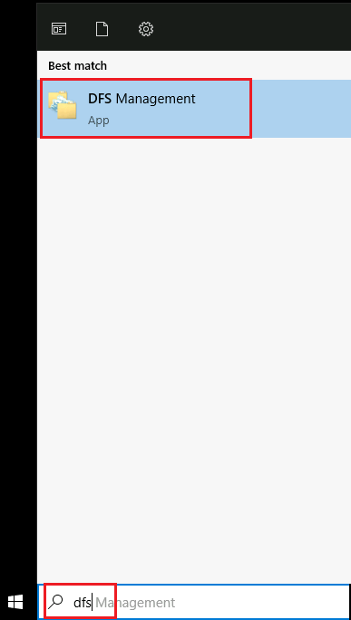


2.  **[DFS Management (管理)]** のナビゲーション ウィンドウで、 **[Namespaces (名前空間)]** を右クリックし、 **[Add Namespaces to Display (表示する名前空間を追加)]** をクリックします。

   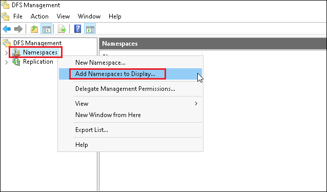


3.  **[Add Namespaces to Display (表示する名前空間の追加)]** ダイアログ ボックスの名前空間の一覧で、**\\Contoso.com\Root** を選択し、 **[OK]** をクリックします。

   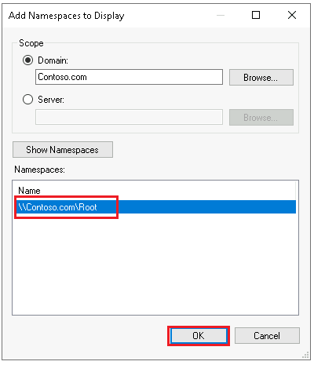


4.  **[DFS Management (管理)]** のナビゲーション ウィンドウで、 **[Replication (レプリケーション)]** を右クリックし、 **[Add Replication Groups to Display (レプリケーション グループを表示に追加)]** をクリックします。

   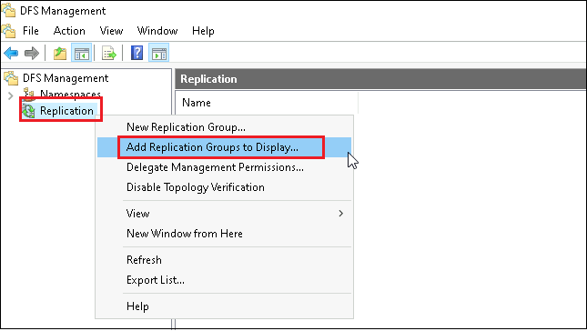


5.  **[Add Replication Groups to Display (表示するレプリケーション グループの追加)]** ダイアログ ボックスの  **[Replication groups (レプリケーショングループ)]** セクションで、 **[Branch1]** を選択し、 **[OK]** をクリックします。

   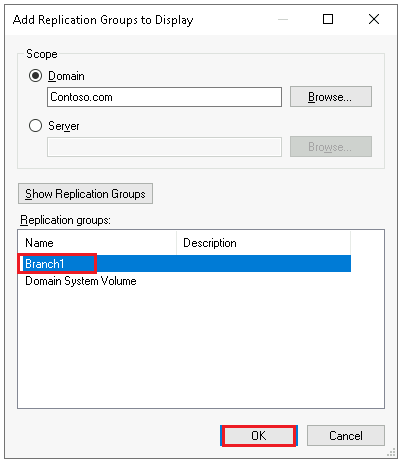


6.  **[DFS Management (管理)]** のナビゲーション ウィンドウで、 **[Namespaces (名前空間)]  - [\\contoso.com\Root]** の順に展開し、 **[Data]** フォルダーを表示します。

7.  詳細ペインで、Dataフォルダーに SEA-SVR1 および SEA-SVR2 のDataフォルダーへの 2 つのリンクが表示されていることを確認します。

   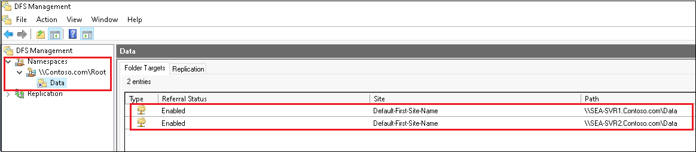


8.  **[DFS Management (管理)]** のナビゲーション ウィンドウで、 **[Replication (レプリケーション)]  - [Branch 1]** の順に展開します。

9.  詳細ウィンドウで、 **SEA-SVR1** と **SEA -SVR2** の `S:\Data ` フォルダー が Branch1レプリケーション グループのメンバーであることを確認します。

   > **注: DFS レプリケーションは、SEA-SVR1とSEA-SVR2の**S:\Data**フォルダーの間でコンテンツをレプリケートします。**

   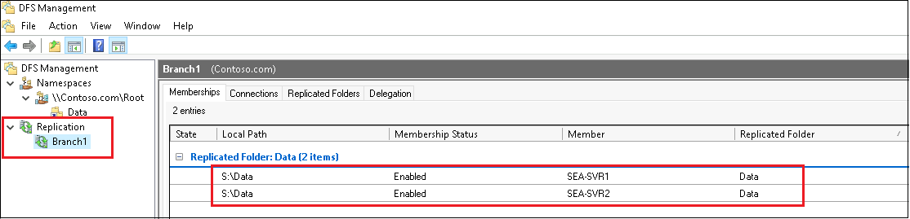

   

10.  **SEA-ADM1** で2つのファイルエクスプローラーを起動させます。1つ目のファイル エクスプローラー で、 `\\SEA-SVR1\Data` 、2つめのファイル エクスプローラーで `\\SEA-SVR2\Data` に接続します。

11. `\\SEA-SVR1\Data` に新しいファイルを作成します。(ファイル名は任意で構いません。)

12.  新規作成したファイルが、数秒後に `\\SEA-SVR2\Data` に複製されることを確認します。

    > **注 : SEA-SVR2に複製されるまでに、数十秒～数分かかる場合があります。**
    >
    > **注 : この結果から、DFS レプリケーションが機能していることを確認できます。**

### <a name="results"></a>結果

この演習を完了すると、機能する DFS インフラストラクチャが作成されます。 これには、**SEA-SVR1** と **SEA-SVR2** の間で内容をレプリケートする DFS レプリケーションが含まれます。


## <a name="exercise-2-creating-and-configuring-a-sync-group"></a>演習 2: 同期グループの作成と構成

### <a name="scenario"></a>シナリオ

DFS レプリケーション環境を File Sync に移行するための準備として、最初に File Sync グループを作成して構成する必要があります。

この演習の主なタスクは次のとおりです。

1. Azure ファイル共有を作成する。
1. Azure ファイル共有を使用する。
1. ストレージ同期サービスと File Sync グループをデプロイする。

### <a name="task-1-create-an-azure-file-share"></a>タスク 1: Azure ファイル共有を作成する

1. **SEA-ADM1** で Microsoft Edge を起動し、Azure portal `https;//portal.azure.com`にアクセスして、このラボで使用するサブスクリプションの所有者ロールを持つユーザー アカウントの資格情報を使用してサインインします。(資格情報は、ラボの **[Home]** タブ内で提供されているものを使用してください。)

   ※Azure Portal にサインイン後は、必要に応じ、右上の歯車マーク(設定)画面から、言語設定を日本語に変更できます。

1.  Azure portal で、ツール バーの **[リソース、サービス、およびドキュメントの検索]** テキスト ボックスで、 **[ストレージ アカウント]** を検索して選択します。

1.  **[ストレージ アカウント]** ページで、 **[ + 作成]** をクリックします。

1.  **[ストレージ アカウントの作成]** ページの **[基本]** タブで、次の設定を指定します。指示がないものは規定値のままで構いません。設定をしたら **[確認]** をクリックし、 **[作成]** を選択します。

   | 設定                   | 値                                                           |
   | ---------------------- | ------------------------------------------------------------ |
   | リソースグループ       | **予め指定されたものを使用してください**                     |
   | ストレージアカウント名 | **グローバルに一意の名前を入力してください (先頭は小文字で、 3 ～ 24 文字の名前にしてください。)** |
   | 地域 (リージョン)      | **East US (米国東部)**                                       |
   | 冗長性                 | **ローカル冗長ストレージ (LRS)**                             |

1. ストレージ アカウントが作成されたら、 **[デプロイ]** ページで **[リソースに移動]** をクリックします。

1. ストレージ アカウントページで、左のナビゲーションペインを下にスクロールし、 **[ファイル共有]** を選択し、更に **[ + ファイル共有]** をクリックします。

   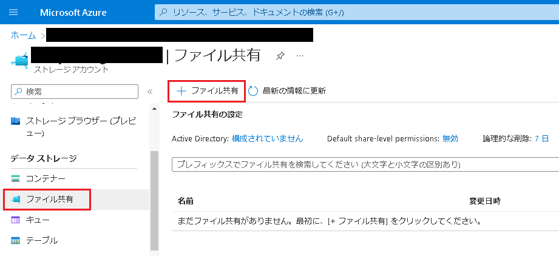

1.  [**新しいファイル共有**] タブで、 **[名前]** テキスト ボックスに **「share1」**と入力し、 **[作成]** をクリックします。

1. ストレージ アカウントで、**share1** という名前のファイル共有が作成できたことを確認したら、タスク2に進んでください。

   

### <a name="task-2-use-an-azure-file-share"></a>タスク 2: Azure ファイル共有を使用する

1.  **SEA-ADM1** の **Azure portal** の詳細ペインで、前のタスクで作成した **share1** を選択します。

   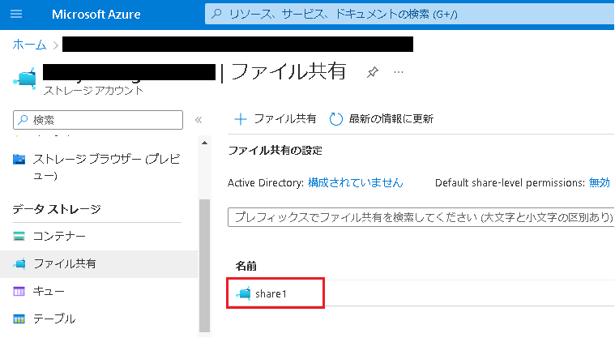


2.  詳細ペインで、 **[アップロード]** をクリックします。

3.  **[ファイルのアップロード]** タブで、`C:\Labfiles\Lab10\File1.txt` を参照し、 **[アップロード]** をクリックします。アップロードが完了したら、 **[ファイルのアップロード]** タブを閉じます。

4.  **share1** ページで、 **[スナップショット] 、 [スナップショットの追加] 、 [ OK ]** の順にクリックします。 **※コメントは省略して構いません。**

5.  **share1** ページで、 **[概要] 、 [接続]** の順に選択します。 **[スクリプトを表示 (Show Script)]** を選択し、スクリプトが表示されているボックスの右下にあるドキュメントマーク、 **[クリップボードにコピー]** ボタンをクリックしてスクリプトをコピーし、 **[接続]** タブを閉じます。

   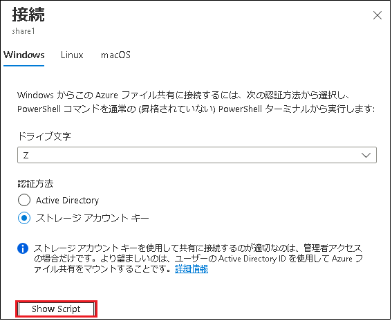


6.  **SEA-ADM1** で、 **Windows PowerShell ISE** ウィンドウに切り替え、スクリプト ペインで新しいタブを開きます。新規に開いたタブ内で、前の手順でコピーしたスクリプトを貼り付けます。

7.  スクリプトの内容を確認したら、 **F5 キー**  を押してスクリプトを実行します。

   > **注:スクリプトを実行すると、Azure ファイル共有を Z ドライブにマウントします。**

8.   **SEA-ADM1** で新しくファイル エクスプローラーを起動し、 **Z ドライブ** にアクセスします。

9.  **File1.txt** が詳細ペインに表示されることを確認します。

   > **注 : File1.txt は、Azure ファイル共有にアップロードしたファイルであることに注目してください。**

10.  **File1.txt** をメモ帳で開きます。

11.  最後の行に自分の名前を追加して変更を保存し、メモ帳を閉じます。

12.  File1.txt を右クリックして から **[Properties (プロパティ)]** をクリックし、 **[ File1.txt  Properties]** ウィンドウで **[Previous Versions (以前のバージョン)]** タブに切り替えます。

    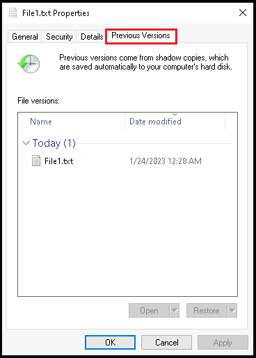


13.  以前のファイル バージョンが 1 つ利用可能であることを確認します。利用可能なバージョン **( File1.txt )** を選択し、 **[Restore (復元)]** を 2 回クリックしてから、 **[OK]** を選択します。

14.  File1.txt を開き、自分の名前が含まれていないことを確認します。

    > **注 : これは、ファイルを変更する前に作成されたスナップショットを復元したためです。**

15. メモ帳を閉じ、タスク3に進んでください。


### <a name="task-3-deploy-storage-sync-service-and-a-file-sync-group"></a>タスク 3: ストレージ同期サービスと File Sync グループをデプロイする

1.  **SEA-ADM1** のAzure portal で、ツールバーの **[リソース、サービス、およびドキュメントを検索]** テキスト ボックスで、 **[ストレージ同期サービス]** を検索します。サービス一覧から、 **[ストレージ同期サービス]** を選択します。

1.  **[ストレージ同期サービス]** ページで、 **[ + 作成]** をクリックします。

1.   **[基本]** タブで以下の値を設定し、 **[確認と作成]** **- [作成]** の順にクリックしてください。

   | 設定                     | 値                                               |
   | ------------------------ | ------------------------------------------------ |
   | リソースグループ         | **プルダウンの一覧にあるものを選択してください** |
   | ストレージ同期サービス名 | **FileSync1**                                    |
   | リージョン               | **East US (米国東部)**                           |

1.  File Sync がプロビジョニングされたら、 **[リソースに移動]** をクリックします。

1.  **[FileSync1 ストレージ同期サービス]** ページで、 **[ + 同期グループ]** を選択して、新しいファイル同期グループを作成します。

1.   **[同期グループ]** ページで、以下の値を設定し、 **[作成]** をクリックします。

   | 設定                       | 値                                                           |
   | -------------------------- | ------------------------------------------------------------ |
   | 同期グループ名             | **Sync1**                                                    |
   | サブスクリプション         | **予め指定されたものを使用してください**                     |
   | ストレージアカウントの選択 | **プルダウンから自分で作成したストレージアカウントを選択してください** |
   | Azure ファイル共有         | **Share 1**                                                  |

   >**注: File Sync をデプロイすると、ストレージ同期サービス リソースが作成されます。**

1.  **[ストレージ同期サービス]** ページで **[登録済みサーバー]** を選択し、現在登録済みのサーバーがないことを確認します。

   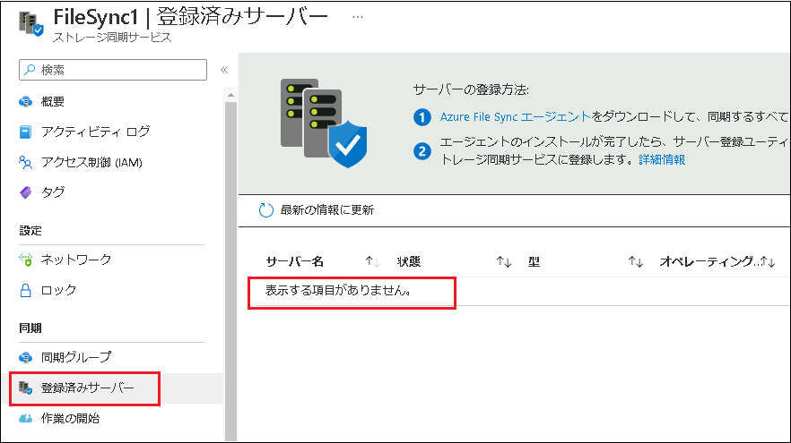

   登録済みサーバーがないことを確認したら、演習3に進んでください。

### <a name="results"></a>結果

この演習を完了すると、File Sync グループが作成されます。 また、**SEA-ADM1** にマップされたクラウド エンドポイントも作成され、Azure ファイル共有の内容を調べることができます。

## <a name="exercise-3-replacing-dfs-replication-with-file-sync-based-replication"></a>演習 3: DFS レプリケーションを File Sync ベースのレプリケーションに置き換える

### <a name="scenario"></a>シナリオ

必要なコンポーネントがすべて準備できたので、DFS レプリケーションを File Sync ベースのレプリケーションに置き換えます。

この演習の主なタスクは次のとおりです。

1. **SEA-SVR1** をサーバー エンドポイントとして追加する。
1. **SEA-SVR2** を File Sync に登録する。
1. DFS レプリケーションを削除し、**SEA-SVR2** をサーバー エンドポイントとして追加する。

### <a name="task-1-add-sea-svr1-as-a-server-endpoint"></a>タスク 1: SEA-SVR1 をサーバー エンドポイントとして追加する

1.  **SEA-ADM1** の Azure portal に表示されている、**「FileSync1  | [登録済みサーバー]」** ページで、 **Azure File Sync エージェントのリンク** を選択して、Azure File Sync エージェントのMicrosoft ダウンロード ページに移動します。

   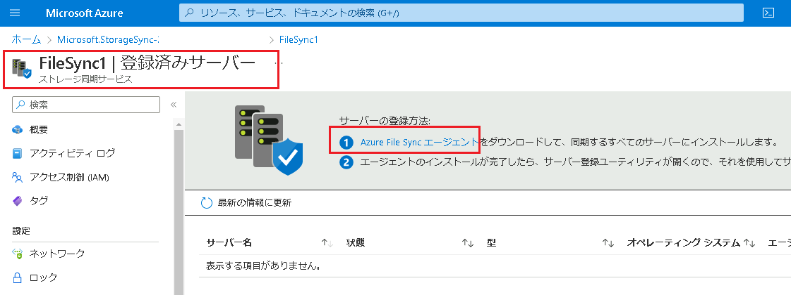

   

1.  Microsoft ダウンロード ページに移動したら、 **[Download]** をクリックします。

   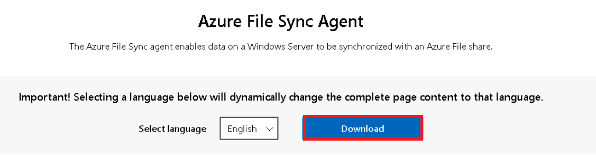

   

1. Windows Server 2022 用の File Sync エージェント  **(StorageSyncAgent_WS2022.msi )** のエントリの横にあるチェックボックスを選択し、 **[Next (次へ)]** をクリックしてダウンロードを開始します。ダウンロードが完了したら、ダウンロード用に開いた Microsoft Edge タブを閉じます。

   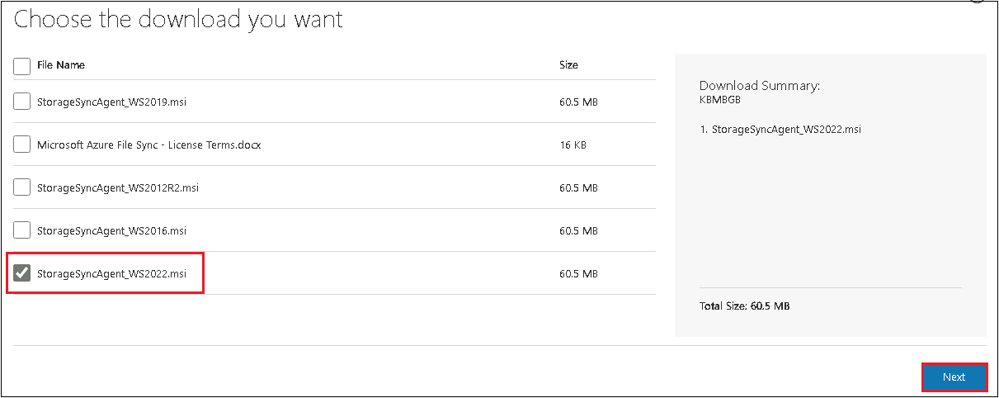

   

1.  3 の手順でダウンロードしたファイルを `C:\Labfiles\Lab10` フォルダーにコピーします。

1.  `C:\Labfiles\Lab10` に格納されている、 **Install-FileSyncServerCore.ps1** を右クリックし、 **[Edit (編集)]** を選択します。

1. スクリプトの 2行目 の変数 $rgName の値をAzureportalで既に使用しているリソースグループ名に変更してから、スクリプトを F5 キーで実行します。

   > **注 : リソースグループ名は、Azure Poral のリソースグループで確認します。** 
   >
   > **注 : スクリプトの実行が終了してから次の作業に進んでください。実行が完了するまでに3分程度かかります。**
   >
   > **注 : スクリプトを実行することにより、SEA-SVR1に File Sync エージェントをインストールします。**

1.  PowerShell コンソールにサインインを求める警告メッセージが表示されたら、警告メッセージ内の 9 文字のコードをコピーします。

1. Microsoft Edge ウィンドウに切り替え、新しいタブを開き、 `https://microsoft.com/devicelogin` にアクセスします。

1.  **[コードの入力]** ダイアログ ボックスで、コピーしたコードを貼り付けます。Azure の 資格情報を使用してサインインします。認証に成功したことを確認してから、次の作業に進んでください。

1.  **Windows PowerShell ISE**  に切り替えて、スクリプトが正常に完了したことを確認します。

   > **注 : 「Script finished」 と表示されていれば、正常に完了しています。**

1. Azure portal に戻り、 **「FileSync1 | [登録済みサーバー]」** ページで、 **[最新の情報に更新]** をクリックして、登録済みサーバーの現在のリストを表示します。

1. 登録済みサーバーのリストに **SEA-SVR1.Contoso.com** サーバーが表示されていることを確認します。

1. ファイル エクスプローラー に切り替え、`\\SEA-SVR1\Data` を参照して、フォルダーに現在 **File1.txt** が含まれていないことを確認します。

1.  Azure portal に切り替え、 **[FileSync1 | 登録済みサーバー]** ページで、 [同期グループ] を選択し、 **[ Sync1]** をクリックします。

    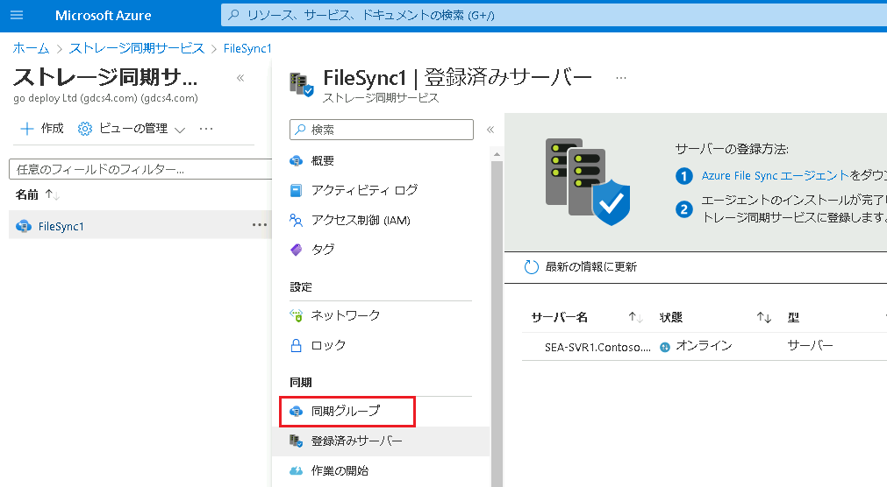

    

1.  **[Sync1]** ページで **[サーバー エンドポイントの追加]** をクリックします。

    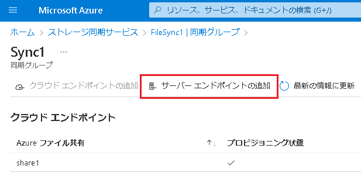


16.  **[サーバー エンドポイントの追加**] タブで、 **[登録済みサーバー]**  リストから **SEA-SVR1.Contoso.com** を選択します。

17.  **[パス]** テキスト ボックスに **「S:\Data 」** と入力し、 **[作成]** をクリックします。

18. サーバーエンドポイントが作成されたことを確認したら、ファイル エクスプローラーに切り替えて、 `\\SEA-SVR1\Data` に  **File1.txt**  が含まれていることを確認します。

    > **注 :  Azure ファイル共有にアップロードしているため、File Sync によってSEA-SVR1に同期されたことが確認できます。**

### <a name="task-2-register-sea-svr2-with-file-sync"></a>タスク 2: SEA-SVR2 を File Sync に登録する

1.  **SEA-ADM1** の  **Windows PowerShell ISE** に切り替え、更に、 **Install-FileSyncServerCore.ps1** の内容を表示するスクリプト ペインのタブに切り替えます。

1. スクリプト 1行目の `SEA-SVR1` を `SEA-SVR2` に置き換え、スクリプトを F5 キーで実行します。

1. PowerShell コンソールにサインインを求める警告メッセージが表示されたら、警告メッセージ内の 9 文字のコードをコピーします。

1. Microsoft Edge ウィンドウに切り替え、新しいタブを開き、 `https://microsoft.com/devicelogin` にアクセスします。

1.  **[コードの入力]** ダイアログ ボックスで、コピーしたコードを貼り付けます。Azure の 資格情報を使用してサインインします。認証に成功したことを確認してから、次の作業に進んでください。

1.  **Windows PowerShell ISE**  に切り替えて、スクリプトが正常に完了したことを確認します。

   > **注 : 「Script finished」 と表示されていれば、正常に完了しています。**

1.  Azure Portal に切り替え、 **「FileSync1 | 同期グループ」** ページに戻ります。

1.  **[登録済みサーバー]** を選択すると、一覧に **SEA-SVR2.Contoso.com** が登録されたことが確認できます。

   

### <a name="task-3-remove-dfs-replication-and-add-sea-svr2-as-a-server-endpoint"></a>タスク 3: DFS レプリケーションを削除し、SEA-SVR2 をサーバー エンドポイントとして追加する

1.  **SEA-ADM1 で、 [DFS Management (管理)]** に切り替えます。

1.  左ナビゲーションペインから、 **Branch1** を右クリックし、 **[Delete (削除)]** をクリックします。

1. 警告メッセージが表示されたら、 **[Yes]**  オプションを選択して、 **[OK]** をクリックします。

1.  Azure portal に切り替え、 **「FileSync1 | 同期グループ」** ページに戻ります。同期グループの一覧から  **[Sync1]** を選択し、 **[サーバー エンドポイントの追加]** をクリックします。

1.  **[サーバー エンドポイントの追加**] タブで、 **[登録済みサーバー]**  リストから **SEA-SVR2.Contoso.com** を選択します。

1.  **[パス]** テキスト ボックスに **「S:\Data 」** と入力し、 **[作成]** をクリックします。

   > **注 : このタスクを完了すると、SEA-SVR2をFile Sync1 同期グループに追加できます。**

### <a name="results"></a>結果

この演習を完了すると、DFS レプリケーションが File Sync に置き換えられます。

## <a name="exercise-4-verifying-replication-and-enabling-cloud-tiering"></a>演習 4: レプリケーションの検証と、クラウドを使った階層化の有効化

### <a name="scenario"></a>シナリオ

演習シナリオ: DFS レプリケーションが File Sync に正常に置き換えられたことを確認した後、クラウドを使った階層化を有効にします。

この演習の主なタスクは次のとおりです。

1. File Sync を検証する。
1. クラウドを使った階層化を有効にする。

### <a name="task-1-verify-file-sync"></a>タスク 1: File Sync を検証する

1. **SEA-ADM1** で、ファイルエクスプローラーの、 **\\\\SEA-SVR1\\Data** と **\\\\SEA-SVR2\\Data** の内容を表示します。
1. **\\\\SEA-SVR1\\Data** に、任意の名前のファイルを作成します。
1.   **\\\\SEA-SVR2\\Data** にアクセスしているファイルエクスプローラーに切り替え、 前の手順で作成したファイルが表示されることを確認します。

   >**注  : 前の演習で DFS レプリケーションを削除しているため、この結果はFile Sync によって、レプリケートされています。**

### <a name="task-2-enable-cloud-tiering"></a>タスク 2: クラウドを使った階層化を有効にする

1.  SEA-ADM1 のAzure portal に切り替え、 **[Sync1同期グループ]** ページで、サーバーエンドポイントの **SEA-SVR2.Contoso.com** を選択します。

1.  **[サーバー エンドポイントのプロパティ]** ウィンドウで、 **[クラウド階層化]** セクションを展開し、 **[クラウド階層化を有効にする]** を選択し、以下の値を設定してから **[保存]** をクリックします。指示がないものは規定値のままで構いません。

   | 設定                                                         | 値   |
   | ------------------------------------------------------------ | ---- |
   | ボリュームの空き領域ポリシー                                 | 90   |
   | 日付ポリシー                                                 | 有効 |
   | 指定した日数内にアクセスまたは変更されたファイルのみをキャッシュする | 14   |

   > 注 : **SEA-SVR2上のファイルは自動的に階層化されます。PowerShell を使用して、このプロセスをトリガーします。**

1.   **SEA-ADM1** で、 [スタート] メニューから Windows PowerShell を起動し、以下のコマンドレットを順番に実行します。

   ```powershell
   Enter-PSSession -computername SEA-SVR2
   ```

   ```powershell
   fsutil file createnew S:\Data\report1.docx 254321098
   fsutil file createnew S:\Data\report2.docx 254321098
   fsutil file createnew S:\Data\report3.docx 254321098
   fsutil file createnew S:\Data\report4.docx 254321098
   ```

   ```powershell
   Import-Module "C:\Program Files\Azure\StorageSyncAgent\StorageSync.Management.ServerCmdlets.dll"
   ```

   ```powershell
   Invoke-StorageSyncCloudTiering -Path S:\Data 
   ```

   

1.   **SEA-ADM1** で、` \\SEA-SVR2\Data`を表示するファイル エクスプローラーに切り替えます。

1. ファイル エクスプローラー ウィンドウで、 **[タイトル] 列** を右クリックして、 **[More...]** を選択した後、 **[Attributes (属性)]** チェックボックスをオンにします。

1.  **[Attributes (属性)] 列** を **[Name (名前)]** 列 の横にドラッグし、ファイルの日付と属性を確認します。

   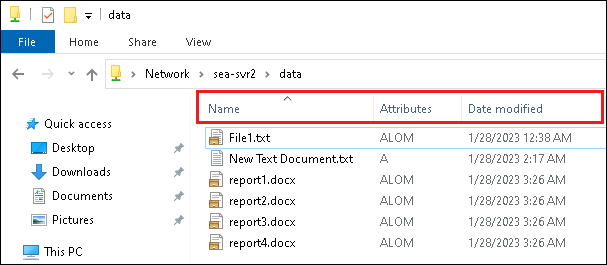

   > **注 : [Attributes (属性)] 列 が [L] 、 [M] 、 [O] であるファイルは 、クラウドを使用した階層化が行われたことを表します。**

### <a name="results"></a>結果

この演習を完了すると、機能する File Sync レプリケーションが作成され、クラウドを使った階層化が構成されます。

## <a name="exercise-5-troubleshooting-replication-issues"></a>演習 5: レプリケーションのトラブルシューティング

### <a name="scenario"></a>シナリオ

Contoso では、レプリケーションの競合など、レプリケーションの問題を迅速に特定して解決する必要があります。 そのため、発生する可能性があるレプリケーションの問題をシミュレートし、検証することにになりました。

この演習の主なタスクは次のとおりです。

1. File Sync レプリケーションを監視する。
1. レプリケーションの競合の解決をテストする。

### <a name="task-1-monitor-file-sync-replication"></a>タスク 1: File Sync レプリケーションを監視する

1.  **SEA-ADM1** で、ファイルエクスプローラーを使用し、 `C:\Windows\INF` フォルダーを `\\SEA-SVR2\Data\` にコピーします。

   > **注 : この結果、フォルダーはクラウド エンドポイントに同期され、同期トラフィックが発生します。**

1.  Azure Portal に切り替え、 **FileSync1** ストレージ同期サービスの **Sync1 同期グループ** ページを確認します。

1.  **[サーバー エンドポイント]** セクションで、両方のエンドポイントの正常性に緑色のチェック マークが付いていることを確認します。

   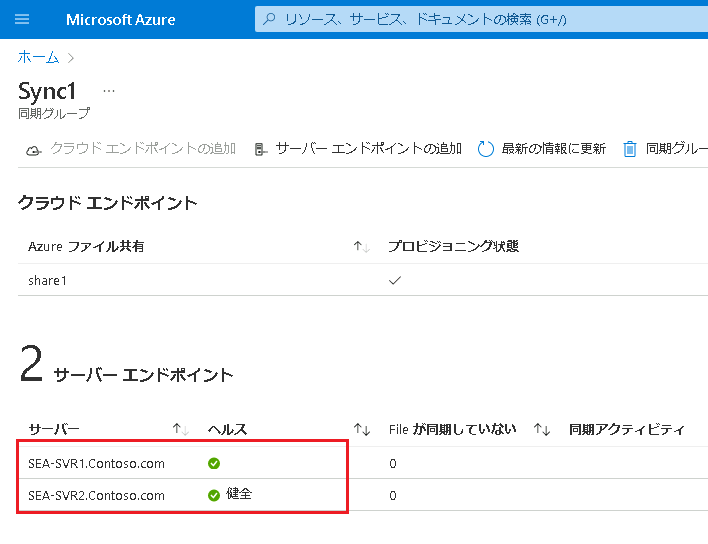

1. SEA-ADM1 のファイルエクスプローラーで、Azure File 共有がマップされたZドライブを表示し、 `\\SEA-SVR2\Data` から同期された INF フォルダーが含まれていることを確認します。

1. **INF** フォルダーがドライブ **Z**に同期中であることを確認します。

1. Azure portal で、同期トラフィックが、 **[同期されたファイル数]** および **[同期されたバイト数]** のグラフに反映されていることを確認します。 **INF** フォルダーには 800 個以上のファイルが含まれており、そのサイズは 40 MB を超えていることが確認できます。

   >**注: 同期トラフィックがAzure portal に反映されるまでに、5分以上かかる場合があります。ブラウザ更新をして確認してください。**

### <a name="task-2-test-replication-conflict-resolution"></a>タスク 2: レプリケーションの競合の解決をテストする

1. **SEA-ADM1** で、`\\SEA-SVR1\Data\`と `\\SEA-SVR2\Data\` のファイルエクスプローラー を表示します。

1. `\\SEA-SVR1\Data\`の内容が表示されているファイルエクスプローラーで、**Demo.txt** という名前のファイルを作成します。 

1.  `\\SEA-SVR2\Data\` の内容が表示されているエクスプローラー ウィンドウで、**Demo.txt** という名前のファイルを作成します。 

1. 最初に作成した **Demo.txt** ファイルに任意のテキストを追加し、変更を保存します。

1. その後すぐに、2 番目に作成した **Demo.txt** ファイルに任意のテキスト (前の手順で使用したものとは異なるテキスト) を追加し、変更を保存します。

   >**注: 2 番目のファイルに対する変更をできる限り早く保存してください。 同期の競合を意図的にトリガーするために、名前は同一で、内容が異なるファイルを作成しています。**

1. 各エクスプローラー ウィンドウで、内容を確認し、**Demo.txt** ファイルだけでなく、**Demo-SEA-SVR2.txt** ファイル (および場合によっては **Demo-SEA-SVR1.txt**) が含まれていることを確認します。 

   >**注: File Sync によって同期の競合が検出されたため、エンドポイント名を表すサフィックス (SEA-SVR2など) が、競合が発生したファイルに追加されます。**

### <a name="results"></a>結果

この演習を完了すると、File Sync レプリケーションを監視し、レプリケーションの問題が解決されます。


以上で演習は終了です。お疲れさまでした。
