---
lab:
  title: 'ラボ: AD DS と Azure AD の統合の実装'
  module: 'Module 2: Implementing Identity in Hybrid Scenarios'
---

# <a name="lab-implementing-integration-between-ad-ds-and-azure-ad"></a>ラボ: AD DS と Azure AD の統合の実装

## <a name="scenario"></a>シナリオ

Microsoft Azure Active Directory (Azure AD) を使用して Azure リソースへのアクセスを認証および承認したことで生じる管理と監視のオーバーヘッドについての懸念に対応するために、あなたは、オンプレミスの Active Directory Domain Services (AD DS) と Azure AD の間の統合をテストし、複数のユーザー アカウントの管理に、オンプレミスとクラウド リソースを組み合わせて使用することに関するビジネス上の懸念に対処できることを検証することにしました。

さらに、情報セキュリティ チームの懸念事項に対応し、サインイン時間やパスワード ポリシーなどの、Active Directory ユーザーに適用される既存のルールを保持することを確認する必要がります。 そこで、オンプレミスの Active Directory のセキュリティを一層強化し、管理オーバーヘッドを最小限に抑える Azure AD 統合機能を検証することとなります。検証には、Windows Server Active Directory 用の Azure AD パスワード保護や、パスワード ライトバックを使用したセルフサービス パスワード リセット (SSPR) が含まれます。

このラボの目標は、オンプレミスの AD DS と Azure AD の間でパススルー認証を実装することです。

## <a name="objectives"></a>目標

このラボを完了すると、次のことができるようになります。

- カスタム ドメインの追加や検証を含め、Azure AD とオンプレミス AD DS との統合の準備を行う。
- IdFix DirSync エラー修復ツールの実行を含め、オンプレミス AD DS と Azure AD の統合の準備を行う。
- Azure AD Connect をインストールし、構成する。
- 同期プロセスをテストして、AD DS とAzure AD の統合を検証する。
- Active Directory に Azure AD 統合機能を実装する。これには Windows Server Active Directory 用の Azure AD パスワード保護や、パスワード ライトバックを使用した SSPR が含まれます。

## <a name="estimated-time-60-minutes"></a>予想所要時間: 60 分

## <a name="lab-setup"></a>ラボのセットアップ

使用する仮想マシン: **AZ-800T00A-SEA-DC1**、**AZ-800T00A-SEA-SVR1**、**AZ-800T00A-ADM1**  

> **注**: **AZ-800T00A-SEA-DC1**、**AZ-800T00A-SEA-SVR1**、**AZ-800T00A-SEA-ADM1** 仮想マシンによって、**SEA-DC1**、**SEA-SVR1**、**SEA-ADM1** のインストールがホストされます。

1. **SEA-ADM1** を選択します。
1. **SEA-ADM1** に次の資格情報を使用してサインインします。
   - ユーザー名: **Administrator**
   - パスワード: **Pa55w.rd**
   - ドメイン: **CONTOSO**

このラボでは、使用可能な VM 環境と Azure AD テナントを使用します。 ラボを開始する前に、Azure AD テナントと、そのテナントのグローバル管理者ロールがあるユーザー アカウントを持っていることを確認します。

## <a name="exercise-1-preparing-azure-ad-for-ad-ds-integration"></a>演習 1: AD DS 統合のための Azure AD の準備

### <a name="scenario"></a>シナリオ

ラボ内のAzure AD 環境で、オンプレミスの AD DS と統合する準備ができている必要があります。 カスタムAzure AD ドメイン名とグローバル管理者ロールのあるアカウントを作成して検証します。

この演習の主なタスクは次のとおりです。

1. Azure でカスタム ドメイン名を作成する。
1. グローバル管理者ロールを持つユーザーを作成する。
1. グローバル管理者ロールを持つユーザーのパスワードを変更する。

### <a name="task-1-create-a-custom-domain-name-in-azure"></a>タスク 1: Azure でカスタム ドメイン名を作成する。

1. **SEA-ADM1** で Microsoft Edge を起動してから、Azure Portal ( https://portal.azure.com )に移動します。

1. ラボで提供されている資格情報を使用して、Azure portal にサインインします。

   

   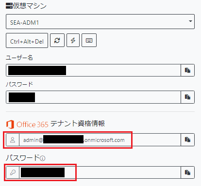

   **※ログイン時に 「Do this to reduce the number of times you are asked to sign in. (サインインの状態を維持すると、次回もう一度サインインする必要がなくなります。)」というメッセージが表示されますが、[Yes]、[NO]のどちらでも構いません。[NO]を選択すると、毎回認証が求められます。**

   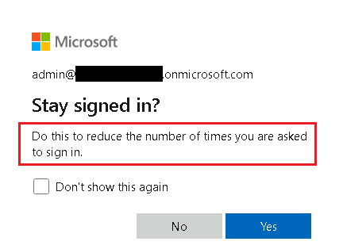

1. Azure Portalにログインが成功すると、「Welcome to Microsoft Azure」のメッセージが表示されます。「Maybe later」をクリックしツアーを終了させます。

   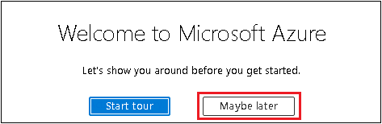

   

   **※以下の手順でAzure Portal の言語設定を日本語に変更することができます。**

   1. Azure Portal にログイン後、画面右上の歯車マークをクリックします。

   

   2. **[Portal settings | Directories + subscriptions]** 画面の左ナビゲーションペインから **[Language + region]** を選択します。

   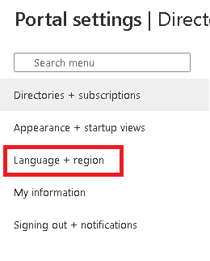

   3. **[Language]** のプルダウンから **[日本語]** を選択し、 **[Apply]** をクリックします。( **「Change language」** の確認メッセージが表示されたら **[OK]** を選択してください。)

      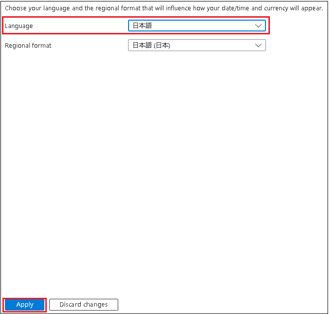

   4. Azure Portal のメニューが日本語表記に変更されます。

      **注: Azure Portal内のすべてのメニューに日本語が適用されるまで、数時間要する場合があります。**

      

1. Azure portal の検索ボックス内に、**[Azure Active Directory]** と入力します。

1. 検索結果の [サービス] から **[Azure Active Directory]** を選択します。

   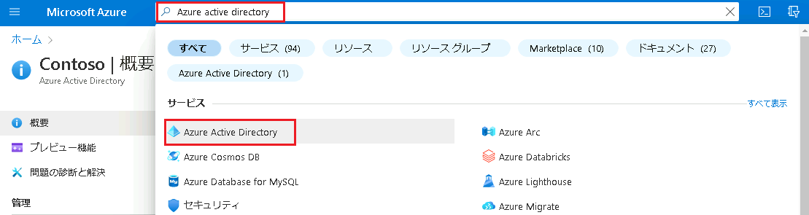

1.  [Azure Active Directory] の左ナビゲーションペインの一覧から**[カスタム ドメイン名]** を選択します。

   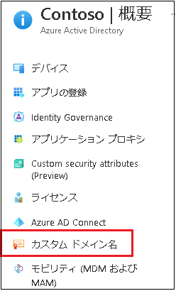

1.  **[+ カスタムドメインの追加]** をクリックし、以下のカスタムドメイン名を入力します。

   | カスタムドメイン名 | contoso.com |
   | ------------------ | ----------- |

   カスタムドメイン名を入力したら、 **[ドメインの追加]** をクリックします。

1. ドメインの検証に使用する DNS レコードの種類を確認したら、**[確認] はクリックせず**にそのままウィンドウを閉じます。

   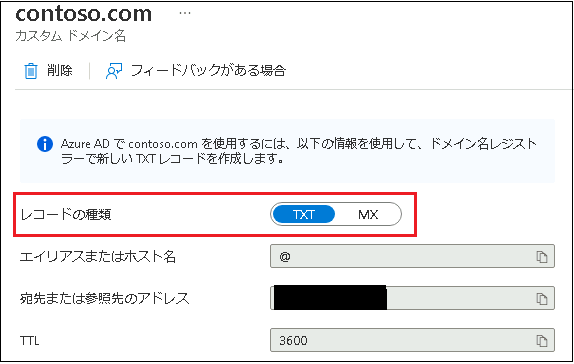

   > **注**: 一般には、DNS レコードを使用してドメインを確認しますが、このラボでは検証済みドメインを使用しません。


## <a name="exercise-2-preparing-on-premises-ad-ds-for-azure-ad-integration"></a>演習 2: Azure AD 統合のためのオンプレミス AD DS の準備

### <a name="scenario"></a>シナリオ

あなたは、既存の Active Directory 環境で Azure AD との統合の準備ができていることを確認する必要があります。 そのため、IdFix ツールを実行し、Active Directory ユーザーの UPN が Azure AD テナントのカスタム ドメイン名と一致することを確保します。

この演習の主なタスクは次のとおりです。

1. IdFix をインストールする。
1. IdFix を実行する。


### **事前準備 : ContosoAdminの [Display Name 属性] を確認する。**

1.  **SEA-ADM1** にCONTOSO\Administrator でサインインしている状態で、 **[Server Manager]** を起動し、 **[Tools (ツール)] - [Active Directory Users and Computers (Active Directory ユーザーとコンピューター)]** を選択します。

2.   **[Contoso.com] - [Users]** の順に展開し、「 **ContosoAdmin** 」をダブルクリックしてプロパティを確認します。

   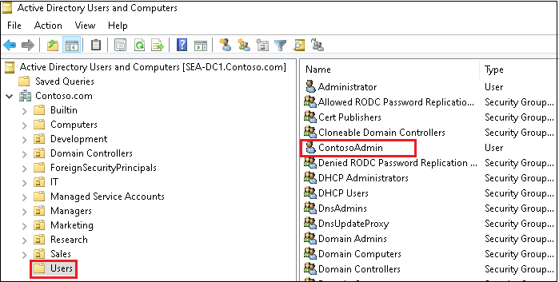

3.  **[General(全般)]** タブの **[Display Name (表示名)]** の属性が空欄になっていることを確認したら、 [OK] をクリックしてプロパティを閉じます。

   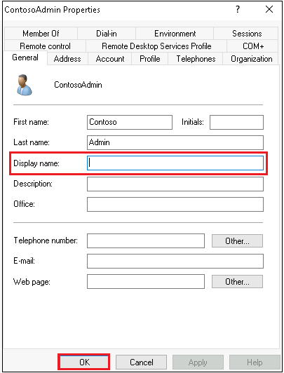

### <a name="task-1-install-idfix"></a>タスク 1: IdFix をインストールする

1. **SEA-ADM1** に CONTOSO\Administraor でサインインし Microsoft Edge を起動します。 Microsoft Edge が起動したら、**https://github.com/microsoft/idfix** にアクセスします。

1. **Github** ページを下にスクロールし、 **[ClickOnce Launch]** で、**[launch]** のリンク をクリックします。

   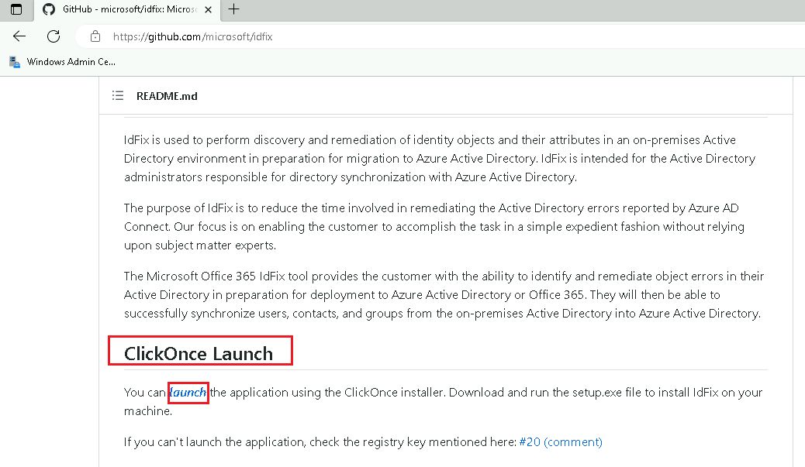

1. Microsoft Edge のステータスバーに表示される **[Open file]** をクリックします。

   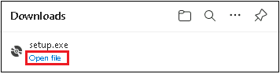

1. [Application Install - Security Warning] ダイアログボックスで [Install] をクリックします。

   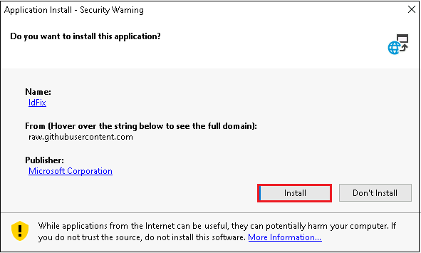

1. **[ IdFix Privacy Statement ]** ダイアログ ボックスで、免責事項を確認し、**[OK]** を選択します。

   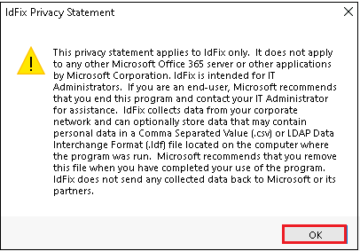

### <a name="task-2-run-idfix"></a>タスク 2: IdFix を実行する

1. **IdFix** が起動したら、ウィンドウから **[Query]** を選択します。

   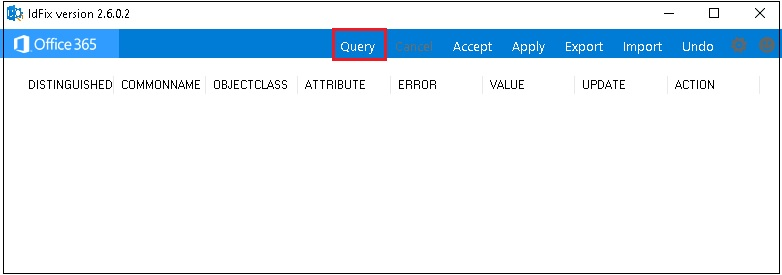

   **※ [Schema Warning] の警告ダイアログボックスが表示された場合は、 [Yes] をクリックして閉じてください。** 

1. オンプレミス Active Directory のオブジェクトの一覧で **[ERROR]** 列 および **[ATTRIBUTE (属性)]** 列を確認します。 

   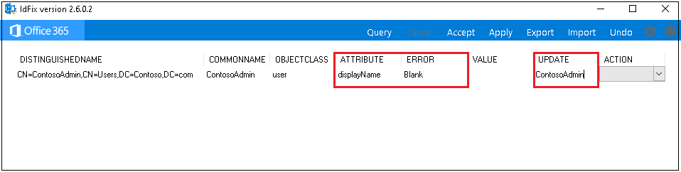

   > **注 :** このシナリオでは、**ContosoAdmin** の **displayName** の値が **空白 (Blank)** となっており、ツールが推奨する値 (ContosoAdmin) が **[UPDATE]** 列に表示されます。
   >
   > **注 : ERROR 列の Blank は、必要な個所(DisplayName) に値が入力されていないことを意味します。** 事前準備で確認した通り、ContosoAdminのDisplayName 属性は未入力の状態のため、入力を促されるエラーが表示されました。

   

1. **IdFix** ウィンドウの、**[ACTION] **ドロップダウン メニューで **[Edit (編集)]** を選択し、**[Apply (適用]** をクリックすると、推奨される値の変更が自動的に実装されます。

   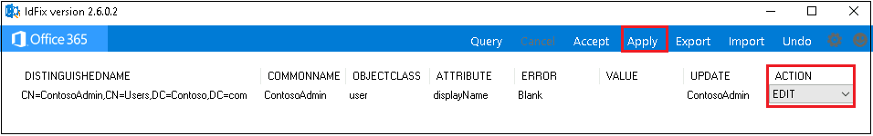

1. **[Apply Pending (保留中の適用)]** ダイアログボックスが表示されたら、 **[Yes]** をクリックします。

   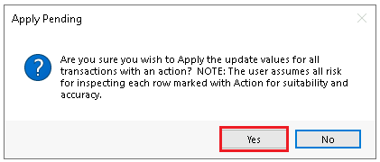

1. **IdFix** ウィンドウの、 **[ACTION]** ドロップダウン メニューが **[COMPLETE]** に変更されたことを確認し、ウィンドウを × で閉じます。

   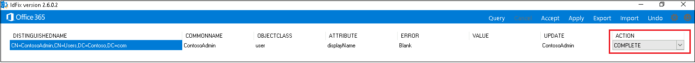

1. **[Active Directory Users and Computers (Active Directory ユーザーとコンピューター)]** に戻り、ContosoAdminのプロパティを再度確認すると、IdFixツールで更新した、**[Display Name (表示名)]** 属性に **「ContosoAdmin」** と入力されていることが確認できます。確認できたら、**[OK]** をクリックしてプロパティと、 **[Active Directory Users and Computers (Active Directory ユーザーとコンピューター)]** を閉じます。

   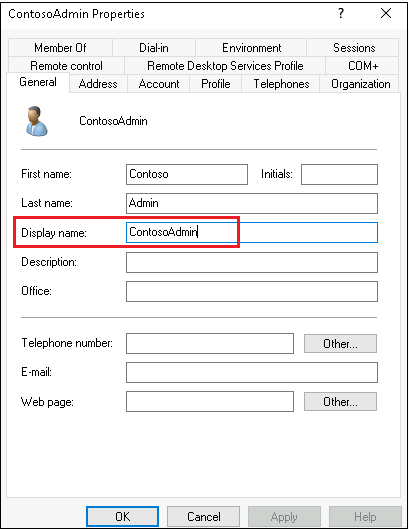

## <a name="exercise-3-downloading-installing-and-configuring-azure-ad-connect"></a>演習 3: Azure AD Connect のダウンロード、インストール、構成

### <a name="scenario"></a>シナリオ

演習のシナリオ: Azure AD Connect をダウンロードし、**SEA-ADM1** にインストールし、設定を構成します。

この演習の主なタスクは次のとおりです。

1. Azure AD Connect をインストールし、構成する。

### <a name="task-1-install-and-configure-azure-ad-connect"></a>タスク 1: Azure AD Connect のインストールと構成

1. **SEA-ADM1** で Microsoft Edge を起動し 、Azure Portal (https://portal.azure.com) にログインします。 Azure Portal の検索ボックスで **[Azure Active Directory]** を検索し、左のナビゲーションペインの一覧から  **[Azure AD Connect]** を参照します。

   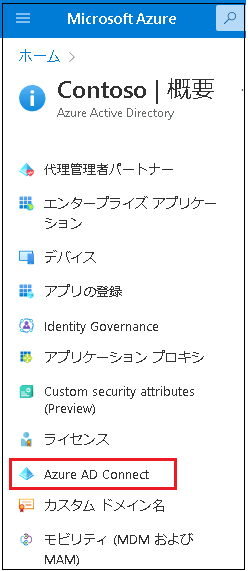

1. **[Azure AD Connect]** ページから、**[Azure AD Connect のダウンロード]** を選択します。

   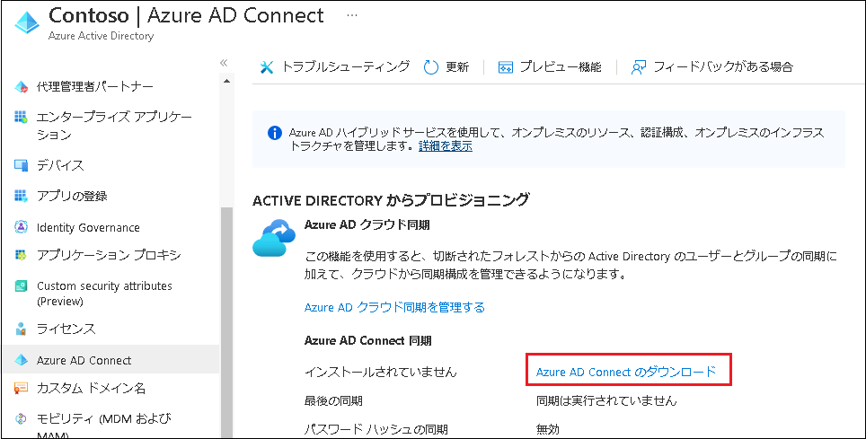

1.  **[Microsoft Azure Active Directory Connect]** ページで、 **[Download]** をクリックします。

   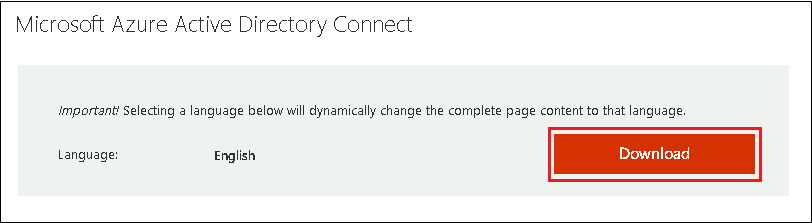

1. ステータス バーで、**[AzureAD Connect.msi]** ファイルの  **[Open file]** を選択します。

   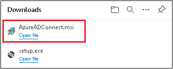

1. Azure AD Connect インストール バイナリーをダウンロードし、インストールを開始します。

1. **[Welcome to Azure AD Connect]** 画面で、**[ I agree to the license terms and privacy notice (ライセンス条項とプライバシーに関する声明に同意します)]** チェックボックスをオンにし、**[Continue (続行)]** を選択します。

   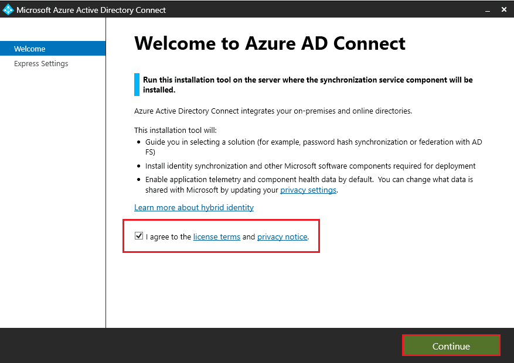

1. **[Express Settings (簡易設定)]** ページで、**[Use express settings (簡易設定を使用する)]** をクリックします。

   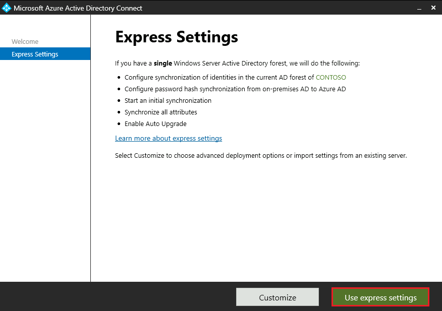

1. **[Connect to Azure AD (Azure AD への接続)]** 画面で、Azure AD のグローバル管理者アカウントの資格情報を入力、 **[Next (次へ)]** をクリックします。(資格情報はラボの [Home] 上で提供されているものを使用してください。)

   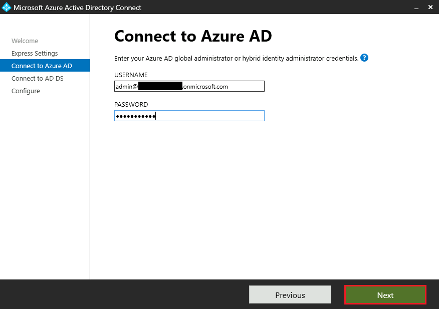

1. **[Connect to AD DS (AD DS への接続)]** ページで、次の資格情報を入力し、 **[Next (次へ)]** をクリックします。

   | USERNAME (ユーザー名)     | CONTOSO\\Administrator |
   | ------------------------- | ---------------------- |
   | **PASSWORD (パスワード)** | **Pa55w.rd**           |

1. **[Azure AD sign-in configuration (Azure AD サインイン構成)]** ページで、追加した新しいドメイン  **(contoso.com)** が Active Directory UPN サフィックスの一覧に含まれていることを確認します。

   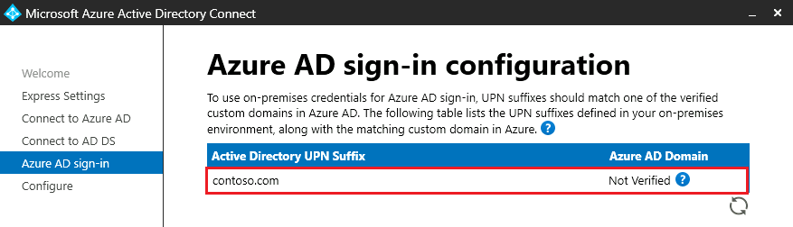

   > **注**:追加したドメインは、 演習1のタスク1で追加したカスタムドメイン名です。状態が [Not Verified (未確認)] と表示されますが、検証済みドメインである必要はありません。 尚、通常は Azure AD Connect をインストールする前にドメインの検証しますが、このラボでは検証手順は不要です。カスタムドメイン名の検証については、ドメインレジストラーへのDNSのレコードの登録等が必要です。詳細は [参考URL](https://learn.microsoft.com/ja-jp/azure/active-directory/fundamentals/add-custom-domain#add-your-dns-information-to-the-domain-registrar) をご参照ください。

1. **[Continue without matching all UPN suffixes to verified domains (一部の UPN サフィックスが検証済みドメインに一致していなくても続行する)]** チェックボックスをオンにして、 **[Next (次へ)]** をクリックします。

   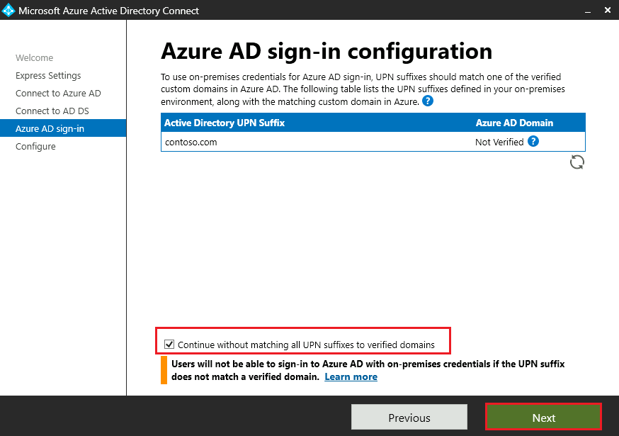

1. **[Ready to configure (構成の準備完了)]** 画面が表示された後、アクションの一覧を確認し、**[Start the synchronaization process when configuration completes. (構成が完了したら、同期プロセスを開始します。)]** のチェックボックスにチェックが入っていることを確認してから、インストールを開始します。

   **※インストールが完了するまでに5分程度要します。**

   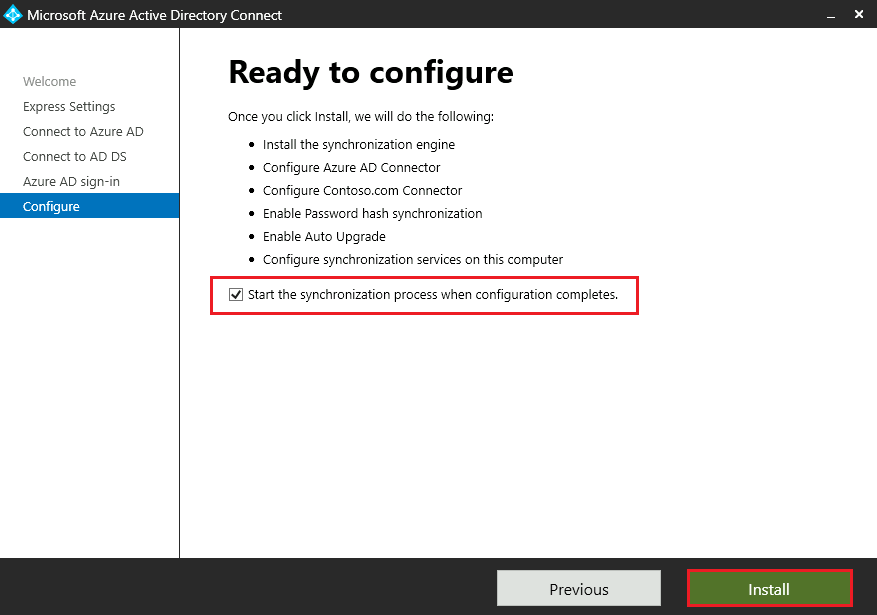

1.  **[Configuration complete (設定完了)]** 画面が表示されたら、 **[Exit]** をクリックして終了します。

   

## <a name="exercise-4-verifying-integration-between-ad-ds-and-azure-ad"></a>演習 4: AD DS と Azure AD の統合の検証

### <a name="scenario"></a>シナリオ

Azure AD Connect をインストールして構成したので、同期のメカニズムを確認できるようになりました。 あなたは、同期をトリガーするオンプレミスのユーザー アカウントに変更を加える予定です。 次に、対応する Azure AD ユーザー オブジェクトに変更がレプリケートされていることを確認します。

この演習の主なタスクは次のとおりです。

1. Azure portal で同期を検証する。
1. Synchronization Service Manager で同期を検証する。
1. Active Directory でユーザー アカウントを更新する。
1. Active Directory でユーザー アカウントを作成する。
1. Azure AD に変更を同期する。
1. Azure AD での変更を検証する。

### <a name="task-1-verify-synchronization-in-the-azure-portal"></a>タスク 1: Azure portal で同期を検証する

1. **SEA-ADM1** で、Azure portal が表示されている Microsoft Edge ウィンドウに切り替えます。 

1. **Azure AD Connect** ページを更新し、**[Active Directory からのプロビジョニング]** の下の情報の **[同期状態]** が **[有効]** となっていることを確認します。※有効が確認できない場合は、ブラウザ更新を実行してください。

   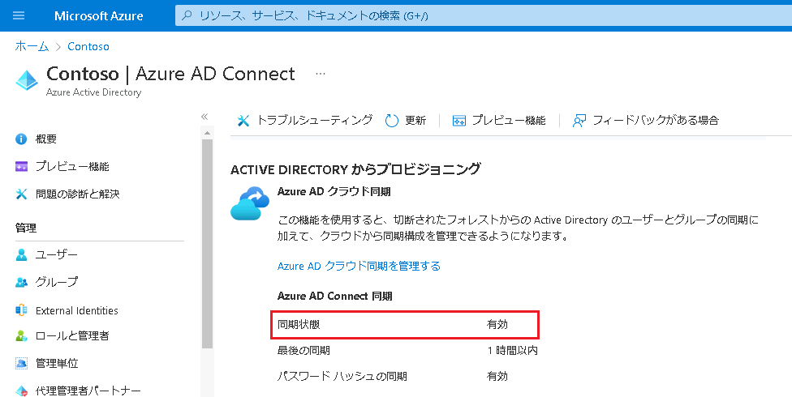

1. 左のナビゲーションペインから **[ユーザー]** を選択します。

   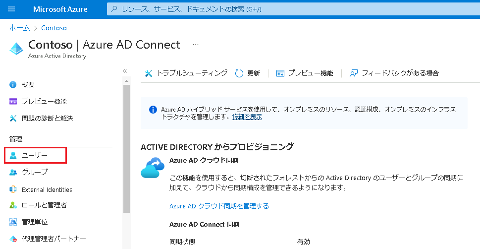

1. Active Directory の Contoso.com ドメインから同期されたユーザーの一覧が表示されます。

   > **注**: ディレクトリ同期が開始されると、Active Directory オブジェクトが Azure AD Portalに表示されるまでに 15 分以上要する場合があります。

1. Azure Active Directory に戻り、左ナビゲーションペインの一覧から **[グループ]**  を参照します。

   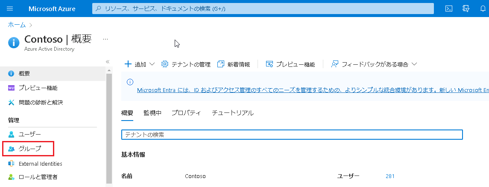

1. Active Directory の Contoso.com ドメインから同期されたグループの一覧を確認します。

   注: オンプレミスドメインの OU が、Azure AD のグループとして同期されていることが確認できます。(例 : Sales OU、Research OU などがセキュリティグループとして同期されています。)

### <a name="task-2-verify-synchronization-in-the-synchronization-service-manager"></a>タスク 2: Synchronization Service Manager で同期を検証する

1. **SEA-ADM1** の **[スタート]** メニューで、**[Azure AD Connect]** を展開し、**[Synchronization Service (同期サービス)]** を選択します。

   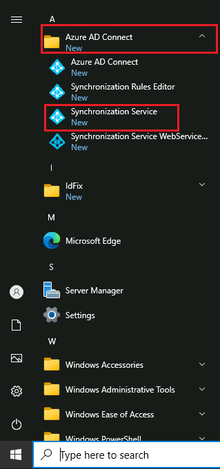

1. **[Synchronization Service Manager]** ウィンドウの **[Operations (操作)]** タブで、Active Directory オブジェクトを同期するために実行されたタスクが確認できます。

   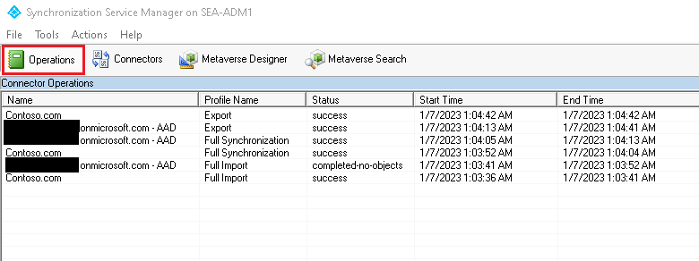

1. **[Connectors (コネクタ)]** タブを選択し、2 つのコネクタが存在することを確認します。

   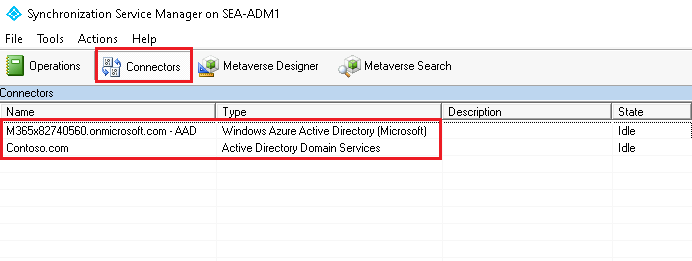

   > **注**: 1 つのコネクタが AD DS 用で、もう 1 つは Azure AD テナント用です。 

1. コネクタを確認したら、 **[Synchronization Service Manager]** ウィンドウを閉じます。

### <a name="task-3-update-a-user-account-in-active-directory"></a>タスク 3: Active Directory でユーザー アカウントを更新する

1. **SEA-ADM1** の **[Server Manager (サーバー マネージャー)]** で  **[Active Directory Users and Computers (Active Directory ユーザーとコンピューター)]** を起動します。

1. **[Active Directory ユーザーとコンピューター]** で、**Sales** 組織単位 (OU) を展開し、ユーザーの **Ben Miller** をダブルクリック、もしくは右クリックをしてプロパティを表示させます。

   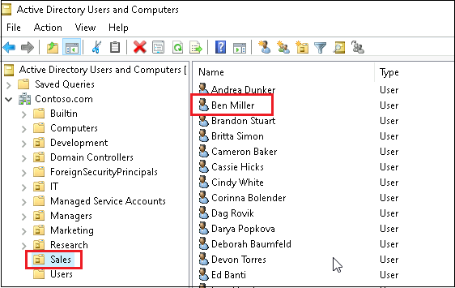

1. ユーザーのプロパティで、 **[Organization (組織)]** タブを選択します。

1. **[Job Title (役職)]** テキストボックスに「**Manager**」と入力し、**[OK]** をクリックします。

   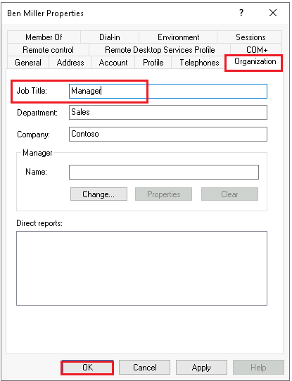

### <a name="task-4-create-a-user-account-in-active-directory"></a>タスク 4: Active Directory でユーザー アカウントを作成する

1.   **SEA-ADM1** の **[Server Manager (サーバー マネージャー)]** で  **[Active Directory Users and Computers (Active Directory ユーザーとコンピューター)]** を起動します。

2.  Sales OU を右クリックして、 **[New] - [User]** の順に選択します。

   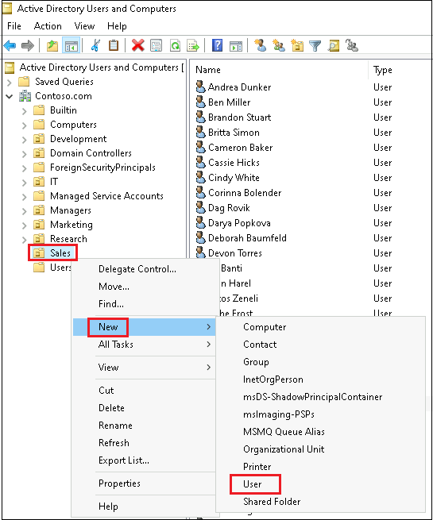

3. [New Object - User] ダイアログボックスに以下を入力して、 **[Next]** をクリックします。

   | First name          | Jordan       |
   | ------------------- | ------------ |
   | **Last name**       | **Mitchell** |
   | **User logon name** | **Jordan**   |

   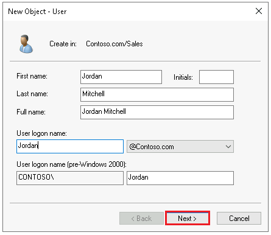

4. パスワードを **Pa55w.rd** と設定して **[Next]** をクリックします。

   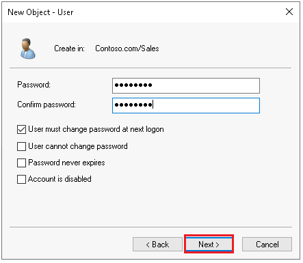

5. 作成したら、 **[Finish]** をクリックしてダイアログボックスを閉じます。

### <a name="task-5-sync-changes-to-azure-ad"></a>タスク 5: Azure AD に変更を同期する

1. **SEA-ADM1** で、管理者として **Windows PowerShell** を起動します。
1. **Windows PowerShell** コンソールで、次のコマンドレットを実行し、Contoso.com ドメインで変更したユーザー情報や作成したユーザーアカウントを同期します。

   ```powershell
   Start-ADSyncSyncCycle
   ```

   > **注**: 同期サイクルの開始後、Active Directory オブジェクトが Azure AD ポータルに表示されるまでに 15 分程度要することがあります。

3. 実行結果に **[Success]** と返ってきたら、Windows PowerShell コンソールを × で閉じて終了します。

### <a name="task-6-verify-changes-in-azure-ad"></a>タスク 6: Azure AD での変更を検証する

1. **SEA-ADM1** で、Microsoft Edge ウィンドウに切り替えて Azure portal を表示し、**[Azure Active Directory]** ページに戻ります。

1. **[Azure Active Directory]** ページから **[ユーザー]** ページを参照します。

1. **[すべてのユーザー]** ページで、ユーザー **Ben Miller** を検索します。

   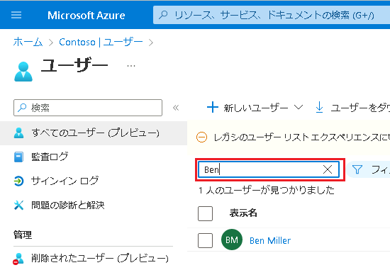

1. ユーザー **Ben Miller** のプロパティ ページを開き、**役職**の属性が Active Directory から同期されたことを確認します。※Ben Miller の役職 [Manager] が同期されます。

   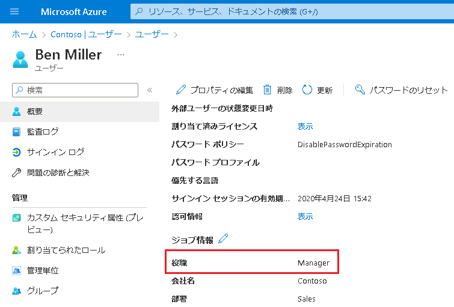

1. Microsoft Edge で、 **[すべてのユーザー]** ページに戻ります。

1. **[すべてのユーザー]** ページで、ユーザーを **Jordan** 検索します。

   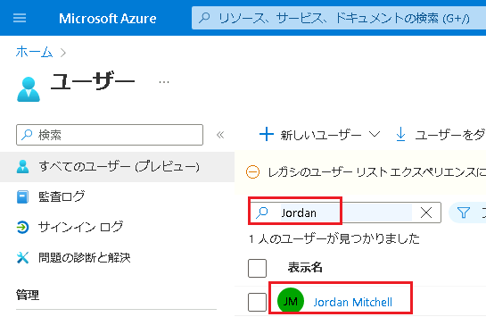

1. Active Directory で作成した、Jordan Mitchell が同期されていることが確認できます。

## <a name="exercise-5-implementing-azure-ad-integration-features-in-ad-ds"></a>演習 5 AD DS での Azure AD 統合機能の実装

### <a name="scenario"></a>シナリオ

オンプレミスの Azure Active Directory のセキュリティをさらに強化し、管理オーバーヘッドを最小限に抑えることができる Azure AD 統合機能を検証します。 また、Windows Server Active Directory 用の Azure AD パスワード保護と、パスワード ライトバックを使用するセルフサービス パスワード リセットを実装も検討することにしました。

この演習の主なタスクは次のとおりです。

1. Azure でセルフサービス パスワード リセットを有効にする。
1. Azure AD Connect でパスワード ライトバックを有効にする。
1. Azure AD Connect でパススルー認証を有効にする。
1. Azure でパススルー認証を検証する。
1. Azure AD パスワード保護プロキシ サービスと DC エージェントをインストールして登録する。
1. Azure でパスワード保護を有効にする。

### <a name="task-1-enable-self-service-password-reset-in-azure"></a>タスク 1: Azure でセルフサービス パスワード リセットを有効にする

1. **SEA-ADM1** で、Microsoft Edge でAzure portal にグローバル管理者としてサインインします。Azure AD(Azure Active Directory) の 左のナビゲーションペインの一覧から **[ライセンス]** を参照します。

   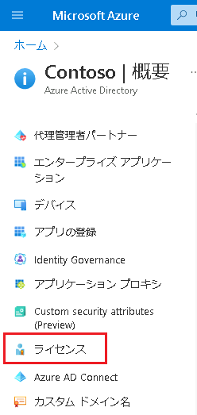

1. **[ライセンス]** ページで、 **[すべての製品]** を選択します。

   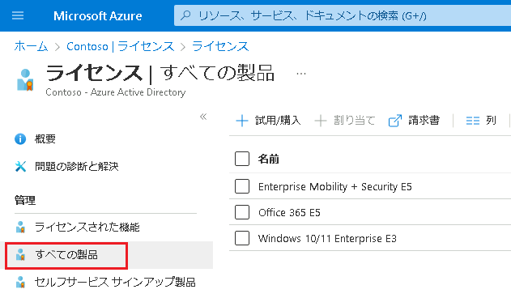

1.  **[すべての製品]** ページで、 **[ + 試用/購入]** を選択します。

   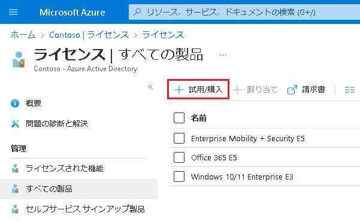

1.  **[アクティブ化]** ページの **[ AZURE AD PREMIUM P2 ]** で、 **[無料試用版]** を選択し、 **[アクティブ化]** をクリックします。 

   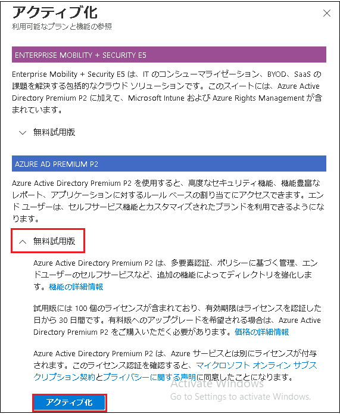

1. ブラウザを更新し、**[Azure Active Directory Premium P2]** を選択します。

   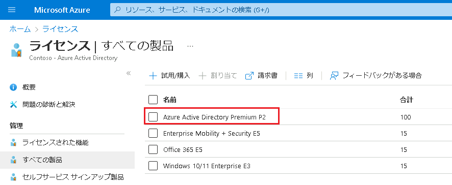

1.  **[Azure Active Directory Premium P2 | ライセンス]** ユーザーページで、 **[ + 割り当て]** を選択します。

   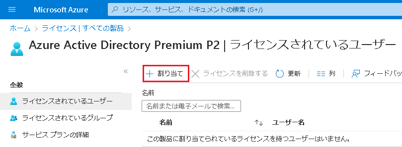

1.  **[ライセンスの割り当て]** ページで、 **[ + ユーザーとグループの追加]** を選択します。

   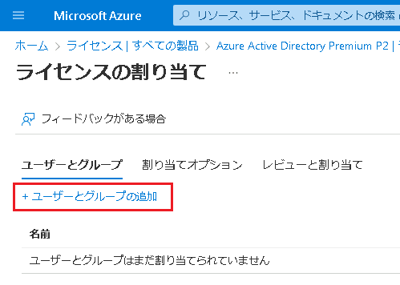

1.  **[ユーザーとグループの追加]** ページで、**admin**を検索し、結果の一覧から **Mod Administrator** を選択してた後、  **[選択]** をクリックします。

   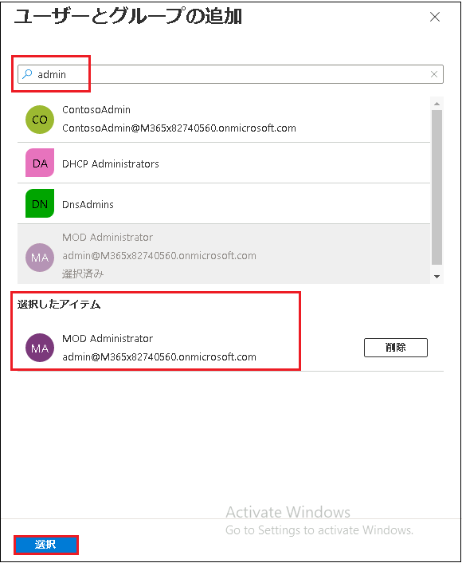

1. **[ライセンスの割り当て]** ページに戻り、 Mod Administrator が選択されていることを確認したら、 **[レビューと割り当て]** をクリックします。

   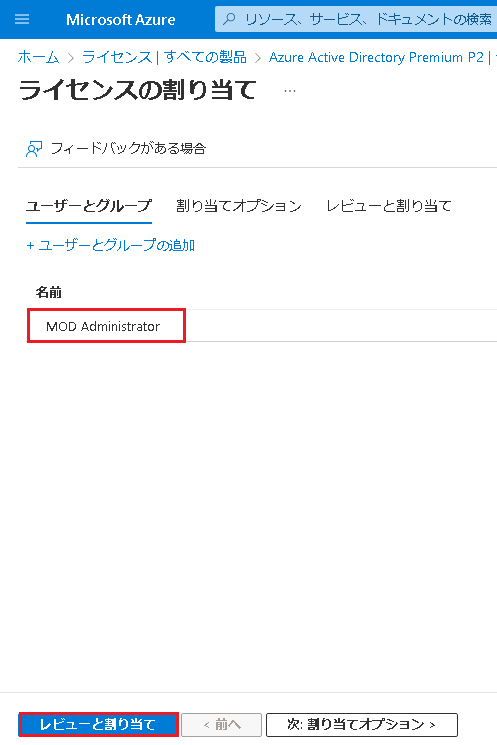

1. **[ライセンスの割り当て]** ページに戻り、 **[割り当て]** をクリックします。

1. **Azure Active Directory** ページに戻り、左のナビゲーションペイン一覧から、 **[パスワードのリセット]** を選択します。

   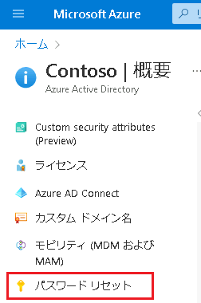

1. **[パスワードのリセット]** ページで、 **[パスワードリセットのセルフパスワードが有効]** の横にある **[!]** マークをクリックし、 メッセージを確認します。※メッセージには、構成を適用するユーザーの範囲を選択できる旨の説明が記載されています。

    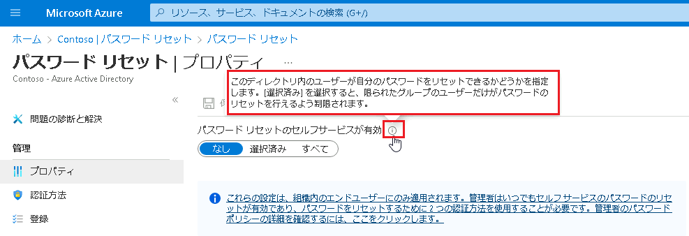

    > **注**: パスワード リセット機能は、有効にしないでください。

1. パスワードリセットのセルフサービスは **[なし]** の状態で、タスク2に進みます。

### <a name="task-2-enable-password-writeback-in-azure-ad-connect"></a>タスク 2: Azure AD Connect でパスワード ライトバックを有効にする

1. **SEA-ADM1** で、[スタート] メニューから、 **Azure AD Connect** を展開し、**[Azure AD Connect]** を起動します。

   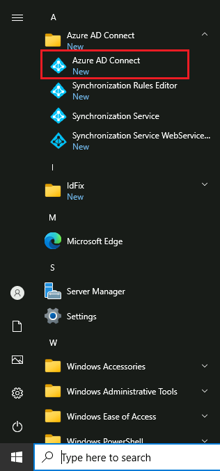

1.  **[Microsoft Azure Active Directory Connect]** ウィンドウで、**[Configure (構成)]** をクリックします。

   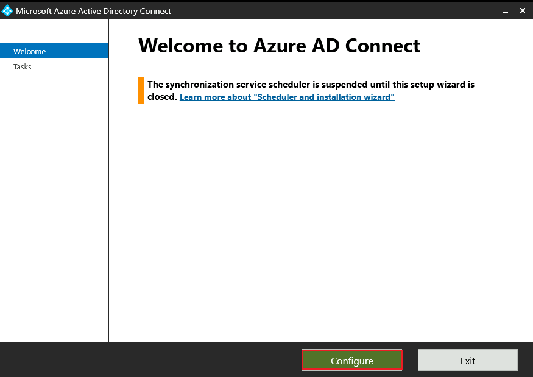

1.  **[Additional tasks (追加のタスク)]** 画面で、**[Customize synchronization options (同期オプションのカスタマイズ)]** を選択し、 **[Next (次へ)]** をクリックします。

   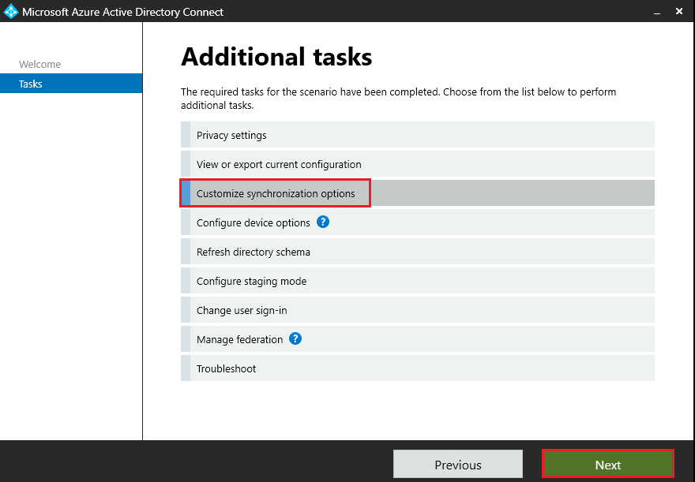

1.  **[Connect to Azure AD (Azure AD への接続)]** 画面で、Azure AD グローバル管理者ユーザー アカウントのユーザー名とパスワードを入力し、 **[Next (次へ)]** をクリックします。※資格情報は、ラボの [Home] タブで提供されているアカウントを使用してください。

   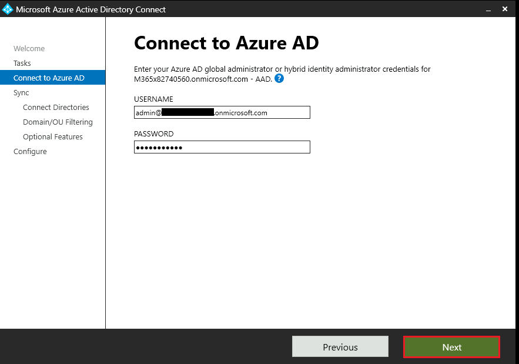

   

1.  **[Connect your directories]** 画面では、規定値のまま **[Next (次へ)]** をクリックします。

1. **[Domain and OU filtering]** 画面では、規定値のまま **[Next (次へ)]** をクリックします。

1. **[Optional features (オプション機能)]** 画面で、**[Password writeback (パスワード ライトバック)]** にチェックを入れ、 [Next (次へ)] をクリックします。

   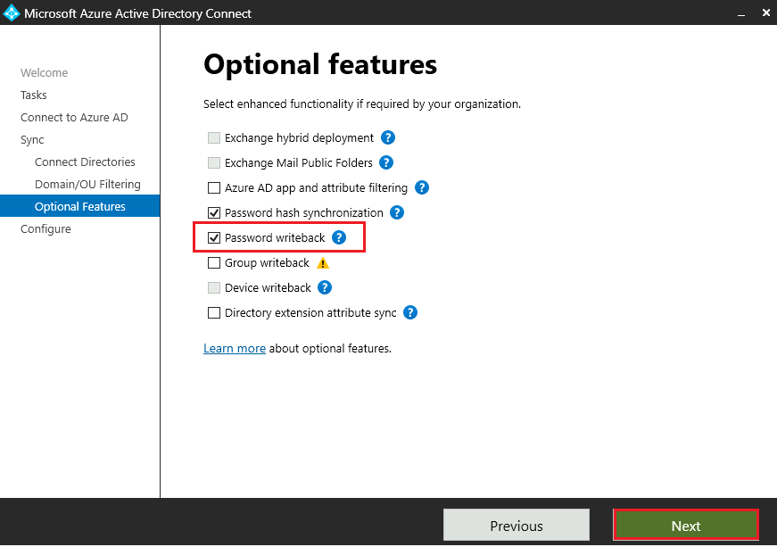

   > **注**: **Active Directory ユーザーのセルフサービス パスワード リセットには、パスワード ライトバックが必要です。 パスワードライトバックによって、Azure AD 内のユーザーによってパスワードが変更され、Active Directory に同期されます。**

1. **[Ready to configure (構成の準備完了)]** 画面が表示されたら、**[Configure (構成)]** をクリックします。

   ※構成が完了するまでに数分かかります。

1. 構成が完了したら、 **[Exit]** をクリックし、 **[Microsoft Azure Active Directory Connect]** ウィンドウを閉じます。

### <a name="task-3-enable-pass-through-authentication-in-azure-ad-connect"></a>タスク 3: Azure AD Connect でパススルー認証を有効にする

1. **SEA-ADM1** の **[スタート]** メニューで、**[Azure AD Connect]** を展開し、**[Azure AD Connect]** を起動します。

1. **[Microsoft Azure Active Directory Connect]** ウィンドウで、**[Configure (構成)]** をクリックします。

1. **[Additional tasks (追加のタスク)]** 画面で、**[Change user sign-in (ユーザー サインインの変更)]** を選択し、 **[Next (次へ)]** をクリックします。

   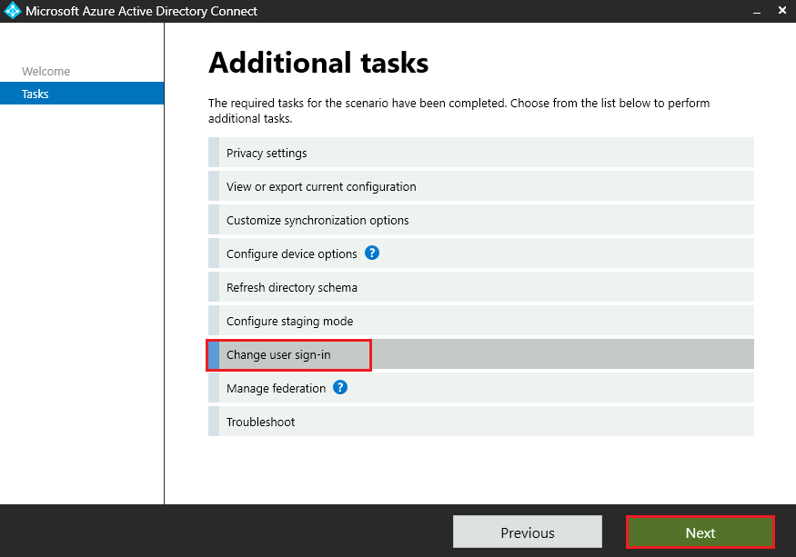

1. **[Connect to Azure AD (Azure AD への接続)]** 画面で、 Azure AD グローバル管理者 アカウントのユーザー名とパスワードを入力して、 **[Next (次へ)]** をクリックします。

1. **[User sign-in (ユーザー サインイン)]** 画面で、**[Pass-through authentication (パススルー認証)]** を選択し、 **[Enable single sign-on (シングル サインオンを有効にする)]** のチェックボックスがオンになっていることを確認したら、 **[Next (次へ)]** をクリックします。

   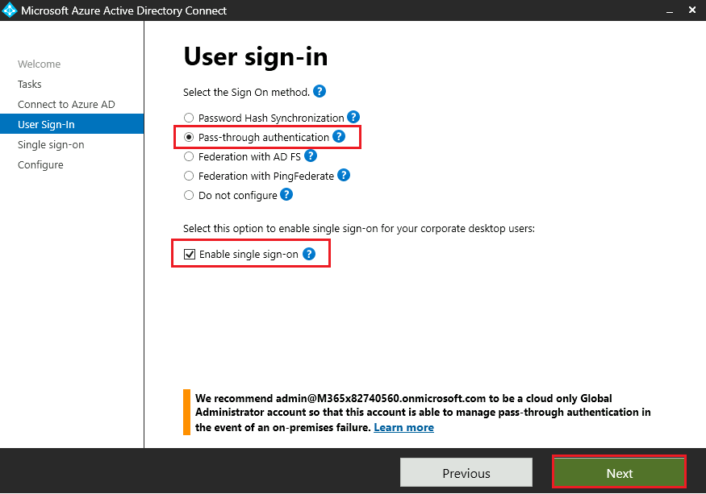

   

1. **[Enable single sign-on (シングル サインオンを有効にする)]** 画面で、**[Enter credentials (資格情報の入力)]** をクリックします。

   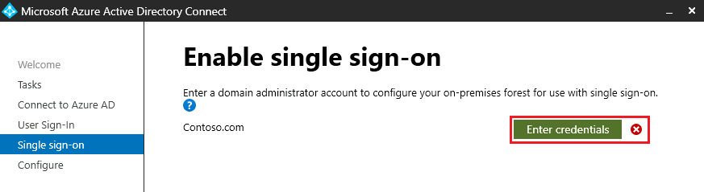

1. **[Forest credentials]** ダイアログ ボックスで、次の資格情報を入力し、 **[OK]** をクリックします。

   - Username: **Administrator**
   - Password: **Pa55w.rd**

1. **[Enable single sign-on (シングル サインオンを有効にする)]** ページで、**[Enter credentials (資格情報の入力)]** の横に緑色のチェック マークが表示されているのを確認したら、 [Next (次へ)] をクリックします。

   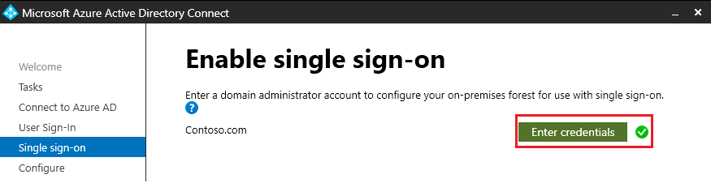

1. **[Ready to configure (構成の準備完了)]** 画面で、実行するアクションの一覧を確認し、**[Configure (構成)]** をクリックします。※構成が完了するまでに数分かかります。

1. 構成が完了したら、 **[Exit]** をクリックし、 **[Microsoft Azure Active Directory Connect]** ウィンドウを閉じます。

### <a name="task-4-verify-pass-through-authentication-in-azure"></a>タスク 4: Azure でパススルー認証を検証する

1. **SEA-ADM1** の、Azure portal で **[Azure Active Directory]** の左ナビゲーションペインの一覧から、 **[Azure AD Connect]** を選択します。

1. **[Azure AD Connect]** ページの、**[ユーザー サインイン]** の下に表示されている、**[シームレス なシングル サインオン]** を選択します。

   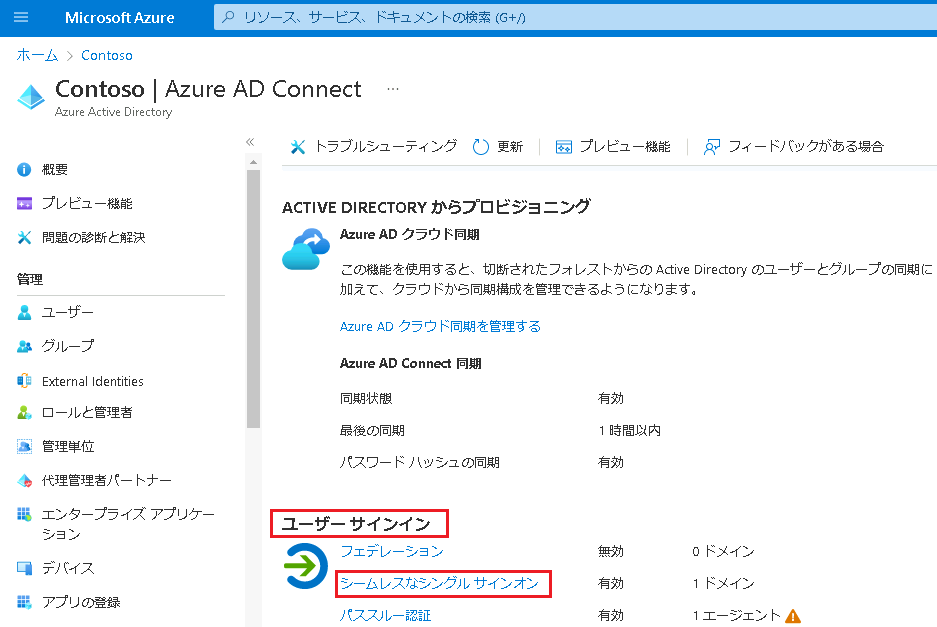

1. **[シームレス シングル サインオン]** ページで、オンプレミスのドメイン名を確認します。※オンプレミスドメイン名は、Contoso.com になっています。

   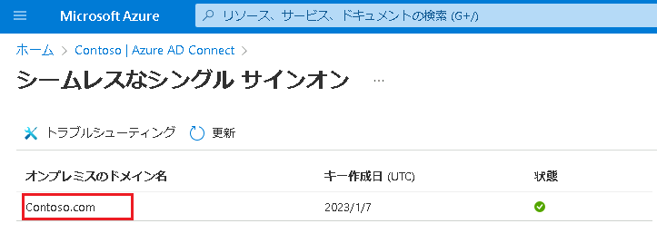

1. **[Azure AD Connect]** ページ に戻り、 **[ユーザーサインオン]** から、 **[パススルー認証]** を選択します。

   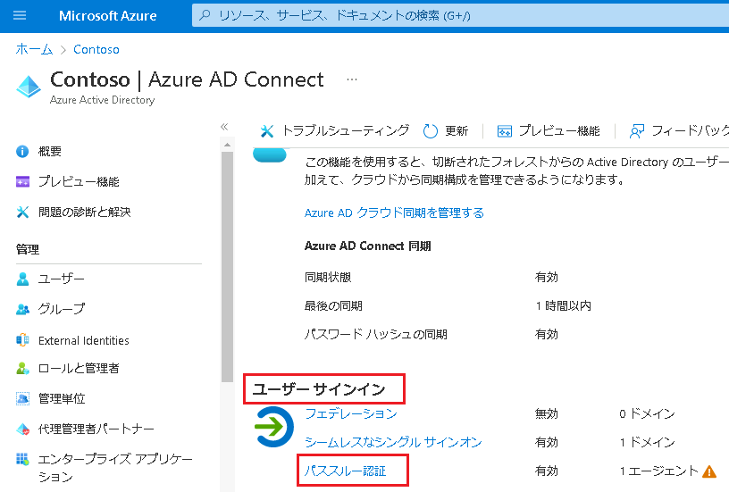

1. **[パススルー認証]** ページで、 **[認証エージェント]** の下にあるサーバー名を確認します。

   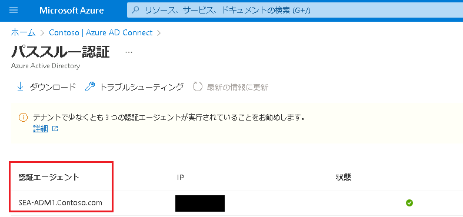

   > **注**: Azure AD Authentication エージェントを環境内の複数のサーバーにインストールするには、Azure portal の **[パススルー認証]** ページからバイナリーをダウンロードします。

### <a name="task-5-install-and-register-the-azure-ad-password-protection-proxy-service-and-dc-agent"></a>タスク 5: Azure AD パスワード保護プロキシ サービスと DC エージェントをインストールして登録する

1. **SEA-ADM1** の Microsoft Edge で、Azure Portal とは別のタブを開き、Microsoft ダウンロード Web サイトを(https://www.microsoft.com/en-us/download/details.aspx?id=57071) を参照します。

1. Microsoft ダウンロード Web サイトにある、「**Azure AD Password Protection for Windows Server Active Directory**」の、**[Download]** をクリックします。

   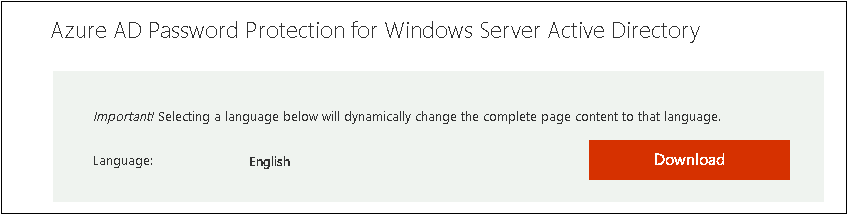

1. **AzureADPasswordProtectionProxySetup.exe** と **AzureADPasswordProtectionDCAgentSetup.msi** を選択し、 **[Next]** をクリックします。

   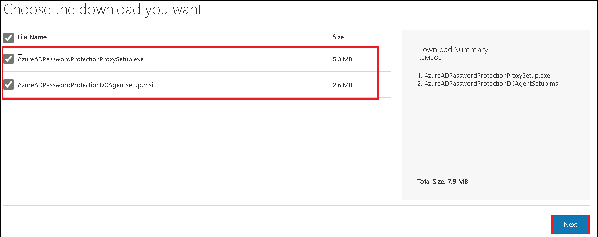

   > **注**: プロキシ サービスは、ドメインコントローラー以外のサーバーにインストールすることが推奨されています。 また、プロキシ サービスは、Azure AD Connect エージェントと同じサーバーにはインストールできません。 このラボでは、プロキシ サービスは **SEA-SVR1** 、パスワード保護 DC エージェントは **SEA-DC1** にインストールします。

1. ブラウザに表示される、「Download multipul files (複数のファイルをダウンロード)」ダイアログボックスで [Allow (許可)] をクリックします。

   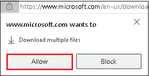

1. **SEA-ADM1** の**Windows PowerShell(管理者)** で次のコマンドレットを実行し、インターネットからファイルがダウンロードされたことを示す Zone.Identifier 代替データ ストリームを削除します。

   ```powershell
   Get-ChildItem -Path "$env:USERPROFILE\Downloads" -File | Unblock-File
   ```

1. 次のコマンドレットを実行して **SEA-SVR1** に **C:\Temp** ディレクトリを作成し、**AzureADPasswordProtectionProxySetup.exe** インストーラーをそのディレクトリにコピーして、インストールを実行します。

   ```powershell
   New-Item -Type Directory -Path '\\SEA-SVR1.contoso.com\C$\Temp' -Force
   
   Copy-Item -Path "$env:USERPROFILE\Downloads\AzureADPasswordProtectionProxySetup.exe" -Destination '\\SEA-SVR1.contoso.com\C$\Temp\'
   
   Invoke-Command -ComputerName SEA-SVR1.contoso.com -ScriptBlock { Start-Process -FilePath C:\Temp\AzureADPasswordProtectionProxySetup.exe -ArgumentList '/quiet /log C:\Temp\AzureADPPProxyInstall.log' -Wait }
   ```

1. 次のコマンドレットを実行して **SEA-DC1** に **C:\Temp** ディレクトリを作成し、**AzureADPasswordProtectionDCAgentSetup.msi** インストーラーをそのディレクトリにコピーし、インストールを実行します。インストールが完了したらドメイン コントローラーを再起動します。

   ```powershell
   New-Item -Type Directory -Path '\\SEA-DC1.contoso.com\C$\Temp' -Force
   
   Copy-Item -Path "$env:USERPROFILE\Downloads\AzureADPasswordProtectionDCAgentSetup.msi" -Destination '\\SEA-DC1.contoso.com\C$\Temp\'
   
   Invoke-Command -ComputerName SEA-DC1.contoso.com -ScriptBlock { Start-Process msiexec.exe -ArgumentList '/i C:\Temp\AzureADPasswordProtectionDCAgentSetup.msi /quiet /qn /norestart /log C:\Temp\AzureADPPInstall.log' -Wait }
   
   Restart-Computer -ComputerName SEA-DC1.contoso.com -Force
   ```

1. 次のコマンドレットを実行して、 Azure AD パスワード保護を実装するために必要なサービスが作成されたことを確認します。※結果が返ってくるまでに数分かかります。

   ```powershell
   Get-Service -Computer SEA-SVR1 -Name AzureADPasswordProtectionProxy | fl
   Get-Service -Computer SEA-DC1 -Name AzureADPasswordProtectionDCAgent | fl
   ```

   > **注**: **[Status]** が **[Running]** であることを確認します。

1. 以下のコマンドレットを実行し、 **SEA-SVR1** への PowerShell リモート処理セッションを確立します。

   ```powershell
   Enter-PSSession -ComputerName SEA-SVR1
   ```

1. PowerShell リモート処理セッション内で次のコマンドを入力し、プロキシ サービスを Active Directory に登録します (-AccountUpn パラメーターの値、 `<Azure_AD_Global_Admin>` は、 Azure AD グローバル管理者ユーザー アカウントのユーザー プリンシパル名に置き換えます)。

   ```powershell
   Register-AzureADPasswordProtectionProxy -AccountUpn <Azure_AD_Global_Admin> -AuthenticateUsingDeviceCode
   ```

1. Microsoft Edgeから、https://microsoft.com/devicelogin、にアクセスし、実行結果に表示された [code] を入力して認証します。

1. プロンプトが表示されたら、Azure AD グローバル管理者ユーザー アカウントの資格情報を使用して認証します。

1. Windows PowerShell コンソールに戻り、次のコマンドレットを実行して、SEA-SVR1へのPowerShell リモート セッションを終了します。

   ```powershell
   Exit-PSsession
   ```

   

1. **Windows PowerShell** コンソールで、次のコマンドレットを実行して、**SEA-DC1** への PowerShell リモート処理セッションを開始します。

    ```powershell
    Enter-PSSession -ComputerName SEA-DC1
    ```

1. PowerShell リモート処理セッション内で次のコマンドレットを実行し、プロキシ サービスを Active Directory に登録します (-AccountUpn の値、 `<Azure_AD_Global_Admin>` は、 Azure AD グローバル管理者ユーザー アカウントのユーザー プリンシパル名に置き換えます)。

    ```powershell
    Register-AzureADPasswordProtectionForest -AccountUpn <Azure_AD_Global_Admin> -AuthenticateUsingDeviceCode
    ```

1. Microsoft Edgeから、https://microsoft.com/devicelogin、にアクセスし、実行結果に表示された [code] を入力して認証します。

1. Windows PowerShell コンソールに戻り、次のコマンドレットを実行して、SEA-DC1へのPowerShell リモート セッションを終了します。

   ```powershell
   Exit-PSsession
   ```

### <a name="task-6-enable-password-protection-in-azure"></a>タスク 6: Azure でパスワード保護を有効にする

1. **SEA-ADM1** で、Azure portal が表示されている Microsoft Edge ウィンドウに切り替え、**[Azure Active Directory]** の左ナビゲーションペインの一覧から、**[セキュリティ]** を選択します。

   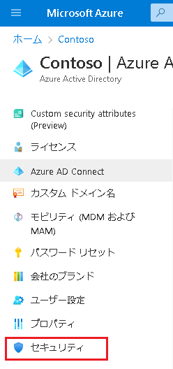

1. **[セキュリティ]** ページの一覧から、**[認証方法]** を選択します。

   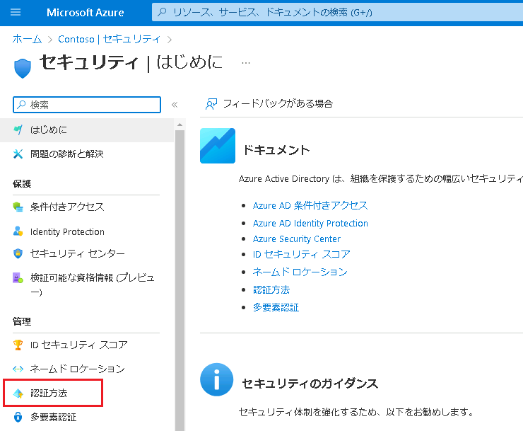

1. **[認証方法]** ページの一覧から、**[パスワード保護]** を選択します。

   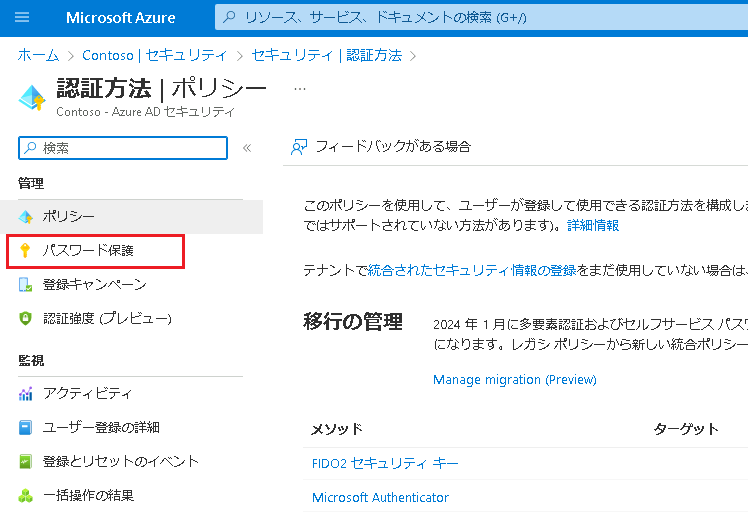

1.  **[パスワード保護]** ページで、 **[カスタム リストの適用]** のスライダーを **[はい]** に変更し、カスタム禁止パスワードの一覧に以下の単語を入力します。

   - **Contoso**
   - **ロンドン**

   > **注**: 禁止パスワードの一覧は、ご自分の組織に関連する単語である必要があります。

1.  **[Windows Server Active Directory でパスワード保護を有効にする]**  のスライダーが **[はい]** に設定されていることを確認します。 

1. **[モード]** が **[監査]** に設定されていることを確認し、変更を保存します。

   ※カスタム禁止パスワードリストが適用されるまでに、数時間要する場合があります。

   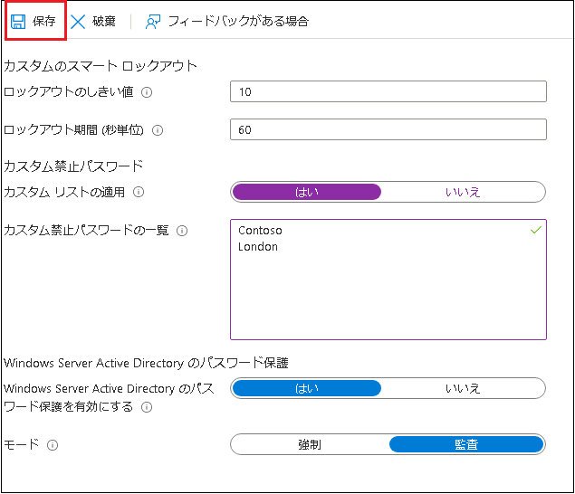

## <a name="exercise-6-cleaning-up"></a>オプション: クリーンアップ

### <a name="scenario"></a>シナリオ

オンプレミスの Active Directory から Azure への同期を無効にします。 

この演習の主なタスクは次のとおりです。

1. Azure AD Connect をアンインストールする。
1. Azure でディレクトリ同期を無効にする。

#### <a name="task-1-uninstall-azure-ad-connect"></a>タスク 1 Azure AD Connect のアンインストール

1. **SEA-ADM1** の検索ボックスで、 **[Control Panel]** を検索し、検索結果に表示された **[Control Panel]** を選択します。

1. **[Programs]** の **[Uninstall a program]** を選択します。

   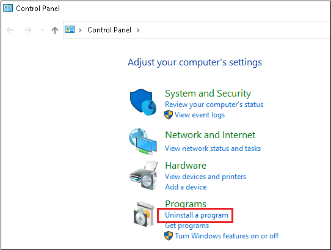

1. **Uninstall or change a program** の一覧から、**[Microsoft Azure AD Connect]** を右クリックし、アンインストールをクリックします。

   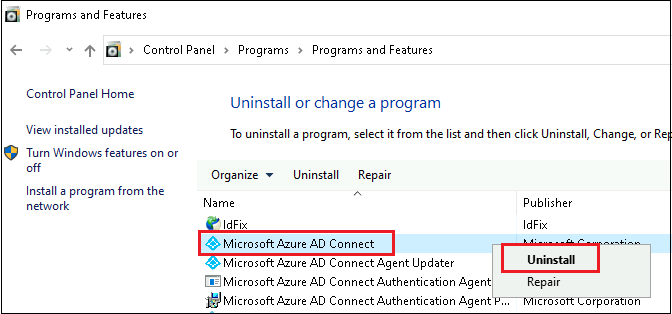

4.  **[Programs and features]** ダイアログボックスで確認メッセージが表示されたら、 **[Yes]** をクリックします。

   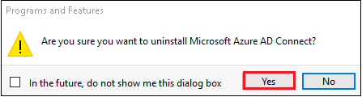

5.  **[Uninstall Azure AD Connect]** ウィンドウで、 **[Remove]** を選択します。

   ※アンインストールが完了するまでに数分要します。

6. Azure AD Connect がアンインストールされたら、 **[Uninstall Azure AD Connect]**  ウィンドウで  **[Exit]** を選択します。

### <a name="task-2-disable-directory-synchronization-in-azure"></a>タスク 2: Azure でディレクトリ同期を無効にする

1. **SEA-ADM1** で、**Windows PowerShell** ウィンドウに切り替えます。
1. **Windows PowerShell** コンソールで、次のコマンドを実行し、Azure AD 用の Microsoft Online モジュールをインストールします。

   ```powershell
   Install-Module -Name MSOnline
   ```
1. 次のコマンドを実行して、資格情報を Azure に提供します。

   ```powershell
   $msolcred=Get-Credential
   ```
1. ダイアログが表示されたら、**[Windows PowerShell 資格情報要求]** ダイアログ ボックスで、演習 1 で作成したユーザー アカウントの資格情報を入力します。
1. 次のコマンドを実行して Azure に接続します。

   ```powershell
   Connect-MsolService -Credential $msolcred
   ```
1. 次のコマンドを実行して、Azure でディレクトリ同期を無効にします。

   ```powershell
   Set-MsolDirSyncEnabled -EnableDirSync $false
   ```

### 
