---
lab:
  title: 'ラボ: Windows Server での仮想化の実装と構成'
  module: 'Module 5: Hyper-V virtualization in Windows Server'
---

# <a name="lab-implementing-and-configuring-virtualization-in-windows-server"></a>ラボ: Windows Server での仮想化の実装と構成

## <a name="scenario"></a>シナリオ

Contoso は、米国シアトルに本社があるグローバルなエンジニアリングおよび製造会社です。 IT オフィスとデータ センターはシアトルにあり、シアトル及び、シアトル以外もサポートしています。 Contoso では最近、Windows Server サーバーとクライアント インフラストラクチャを展開しました。 

現在使用率が低い物理サーバーが多数あるため、仮想化を展開して環境を最適化する予定です。 あなたは仮想マシン環境の管理に Hyper-V をどのように使用できるか確認するための概念実証を行うことにしました。 また、Contoso DevOps チームはコンテナー テクノロジを調べ、新しいアプリケーションの展開時間を短縮できるかどうかを判断し、クラウドへのアプリケーションの移行を簡素化したいと考えています。 あなたはContoso DevOps チームと協力して Windows Server コンテナーを評価し、コンテナーでのインターネット インフォメーション サービス (Web サービス) の提供を検討する予定です。


## <a name="objectives"></a>目標

このラボを完了すると、次のことができるようになります。

- VM を作成して構成する。
- コンテナーをインストールして構成する。

## <a name="estimated-time-60-minutes"></a>予想所要時間: 60 分

## <a name="lab-setup"></a>ラボのセットアップ

仮想マシン: **SEA-DC1**、**SEA-SVR1**、および **SEA-ADM1** を使用します。


1. **SEA-ADM1** を選択します。
1. 次の資格情報を使用してサインインします。

   - ユーザー名: **Administrator**
   - パスワード: **Pa55w.rd**
   - ドメイン: **CONTOSO**


## <a name="exercise-1-creating-and-configuring-vms"></a>演習 1: VM の作成と構成

### <a name="scenario"></a>シナリオ

この演習では、Hyper-V マネージャーと Windows Admin Center を使用して、仮想マシンを作成および構成します。 まず、プライベート仮想ネットワーク スイッチを作成します。 次に、VM にインストールするオペレーティング システムで既に準備されている基本イメージの差分ドライブを作成することにします。 最後に、概念実証のために準備した差分ドライブとプライベート スイッチを使用する第 1 世代 VM を作成します。

この演習の主なタスクは次のとおりです。

1. Hyper-V 仮想スイッチを作成します
1. 仮想ハード_ディスクを作成します。
1. 仮想マシンの作成
1. Windows Admin Center を使用して仮想マシンを管理します

### <a name="task-1-create-a-hyper-v-virtual-switch"></a>タスク 1: Hyper-V 仮想スイッチを作成する

1. **SEA-ADM1** で、**[スタート]** メニューを選択し、 **[Server Manager (サーバー マネージャー)]** を起動します。 

1. サーバー マネージャーの左のナビゲーションペインの一覧から、**[All Servers (すべてのサーバー)]** を選択します。 

1.  **[サーバー]** リストで **SEA-SVR1** を選択してから、右クリックをして **[Hyper-V Manager (Hyper-V マネージャー) ]** を起動します。 

   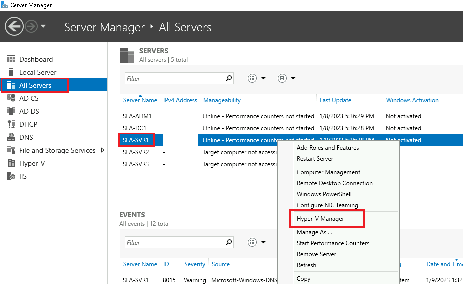

1.  SEA-SVR1.CONTOSO.COM が選択された**Hyper-V マネージャー** であることを確認し、 **[Action (操作)]** ウインドウから **[Virtual Switch Manager (仮想スイッチ マネージャー) ]** を起動させます。

   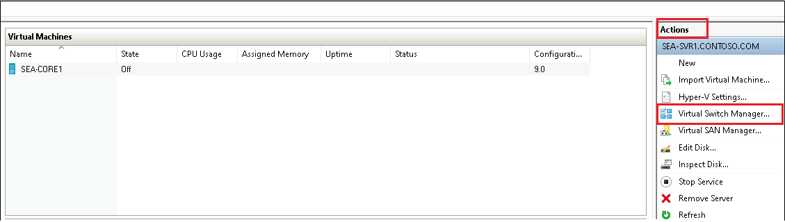

1.  **[Virtual Switch Manager (仮想スイッチ マネージャー) ]** の **[ Create virtual switch (仮想スイッチの作成)]** ウィンドウで、**[Private (プライベート)]** を選択し、次に **[ Create virtual switch (仮想スイッチの作成)]**  をクリックします。

   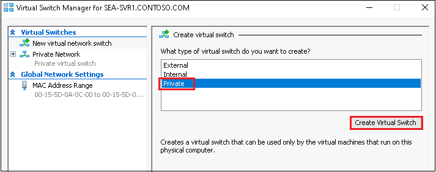

1.  **[Virtual Switch Properties (仮想スイッチのプロパティ)]** ボックスで、次の設定を指定し、  **[ OK ]** をクリックします。

   | 項目                             | 値                         |
   | -------------------------------- | -------------------------- |
   | **Name**                         | **Contoso Private Switch** |
   | **Connection type (接続の種類)** | **Private network**        |

   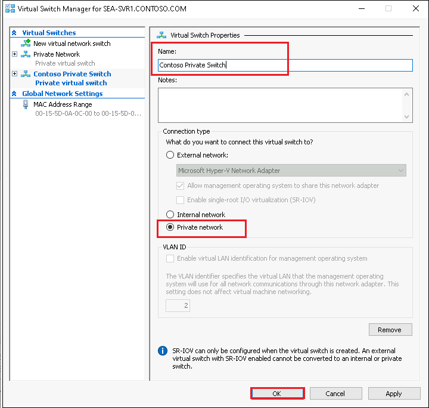

1. **SEA-SVR1** に次の設定で仮想スイッチを作成します。

   - 名前: **Contoso Private Switch**
   - 接続の種類: **プライベート ネットワーク**

※このタスクを完了すると、Hyper-V の仮想スイッチを作成できたことが確認できます。


### <a name="task-2-create-a-virtual-hard-disk"></a>タスク 2: 仮想ハード ディスクを作成する

1. **SEA-ADM1** の  **[Hyper-V Manager (Hyper-V マネージャー)]** の **[Action (操作)]** から、 **[New (新規)]** を選択し、 **[Hard Disk (ハードディスク)]** を選択します。

   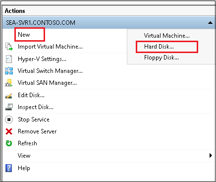

2.  ウィザードが起動し、**「Before you Begin page (開始する前に)」** と表示されたら、**[Next (次へ)]** をクリックします。

3.  **[Choose Disk Format (ディスク フォーマットの選択)]**  画面で、 **[ VHD ]** を選択し、 **[Next (次へ)]** を選択します。

   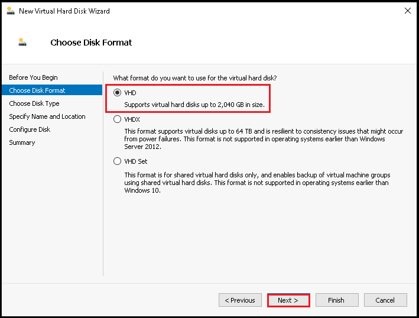

   

4.  **[Choose Disk Type (ディスク フォーマットの選択)]** ページで、 **[ Differencing (差分)]** を選択し、 **[Next (次へ)]** を選択します。

   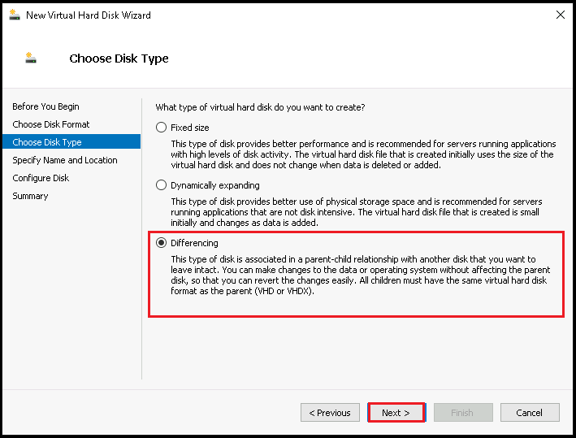

   

5.  **[Specify Name and Location (名前と場所の指定)]** ページで、次の設定を指定し、 **[Next (次へ)]** を選択します。

   | 項目         | 値          |
   | ------------ | ----------- |
   | **Name**     | **SEA-VM1** |
   | **Location** | **C:\Base** |

   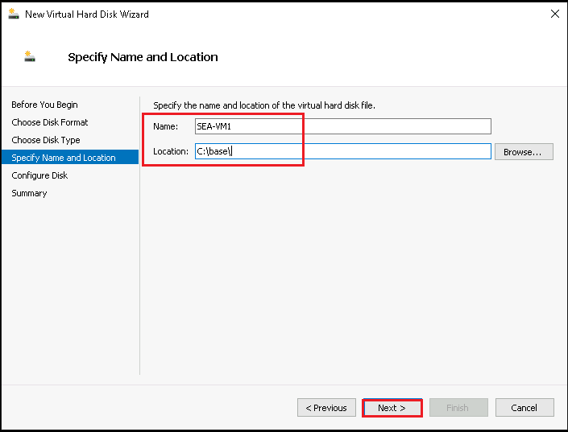

6.  **[Configure Disk (ディスクの構成)]**  ページの **[Location (場所)]** ボックスの **[Browse (参照)]** をクリックして、`C:\Base\BaseImage.vhd` を選択してから、**[Next (次へ)]** をクリックします。

   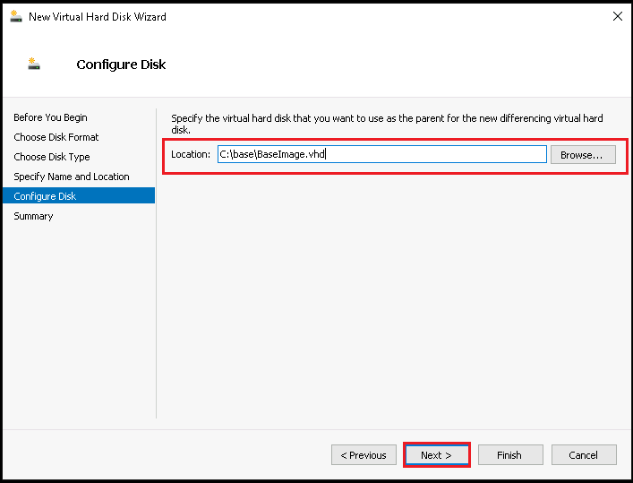

7.  **[Summary (概要)]** ページで、**[Finish (完了)]** を選択します。

※このタスクを完了すると、差分の仮想ハードディスクが作成されます。


### <a name="task-3-create-a-virtual-machine"></a>タスク 3: 仮想マシンを作成する

1.  SEA-ADM1の  **[Hyper-V Manager (Hyper-V マネージャー)]**  の **[Action (操作)]** から、 **[New (新規)]** を選択し、 **[Virtual Machine (仮想マシン)]**を選択します。新しい仮想マシン ウィザードが起動します。

1.  **[Before you Begin page (開始する前に)]** ページで、**[Next (次へ)]** を選択します。

1.  **[Specify Name and Location (名前と場所の指定)]** ページで **[SEA-VM1]** と入力し、 **[Store the virtual machine in a different location (仮想マシンを別の場所に保存する)]** の横にあるチェック ボックスをオンにします。

1.  **[Location (場所)]** ボックス の横にある **[Browse (参照)]** から `C:\Base` 選択し、**[Next (次へ)]** を選択します。

   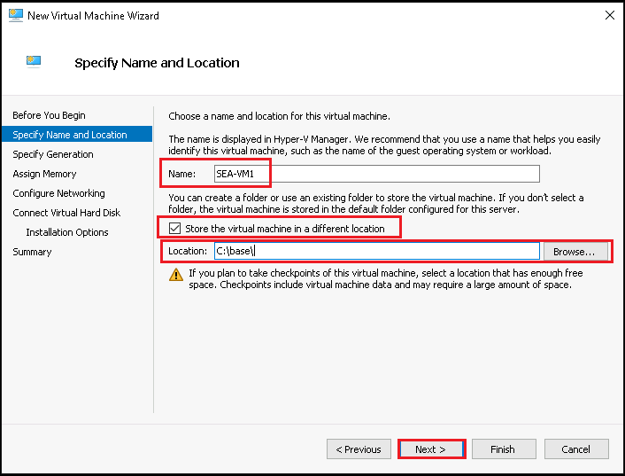

1.  **[Specify Generation (世代の指定)]** ページで、 **[Generation 1 (第1世代)]** を選択し、 **[Next (次へ)]** をクリックします。

1.  **[Assign Memory (メモリの割り当て)]** ページで **[4096]** と入力し、 **[Next (次へ)]** をクリックします。

1.  **[Configure Networking (ネットワークの構成)]** ページで、**[Connection (接続)]** ドロップダウン メニューを選択し、**[Contoso Private Switch]** を選択して、**[Next (次へ)]** をクリックします。

   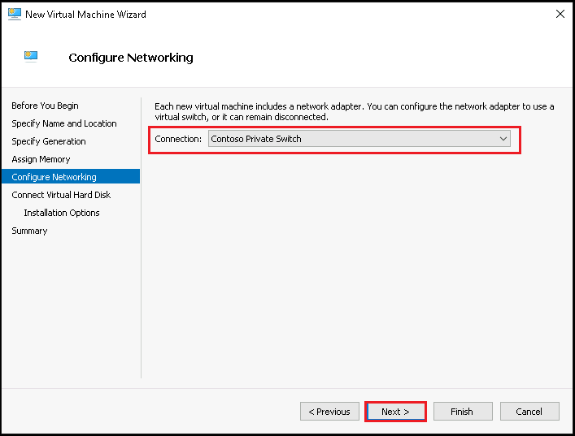

1.  **[Connect Virtual Hard Disk (仮想ハード ディスクの接続)]** ページで、**[Use an existing virtual hard disk (既存の仮想ハード ディスクを使用する)]** を選択し、**[Browse (参照)]** を選択します。

   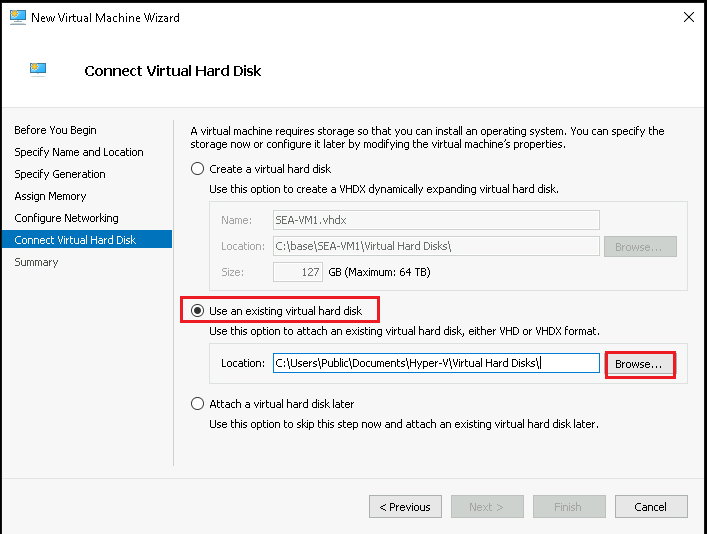

   

1.  **[C:\Base]** を参照したあと、**[SEA-VM1.vhd]** を選択し、 **[Open (開く)]** をクリックして、 **[Next (次へ)]** クリックします。

   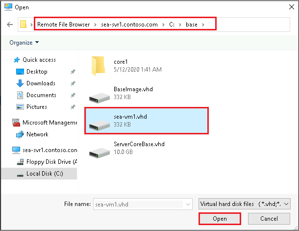

1.  **[Summary (概要)]** ページで、**[Finish (完了)]** をクリックします。仮想マシンのリストに **SEA-VM1** が表示されることを確認してください。

   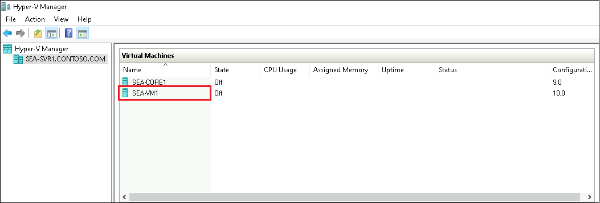

1.  **SEA-VM1** を選択し、**[Action (操作)]** ウィンドウで、SEA-VM1の下の **[Settings (設定)]**を選択します。

    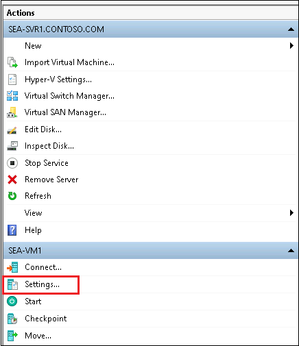

1.  **[Hardware]** リストで、**[Memory]** を選択します。

    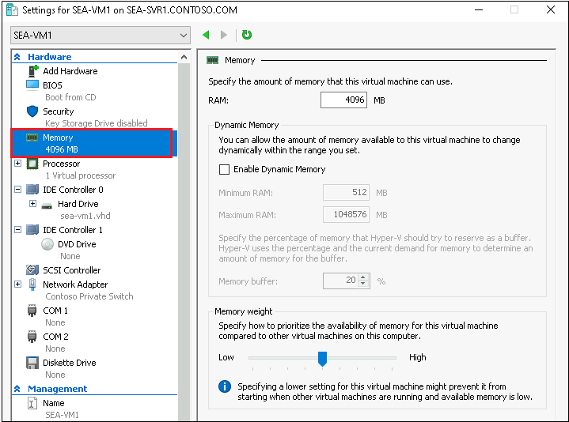

1.  **[Dynamic Memory (動的メモリ)]** セクションで、**[Enable Dynamic Memory (動的メモリを有効にする)]** の横にあるチェック ボックスをオンにします。

    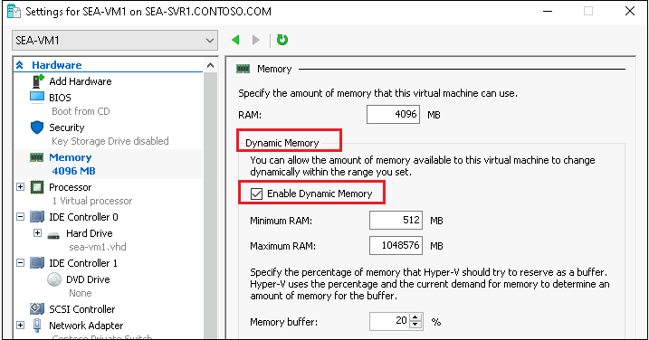

1.  **[Maximum RAM (最大 RAM)]** の横に **[4096]** と入力し、**[OK]** をクリックします。

    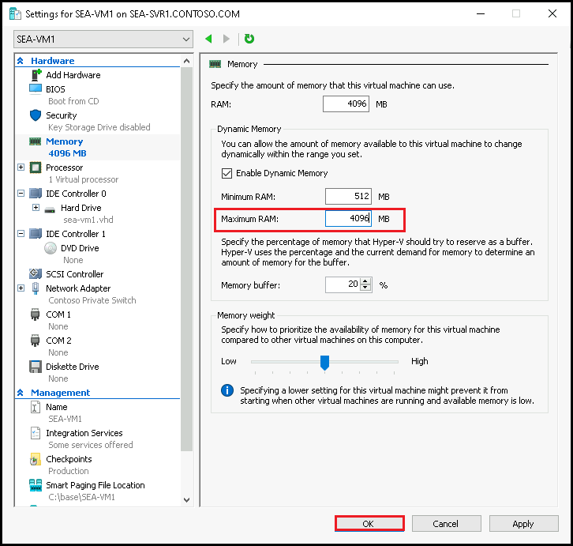

    

1.  **Hyper-V Manager** を閉じます。

### <a name="task-4-manage-virtual-machines-using-windows-admin-center"></a>タスク 4: Windows Admin Center を使用して仮想マシンを管理する

1. **SEA-ADM1** で Microsoft Edge を起動し、`https://SEA-ADM1.contoso.com` で Windows Admin Center に接続します。 

1.  **[Windows セキュリティ]** ダイアログ ボックスが表示されたら、次の資格情報を入力し、**[OK]** をクリックします。

   - ユーザー名: **CONTOSO\\Administrator**
   - パスワード: **Pa55w.rd**

   ※Windows Admin Center に接続後、必要に応じ、右上の歯車マークから言語設定を日本語に変更してください。

1.  **[すべての接続]** ウィンドウで、 **[ + 追加]** を選択します。

   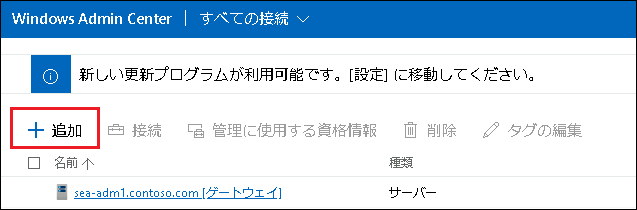

1.  **[リソースの追加または作成]** ウィンドウの **[サーバー]** タイルで、 **[追加]** をクリックします。

1.  **[サーバー名]** テキスト ボックスに、 **[sea-svr1.contoso.com]** と入力します。

1.  **[この接続では別のアカウントを使用する]** オプションを選択し、次の資格情報を入力して、 **[資格情報を含めて追加]** をクリックします。

   

   - ユーザー名: Contoso\Administrator
   - パスワード：Pa55w.rd

   

   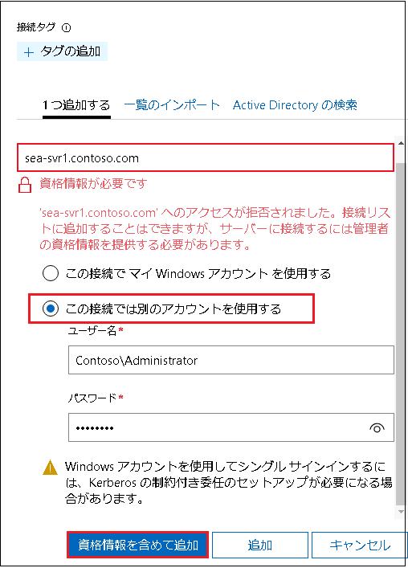

1.  **[すべての接続]** ウィンドウの一覧から、 **[sea-svr1.contoso.com]** を選択し、左ペインの  **[ツール]** リストから、**[仮想マシン]** を選択します。 **[概要]** タブを選択すると、仮想マシンのパフォーマンスなどが確認できるようになっています。

   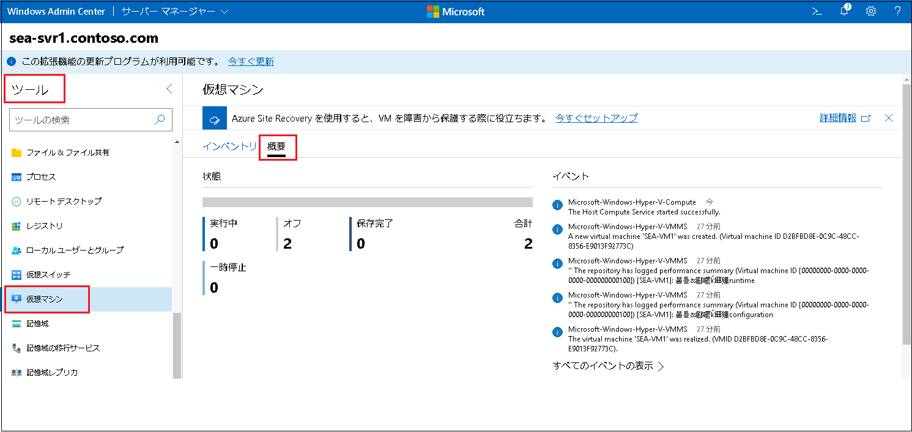

1.  **[インベントリ]** タブを選択し、**SEA-VM1** が含まれていることを確認します。

   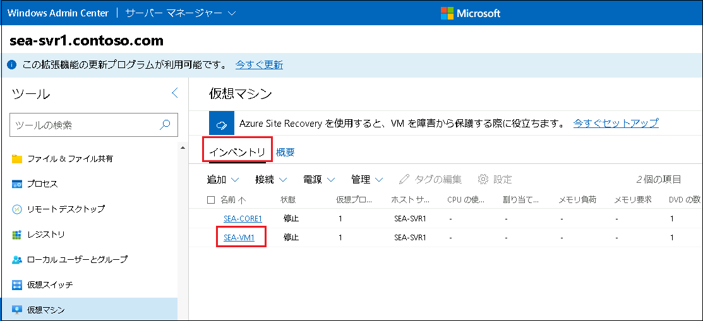

1. **SEA-VM1** を選択した後、**[設定 (歯車マーク)]** を選択し、**[ディスク]** をクリックします。

1.  ディスクページの一番下までスクロールし、 **[ + ディスクの追加]** を選択します。

   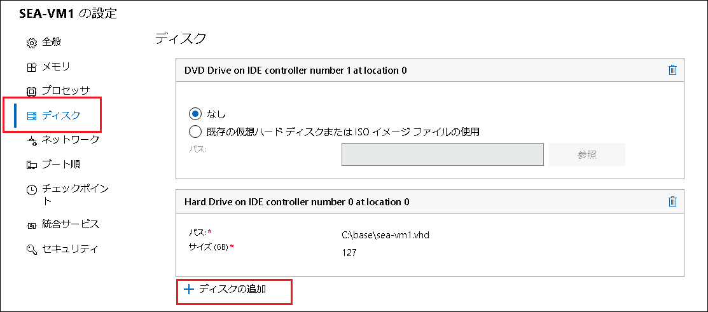

   

11.  **[新しい仮想ハードディスク]** を選択します。

12.  **[新しい仮想ハード ディスク]** ウィンドウの **[サイズ (GB)]** テキスト ボックスに **[ 5 ]** と入力し、他の設定を既定値のままにして、 **[作成]** をクリックします。

    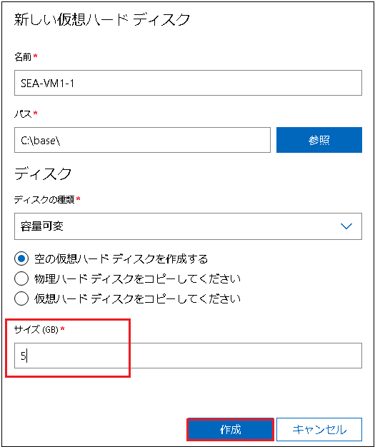

13.  **[ディスク設定の保存]** を選択し、**[閉じる]** をクリックします。

14. **SEA-VM1** の **[プロパティ]** ウィンドウに戻り、 **[電源]** を選択し、 **[開始]** をクリックして **SEA-VM1** を開始します。

    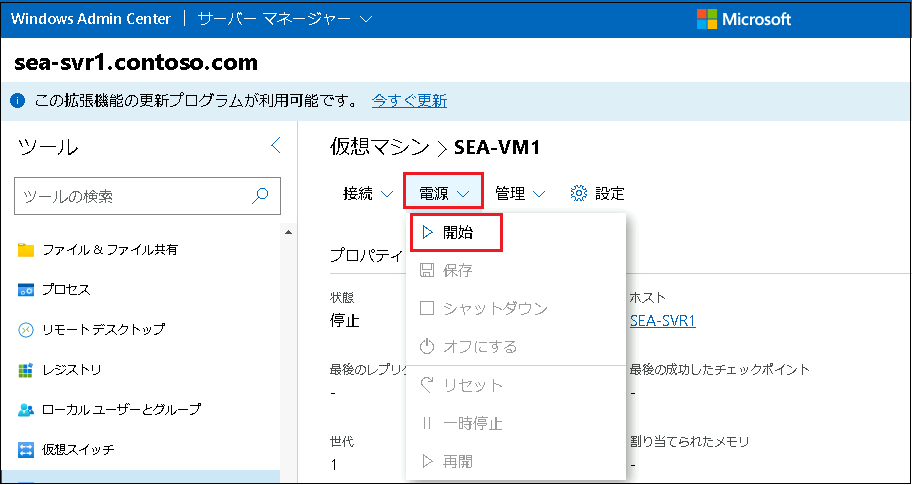

15.   **[プロパティ]** ウィンドウを下にスクロールして、実行中の VM の統計情報を監視できることを確認します。

16.  ブラウザを更新し、 **[電源] - [シャットダウン]** の順に選択し、 **[はい]** を選択して確認します。

17.  **SEA-VM1** の状態が **[停止]** になったことを確認します。

    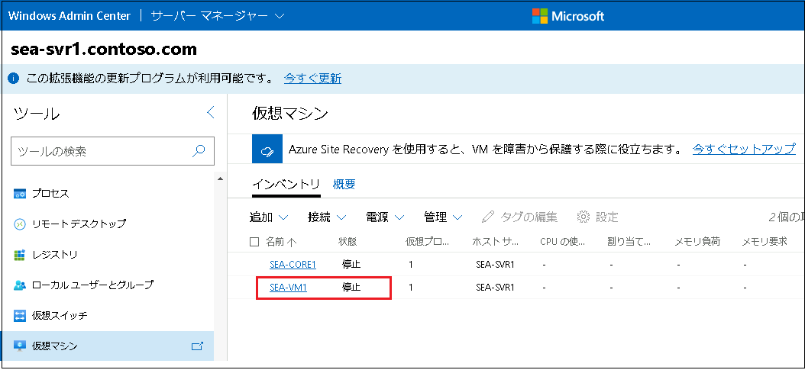

    

### <a name="exercise-1-results"></a>演習 1 の結果

**この演習が完了すると、Hyper-V マネージャーと Windows Admin Center を使用して、仮想スイッチ、仮想ハード ディスク、仮想マシンの管理したことになります。**

## <a name="exercise-2-installing-and-configuring-containers"></a>演習 2: コンテナーのインストールと構成

### <a name="scenario"></a>シナリオ

この演習では、Docker を使用して Windows コンテナーをインストールして実行します。 また、Windows Admin Center を使用してコンテナーを管理します。

この演習の主なタスクは次のとおりです。

1. Windows Server に Docker をインストールする
1. Windows コンテナーをインストールして実行する
1. Windows Admin Center を使用してコンテナーを管理する

#### <a name="task-1-install-docker-on-windows-server"></a>タスク 1: Windows Server に Docker をインストールする

1. **SEA-ADM1** の Windows Admin Center で、**sea-svr1.contoso.com** に接続している状態で、**[ツール]** メニューの一覧から、 **[ PowerShell ]** を選択します。プロンプトが表示されたら、 CONTOSO\Administratorのパスワード (Pa55w.rd) を入力し、Enter キーを押下します。

   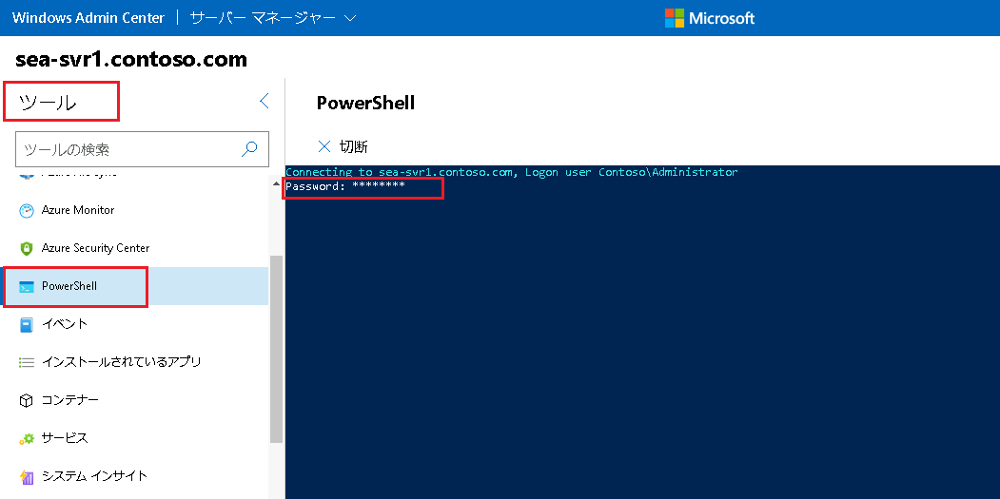

   > **注**: Windows Admin Center での PowerShell 接続は、ラボで使用される入れ子になった仮想化が原因で動作が遅くなる場合があります。ラボの動作が遅くなる場合は、**SEA-ADM1** の Windows Powershell コンソールから `Enter-PSSession -ComputerName SEA-SVR1` でリモート処理を実行する方法で 2番目以降の手順を実施しても構いません。

1. PowerShell コンソールで次のコマンドレットを実行して、TLS 1.2 を強制的に使用し、PowerShellGet モジュールをインストールします。 

   **※ラボを [拡張モード] でコマンドレットを実行するとエラーを返す場合があります。その際は、一度拡張モードを終了させてから再度コマンドレットを実行してください。**

   ```powershell
   [Net.ServicePointManager]::SecurityProtocol = [Net.ServicePointManager]::SecurityProtocol -bor [Net.SecurityProtocolType]::Tls12
   ```

   ```powershell
   Install-PackageProvider -Name NuGet -Force
   ```

   ```powershell
   Install-Module PowerShellGet -RequiredVersion 2.2.4 -SkipPublisherCheck
   ```

   

1.  プロンプトが表示されたら、 **[A]** キーを押してから Enter キーを押下します。

1. インストールが完了したら、次のコマンドレットを実行して、**SEA-SVR1** を再起動します。

   **※「セッション終了 : [接続] をクリックして再接続します。」というメッセージが表示されるまでコマンドを繰り返し実行してください。**

   ```powershell
   Restart-Computer -Force
   ```

1. **SEA-SVR1** が再起動した後、**PowerShell** ツールの **[ >< 接続]** をクリックして、**SEA-SVR1** への新しい PowerShell リモート処理セッションを確立します。CONTOSO\Administratorのパスワード (Pa55w.rd) を入力し、Enter キーを押下します。

   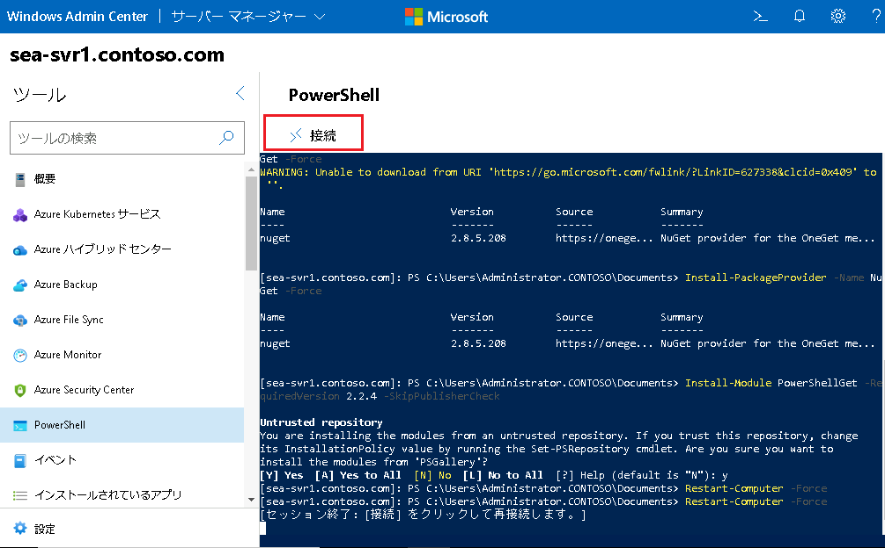

1.  Windows PowerShell コンソールで次のコマンドレットを実行し、 Docker Microsoft PackageManagement プロバイダーを **SEA-SVR1** にインストールします。

   ```powershell
   Install-Module -Name DockerMsftProvider -Repository PSGallery -Force
   ```

1. Windows PowerShell コンソールで次のコマンドレットを実行し、**SEA-SVR1** に Docker ランタイムをインストールします。

   **※エラーが返ってきたら、再度実行してください。**

   ```powershell
   Install-Package -Name docker -ProviderName DockerMsftProvider
   ```

1. 確認を求めるプロンプトが表示されたら、 **[A]** キーを押してから、Enter キーを押下します。

1. インストールが完了した後、次のコマンドを実行して **SEA-SVR1** を再起動します。

   **※「セッション終了 : [接続] をクリックして再接続します。」というメッセージが表示されるまでコマンドを繰り返し実行してください。**

   ```powershell
   Restart-Computer -Force
   ```

### <a name="task-2-install-and-run-a-windows-container"></a>タスク 2: Windows コンテナーをインストールして実行する

1. **SEA-SVR1** が再起動した後、PowerShell ツールを再度使用して、**SEA-SVR1** への新しい PowerShell リモート処理セッションを確立します。

1. Windows PowerShell コンソールで次のコマンドを実行し、インストールされた Docker のバージョンを確認します。

   ```powershell
   Get-Package -Name Docker -ProviderName DockerMsftProvider
   ```

1. 次のコマンドを実行して、現在 **SEA-SVR1** に存在する Docker イメージを特定します。 

   ```powershell
   docker images
   ```

   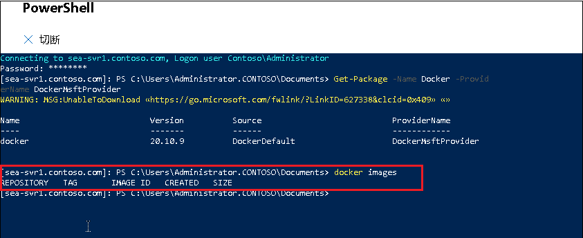

   > **注: ローカル リポジトリ ストアにイメージがないことを確認してください。**

1. 次のコマンドレットを実行し、オンラインの Microsoft リポジトリから Docker ベース イメージを一覧表示します。

   ```powershell
   docker search microsoft
   ```

   

1. 次のコマンドレットを実行し、インターネット インフォメーション サービス (IIS) インストールを含む Nano Server イメージをダウンロードします。

   **※エラーが返ってきたら、実行結果が得られるまでコマンドレットを実行してください。**

   ```powershell
   docker pull nanoserver/iis
   ```

   > **注: ダウンロードが完了するのにかかる時間は、ラボ VM から Microsoft コンテナー レジストリへのネットワーク接続の使用可能な帯域幅によって異なります。**

1. 次のコマンドレットを実行して、Docker イメージが正常にダウンロードされたことを確認します。

   ```powershell
   docker images
   ```

1. 次のコマンドを実行し、ダウンロードされたイメージに基づいてコンテナーを起動します。

   ```powershell
   docker run --isolation=hyperv -d -t --name nano -p 80:80 nanoserver/iis 
   ```

   > **注**: docker コマンドでは、(ホスト オペレーティング システムの非互換性の問題に対処する) Hyper-V 分離モードのコンテナーをバックグラウンド サービスとして起動し (`-d`)、コンテナー ホストのポート 80 がコンテナーのポート 80 にマップされるようにネットワークが構成されます。 

1. 次のコマンドを実行して、コンテナー ホストの IP アドレス情報を取得します。

   ```powershell
   ipconfig
   ```

   > **注**: vEthernet (nat) という名前のイーサネット アダプターの IPv4 アドレスを特定します。 これは、新しいコンテナーのアドレスです。 次に、**Ethernet** という名前のイーサネット アダプターの IPv4 アドレスを特定します。 これはホスト (**SEA-SVR1**) の IP アドレスであり、**172.16.10.12** に設定されています。

1. **SEA-ADM1** で、Microsoft Edge ウィンドウに切り替え、別のタブを開き、**http://172.16.10.12** に移動します。 ブラウザーに既定の IIS ページが表示されていることを確認します。

1. **SEA-ADM1** で、**SEA-SVR1** への PowerShell リモート処理セッションに戻り、**Windows PowerShell** コンソールで次のコマンドを実行し、実行中のコンテナーを一覧表示します。

   ```powershell
   docker ps
   ```
   > **注**: このコマンドは、**SEA-SVR1** で現在実行されているコンテナーに関する情報を提供するものです。 コンテナーを停止するために使用するため、コンテナー ID を記録します。 

1. 次のコマンドを実行して、実行中のコンテナーを停止します (`<ContainerID>` プレースホルダーは、前の手順で特定したコンテナー ID に置き換えてください)。

    ```powershell
    docker stop <ContainerID>
    ```

1. 次のコマンドを実行して、コンテナーが停止したことを確認します。

    ```powershell
    docker ps
    ```

#### <a name="task-3-use-windows-admin-center-to-manage-containers"></a>タスク 3: Windows Admin Center を使用してコンテナーを管理する

1. **SEA-ADM1** の Windows Admin Center で、**sea-svr1.contoso.com** の **[ツール]** メニューの **[コンテナー]** を選択します。 **PowerShell** セッションを閉じるように求められたら、 **[続行]** を選択します。
1. コンテナー ペインで、 **[要約]** 、 **[コンテナー]** 、 **[イメージ]** 、 **[ネットワーク]** 、 **[ボリューム]** の各タブを参照します。

### <a name="exercise-2-results"></a>演習 2 の結果

この演習が完了すると、Windows Server に Docker をインストールし、Web サービスを含む Windows コンテナー イメージをダウンロードして、その機能を確認したことになります。
