---
lab:
  title: 'ラボ: Azure VM での Windows Server のデプロイと構成'
  module: 'Module 6: Deploying and Configuring Azure VMs'
---

# <a name="lab-deploying-and-configuring-windows-server-on-azure-vms"></a>ラボ: Azure VM での Windows Server のデプロイと構成

## <a name="scenario"></a>シナリオ

Windows Server ベースのワークロードを実行している Azure VM に追加で適用する必要がある制御に関して、運用モデルが古いため、自動化の使用が限定的であるなど、セキュリティ チームの懸念があります。 あなたは、Windows Server で実行されている Azure VM の自動デプロイと構成プロセスを開発して実装することにしました。

このプロセスには、Azure VM 拡張機能を使用した Azure Resource Manager (ARM) テンプレートと OS 構成が必要です。 また、AppLocker によるアプリケーション許可リスト、ファイルの整合性チェック、アダプティブ ネットワークまたは DDoS 保護など、オンプレミス システムに既に適用されている以外の追加のセキュリティ保護メカニズムも組み込まれます。 今回は、JIT 機能を利用して、Azure VM への管理アクセスをロンドン本社に関連付けられているパブリック IP アドレス範囲に制限することとしました。

## <a name="objectives"></a>目標

このラボを完了すると、次のことができるようになります。

- Azure VM デプロイ用の ARM テンプレートを作成する。
- VM 拡張機能ベースの構成を含むように ARM テンプレートを変更する。
- ARM テンプレートを使用して Windows Server を実行している Azure VM をデプロイする。
- Windows Server を実行している Azure VM への管理アクセスを構成する。
- Azure VM で Windows Server のセキュリティを構成する。
- Azure 環境をプロビジョニング解除する。

## <a name="estimated-time-90-minutes"></a>予想所要時間: 45 分

## <a name="lab-setup"></a>ラボのセットアップ

仮想マシン: **SEA-DC1** および **AZ-800T00A-ADM1** を使用します。

1. **SEA-ADM1** を選択します。
1. 次の資格情報を使用してサインインします。

   - ユーザー名: **Administrator**
   - パスワード: **Pa55w.rd**
   - ドメイン: **CONTOSO**

このラボでは、 仮想マシンと Azure サブスクリプションを使用します。

## <a name="exercise-1-authoring-arm-templates-for-azure-vm-deployment"></a>演習 1: Azure VM デプロイ用の ARM テンプレートの作成

### <a name="scenario"></a>シナリオ

Azure ベースの操作を効率化するために、Azure VM への Windows Server の自動デプロイと構成プロセスを開発して実装することにしました。 デプロイは、情報セキュリティ チームの要件に準拠し、高可用性を含む Contoso, Ltd. の意図されたターゲット運用モデルに準拠する必要があります。

この演習の主なタスクは次のとおりです。

1. Azure サブスクリプションに接続し、Microsoft Defender for Cloud のセキュリティ強化を有効にする。
1. Azure portal を使用して ARM テンプレートとパラメーター ファイルを生成する。
1. Azure portal を使用して ARM テンプレートとパラメーター ファイルをダウンロードする。

### <a name="task-1-connect-to-your-azure-subscription-and-enable-enhanced-security-of-microsoft-defender-for-cloud"></a>タスク 1: Azure サブスクリプションに接続し、Microsoft Defender for Cloud のセキュリティ強化を有効にする

このタスクでは、Azure サブスクリプションに接続し、Microsoft Defender for Cloud のセキュリティ強化機能を有効にします。

1. **SEA-ADM1** に接続し、必要に応じて、パスワード **Pa55w.rd** を使用し、**CONTOSO\\Administrator** としてサインインします。

1. **SEA-ADM1** で Microsoft Edge を起動し、Azure portal('https;//portal.azure.com')に移動します。このラボで使用するサブスクリプションの所有者ロールを持つユーザー アカウントの資格情報を使用してサインインします。(資格情報は、ラボの **[Home]** タブ内で提供されているものを使用してください。)

   ※Azure Portal にサインイン後は、必要に応じ、右上の歯車マーク(設定)画面から、言語設定を日本語に変更できます。

3. Azure portal の **[リソース、サービス、およびドキュメントの検索]テキスト ボックス**のツール バーで、**Microsoft Defender for Cloud**を検索して選択します。

   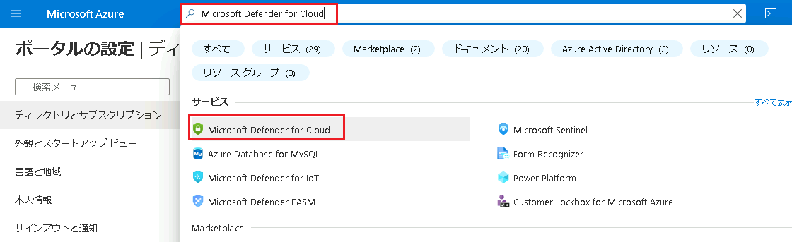

4.  **[Microsoft Defender for Cloud | はじめに]** ページで、**[アップグレード]** を選択し、 **[エージェントのインストール]** をクリックします。 **[エージェントのインストールが開始されました]** という通知メッセージが表示されたら、タスク2に進んでください。

   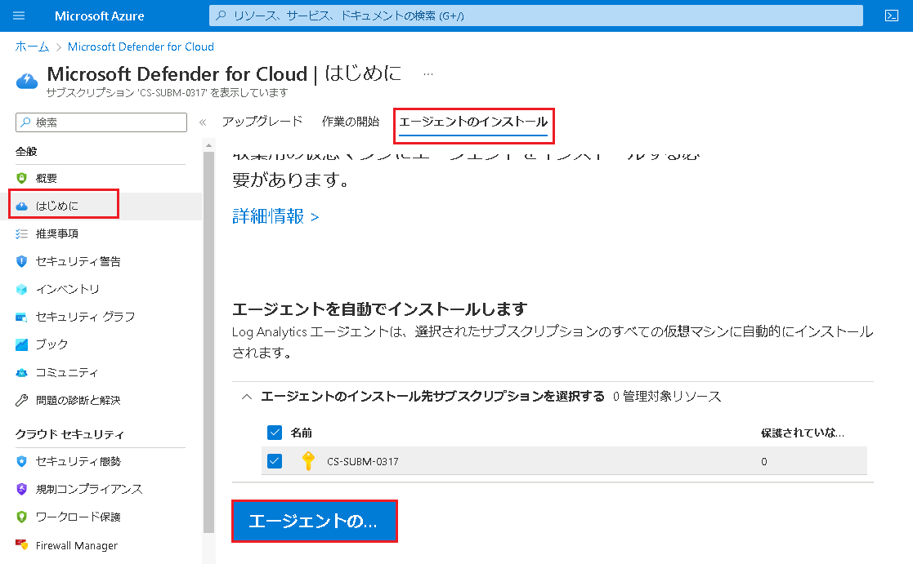

   > **注: 本コースのラボでは通常、Azure サブスクリプションで Microsoft Defender for Cloud は既に有効化されているため、以下の手順は不要です。[エージェントのインストール] タブで、 [エージェントのインストール] ボタンがグレーアウトされている場合は、有効化済みのため、タスク2に進んでください。但し、[Microsoft Microsoft Defender for Cloud | はじめに] の画面で [エージェントのインストール] がグレーアウトされずに表示された場合は、インストールし、有効化する必要があります。**

### <a name="task-2-generate-an-arm-template-and-parameters-files-by-using-the-azure-portal"></a>タスク 2: Azure portal を使用して ARM テンプレートとパラメーター ファイルを生成する

1.  **SEA-ADM1** のAzure portal で、ツールバーの  **[リソース、サービス、およびドキュメントの検索]** テキスト ボックスで、 **[Virtual machines]** を検索して選択します。

   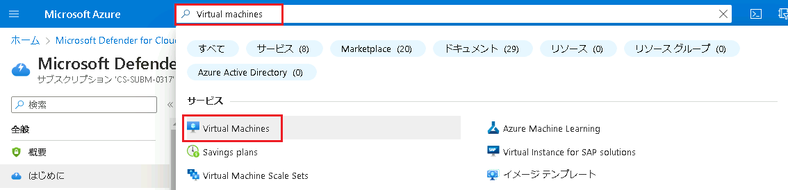

   

1.  **[仮想マシン]** ページで、 **[ + 作成]** を選択し、 **[ Azure 仮想マシン]** を選択します。

   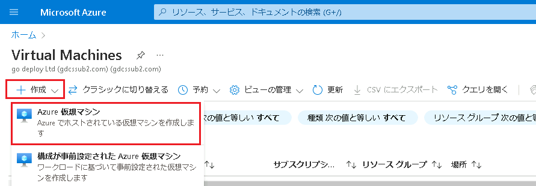

   

3.  **[仮想マシンの作成]** ページの **[基本]** タブで、次の設定を指定します。指示がないものは規定値のままで構いません。

   > **注 : このタスクでは仮想マシンの作成はしません。 [確認および作成] はクリックしないでください。**

|設定|値|
|---|---|
|サブスクリプション|予め設定されたものを使用してください|
|リソース グループ|**AZ800-L060** をプルダウンから選択してください|
|仮想マシン名|**az800l06-vm0**|
|リージョン|**East US (米国東部)**|
|可用性のオプション|**インフラストラクチャの冗長性は必要ありません**|
|セキュリティの種類|**Standard**|
|イメージ|**Windows Server 2022 Datacenter: Azure Edition - Gen2**|
|Azure スポット割引で実行する|**チェックしない**|
|サイズ|**Standard_D2s_v3**|
|ユーザー名|**Student**|
|パスワード|**Pa55w.rd1234**|
|パブリック受信ポート|**なし**|
|既存の Windows Server ライセンスを使用しますか|**チェックしない**|


4.  **[次へ: ディスク > ]** を選択し、**[仮想マシンの作成]** ページの **[ディスク]** タブで次の設定を指定し、その他の設定はすべて既定値のまま、**[次 : ネットワーク]** をクリックします。

   | 設定              | 値                                       |
   | ----------------- | ---------------------------------------- |
   | OS ディスクの種類 | **Standars HDD(ローカル冗長ストレージ)** |

5.  **[仮想マシンの作成]** ページの **[ネットワーク]** タブで、**[仮想ネットワーク]** テキスト ボックスの下にある、 **[新規作成]** をクリックします。

   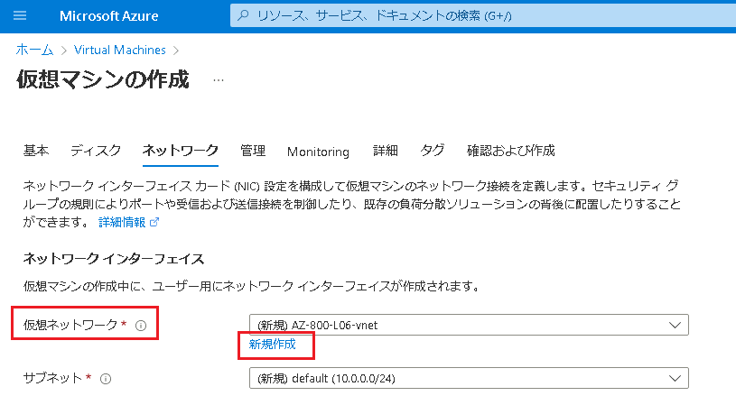

   

6.  **[仮想ネットワークの作成]** ページで、次の設定を指定し **[ OK ]** をクリックします。※指示がないものは規定値のままで構いません。

   | 設定           | 値                |
   | -------------- | ----------------- |
   | 名前           | **az800l06-vnet** |
   | アドレス空間   | **10.60.0.0/20**  |
   | サブネット名   | **subnet0**       |
   | サブネット範囲 | **10.60.0.0/24**  |

   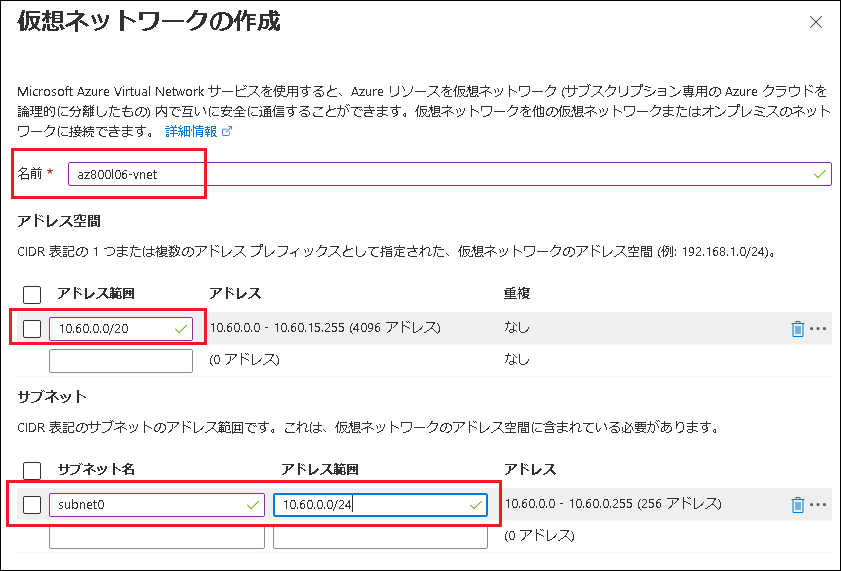

   

7.  **[仮想マシンの作成]** ページに戻り、 **[ネットワーク]** タブで次の設定を指定します。指示がないものは規定値のままで構いません。設定を確認したら、 **[次 :  管理]** をクリックします。

   | 設定                                   | 値                 |
   | -------------------------------------- | ------------------ |
   | パブリック IP                          | **なし**           |
   | NIC ネットワーク セキュリティ グループ | **なし**           |
   | 高速ネットワークを有効にする           | **チェックを外す** |


8.  **[管理]** ページでは規定値のまま、 **[次 : Minitoring(監視)]** をクリックします。

9.  **[監視]** では、次の設定を指定します。指示がないものは規定値のままで構いません。

   | 設定                              | 値                                                           |
   | --------------------------------- | ------------------------------------------------------------ |
   | **ブート診断 (Boot diagnostics)** | **マネージドストレージアカウントで有効にする(推奨) (Enable with managed storage account (recommended))** |

>**注:  仮想マシンはまだ作成しないでください。 ここまで設定が完了したら、演習2でテンプレートを使用して仮想マシンを作成するため、そのままタスク3に進んでください。**

### <a name="task-3-download-the-arm-template-and-parameters-files-from-the-azure-portal"></a>タスク 3: Azure portal から ARM テンプレートとパラメーター ファイルをダウンロードする

1. **[仮想マシンの作成]** ページの **[確認と作成]** をクリックします。**[仮想マシンの作成]** ページにある、 **[Automationのテンプレートをダウンロードする]** をクリックします。

   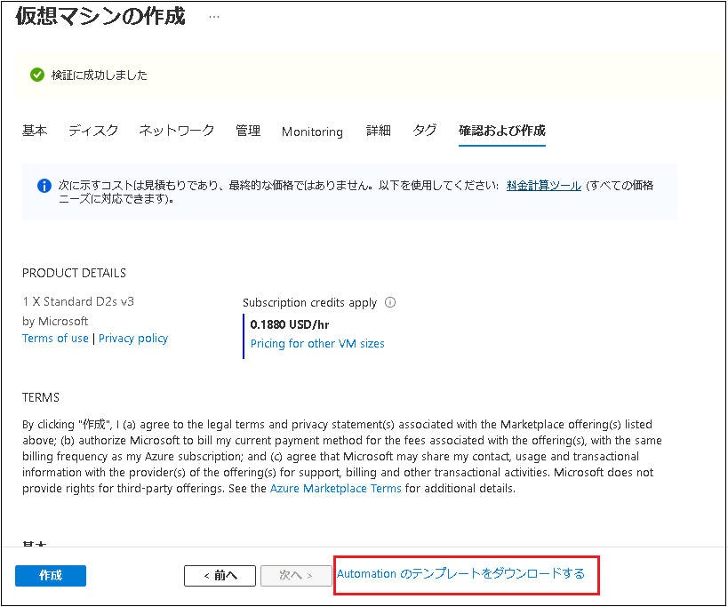

2.  **[テンプレート]** ページで、**[ダウンロード]** をクリックします。

   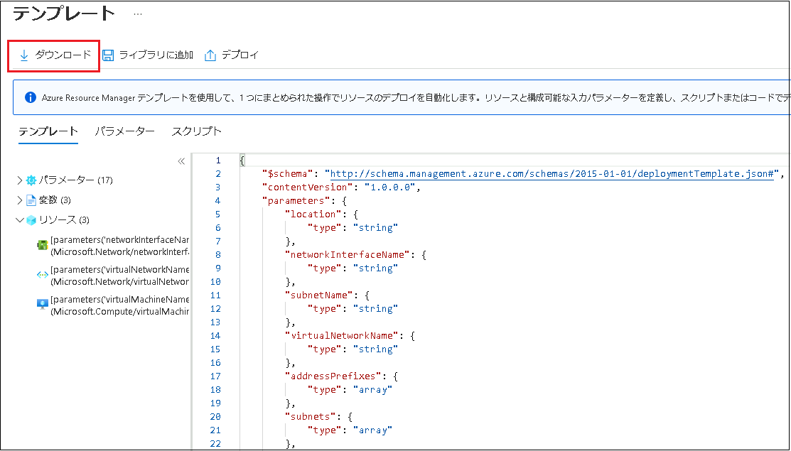


3. ブラウザに上部に表示される、**[template.zip]** の横にある省略記号ボタンを選択し、ポップアップ メニューで **[ Show in folder ]** を選択します。

   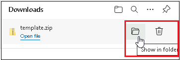

4. ファイルエクスプローラーが開いたら、 **template.zip** を **SEA-ADM1** の **C:\Labfiles\Lab06** フォルダーにコピーします。

   > **注 : C:\Labfiles\配下に、Lab06フォルダーがない場合は、新規作成してください。**

5. Azure Portal の  **[テンプレート]** ページから **[仮想マシンの作成]** ページに戻ります。仮想マシンは作成せずに、×で閉じて構いません。

## <a name="exercise-2-modifying-arm-templates-to-include-vm-extension-based-configuration"></a>演習 2: VM 拡張機能ベースの構成を含むように ARM テンプレートを変更する

### <a name="scenario"></a>シナリオ

Azure リソースのデプロイの自動化に加えて、Azure VM で実行されている Windows サーバーを自動的に構成することができます。 ここでは、Azure カスタム スクリプトの拡張機能をテストします。

この演習の主なタスクは次のとおりです。

1. Azure VM デプロイ用の ARM テンプレートとパラメーターのファイルを確認する。
1. 既存のテンプレートに Azure VM 拡張機能セクションを追加する。

### <a name="task-1-review-the-arm-template-and-parameters-files-for-azure-vm-deployment"></a>タスク 1: Azure VM デプロイ用の ARM テンプレートとパラメーターのファイルを確認する

1.  **SEA-ADM1** でファイル エクスプローラーを起動し、**C:\Labfiles\Lab06** フォルダーを参照します。

1.  **template.zipファイル** を解凍し、以下2つのファイルを**C:\Labfiles\Lab06** に格納します。

   **・parameters.json**

   **・template.json**

1.  **template.jsonファイル**をメモ帳で開き、その内容を確認します。メモ帳は開いたままにします。

1.  C:\Labfiles\Lab06\ 配下にある、 **parameters.json ファイル** をメモ帳で開き、内容を確認したら、メモ帳を閉じます。

### <a name="task-2-add-an-azure-vm-extension-section-to-the-existing-template"></a>タスク 2: 既存のテンプレートに Azure VM 拡張機能セクションを追加する

1. ラボ VM の **template.json** ファイルの内容が表示されているメモ帳ウィンドウで、`    "resources": [` 行の直後に、次のコードをコピーして挿入します。

   >**注:intellisense 行ごとにコードを貼り付けるツールを使用している場合は、検証エラーを引き起こす余分な角かっこが追加される可能性があります。 コードを最初にメモ帳に貼り付け、次に JSON ファイルに挿入することをお勧めします。**

   ```json
        {
           "type": "Microsoft.Compute/virtualMachines/extensions",
           "name": "[concat(parameters('virtualMachineName'), '/customScriptExtension')]",
           "apiVersion": "2018-06-01",
           "location": "[resourceGroup().location]",
           "dependsOn": [
               "[concat('Microsoft.Compute/virtualMachines/', parameters('virtualMachineName'))]"
           ],
           "properties": {
               "publisher": "Microsoft.Compute",
               "type": "CustomScriptExtension",
               "typeHandlerVersion": "1.7",
               "autoUpgradeMinorVersion": true,
               "settings": {
                   "commandToExecute": "powershell.exe Install-WindowsFeature -name Web-Server -IncludeManagementTools && powershell.exe remove-item 'C:\\inetpub\\wwwroot\\iisstart.htm' && powershell.exe Add-Content -Path 'C:\\inetpub\\wwwroot\\iisstart.htm' -Value $('Hello World from ' + $env:computername)"
              }
           }
        },
   ```
1. ファイルを上書き保存して閉じます。

## <a name="exercise-3-deploying-azure-vms-running-windows-server-by-using-arm-templates"></a>演習 3: ARM テンプレートを使用して Windows Server を実行している Azure VM をデプロイする

### <a name="scenario"></a>シナリオ

演習2で構成したARM テンプレートを使用して、Azure サブスクリプションへのVMのデプロイを実行し、機能を確認します。

この演習の主なタスクは次のとおりです。

1. ARM テンプレートを使用して Azure VM をデプロイする。
1. Azure VM のデプロイの結果を確認する。

### <a name="task-1-deploy-an-azure-vm-by-using-an-arm-template"></a>タスク 1: ARM テンプレートを使用して Azure VM をデプロイする

1. **SEA-ADM1** の Azure portal に戻り、のツール バーにある **[リソース、サービス、およびドキュメントの検索]** テキスト ボックスで、 **[カスタム テンプレートのデプロイ]** を検索して選択します。

   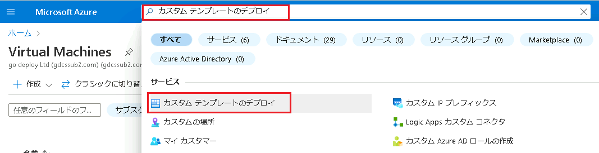

   

1.  **[カスタム デプロイ]** ページで、 **[エディターで独自のテンプレートを作成する]** を選択します。

   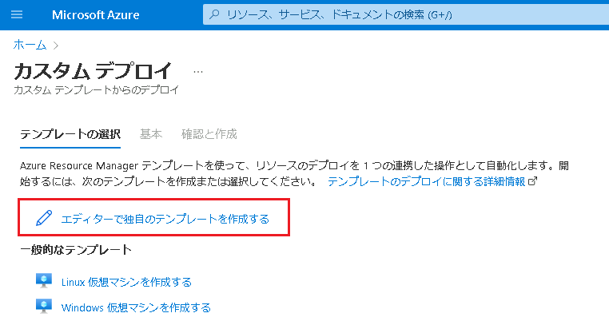

3.  **[テンプレートの編集]** ページで、 **[ファイルの読み込み]** を選択し、前の演習で編集したテンプレート ファイル **template.json** をアップロードして、 **[保存]** を選択します。

   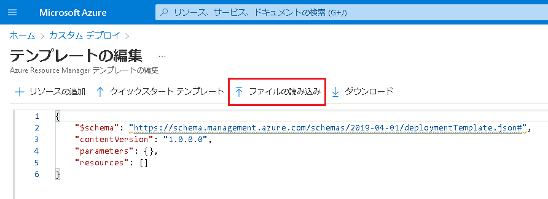


4.  **[カスタム デプロイ]** ページで、 **[パラメーターの編集]** をクリックします。

   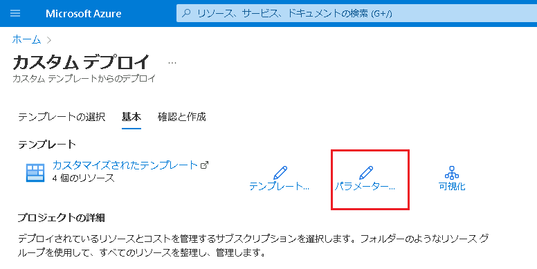


5.  **[パラメーターの編集]** ページで、 **[ファイルの読み込み]** を選択し、前の演習で確認したパラメーター ファイル **parameters.json** をアップロードして、 **[保存]** をクリックします。

6.  **[カスタム展開]** ページに戻り、次の設定を指定し、**[確認と作成]** をクリックします。指示がないものは規定値のままで構いません。

   | 設定                             | 値                                               |
   | -------------------------------- | ------------------------------------------------ |
   | サブスクリプション               | **設定済みのものを使用してください**             |
   | リソース グループ                | **プルダウンから、AZ-800-L06を選択してください** |
   | リージョン                       | **(US)East US もしくは米国東部**                 |
   | 管理者パスワード(Admin Password) | **Pa55w.rd1234**                                 |

7.  **[作成]** をクリックします。

>**注: デプロイには約 10 分かかります。**

8. デプロイが正常に完了したことを確認したら、タスク2に進んでください。

   

### <a name="task-2-review-results-of-the-azure-vm-deployment"></a>タスク 2: Azure VM のデプロイの結果を確認する

1. Azure portal のツール バーにある **[リソース、サービス、およびドキュメントの検索]** テキスト ボックスで、 **[リソース グループ]** を検索して選択します。

   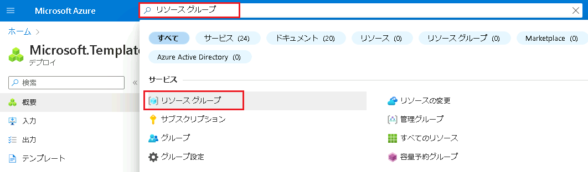


2.  **[リソース グループ]** ページで、**AZ-800-L06** を選択します。

3. **AZ-800-L06** の **[概要]** ページで、**Azure VM az800l06-vm0** を含むリソースの一覧を確認します。

   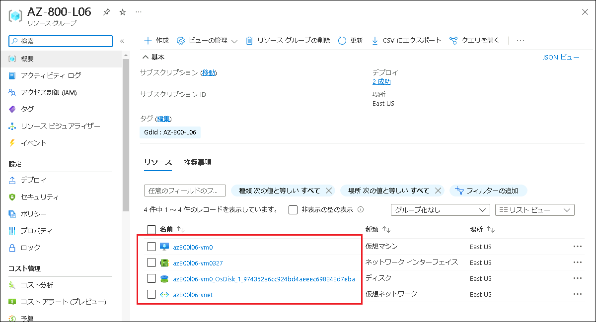

4. リソースの一覧で、**az800l06-vm0** を選択します。

5.  **az800l06 -vm0 ページ**で **[拡張機能とアプリケーション]** を選択し、拡張機能の一覧で**customScriptExtension** が正常にプロビジョニングされていることを確認します。

   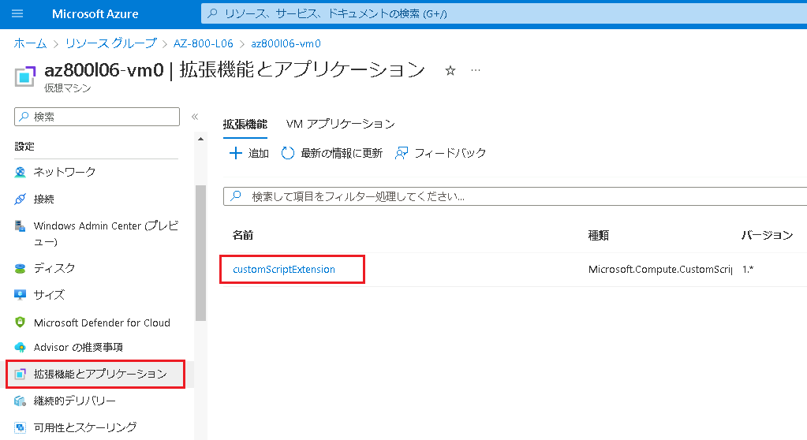


6.  **AZ-800-L06 ページ**に戻り、 **[設定]** セクションで **[デプロイ]** を選択します。

   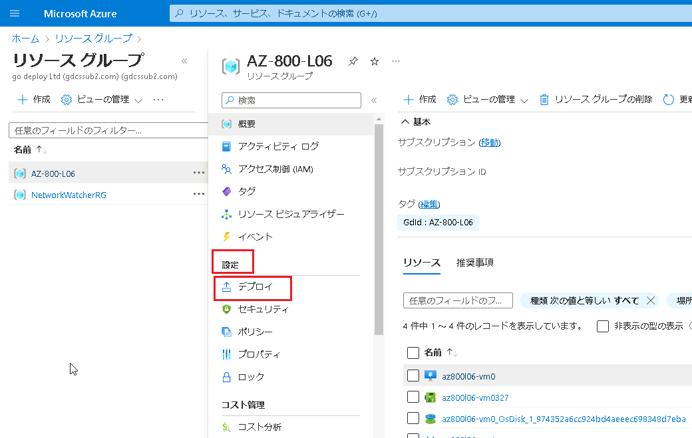


7.  **AZ -800-L06について | [デプロイ] ページ** で、**Microsoft.Template** リンクを選択します。

   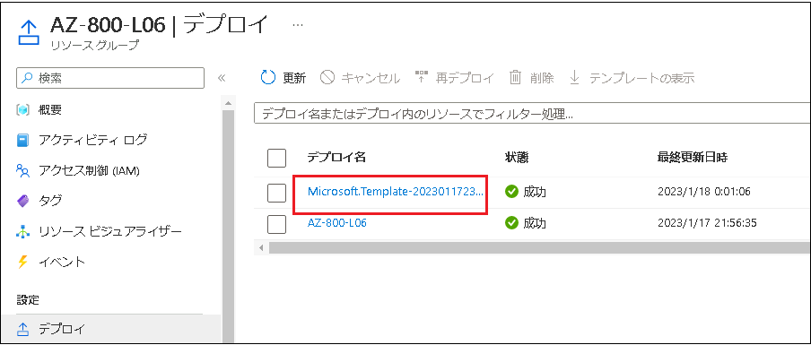


8. **Microsoft.Template の | [概要]ページ** で **[テンプレート]** を選択します。テンプレートの内容は、デプロイに使用したテンプレート (temprate.json) と同じであることが確認できます。

   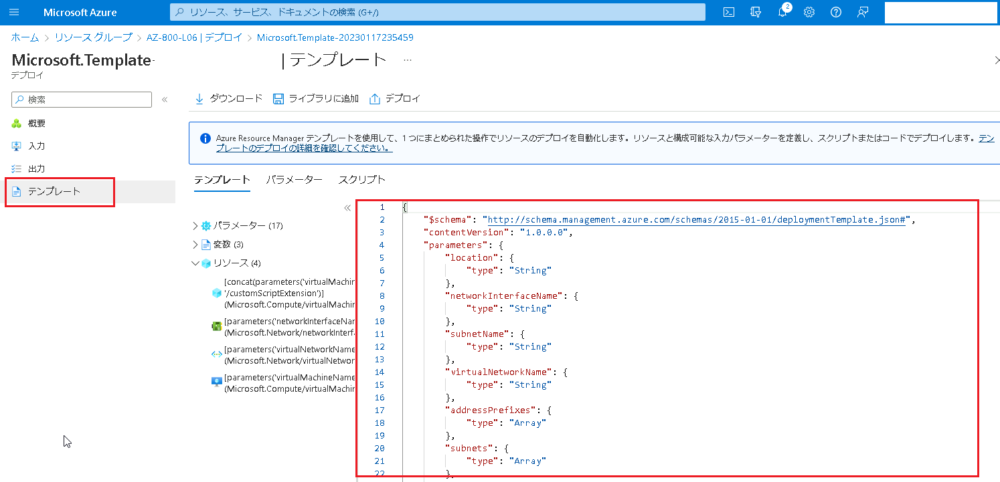

9. テンプレートを確認したら、×で閉じて構いません。

## <a name="exercise-4-configuring-administrative-access-to-azure-vms-running-windows-server"></a>オプション: Windows Server を実行している Azure VM への管理アクセスの構成

### <a name="scenario"></a>シナリオ

Azure VM が Windows Server を実行している状態で、オンプレミスの管理端末からリモートで管理する機能をテストする必要があります。

この演習の主なタスクは次のとおりです。

1. Azure Microsoft Defender for Cloud の状態を確認する。

2.  Just-In-Time VM アクセスの設定を確認する。

### <a name="task-1-verify-the-status-of-azure-microsoft-defender-for-cloud"></a>タスク 1: Azure Microsoft Defender for Cloud の状態を確認する

1. Azure portal のツール バーにある **[リソース、サービス、およびドキュメントの検索]** テキスト ボックスで、**Microsoft Defender for Cloud** を検索し、選択します。

1. Microsoft Defender for Cloudの **[概要]** ページで、ナビゲーションペインの **[管理]** セクションで、 **[環境設定]** を選択します。

   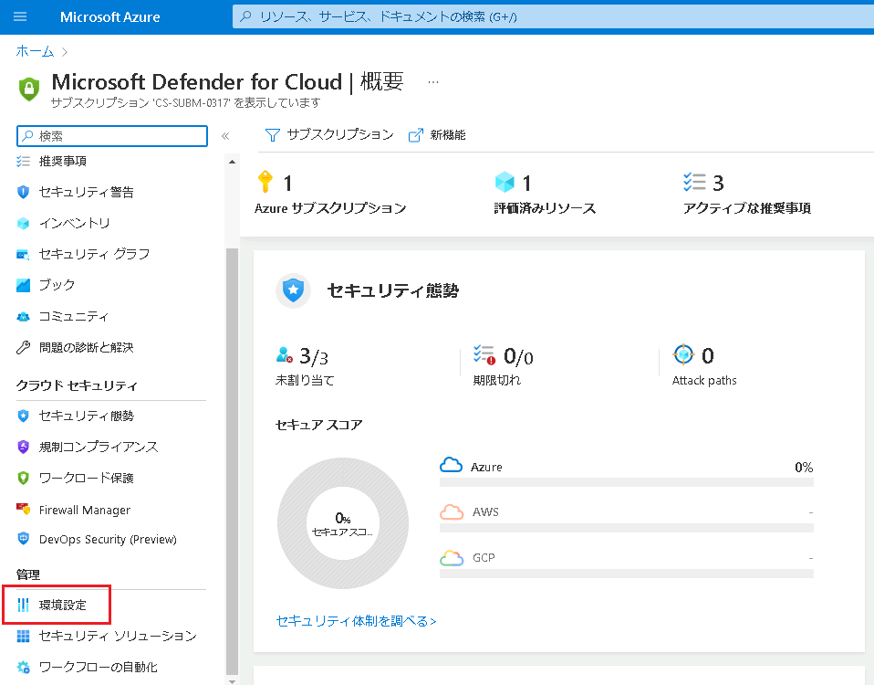


3.  **[環境設定]** ページで、Azure サブスクリプションを表すエントリを選択します。

   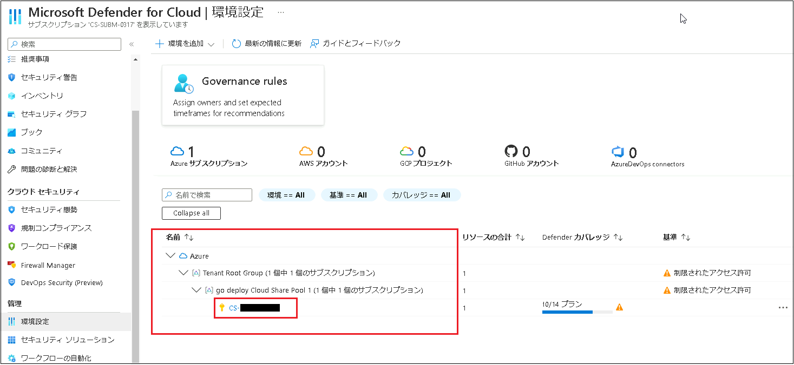


4. **設定| [ Defender プラン]** ページで、**[状態]** が すべて **[オン]** になっていることを確認し、×で閉じます。

   > **注 : [状態] がすべて [オン] になっていない場合は、[すべて有効にする] をクリックした後、[保存] を選択してください。**

### <a name="task-2-review-the-just-in-time-vm-access-settings"></a>タスク2 : Just-In-Time VM アクセスの設定を確認する

1.  **Microsoft Defender for Cloud** の **[概要]** ページに戻り、**[クラウド セキュリティ]** セクションで **[ワークロード保護]** を選択します。

   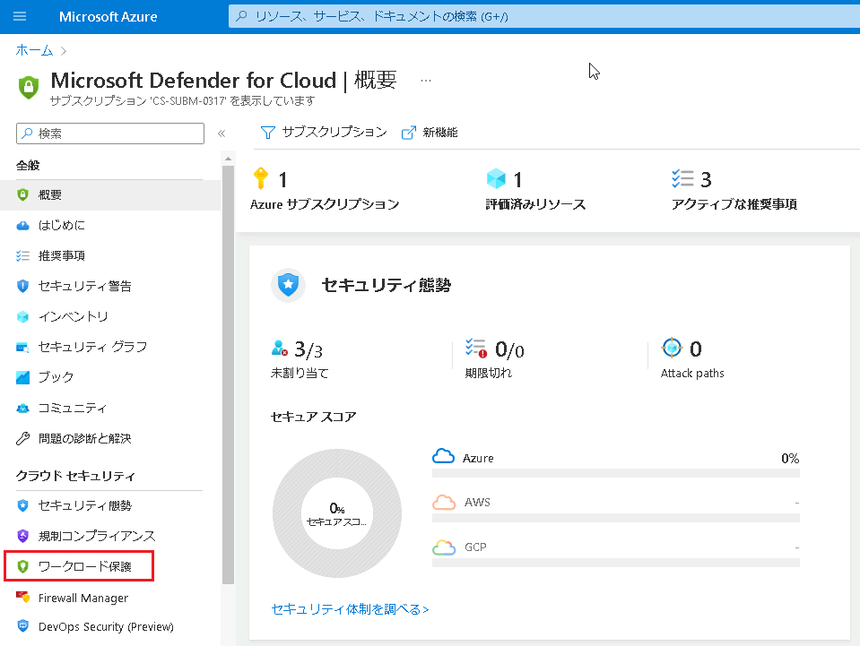

1. **Microsoft Defender for Cloud | [ワークロードの保護]** ページを下にスクロールし、**[ジャストインタイムの VM アクセス]** をクリックします。

   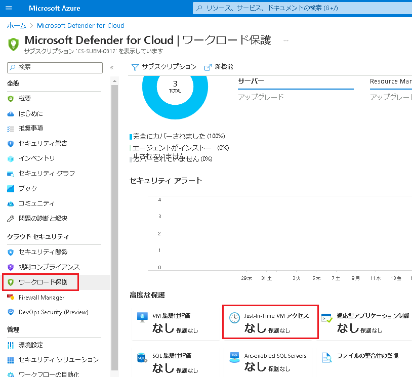

1. **[Just In Time VM アクセス]** ページで、**[構成済み]**、**[未構成]**、**[サポート対象外]** のタブを確認します。

   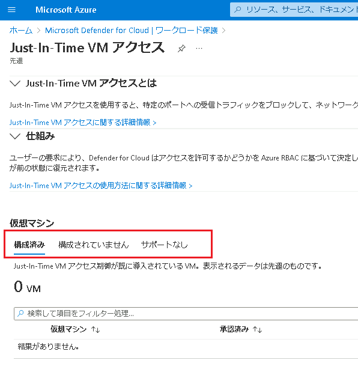

   >**注: 新しくデプロイされた VM が [サポート対象外] タブに表示されるまで、最大で 24 時間かかる場合があります。結果を待たずに、次の演習に進んでください。**

## <a name="exercise-5-configuring-windows-server-security-in-azure-vms"></a>オプション: Azure VM での Windows Server のセキュリティの構成

### <a name="scenario"></a>シナリオ

Azure VM が Windows Server を実行している状態で、オンプレミスの管理ワークステーションからリモートで管理する機能をテストする必要があります。

この演習の主なタスクは次のとおりです。

1. NSG を作成して構成する。
1. Azure VM への受信 HTTP アクセスを構成する。
1. Azure VM の JIT 状態の再評価をトリガーする。
1. JIT VM アクセス経由で Azure VM に接続する。

### <a name="task-1-create-and-configure-an-nsg"></a>**タスク 1: NSG を作成して構成する**

1. Azure portal のツール バーにある **[リソース、サービス、およびドキュメントの検索]** テキスト ボックスで、 **[ネットワーク セキュリティ グループ]** を検索、選択します。

1.  **[ネットワーク セキュリティ グループ]** ページで、 **[ + 作成]** をクリックします。

   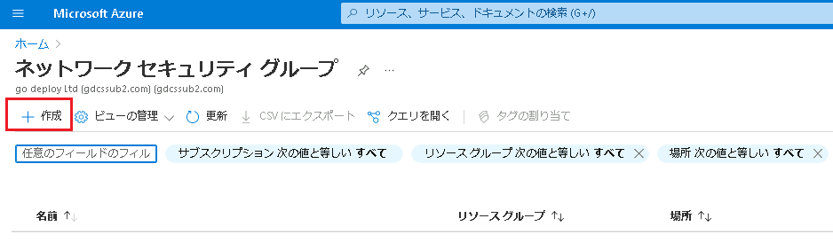

1.  **[ネットワーク セキュリティ グループの作成]** ページの **[基本]** タブで、次の設定を指定し、[確認および作成] をクリックします。指示がないものは規定値のままで構いません。

   |設定|値|
   |---|---|
   |サブスクリプション|**設定済みのものを使用してください**|
   |リソース グループ|**プルダウンから AZ-800-L06 を選択してください**|
   |名前|**az800l06-vm0-nsg1**|
   |リージョン (地域)|**East US (米国東部)**|

1.  [作成] をクリックし、NSGを作成します。

1. Azure portal でリソースグループの **AZ-800-L06** ページ に戻り、リソースの一覧で、新しく作成されたネットワーク セキュリティ グループ **az800l06-vm0-nsg1** を選択します。

   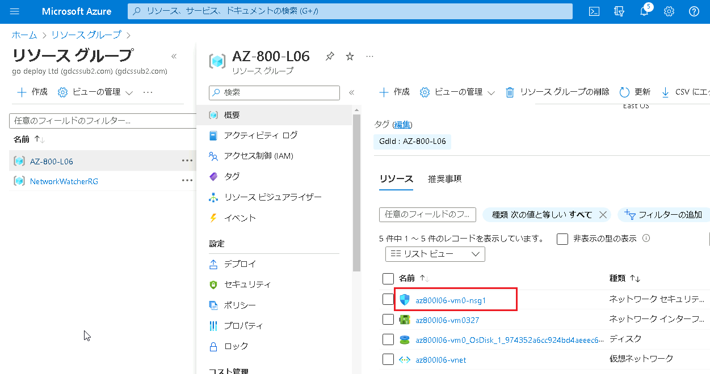

1.  **az800l06 -vm0-nsg1 ページ** で、既定の受信および送信セキュリティ規則の一覧を確認した後、左のナビゲーションペインの一覧の **[設定]** から **[受信セキュリティ規則]** を選択します。

   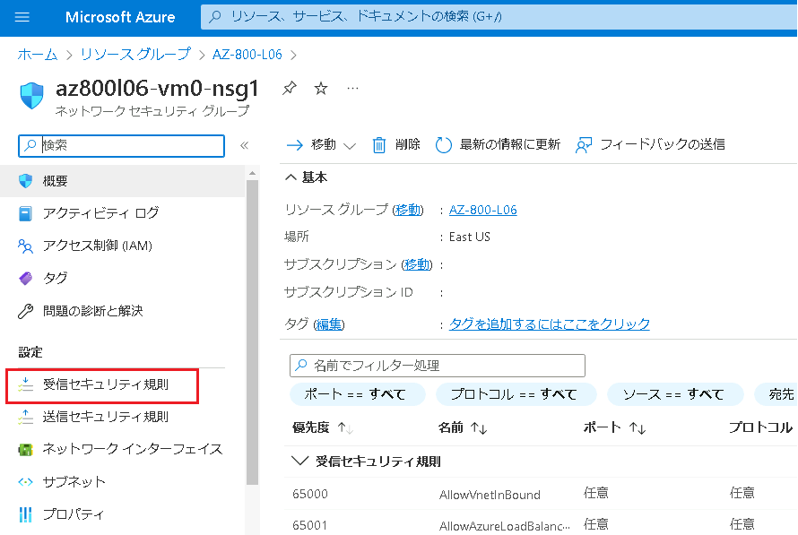

1.  **az800l06 -vm0-nsg1 | [受信セキュリティ規則] ページ**で、 **[ + 追加]** をクリックします。

   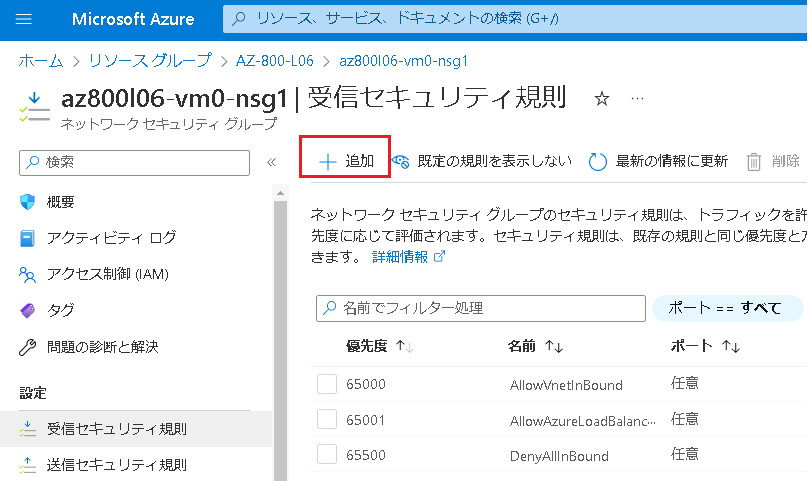

1.  **[受信セキュリティ規則の追加]** ページで、次の設定を指定し **[追加]** をクリックします。指示がないものは規定値のままで構いません。

   |設定|値|
   |---|---|
   |ソース|**Any**|
   |ソースポート範囲|*|
   |宛先|**Any**|
   |サービス|**HTTP**|
   |アクション|**許可**|
   |優先度|**300**|
   |名前|**AllowHTTPInBound**|


### <a name="task-2-configure-inbound-http-access-to-an-azure-vm"></a>タスク 2: Azure VM への受信 HTTP アクセスを構成する

1. Azure portal で **リソースグループ AZ-800-L06 ページ** に戻り、リソースの一覧で **Azure VM az800l06-vm0** を 選択します。

1.  **az800l06 -vm0 ページ** で、 **[ネットワーク]** を選択します。

   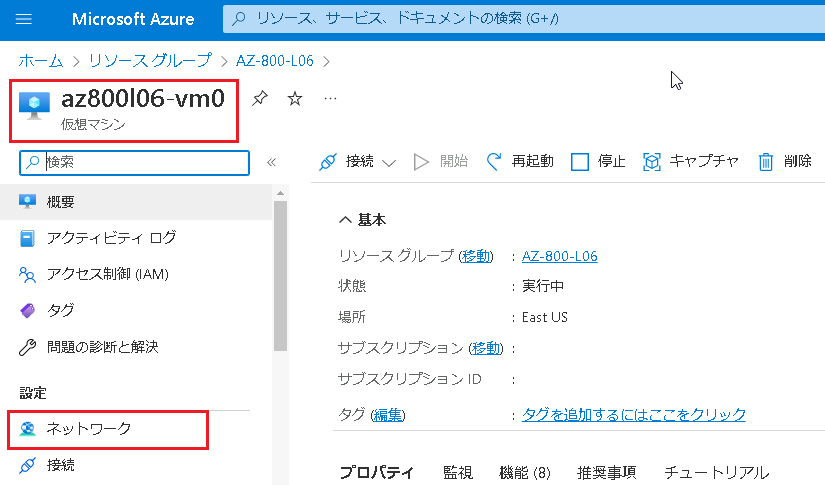

1.  **az800l06 -vm0 | ネットワーク ページ** で、**az800l06-vm0** に接続されているネットワーク インターフェイスを指定するリンクを選択します。

   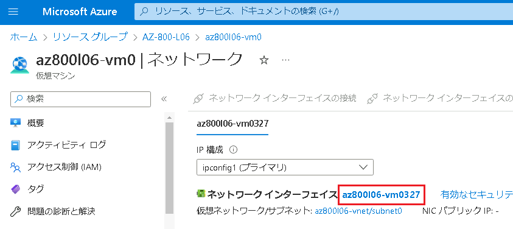

   

1.  ネットワーク インターフェイス ページの左ナビゲーションペインの一覧の **[設定]**セクションで、 **[ネットワーク セキュリティ グループ]** を選択します。

   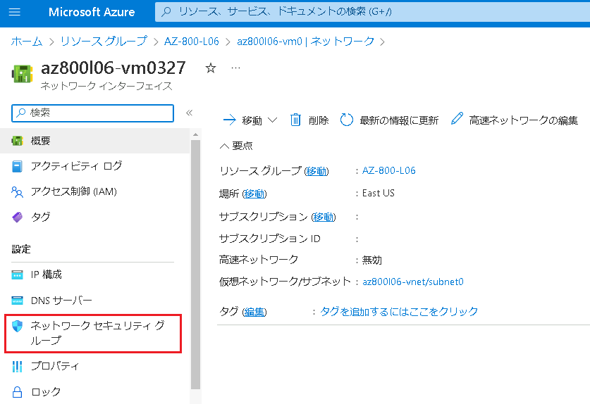

1.  **[ネットワーク セキュリティ グループ]** ページのドロップダウン リストで、**az800l06-vm0-nsg1** を選択し、 **[保存]** をクリックします。

1. ネットワーク インターフェイスのプロパティが表示されているページに戻り、左ナビゲーションペインの一覧から **[ IP 構成]** を選択し、**ipconfig1** をクリックします。

   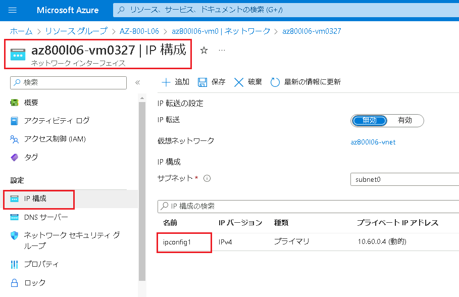

1.  **ipconfig1** ページ の **[ パブリックIPアドレス ]** セクションで スライダーを [関連付け] に変更し、**[パブリックIPアドレス]** の ドロップダウンの下にある **[新規作成]** をクリックします。

   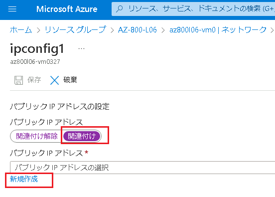

   

1.  **[パブリック IP アドレスの追加]** ウィンドウで、次の設定を指定し、 **[ OK ]** を選択します。

   | 設定     | 値                    |
   | -------- | --------------------- |
   | 名前     | **az800l06-vm0-pip1** |
   | SKU      | Basic                 |
   | 割り当て | **動的**              |

   

1. **ipconfig1 ページ** に戻り、 **[保存]** をクリックします。

   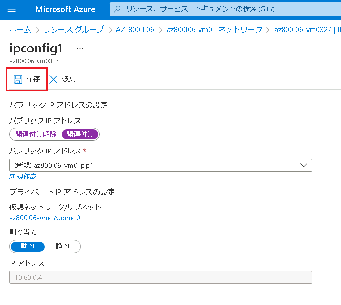

1. ネットワーク インターフェイスのプロパティが表示されているページに戻り、 **[概要]** を選択した後、ネットワークインターフェイスに設定されているパブリックIPアドレスを確認します。

1. ブラウザーで別のタブを開き、前の手順で確認したパブリック IP アドレスを参照します。Web ページが開き、**az800l06-vm0**  からの  **Hello World** が表示されていることを確認します。

1. ラボ コンピューターからリモート デスクトップ アプリ(mstsc.exe)を起動し、同じ前の手順と同様に、パブリック IP アドレスに接続ができるか確認します。※接続は失敗しますが、ポート 80 を閉じているため想定内です。

### <a name="task-3-trigger-re-evaluation-of-the-jit-status-of-an-azure-vm"></a>タスク 3: Azure VM の JIT 状態の再評価をトリガーする

>**注: このタスクは、Azure VM の JIT 状態の再評価をトリガーするために必要です。 実際に設定が反映されるまでに、最大 24 時間かかる場合があります。**

1. Azure portal でリソースグループ **AZ-800-L06 ページ** に戻り、リソースの一覧から、 **Azure VM az800l06-vm0** を選択します。
1. **[az800l06-vm0]** ページの左ナビゲーションペイン一覧から、**[構成]** を選択します。 
1. **[az800l06-vm0 \| 構成]** ページで、 **[Just-In-Time VM アクセスを有効にする]** をクリックし、 **[Azure Security Center を開く]** リンクを選択します。
1. **[Just In Time VM アクセス]** ページで、**az800l06-vm0** Azure VM を表すエントリが **[構成済み]** タブに表示されていることを確認します。

### <a name="task-4-connect-to-the-azure-vm-via-jit-vm-access"></a>タスク 4: JIT VM アクセス経由で Azure VM に接続する

1.  **az800l06-vm0** ページに戻り、 **[接続]** を選択し、ドロップダウン リストで **[ RDP ]** を選択します。
1. **az800l06 -vm0 | [接続] ページ**の **[ソース IP]** セクションで、**[マイ IP]** を選択し、**[アクセスの要求]** を選択します。
1. 要求が承認されたことを示す通知を待ち、**[ RDP ファイルのダウンロード]** を選択し、プロンプトに従ってaz800l06 -vm0  に接続します。

1. 資格情報のプロンプトが表示されたら、次の値を指定します。

   |設定|値|
   |---|---|
   |ユーザー名|**Student**|
   |パスワード|**Pa55w.rd1234**|

1. Azure VM で実行されているオペレーティング システムがリモート デスクトップ経由で正常にアクセスできることを確認し、リモート デスクトップ セッションを閉じます。

## <a name="exercise-6-deprovisioning-the-azure-environment"></a>オプション: Azure 環境のプロビジョニング解除

### <a name="scenario"></a>シナリオ

Azure 関連の料金を最小限に抑えるため、このラボでプロビジョニングした Azure リソースをプロビジョニング解除します。

この演習の主なタスクは次のとおりです。

1. Cloud Shell を使用し、ラボでプロビジョニングしたすべての Azure リソースを特定、削除する

#### <a name="task-1-start-a-powershell-session-in-cloud-shell"></a>タスク 1: Cloud Shell を使用し、ラボでプロビジョニングしたすべての Azure リソースを特定、削除する

1. SEA-ADM1で、Azure portal で、Cloud Shell アイコンを選択して Azure Cloud Shell ペインを開きます。

1. BashまたはPowerShellのいずれかを選択するように求められたら、PowerShellを選択します。

   > **注 : 初めて Cloud Shell を起動し、[ストレージがマウントされていません]というメッセージが表示された場合は、このラボで使用しているサブスクリプションを選択し、[ストレージの作成] を選択します。**

3. Cloud Shell ペインから次のコマンドを実行して、このラボ全体で作成されたすべてのリソース グループを一覧表示します。

   ```powershell
   Get-AzResourceGroup -Name 'AZ-800-L06'
   ```

4. 次のコマンドを実行して、このラボ全体で作成されたすべてのリソース グループを削除します。

   ```powershell
   Get-AzResourceGroup -Name 'AZ-800-L06' | Remove-AzResourceGroup -Force -AsJob
   ```

   

<a name="results"></a>結果

このラボを完了すると、Contoso, Ltd. の管理容易性とセキュリティの要件を満たす方法で Windows Server を実行している Azure VM がデプロイおよび構成されます。
