---
lab:
  title: 'ラボ : Windows Server でのネットワーク インフラストラクチャ サービスの実装と構成'
  module: 'Module 7: Network Infrastructure services in Windows Server'
---

# <a name="lab-implementing-and-configuring-network-infrastructure-services-in-windows-server"></a>ラボ : Windows Server でのネットワーク インフラストラクチャ サービスの実装と構成

## <a name="scenario"></a>シナリオ

Contoso, Ltd. は、ネットワーク サービスに関する複雑な要件がある大規模組織です。 これらの要件を満ため、DHCP を展開および構成し、サービスの可用性を確保するための高可用性を実現します。 また、Contoso 内のリサーチ部門(Trey Research) がテスト領域で独自の DNS サーバーを持てるように、DNS を設定します。 最後に、Windows Admin Center へのリモート アクセスを実装し、Web アプリケーション プロキシを使用したセキュリティで保護します。

## <a name="objectives"></a>目標

このラボを完了すると、次のことができるようになります。

- DHCP を展開および構成する。
- DNS を展開および構成する。

## <a name="estimated-time-60-minutes"></a>予想所要時間: 60 分

## <a name="lab-setup"></a>ラボのセットアップ

仮想マシン: **SEA-DC1、SEA-SVR1、SEA-ADM1を使用します。**

1. **SEA-ADM1** を選択します。
1. 次の資格情報を使用してサインインします。

   - ユーザー名: **Administrator**
   - パスワード: **Pa55w.rd**
   - ドメイン: **CONTOSO**

このラボでは、仮想マシンのみを使用します。

## <a name="exercise-1-deploying-and-configuring-dhcp"></a>演習 1: DHCP の展開と構成

### <a name="scenario"></a>シナリオ

Contoso の Trey Research の下位部門には、約 50 人のユーザーのみが存在する別のオフィスがあります。 現在、下位部門のユーザーは、各自 IP アドレスを手動で構成しているため、DHCP の使用を開始したいと考えています。 DHCP は、Trey Research サイトのスコープを持つ **SEA-SVR1** にインストールします。 さらに、**SEA-DC1** での高可用性を実現するため、DHCP フェールオーバーを構成します。

この演習の主なタスクは次のとおりです。

1. DHCP 役割をインストールします。
1. DHCP サーバーを承認します。
1. スコープを作成します。
1. DHCP フェールオーバーを構成します。
1. DHCP 機能を確認します。

### <a name="task-1-install-the-dhcp-role"></a>タスク 1: DHCP 役割をインストールする

1. SEA-ADM1で、Microsoft Edge を起動し、`https://SEA-ADM1.contoso.com ` を参照します。

1. セキュリティダイアログボックスが表示されたら、次の資格情報を入力し、**[OK]** をクリックします。

   - ユーザー名: **CONTOSO\\Administrator**
   - パスワード: **Pa55w.rd**

   ※Windows Admin Center に接続したら、必要に応じ、右上の歯車マーク(設定) から言語を日本語に変更できます。

1.  **[すべての接続]** ページで、 **[ + 追加]** をクリックします。

1.  **[リソースの追加または作成]** ページの **[サーバー]** タイルで、 **[追加]** をクリックします。

1.  **[サーバー名]** のテキスト ボックスに、 **sea-svr1.contoso.com** と入力します。

1.  **[資格情報が必要です]** と表示されたら、以下のオプションを設定し、 **[資格情報を含めて追加]** をクリックします。

   | 設定                                 | 値                        |
   | ------------------------------------ | ------------------------- |
   | この接続では別のアカウントを使用する | **チェックする**          |
   | ユーザー名                           | **Contoso\Administrator** |
   | パスワード                           | **Pa55w.rd**              |

   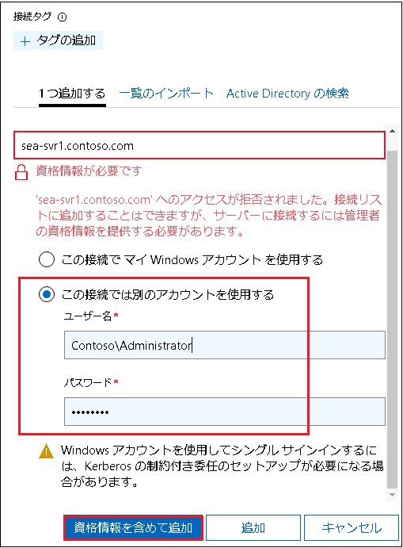

1. すべてのサーバー一覧から、**sea-svr1.contoso.com** を選択し、 左ナビゲーションペインの **[ツール]** を下にスクロールし、 **[役割と機能]** をクリックします。

   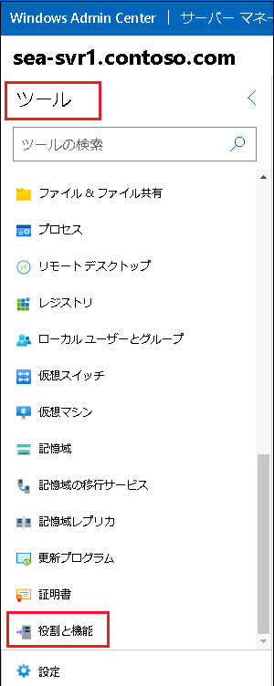

1.  **[役割と機能]** 一覧から、 **[DHCP サーバー]** のチェックボックスを選択し、**[ + インストール]** をクリックします。

   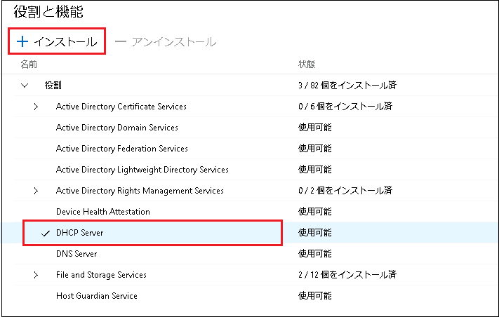

1. **[役割と機能のインストール]** ウィンドウが表示されたら、**[はい]** を選択します。

   ※ **[必要に応じてサーバーを自動的に再起動する]** のチェックボックスはオフのままで構いません。

1. Microsoft Edge で表示されている Windows Admin Center のページを更新します。

   > **注 : 資格情報の入力を求められたら、以下を設定して [続行] をクリックしてください。(これらの資格情報をすべての接続でしようします。のチェックボックスはオフのままで構いません。)**
   >
   > | 設定                                 | 値                        |
   > | ------------------------------------ | ------------------------- |
   > | この接続では別のアカウントを使用する | **チェックを入れる**      |
   > | ユーザー名                           | **Contoso\Administrator** |
   > | パスワード                           | **Pa55w.rd**              |

   

1.  Windows Admin Center の **[すべての接続]** を展開し、 **[All Connections(すべての接続)]** を選択した後、 **sea-svr1.contoso.com** に再度接続します。

   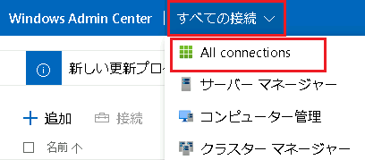

1.  sea-svr1.contoso.comページの **[ツール]** 一覧から **[ DHCP ]** を選択し、詳細ウィンドウで **[インストール]** を選択して **DHCP PowerShell** ツールをインストールします。

   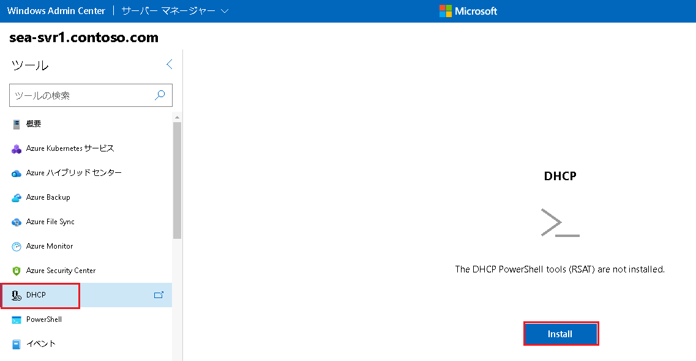

1. DHCP PowerShell ツールがインストールされたという通知が確認できてから、タスク2に進んでください。

   > **注: 通知メッセージが表示されない場合は、Windows Admin Center の右上にあるベルのマークをクリックして通知メッセージの一覧を確認できます。**

### <a name="task-2-authorize-the-dhcp-server"></a>タスク 2: DHCP サーバーを承認する

1. **SEA-ADM1** で、**[スタート]** メニューから、**[Server Manager (サーバー マネージャー)]** を選択します。

1. Server Manager が起動したら、右上の旗のマーク **[通知]** をクリックし、**[Complete DHCP configuration (DHCP 構成の完了)]** を選択します。

   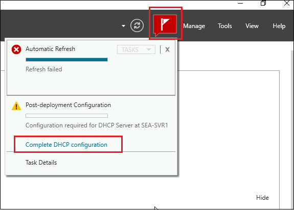

3. DHCP インストール後の構成ウィザードウィンドウの **[Description (説明)]** 画面で、**[Next (次へ)]** をクリックします。

   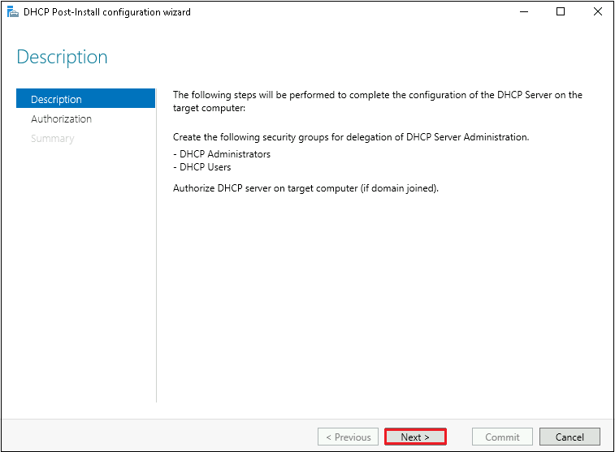

4.  **[Authorization (承認)]** 画面で、**[User the following user's credentials]** にチェックが入り、**CONTOSO\Administrator** が選択されていることを確認し、 [**コミット**] をクリックします。

   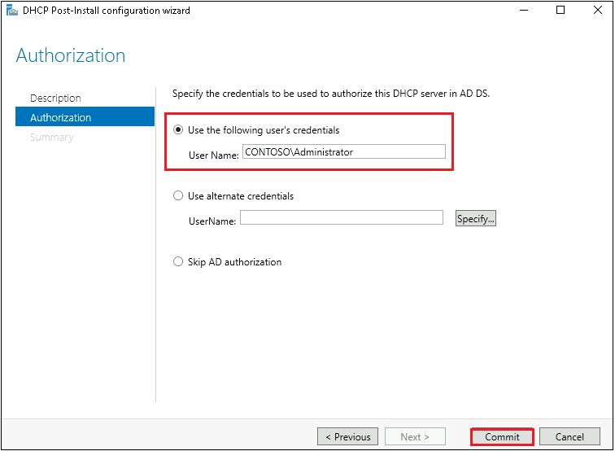

5.  **[Summary (概要)]** 画面が表示されたら、**[close]** をクリックしてウィザードを終了します。

   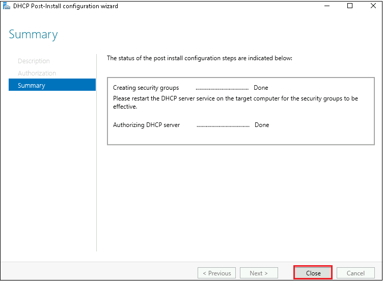

### <a name="task-3-create-a-scope"></a>タスク 3: スコープを作成する

1. **SEA-ADM1**  の Windows Admin Center で、**sea-svr1.contoso.com** に接続し、左ナビゲーションペインの一覧から **[DHCP]** を選択します。

1.  **[ DHCP ]** ページで、 **[ + 新しいスコープ]** を選択します。

   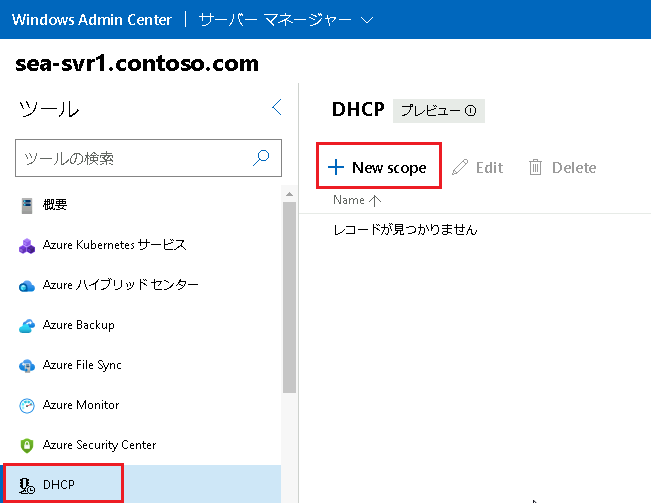

1.  **[新しいスコープの作成]** ウィンドウで、次の設定を指定し、 **[作成]** をクリックします。特に指示がないものは規定値のままで構いません。

   | 設定                                                         | 値                                                     |
   | ------------------------------------------------------------ | ------------------------------------------------------ |
   | プロトコル(Protocol)                                         | **IPv4**                                               |
   | 名前 (Name)                                                  | **ContosoClients**                                     |
   | 開始 IP アドレス (Starting IP Address)                       | **10.100.150.50**                                      |
   | 終了 IP アドレス (End IP Address)                            | **10.100.150.254**                                     |
   | DHCP クライアントのサブネット マスク (DHCP client subner mask) | **255.255.255.0**                                      |
   | ルーター (default gateway)                                   | **[＋ 追加] をクリックし、 10.100.150.1 を設定します** |
   | DHCP クライアントのリース期間 (Lease duration for DHCP clients) | **[Days] に [4] と設定してください**                   |

   

1.  **SEA-ADM1** のサーバー マネージャーに切り替え、 **[Tools (ツール)]  - [ DHCP ]** の順に選択します。

   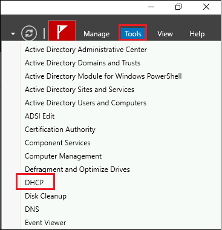

1.  **[DHCP]** の **[Actions (操作)]** ウィンドウで、**[More Actions (その他の操作)]** を選択し、 **[Manage Authorized Servers (承認済みサーバーの管理)]** を選択します。

   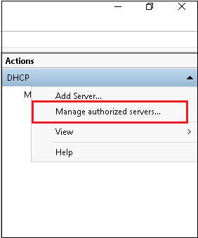

1.  **[Manage Authorized Servers (承認済みサーバーの管理)]** ウィンドウで **[Refresh (更新)]** を選択し、**Authorized DHCP Servers の一覧**に、 **sea-dc1.contoso.com** と **sea-svr1.contoso.com** の両方が表示されていることを確認してから、 **[Manage Authorized Servers (承認済みサーバーの管理)]** ウィンドウを閉じます。

   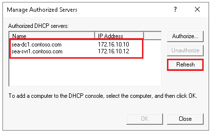

1.  **[DHCP]** の **[Actions (操作)]** ウィンドウで、**[More Actions (その他の操作)]** を選択し、**[Add Server (サーバーの追加)]** を選択します。

   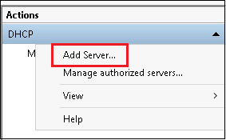

1.  **[Add Server (サーバーの追加)]** ダイアログ ボックスで、**[This authorized DHCP server (承認された DHCP サーバー)]** のラジオボタンを選択、**[ sea-svr1.contoso.com ]** を選択してから、**[ OK ]** をクリックします。

   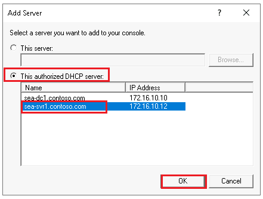

1. DHCP ウィンドウで、**[172.16.10.12] - [IPv4] Scope - [10.100.150.0] ContosoClients** の順に展開し、 **[Scope Options]** を選択します。

   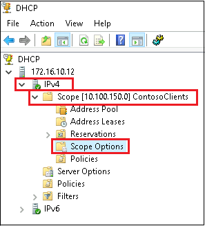

1.  **[Actions (操作)]** ウィンドウで、**[More Actions (その他の操作)]** を選択し、**[Configure Options (オプションの構成)]** を選択します。

   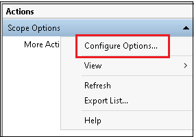

1.  **[Scope Options (スコープ オプション)]** ダイアログ ボックスで、**[ 006 DNS Server]** チェックボックスをオンにし、[Data entry] に以下を設定した後、[Add (追加)]をクリックしてから、 [OK] を選択します。

   | 設定                     | 値                      |
   | ------------------------ | ----------------------- |
   | Server name (サーバー名) | **sea-dc1.contoso.com** |
   | IP address (IPアドレス)  | **172.16.10.10**        |

   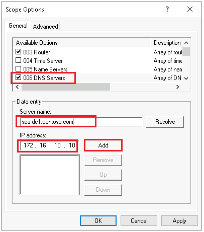

   

### <a name="task-4-configure-dhcp-failover"></a>タスク 4: DHCP フェールオーバーを構成する

1.  **SEA-ADM1** の **[ DHCP ]** ウィンドウで **[ IPv4 ]** を選択し、**[Actions (操作)] - [More Actions (その他の操作)]** の順に展開してから、**[Configure Failover (フェールオーバーの構成)]** を選択します。

   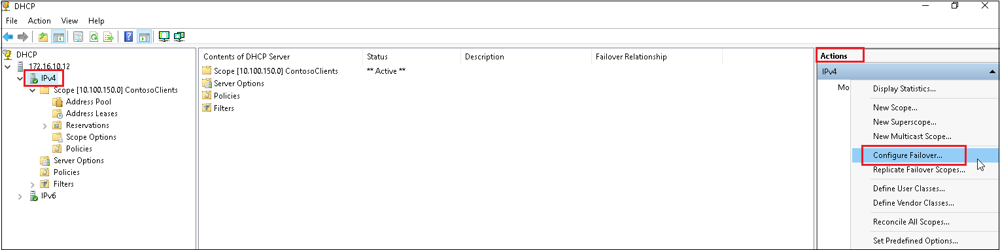

1.  **[Configure Failover (フェイルオーバーの構成)]** ウィンドウで、**[Select all (すべて選択)]** チェックボックスにチェックが入っていることを確認し、**[Next (次へ)]** を選択します。

   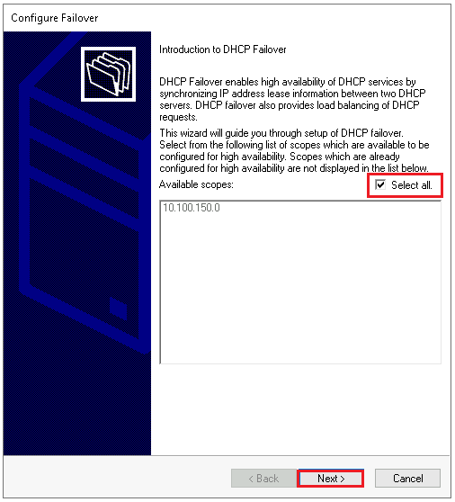

1.  **[Specify the partner server to use for failover (フェールオーバーに使用するパートナー サーバーの指定)]** 画面で、 **[Add Server (サーバーの追加)]** をクリックします。

   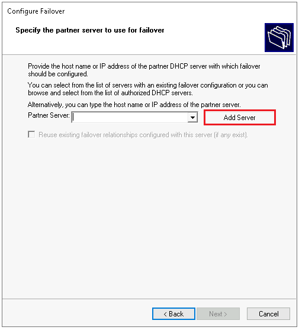

1.  **[Add Server (サーバーの追加)]** ダイアログ ボックスで、**[This authorized DHCP server (承認された DHCP サーバー)]** を選択し、**[ sea-dc1.contoso.com ]** を選択してから、**[ OK ]** をクリックします。

   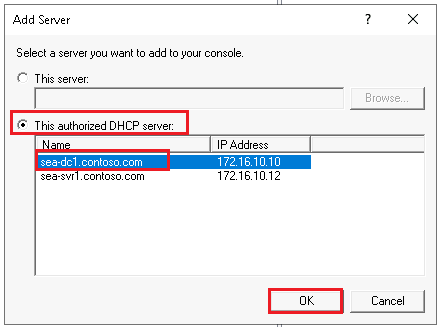

1.  **[Specify the partner server to use for failover (フェールオーバーに使用するパートナー サーバーの指定)]** 画面に戻り、 **[パートナー サーバー]** ドロップダウン リストに **sea-dc1** が表示されていることを確認し、**[Next (次へ)]** を選択します。

   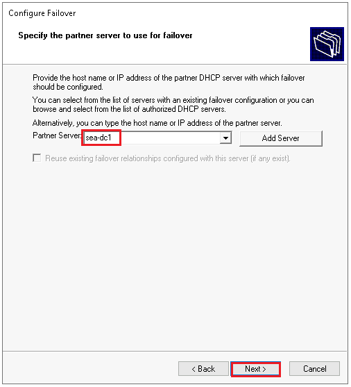

1.  **[Create a new failover relationship (新しいフェールオーバー関係の作成)]** 画面で、次の情報を入力し、 **[Next (次へ)]** を選択します。指示がないものは規定値のままで構いません。

   | 設定                                                         | 項目                               |
   | ------------------------------------------------------------ | ---------------------------------- |
   | Relationship Name (レプリケーションの名前)                   | **SEA-SVR1 to SEA-DC1**            |
   | Maximum Client Lead Time (クライアントの最大リードタイム)    | **1 hours (1時間)**                |
   | Mode (モード)                                                | **Hot standby (ホットスタンバイ)** |
   | Role Partner Server (パートナー サーバーの役割)              | **Standby**                        |
   | Address reserved for standby server (スタンバイ サーバー用に予約されたアドレス) | **5％**                            |
   | State Switchover Interval (状態切り替え間隔)                 | **チェックオフ(無効)**             |
   | Enable Message Authentication (メッセージ認証を有効にする)   | **チェックオン(有効)**             |
   | Shared Secret (秘密共有)                                     | **DHCP-Failover**                  |

   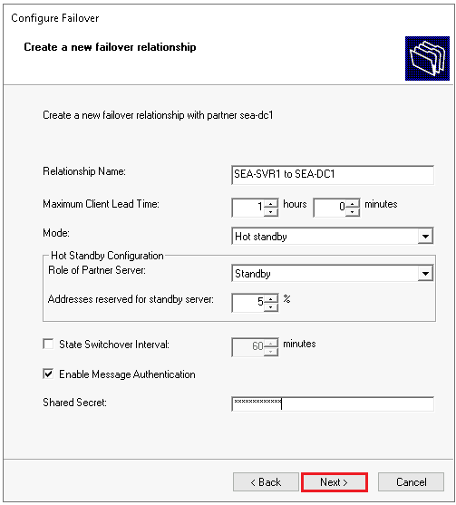


7.  **[Configure Failover]** ウィザード画面が表示されたら、 **[Finish (終了)]** をクリックします。

   **※結果が [Successful] と表示されることを確認したら [close] で閉じて構いません。**

   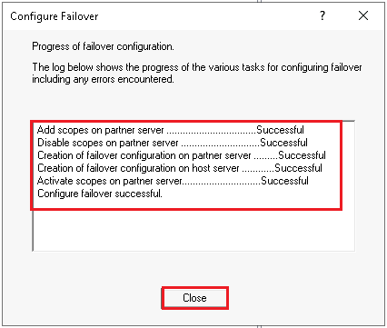


8.  **[ DHCP ]** を選択し、**[Actions (操作)] - [More Actions (その他の操作)]** の順に展開してから、**[Add Server(サーバーの追加)]** を選択します。

   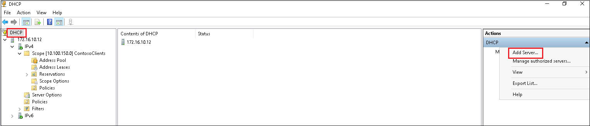


9.  **[ Add Server (サーバーの追加)]** ダイアログ ボックスで、**[This authorized DHCP server (承認された DHCP サーバー)]** を選択し、**[sea-dc1.contoso.com]** を選択して、**[ OK ]** をクリックします。

10.  **DHCP** ウィンドウで、**sea-dc1 ノード** を展開し、 **IPv4** を選択して、2 つのスコープがリストされていることを確認します。

    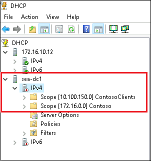

11.  **[Scope [172.16.0.0] Contoso]** を選択し、**[Actions (操作)]** ウィンドウで **[More Actions (その他の操作)]** を選択し、**[Configure Failover (フェールオーバーの構成)]** を選択します。

12. **[Configure Failover (フェールオーバーの構成)]** ウィンドウで、**[Select all]** にチェックが入っていることを確認したら、 **[ Next (次へ)]** をクリックします。

13.  **[ Specify the partner server to use for failover (フェールオーバーに使用するパートナー サーバーを指定してください)]** 画面の **[Partner Server (パートナー サーバー)] のプルダウンから**に **172.16.10.12** を選択します。 **[Reuse existing failover relationships configured with this server (if any exist) (このサーバーで構成された既存のフェールオーバー関係を再利用する (存在する場合))]** チェックボックスにチェックが入っていることを確認して、 **[Next (次へ)]** をクリックします。

    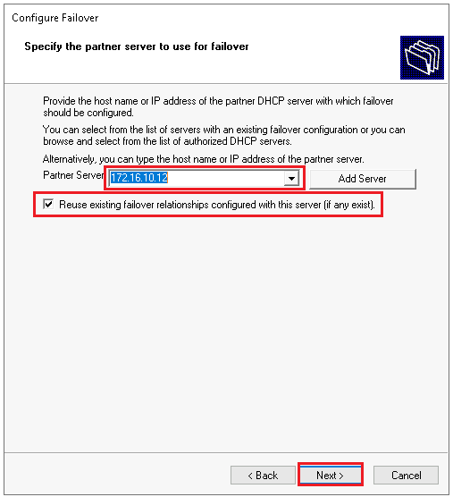

14.  **[Select from failover relationships which are already configured on this server  (このサーバーで既に構成されているフェールオーバー関係から選択する)]** 画面で、**[Next (次へ)]** を選択し、**[Finish (完了)]**をクリックします。

15.  **[Configure Failover]** ウィザード画面が表示されたら、 **[Finish (終了)]** をクリックします。

    **※結果が [Successful] と表示されることを確認したら [close] で閉じて構いません。**

16.  **172.16.10.12** の下で **IPv4** を選択し、2つのスコープが表示されていることを確認します。

    > **注 : スコープが確認できない場合は、F5キーを押して更新してください。**

    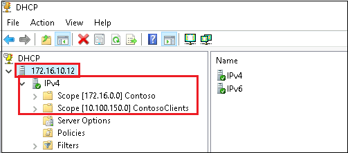

17.  **sea-dc1** のサーバー エントリを右クリックし、 **[ Authorize(承認する) ]**をクリックします。

    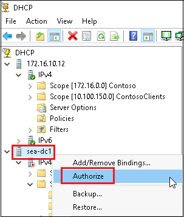

### <a name="task-5-verify-dhcp-functionality"></a>タスク 5: DHCP 機能を確認する

1.  **SEA-ADM1** の **[スタート]** を選択し、**歯車マーク(settings)** を選択します。

   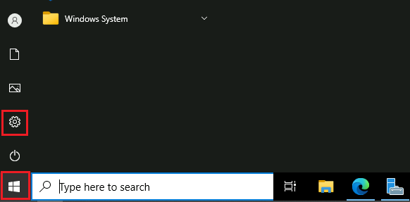

1.  **[Windows Settings (設定)]** ウィンドウで、**[Network & Internet (ネットワークとインターネット)]** を選択し、**[Network and Sharing Center (ネットワークと共有センター)]** を選択します。

   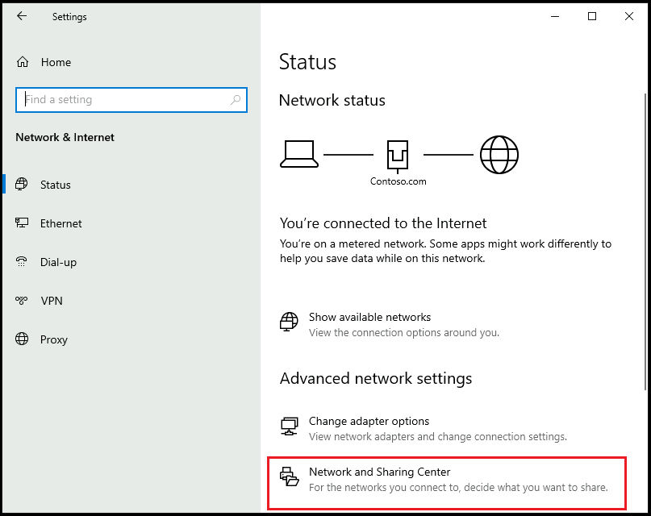


3.  **[Network and Sharing Center (ネットワークと共有センター)]** で、 **[Ethernet (イーサネット)]** を選択した後、 **[Properties (プロパティ)]** を選択します。

   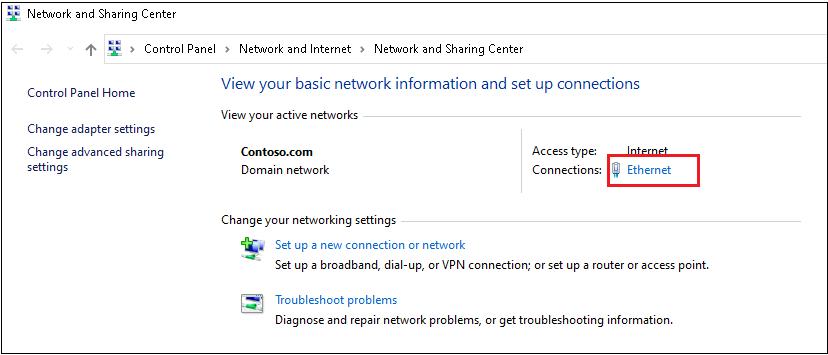

   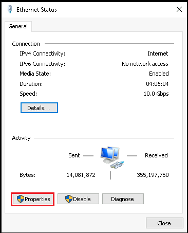

4.  **[Ethernet Properties (イーサネットのプロパティ)]**  ダイアログ ボックスで、**[Internet Protocol Version 4 (TCP/IPv4) ]** を選択した後、**[Properties (プロパティ)]** をクリックします。

   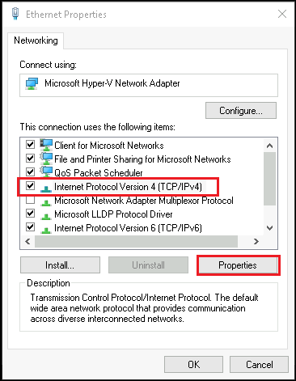

5.  **[Internet Protocol Version 4 (TCP/IPv4) Properties]** ダイアログ ボックスで、**[ Obtain an IP address automatically (IP アドレスを自動的に取得する)]**  、**[Obtain DNS server address automatically(DNS サーバーのアドレスを自動的に取得する)]** を選択した後、**[ OK ]** をクリックします。

   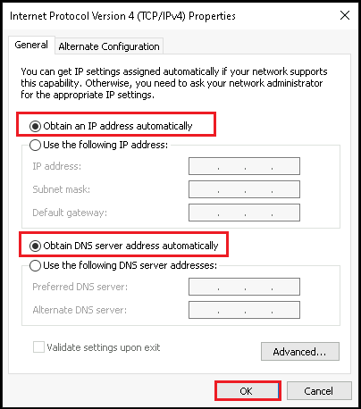

6.  **[Ethernet Properties (イーサネットのプロパティ)]**  ダイアログ ボックスを、 [Close] で閉じます。

7.   **[Ethernet Status (イーサネット ステータス)]** ウィンドウで  **[Details (詳細)]** を選択します。

   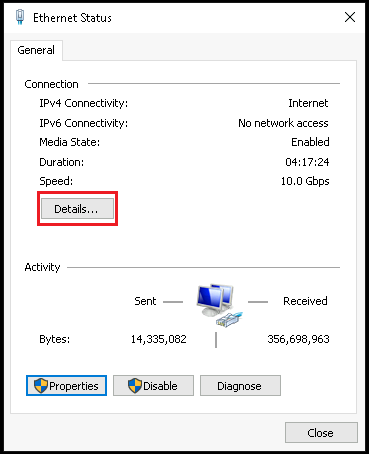

8.  **[Network Connection Details (ネットワーク接続の詳細)]** ダイアログ ボックスで、DHCP が有効(Enable) になっていること、IP アドレスが取得されていること、および **SEA-SVR1 (172.16.10.12)** DHCP サーバーがリースを発行したことを確認します。

   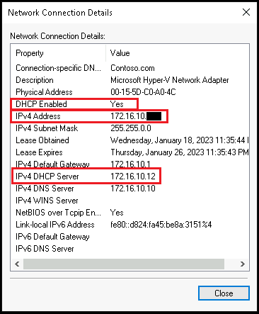

9. 確認出来たら、[Close (閉じる)] を選択して、**[Ethernet Status (イーサネット ステータス)]** ウィンドウに戻ります。

10.  **SEA-ADM1** の DHCPウィンドウに戻り、**[172.16.10.12] - [IPv4ノード]** の順に展開した後、**Scope  [172.16.0.0] Contosoノード**を展開して、**[Address Leases (アドレス リース)]**を選択します。

    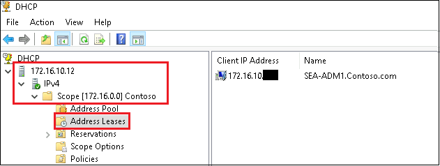

11.  **SEA-ADM1.contoso.com リース**を表すエントリがあることを確認します。

12.  **sea-dc1** を展開し、**[IPv4] - [スコープ [172.16.0.0] Contoso]** の順に展開してから、 **[Address Leases]** を選択します。

13.  SEA-ADM1.contoso.com リースを表すエントリがあることが確認できます。

    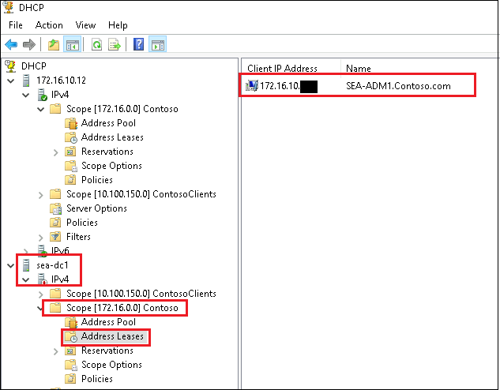


14.  **sea-svr1 (172.16.10.12)**  を選択し、**[Actions (アクション)]** ウィンドウで **[More Actions (その他のアクション)]** を選択し、**[All tasks (すべてのタスク)]** を選択してから、**[Stop (停止)]** を選択します。

    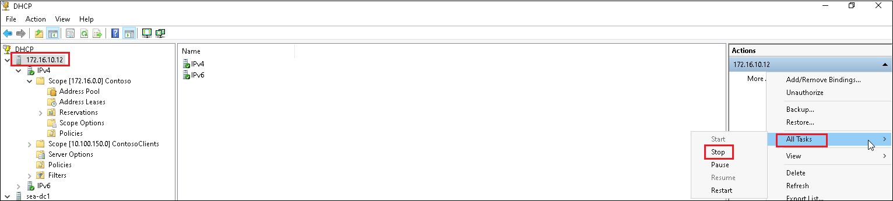


15.  **[Ethernet Status (イーサネット ステータス)]** ウィンドウに戻り、 **[(Disable) 無効]** を選択します。

    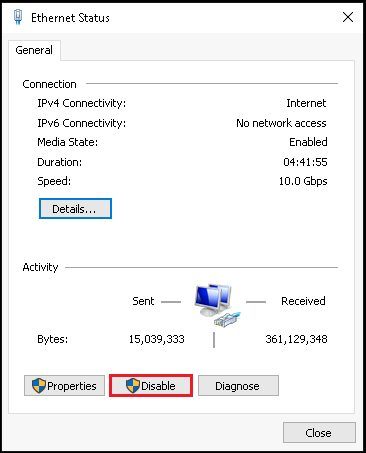


16.  **[Network and Sharing Center (ネットワークと共有センター)]** ウィンドウに戻り、**[Change adapter settings (アダプターの設定を変更する)] - [Ethernet]** の順に選択し、**Ethernet** を右クリックして  **[Enable(有効)]** をクリックします。

    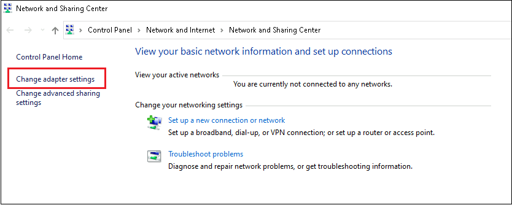

    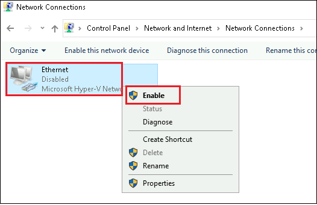

17.  **[有効なイーサネット接続]** をダブルクリックして、ステータス ウィンドウを表示します。

18.  **[Ethernet Status]** ウィンドウで、**[Details (詳細)]** を選択します。

    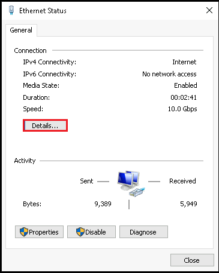


19.  **[Network Connection Details (ネットワーク接続の詳細)]** ダイアログ ボックスで、DHCP が有効 (Enable) になり、IP アドレスが取得されていること、 **SEA-DC1 (172.16.10.10)**  DHCP サーバーがリースを発行したことを確認します。

    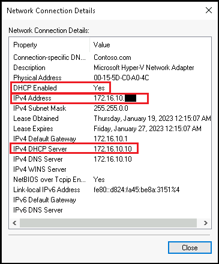


20.  **[close]** をクリックして、**[Ethernet Status]** ウィンドウに戻ります。

21.  **[Ethernet Status (イーサネット ステータス)]** ウィンドウで、 **[Properties (プロパティ)]** をクリックします。

22.  **[Ethernet Properties (イーサネットのプロパティ)]**  ダイアログ ボックスで、**[Internet Protocol Version 4 (TCP/IPv4)]** を選択した後、**[Properties (プロパティ)]** をクリックします。

23.  **[Internet Protocol Version 4 (TCP/IPv4)]** ダイアログ ボックスで、 **[Use the following IP address (次の IP アドレスを使用する)]** を選択し、次の設定を指定します。

    | 設定                                     | 値               |
    | ---------------------------------------- | ---------------- |
    | IP address (IP アドレス)                 | **172.16.10.11** |
    | Subnet mask (サブネットマスク)           | **255.255.0.0**  |
    | Default gateway (デフォルトゲートウェイ) | **172.16.10.1**  |

    **[Use the following DNS server addresses (次の DNS サーバー アドレスを使用する)]** を選択し、**[Preferred DNS server (優先 DNS サーバー)]** を **172.16.10.10** に設定して、**[ OK ]** をクリックします。

    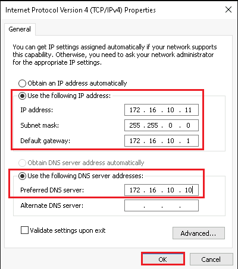


**※ [Ethernet Status] ウィンドウはこのラボの後半で必要になるため、閉じずに次の演習に進んでください。**

## <a name="exercise-2-deploying-and-configuring-dns"></a>演習 2: DNS の展開と構成

### <a name="scenario"></a>シナリオ

Contoso 内の Trey Research で働いているスタッフには、テスト環境にDNSのレコードを作成するための DNS サーバーが必要です。 要件として、テスト環境では、Contoso のインターネット DNS 名とリソース レコードを名前解決できる必要があります。 要件を満たすために、インターネット サービス プロバイダー (ISP) への転送を構成し、**SEA-DC1** に **contoso.com** の条件付きフォワーダーを作成します。 また、ユーザーの場所に基づいて異なる IP アドレスの名前解決を必要とするテスト アプリケーションもあるため、 DNS ポリシーを使用して、**testapp.treyresearch.net** を、本社のユーザーに対して異なる方法で解決するように構成します。

この演習の主なタスクは次のとおりです。

1. DNS 役割をインストールします。
1. DNS ゾーンの作成。
1. 転送を構成します。
1. 条件付き転送を構成します。
1. DNS ポリシーを構成します。
1. DNS ポリシーの機能を確認します。

### <a name="task-1-install-the-dns-role"></a>タスク 1: DNS 役割をインストールする

1. **SEA-ADM1** で、Windows Admin Center の **sea-svr1.contoso.com** への接続している、 Microsoft Edge ウィンドウに戻ります。

1. **[ツール]** の左ナビゲーションペイン一覧から、 **[役割と機能]** を選択します。

1.  **[役割と機能]** ウィンドウで、 **[ DNS サーバー]** チェックボックスを選択し、**[ + インストール]** をクリックします。

   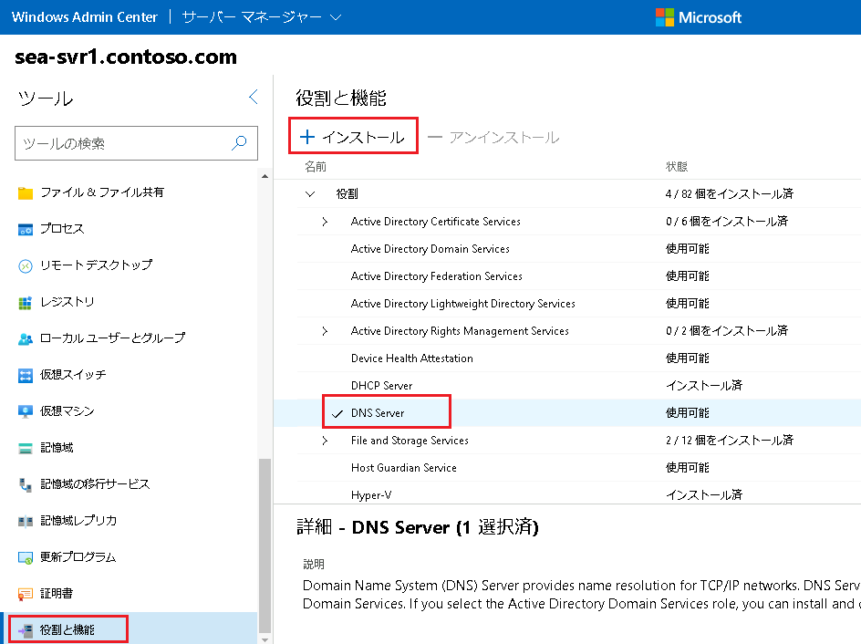

1.  **[役割と機能のインストール]** ウィンドウで、**[はい]** をクリックします。

   ※  **[必要に応じてサーバーを自動的に再起動する]**  のチェックボックスはオフで構いません。

1. DNS Server の役割がインストールされたという通知が確認できてから、タスク2に進んでください。

   > **注: 通知メッセージが表示されない場合は、Windows Admin Center の右上にあるベルのマークをクリックして通知メッセージの一覧を確認できます。**

1. Microsoft Edge で表示されている Windows Admin Center のページを更新します。

1.  **sea-svr1.contoso.com** ページに戻り、左ナビゲーションペインの **[ツール]** の一覧から  **[ DNS ]** を選択し、詳細ウィンドウで **[インストール]** を選択して **DNS PowerShell ツール** をインストールします。

   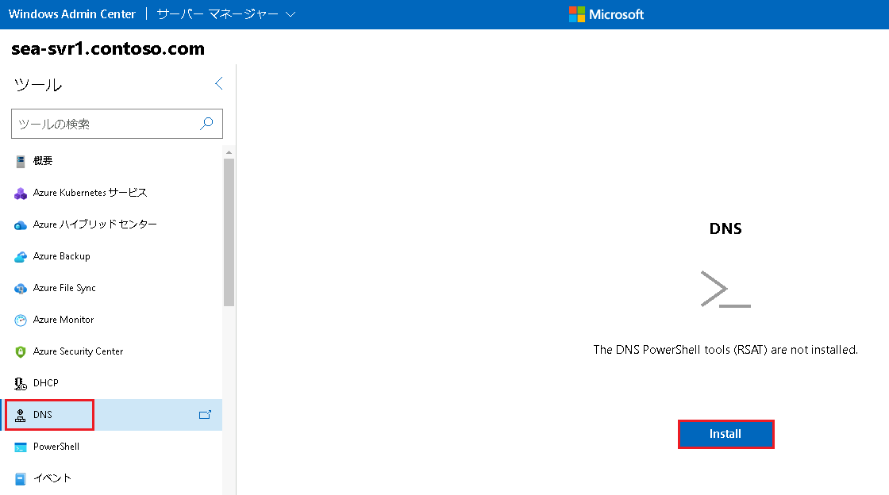


8.  DNS PowerShell ツールがインストールされたことを示す通知が表示されるまで待ちます。

   > **※通知メッセージが表示されない場合は、Windows Admin Center の右上にあるベルマーク [通知] アイコンを選択して現在のステータスを確認します。**

9. 通知メッセージが確認できてから、タスク2に進んでください。

### <a name="task-2-create-a-dns-zone"></a>タスク 2: DNS ゾーンを作成する

1. **SEA-ADM1**  の Windows Admin Center の DNS ウィンドウで、  **[ + 新しい DNS ゾーンの作成 (Create a new DNS zone)]** を選択します。

   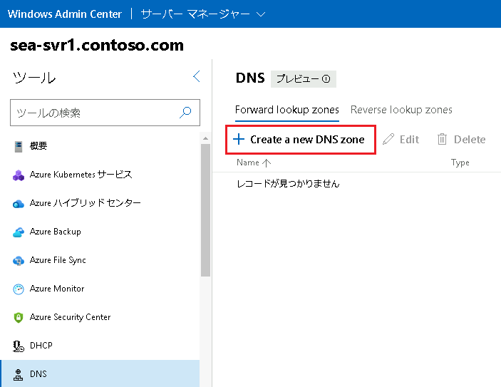

1.   **[新しい DNS ゾーンの作成  (Create a new DNS zone)]**  ダイアログ ボックスで、次の設定を指定し、 **[Create (作成)]** を選択します。指示がないものは規定値のままで構いません。

   | 設定                               | 値                                                     |
   | ---------------------------------- | ------------------------------------------------------ |
   | Zone type (ゾーンタイプ)           | **Primary**                                            |
   | Zone name (ゾーン名)               | **TreyResearch.net**                                   |
   | Zone file (ゾーンファイル)         | **Create a new file (新しいファイルを作成する)**       |
   | Zone file namre (ゾーンファイル名) | **TreyResearch.net.dns**                               |
   | Dynamic update (動的更新)          | **Do not allow dynamic update (動的更新を許可しない)** |

   

1.  DNS ウィンドウに戻り、 **[TreyResearch.net]** を選択してから、**[ + 新しい DNS レコードの作成 (Create a new DNS record)]** を選択します。

    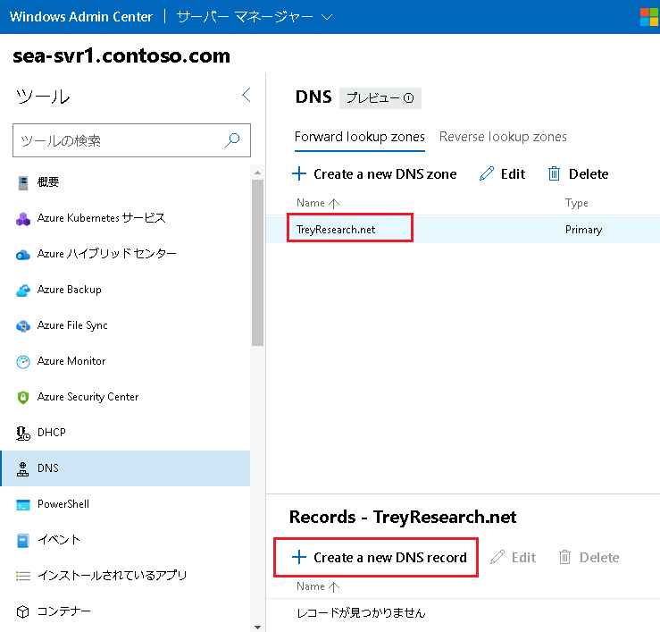


4.   **[新しい DNS レコードの作成 (Create a new DNS record)]**  ウィンドウで、次の設定を指定し、 **[Create (作成)]** を選択します。指示がないものは規定値のままで構いません。

   | 設定                                  | 値                |
   | ------------------------------------- | ----------------- |
   | DNS record type (DNS レコード タイプ) | **Host (A)**      |
   | Record name (レコード名)              | **TestApp**       |
   | IP address (IP アドレス)              | **172.30.99.234** |
   | Time to live (有効期間)               | **600**           |

   ※Create associated pointer (PTR) record (関連付けられたポインター (PTR) レコードを作成する)のチェックボックスはオフにしてください。

   ※レコードが追加されたら、[新しい DNS レコードの作成 (Create a new DNS record)] は [キャンセル] で閉じて構いません。

   **TestApp.TreyResarch.net というAレコードが追加されたことが確認できます。**

   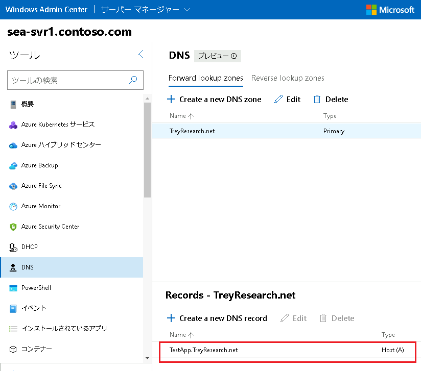


5.  **SEA-ADM1** で、**[スタート] メニュー**を選択し、**[ Windows PowerShell ]** を起動します。

6.  Windows PowerShell コンソールで次のコマンドを実行すると、新しい DNS レコードが名前解決を提供することが確認できます。

   ```powershell
   Resolve-DnsName -Server sea-svr1.contoso.com -Name testapp.treyresearch.net
   ```

   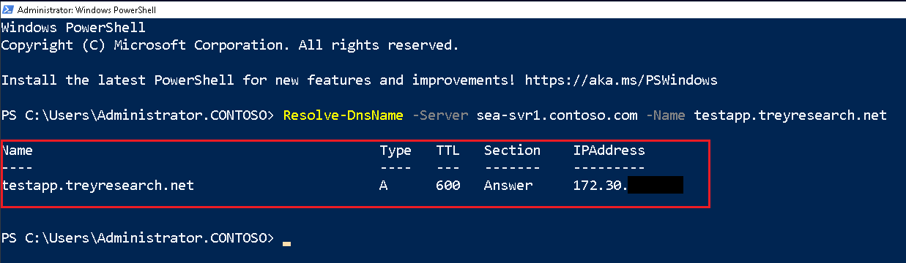

### <a name="task-3-configure-forwarding"></a>タスク 3: 転送を構成する

1. **SEA-ADM1** で、**Server Manager** に切り替えます。

1. Server Manager の **[Tools (ツール)]** を展開し、**[ DNS ]** を選択します。

   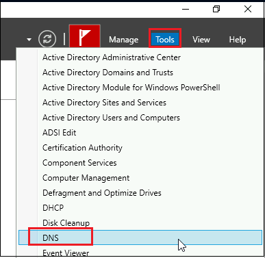

1.  **[DNS Manager (DNS マネージャー)]** で **[ DNS ]** を選択し、右クリックしてから、 **[ Connect to DNS Server (DNS サーバーに接続)]**  を選択します。

   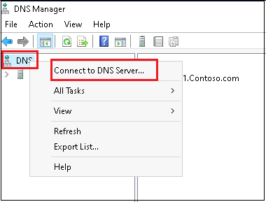

1.  **[Connect to DNS Server (DNS サーバーに接続)]** ダイアログ ボックスで、 **[ The following computer (次のコンピューター)]**  を選択し、 **SEA-SVR1.contoso.com** と入力したら、 [OK] をクリックします。

   **※connect to the specified computer now (指定したコンピュータに今すぐ接続する) のチェックは外さないでください。**

   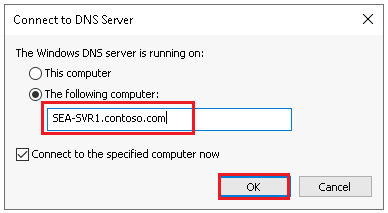


5.  **[DNS Manager (DNS マネージャー)]** で **[SEA-SVR1.contoso.com ]** を選択し、右クリックして、  **[Properties (プロパティ)]** をクリックします。

   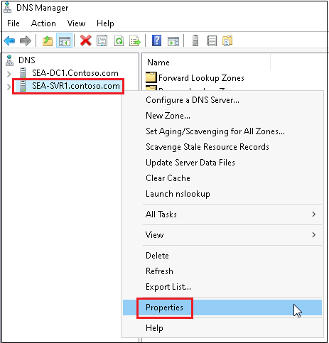


6.  **[SEA-SVR1.contoso.com のProperties]**  ダイアログ ボックスで、 **[Forwarders (フォワーダー)]**  タブを選択し、 **[Edit (編集)]** をクリックします。

   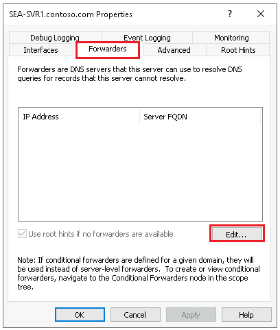


7.   **[Edit Forwarders (フォワーダーの編集)]** ダイアログ ボックスの  **[IP addresses for forwarding servers (転送サーバーの IP アドレス)]**  ボックスに **[ 131.107.0.100 ]** と入力し、 **[OK]** をクリックします。

   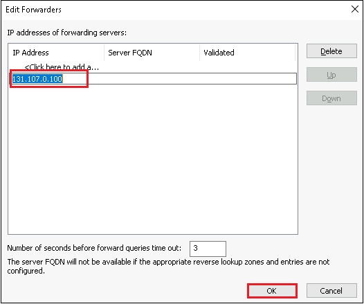


8.  **[SEA-SVR1.contoso.com のProperties]**  ダイアログ ボックスを**[ OK ]** をクリックして閉じます。

### <a name="task-4-configure-conditional-forwarding"></a>タスク 4: 条件付き転送を構成する

1. **SEA-ADM1** の **[DNS マネージャー]** で、 **SEA-SVR1.contoso.com** を展開し、 **Conditional Forwarders** を選択します。

1.  **[Conditional Forwarders(条件付きフォワーダー) ]** を右クリックして、 **[ New Conditional Forwarder (新しい条件付きフォワーダー) ]**  を選択します。

    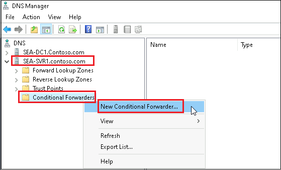


3.  **[New Conditional Forwarder (新しい条件付きフォワーダー) ]** ダイアログ ボックスの **[DNS Domain]** ボックスに、 **[Contoso.com]** と入力します。

4.  **[IP addresses of the master servers (マスター サーバーのIP アドレス)]** ボックスに **[172.16.10.10]** と入力し、[OK] をクリックします。

   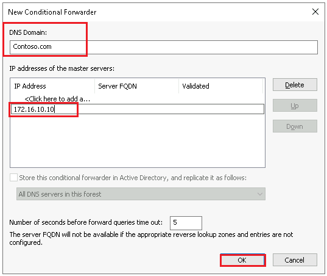

   > **注 : 検証エラーが発生する場合がありますが、無視して構いません。**

1. **SEA-ADM1** の **Windows PowerShell** コンソールで、次のコマンドを実行して条件付きフォワーダーが動作していることを確認します。

    ```powershell
    Resolve-DnsName -Server sea-svr1.contoso.com -Name sea-dc1.contoso.com
    ```

​          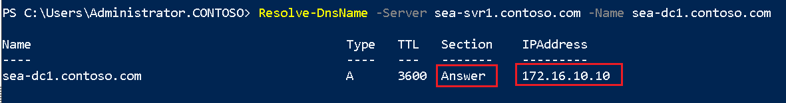

### <a name="task-5-configure-dns-policies"></a>タスク 5: DNS ポリシーを構成する

1. **SEA-ADM1** の Windows Admin Center に接続している、Microsoft Edge に切り替えます。**sea-svr1.contoso.com** に接続している状態で、 **[ツール]** の一覧から **PowerShell** を選択します。

    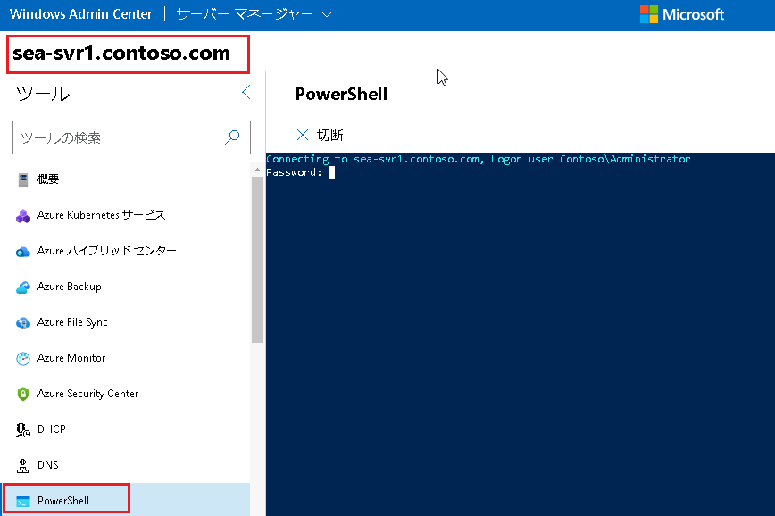

1.  プロンプトが表示されたら、**パスワード (Pa55w.rd)** を入力し、リモートセッションを開始します。

1. **Windows PowerShell** プロンプトで、次のコマンドレットを実行して本社のサブネットを作成します。

    ```powershell
    Add-DnsServerClientSubnet -Name "HeadOfficeSubnet" -IPv4Subnet '172.16.10.0/24'
    ```

1. 次のコマンドレットを実行して、本社のゾーン スコープを作成します。

    ```powershell
    Add-DnsServerZoneScope -ZoneName 'TreyResearch.net' -Name 'HeadOfficeScope'
    ```

1. 次のコマンドレットを実行して、本社のスコープの新しいリソース レコードを作成します。

    ```powershell
    Add-DnsServerResourceRecord -ZoneName 'TreyResearch.net' -A -Name 'testapp' -IPv4Address '172.30.99.100' -ZoneScope 'HeadOfficeScope'
    ```

1. 次のコマンドレットを実行して、本社のサブネットとゾーン スコープをリンクする新しいポリシーを作成します。

    ```powershell
    Add-DnsServerQueryResolutionPolicy -Name 'HeadOfficePolicy' -Action ALLOW -ClientSubnet 'eq,HeadOfficeSubnet' -ZoneScope 'HeadOfficeScope,1' -ZoneName 'TreyResearch.net'
    ```

### <a name="task-6-verify-dns-policy-functionality"></a>タスク 6: DNS ポリシー機能を確認する

1. **SEA-ADM1** の **Windows PowerShell** コンソールで、`ipconfig` を実行して、**SEA-ADM1** が **HeadOfficeSubnet (172.16.10.0)** 上にあることを確認します。

    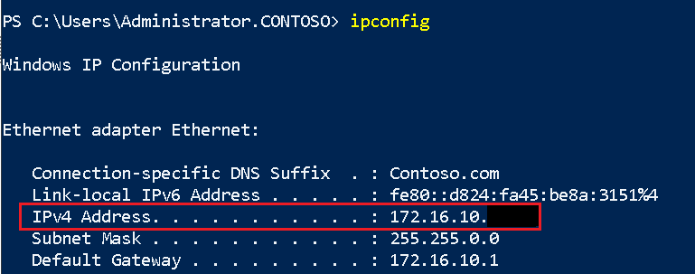

1. **Windows PowerShell** コンソールで、次のコマンドを実行して DNS ポリシーをテストします。

   ```powershell
   Resolve-DnsName -Server sea-svr1.contoso.com -Name testapp.treyresearch.net
   ```

   > **注: 名前が、HeadOfficePolicy で構成された IP アドレス 172.30.99.100 に解決されることを確認します。**

   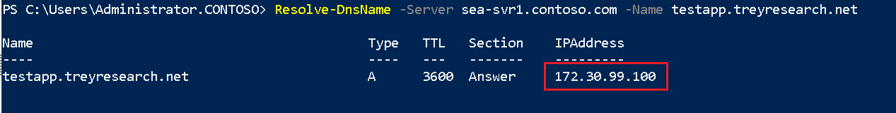

1.  **[Ethernet Status (イーサネット ステータス)]** ウィンドウに戻り、 **[Properties (プロパティ)]** をクリックします。

    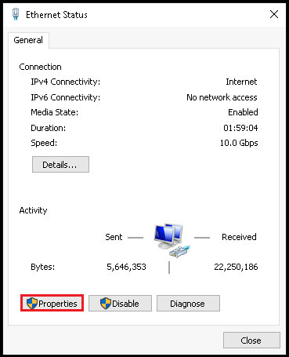


4.  **[Ethernet Properties (イーサネットのプロパティ)]** ダイアログ ボックスで、**[Internet Protocol Version 4 (TCP/IPv4)]**  を選択し、 **[プロパティ (Properties)]** をクリックします。

1.   **[Internet Protocol Version 4 (TCP/IPv4)]** ダイアログ ボックスで、現在割り当てられている IP アドレス **( 172.16.10.11 )** を HeadOfficeSubnet の IP アドレス範囲外のIP アドレス **172.16.11.11** に変更し、 **[ OK ]** をクリックします。

    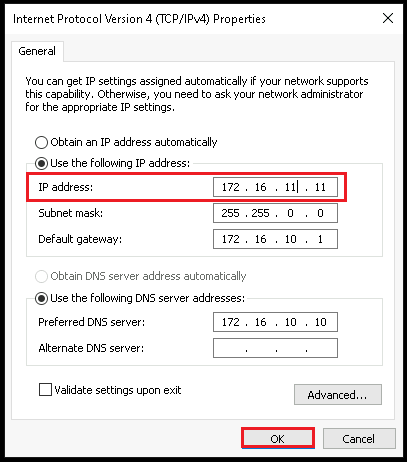

1. **Windows PowerShell** コンソールに切り替え、次のコマンドレットを実行して DNS ポリシーをテストします。

   ```powershell
   Resolve-DnsName -Server sea-svr1.contoso.com -Name testapp.treyresearch.net
   ```
   > **注:  172.30.99.234 に名前解決されることを確認します。 SEA-ADM1 の IP アドレスが HeadOfficeSubnet 内に存在しなくなったため、これは想定内です。 `testapp.treyresearch.net` をターゲットとする (172.16.10.0/24) の HeadOfficeSubnet からの DNS クエリは、172.30.99.100 に解決されます。 `testapp.treyresearch.net` をターゲットとするこのサブネット外からの DNS クエリは、172.30.99.234 に解決されます。**

   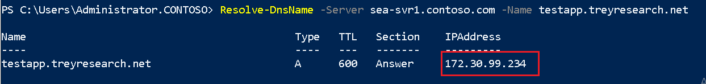

1. **SEA-ADM1** の IP アドレスを元の値 ( **172.16.10.11 )** に戻します。


以上で演習は終了です。お疲れさまでした。
