---
lab:
  title: 'ラボ: ハイブリッド ネットワーク インフラストラクチャの実装'
  module: 'Module 8: Implementing Windows Server IaaS VM networking'
---

# <a name="lab-implementing-hybrid-networking-infrastructure"></a>ラボ: ハイブリッド ネットワーク インフラストラクチャの実装

## <a name="scenario"></a>シナリオ

あなたは、ハブ アンド スポーク トポロジで構成された、個別の仮想ネットワークにデプロイされている Microsoft Azure 仮想マシンのテスト環境の構築を任されました。テスト環境には、トラフィックがハブ経由で流れるようにするユーザー定義のルートを使用して、スポーク間の接続を実装する必要があります。また、Azure プライベート DNS ゾーンを使用して仮想ネットワーク間で Azure 仮想マシンの DNS 名前解決を実装し、外部名前解決のための Azure DNS ゾーンの使用を検証する必要もあります。


## <a name="objectives"></a>目標

このラボを完了すると、次のことができるようになります。

- Azure で仮想ネットワーク ルーティングを実装する
- Azure で DNS 名前解決を実装する
- Azure 環境をプロビジョニング解除する

## <a name="estimated-time-60-minutes"></a>予想所要時間: 60 分

## <a name="lab-setup"></a>ラボのセットアップ

仮想マシン:  **SEA-DC1 、SEA-ADM1** を使用します。

1. **SEA-ADM1** を選択します。
1. 次の資格情報を使用してサインインします。

   - ユーザー名: **Administrator**
   - パスワード: **Pa55w.rd**
   - ドメイン: **CONTOSO**

このラボでは、 仮想マシンと Azure サブスクリプションを使用します。

### <a name="exercise-1-implement-virtual-network-routing-in-azure"></a>演習 1: Azure で仮想ネットワーク ルーティングを実装する

### <a name="scenario"></a>シナリオ

はじめに、Azure Resource Manager テンプレートを使ってコア ネットワーク インフラストラクチャをデプロイし、カスタム ルーティングを構成して、機能を検証します。 

この演習の主なタスクは次のとおりです。

1. ラボ インフラストラクチャ リソースをプロビジョニングする
1. ハブ アンド スポーク ネットワーク トポロジを構成する
1. 仮想ネットワーク ピアリングの推移性をテストする
1. ハブ アンド スポーク トポロジでルーティングを構成する


### **事前準備 : ラボ ファイルをダウンロードする**

1.  **SEA-ADM1** を選択します。

2. 次の資格情報を使用してサインインします。

   ユーザー名: **Administrator**
   パスワード: **Pa55w.rd**
   ドメイン: **CONTOSO**

3.   **[スタート]** メニューを選択し、 **[ Windows PowerShell ]** を起動します。

4.  次の Windows PowerShell コマンドレットを実行して、ラボ ファイルの最新バージョンを仮想マシンにダウンロードします。

   ```powershell
   ([System.Net.WebClient]::new()).DownloadFile('https://github.com/MicrosoftLearning/AZ-800-Administering-Windows-Server-Hybrid-Core-Infrastructure/archive/refs/heads/master.zip', 'C:\Labfiles\master.zip')
   ```

   ```powershell
   Expand-Archive -Path 'C:\Labfiles\master.zip' -DestinationPath 'C:\Labfiles'
   ```

   ```powershell
   Move-item -Path "C:\Labfiles\AZ-800-Administering-Windows-Server-Hybrid-Core-Infrastructure-master\Allfiles\Labfiles" -Destination "C:\Labfiles" -confirm:$false
   ```

   

### <a name="task-1-provision-lab-infrastructure-resources"></a>タスク 1: ラボ インフラストラクチャ リソースをプロビジョニングする

このタスクでは、3 つの仮想マシンを同じ Azure リージョン内の個別の仮想ネットワークにデプロイします。 1 つ目の仮想ネットワークはハブとして機能し、残りの 2 つの仮想ネットワークはスポークとなります。 これらのリソースは、ラボ インフラストラクチャの基礎として機能します。

1.   **SEA-ADM1** でMicrosoft Edge を起動し、Azure portal `https://portal.azure.com`に接続します。

   (資格情報は、ラボの **[Home]** タブ内で提供されているものを使用してください。)

   ※Azure Portal にサインイン後は、必要に応じ、右上の歯車マーク(設定)画面から、言語設定を日本語に変更できます。

1. Azure portal で、検索テキスト ボックスの横にあるツールバー アイコンを選択して、Cloud Shell ペインをクリックします。

1.  **Bash** または **PowerShell** のいずれかを選択するように求められたら、**PowerShell** を選択します。

1.  **[ストレージがマウントされていません]** ウィンドウで、 **[詳細設定の表示]** をクリックし、以下の項目を設定します。指示がないものは規定値のままで構いません。

   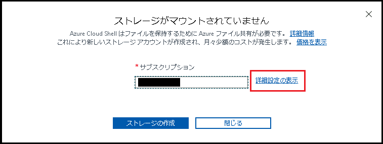

   | 設定                   | 項目                                                         |
   | ---------------------- | ------------------------------------------------------------ |
   | Cloud Shell リージョン | **米国東部 (East US)**                                       |
   | リソース グループ      | **既存のものを使用 (AZ80x-RG)**                              |
   | ストレージ アカウント  | **新規作成 : テキストボックス内に、文字数3～24文字、小文字と数字を組み合わせた任意の名前 (例 : mystorageXXXX) 注意 : ストレージアカウントの名前は一位である必要があります。** |
   | 共有ファイル           | **新規作成 : 必須フィールドに [cloudshell] と入力してください** |

   設定したら、 **[ストレージの作成]** をクリックします。

   > **注 : [ストレージの作成に失敗しました] ストレージアカウントは既に取得されています。というエラーが表示された場合は、ストレージアカウントの名前を別のものに設定しなおし、再度 [ストレージの作成] を実行してください。**

   **※ストレージアカウントが作成されるまでに、数分要する場合があります。**

1.  Cloud Shell ペインのツールバーで、 **[ファイルのアップロード / ダウンロード]** アイコンを選択し、ドロップダウン メニューで  **[アップロード]** を選択します。

   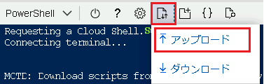

1.  `C:\Labfiles\Lab08\` に格納されている、 **L08-rg_template.json** および  **L08-rg_template.parameters.json** を Cloud Shell ホーム ディレクトリに追加します。

1.  Cloud Shell ペインで次のコマンドレットを実行し、アップロードしたテンプレートとパラメーター ファイルを使用して、3 つの仮想ネットワークと Azure VM を作成します。

   ```powershell
   New-AzResourceGroupDeployment -ResourceGroupName AZ80x-RG -TemplateFile ./L08-rg_template.json -TemplateParameterFile ./L08-rg_template.parameters.json
   ```

   **※デプロイが完了してから、次の作業に進んでください。完了するまでに5分程度要することがあります。**

1.  次のコマンドレットを実行して、前の手順でデプロイした Azure VM に Network Watcher 拡張機能をインストールします。

   ```powershell
   $rgName = 'AZ80X-RG'
   ```

   ```powershell
   $location = (Get-AzResourceGroup -ResourceGroupName AZ80x-RG).location
   ```

   ```powershell
   $vmNames = (Get-AzVM -ResourceGroupName AZ80x-RG).Name
   ```

   ```powershell
   foreach ($vmName in $vmNames) {
    Set-AzVMExtension `
    -ResourceGroupName AZ80x-RG `
    -Location $location `
    -VMName $vmName `
    -Name 'networkWatcherAgent' `
    -Publisher 'Microsoft.Azure.NetworkWatcher' `
    -Type 'NetworkWatcherAgentWindows' `
    -TypeHandlerVersion '1.4'
   }
   ```

   **※Network Watcher 拡張機能のインストールには5 分以上要する場合があります。デプロイが完了するのを待たずに、次の作業に進んでください。**

   

### <a name="task-2-configure-the-hub-and-spoke-network-topology"></a>タスク 2: ハブ アンド スポーク ネットワーク トポロジを構成する

このタスクでは、前のタスクでデプロイした仮想ネットワーク間にローカル ピアリングを構成し、ハブ アンド スポーク ネットワーク トポロジを作成します。

1. **SEA-ADM1** の Azure portal を表示している Microsoft Edge ウィンドウで、別のタブを開き、Azure Portal `https://portal.azure.com`にアクセスします。

1. Azure portal で、ツール バーの  **[リソース、サービス、およびドキュメントの検索]** テキスト ボックスで、  **[Virtual networks (仮想ネットワーク)]** を検索し、サービス一覧から **[仮想ネットワーク]** を選択します。 

1. 仮想ネットワークの一覧から、 **az800l08-vnet0** を選択します。

1. **az800l08 -vnet0** 仮想ネットワーク ページの左ペインにある **[設定]** セクションの一覧から、 **[ピアリング]** を選択し、 **[ + 追加]** をクリックします。

    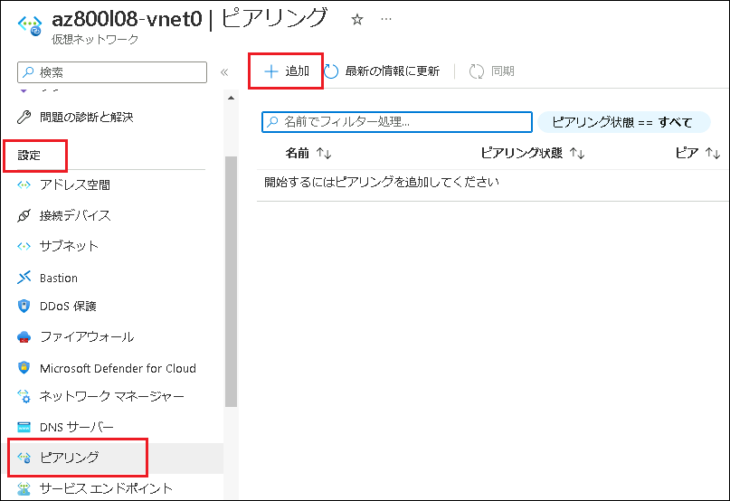

    

1. **[ピアリングの追加]**  ページで次の設定を指定し、 **[追加]** をクリックします。指示がないものは規定値のままで構いません。

   | 設定                                               | 値                                          |
   | -------------------------------------------------- | ------------------------------------------- |
   | ピアリング リンク名                                | **az800l08-vnet0_to_az800l08-vnet1**        |
   | リモート仮想ネットワークへのトラフィック           | **許可 (規定)**                             |
   | リモート仮想ネットワークから転送されたトラフィック | **許可 (規定)**                             |
   | 仮想ネットワーク ゲートウェイまたはルート サーバー | **なし (規定)**                             |
   | ピアリング リンク名                                | **az800l08-vnet1_to_az800l08-vnet0**        |
   | 仮想ネットワークのデプロイモデル                   | **Resource Manager (リソースマネージャー)** |
   | 仮想ネットワーク                                   | **az800l08-vnet1**                          |
   | リモート仮想ネットワークへのトラフィック           | **許可 (規定)**                             |
   | リモート仮想ネットワークから転送されたトラフィック | **許可 (規定)**                             |
   | 仮想ネットワーク ゲートウェイ                      | **なし (規定)**                             |

   >**注: 操作が完了するまで待ちます。**

   >**注**: この手順を実行すると、2 つのピアリング (1 つは **az800l08-vnet0** から **az800l08-vnet1** 、もう 1 つは **az800l08-vnet1** から **az800l08-vnet0** へ) を確立します。

   >**注**: このラボで後ほど実装するスポーク仮想ネットワーク間のルーティングを容易にするために、 **[トラフィック転送を許可する]** を有効にする必要があります。このタスクはラボの後半で実施します。

1. **[az800l08 -vnet0 | ピアリング]** 画面に戻り、ピアリング状態が **[接続済み]** となるまで、 **[最新の状態を更新]** をクリックしてください。

    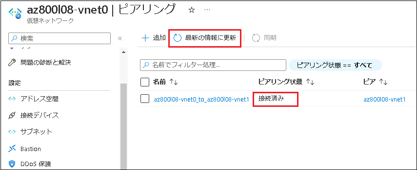

1. **[az800l08 -vnet0 | ピアリング]** 画面で **[ + 追加]** をクリックします。

1. ピアリングの追加 ページで次の設定を指定し、 **[追加]** をクリックします。指示がないものは規定値のままで構いません。

     | 設定                                               | 値                                          |
     | -------------------------------------------------- | ------------------------------------------- |
     | ピアリング リンク名                                | **az800l08-vnet0_to_az800l08-vnet2**        |
     | リモート仮想ネットワークへのトラフィック           | **許可 (規定)**                             |
     | リモート仮想ネットワークから転送されたトラフィック | **許可 (規定)**                             |
     | 仮想ネットワーク ゲートウェイまたはルート サーバー | **なし (規定)**                             |
     | ピアリング リンク名                                | **az800l08-vnet2_to_az800l08-vnet0**        |
     | 仮想ネットワークのデプロイモデル                   | **Resource Manager (リソースマネージャー)** |
     | 仮想ネットワーク                                   | **az800l08-vnet2**                          |
     | リモート仮想ネットワークへのトラフィック           | **許可 (規定)**                             |
     | リモート仮想ネットワークから転送されたトラフィック | **許可 (規定)**                             |
     | 仮想ネットワーク ゲートウェイ                      | **なし (規定)**                             |

     >**注**: この手順を完了すると、2 つのピアリング (1 つは **az800l08-vnet0** から **az800l08-vnet2** へ、もう 1 つは **az800l08-vnet2** から **az800l08-vnet0**へ) を確立します。 これでハブ アンド スポーク トポロジの設定は完了です (**az800l08-vnet0** 仮想ネットワークがハブの役割を果たし、**az800l08-vnet1** と **az800l08-vnet2** はそのスポークです)。

1. **[az800l08 -vnet0 | ピアリング]** 画面に戻り、2つのピアリングが接続済みであることを確認し、タスク3に進んでください。

### <a name="task-3-test-transitivity-of-virtual-network-peering"></a>**タスク3: 仮想ネットワーク ピアリングの推移性をテストする**

このタスクでは、Network Watcher を使って、仮想ネットワーク ピアリング間の接続をテストします。

>**注**: このタスクを開始する前に、この演習の最初のタスクで呼び出したスクリプトが正常に完了したことを確認します。

1. Azure portal で、 **[リソース、サービス、およびドキュメントの検索]テキスト ボックス** のツール バーで **Virtual Machines** を検索して、サービス一覧に表示された **[Virtual Machines]** を選択します。

2. 仮想マシンの一覧から、 **「az800l0-vm0」** を選択します。

3. 左ナビゲーションペインを下にスクロールし、 **[実行コマンド]** をクリックします。

4.  **[RunPowerShellScript]** を選択し、ブロンプロが表示させたら、以下のPowerShellコマンドレットを実行します。

   ```powershell
   Test-NetConnection -ComputerName 10.81.0.4 -Port 3389 -InformationLevel 'Detailed'
   ```

   > **注 : 実行結果が返ってくるまでに数分かかります。**
   >
   > **注 : 宛先 IP アドレスの 10.81.0.4 は az800l0-vm1 の プライベート IP アドレスです。このコマンドを実行することによって、TCP ポート 3389 での az800l0-vm1 への接続性をテストしています。**

5. 実行結果を確認し、 **[TcpTestSuccessed]** の結果が **[True]** と返ってくれば、接続ができています。

6. プロンプトで、以下のコマンドレットを実行し、接続性のテストを実行します。

   ```powershell
   Test-NetConnection -ComputerName 10.82.0.4 -Port 3389 -InformationLevel 'Detailed'
   ```

   > **注 : 実行結果が返ってくるまでに数分かかります。**
   >
   > **注 : 宛先 IP アドレスの 10.82.0.4 は az800l0-vm2 の プライベート IP アドレスです。このコマンドを実行することによって、TCP ポート 3389 での az800l0-vm2 への接続性をテストしています。**

7. 実行結果を確認し、 **[TcpTestSuccessed]** の結果が **[True]** と返ってくれば、接続ができています。

8. 実行コマンド画面を×で閉じます。

9.  **[Virtual Machines]** に戻り、仮想マシンの一覧から、 **「az800l0-vm1」**を選択します。

10. 左ナビゲーションペインを下にスクロールし、 **[実行コマンド]** をクリックします。

11. **[RunPowerShellScript]** を選択し、ブロンプロが表示させたら、以下のPowerShellコマンドレットを実行します。

    ```
    Test-NetConnection -ComputerName 10.82.0.4 -Port 3389 -InformationLevel 'Detailed'
    ```

    > **注 : 実行結果が返ってくるまでに数分かかります。**
    >
    > **注 : 宛先 IP アドレスの 10.82.0.4 は az800l0-vm2 の プライベート IP アドレスです。このコマンドを実行することによって、TCP ポート 3389 での az800l0-vm2 への接続性をテストしています。**

12. 実行結果を確認し、 **[TcpTestSuccessed]** の結果が **[False]** となり、接続に失敗することが確認できます。

    > **注 : az800l0-vm1とaz800l0-vm2は直接通信できないため、これは正しい結果です。**
    >
    > **注: 2 つのスポーク仮想ネットワーク ( az800l08-vnet1 と az800l08-vnet2 ) は相互にピアリングされておらず、仮想ネットワーク ピアリングが推移的ではないことから、このような結果になります。**

13. 実行コマンド画面を×で閉じます。

### <a name="task-3-test-transitivity-of-virtual-network-peering"></a>オプション: Network Watcherを使用して、仮想ネットワーク ピアリングの推移性をテストする

このタスクでは、Network Watcher を使って、仮想ネットワーク ピアリング間の接続をテストします。

>**注**: このタスクを開始する前に、この演習の最初のタスクで呼び出したスクリプトが正常に完了したことを確認します。

1.  Azure portal で、 **[リソース、サービス、およびドキュメントの検索]テキスト ボックス** のツール バーで **Network Watcher** を検索して、サービス一覧に表示された **[Network Watcher]** を選択します。

1. **Network Watcher**ページで、左ナビゲーションペインの **[ネットワーク診断ツール]** から **[接続のトラブルシューティング]** をクリックします。

    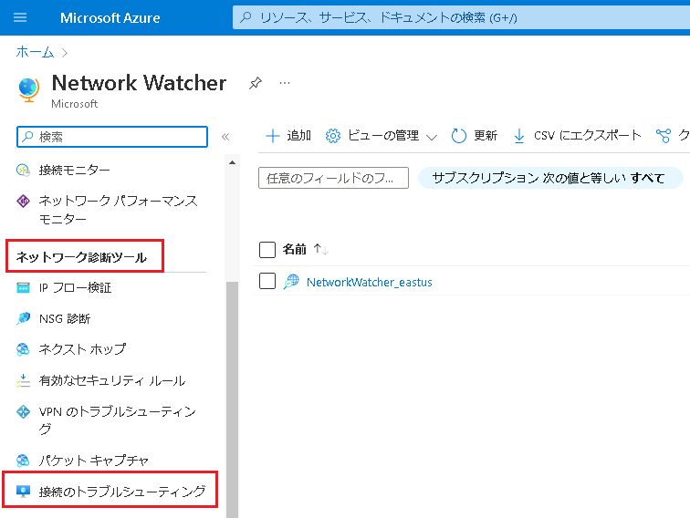

1.  **[Network Watcher - 接続のトラブルシューティング]**  ページで、次の設定を使用して **[チェック]** をクリックします。指示がないものは規定値のままで構いません。

    | 設定 | 値 |
    | --- | --- |
    | サブスクリプション         | **あらかじめ入力されているものを使用してください** |
    | リソース グループ          | **AZ80x-RG**                                       |
    | ソースの種類               | **仮想マシン**                                     |
    | 仮想マシン                 | **az800l08-vm1**                                   |
    | 宛先                       | **手動で指定**                                     |
    | URI、FQDN 、IPv4のいずれか | **10.81.0.4**                                      |
    | プロトコル                 | **TCP**                                            |
    | 宛先ポート                 | **3389**                                           |

    > **注**: **10.81.0.4** は、**az800l08-vm1** のプライベート IP アドレスを表します。 このテストでは **TCP** ポート **3389** を使っています。Azure 仮想マシンではリモート デスクトップが既定で有効であり、仮想ネットワーク内および仮想ネットワーク間でアクセスできるためです。

1. 接続チェックの結果が返ってくるのを待ちます。(結果が返ってくるまでに、5分以上かかる場合があります)。 状態が "**到達可能**" であることを確認してください。 ネットワーク パスを確認します。接続が直接であり、仮想マシン間に中間ホップがないことに注意してください。

    > **注**: ハブ仮想ネットワークが最初のスポーク仮想ネットワークと直接ピアリングされていることから、このようになります。

1. **[Network Watcher - 接続のトラブルシューティング]** ページから、次の設定をし、再度チェックを開始します (その他は既定値のままにします)。

    | 設定 | 値 |
    | --- | --- |
    | サブスクリプション | **あらかじめ入力されているものを使用してください** |
    | リソース グループ | **AZ800-L0801-RG** |
    | ソースの種類 | **仮想マシン** |
    | 仮想マシン | **az800l08-vm0** |
    | 宛先 | **手動で指定** |
    | URI、FQDN 、IPv4のいずれか | **10.82.0.4** |
    | プロトコル | **TCP** |
    | 宛先ポート | **3389** |

    > **注**: **10.82.0.4** は、**az800l08-vm2** のプライベート IP アドレスを表します。 

1. **[チェック]** を選び、接続チェックの結果が返されるまで待ちます。 状態が "**到達可能**" であることを確認します。 

    > **注: ハブ仮想ネットワークが 2 つ目のスポーク仮想ネットワークと直接ピアリングされていることから接続できることが確認できます。**

1. **[Network Watcher - 接続のトラブルシューティング]** ページから、次の設定でもう一度チェックを開始し (その他は既定値のままにします)、もう一度チェックします。

    | 設定 | 値 |
    | --- | --- |
    | サブスクリプション | **あらかじめ入力されているものを使用してください** |
    | リソース グループ | **AZ800-L0801-RG** |
    | 送信元の種類 | **仮想マシン** |
    | 仮想マシン | **az800l08-vm1** |
    | 到着地 | **手動で指定** |
    | URI、FQDN、または IPv4 | **10.82.0.4** |
    | Protocol | **TCP** |
    | 宛先ポート | **3389** |
    
1. 接続チェックの結果が返されるまで待ちます。 状態が "**到達不能**" であることが確認できます。

    > **注: 2 つのスポーク仮想ネットワークが相互にピアリングされておらず、仮想ネットワーク ピアリングが推移的ではないことから、正しい結果です。**

### <a name="task-4-configure-routing-in-the-hub-and-spoke-topology"></a>タスク 4: ハブ アンド スポーク トポロジでルーティングを構成する

このタスクでは、**az800l08-vm1** 仮想マシンのネットワーク インターフェイスで IP 転送を有効にし、スポーク仮想ネットワーク上でユーザー定義ルートを構成することで、2 つのスポーク仮想ネットワーク間のルーティングを、テストします。

1. Azure portal   **[リソース、サービス、およびドキュメントの検索]テキスト ボックス** のツール バーで、 **[Virtual Machines]** を検索し、 **az800l08-vm0** 仮想マシンのページに移動します。

1.  **az800l08 -vm0** 仮想マシン ページの **[設定]** セクションで、 **[ネットワーク]** を選択します。

    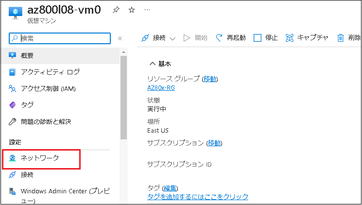

1.  **[ネットワーク インターフェイス]** ラベルの横にある **az800l08-nic0リンク** をクリックします。

    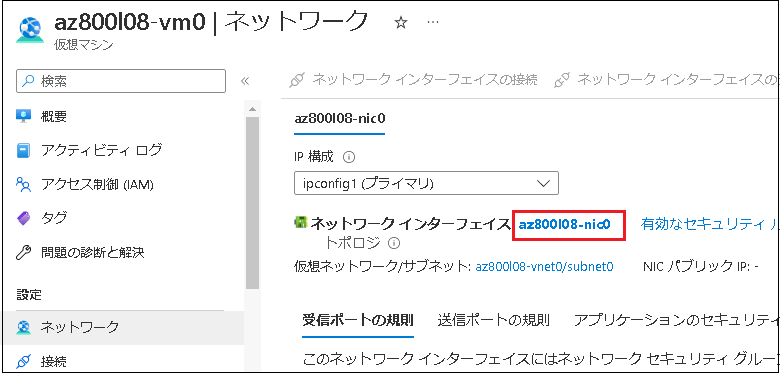

1.  **[az800l08-nic0 ネットワーク インターフェイス]**  ページの **[設定]** クションで **[ IP 構成]** をクリックします。

    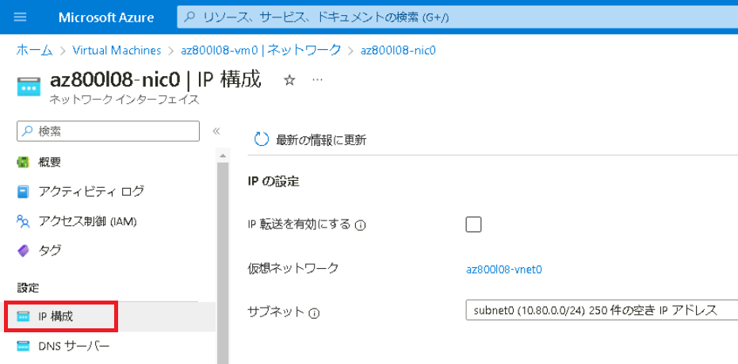

1.  **[ IP 転送]** のスライダーを **[有効]** に設定し、 **[保存]** をクリックします。

    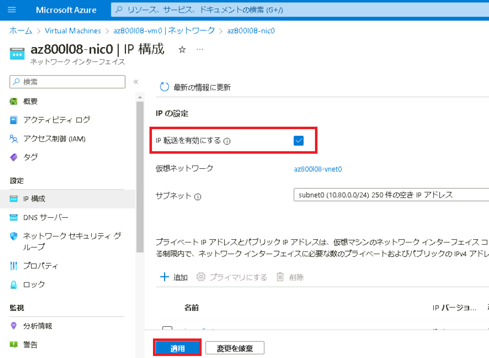

    > **注: この設定は、 az800l08-vm0が 2 つのスポーク仮想ネットワーク間のトラフィックをルーティングするルーターとして機能するために必要です。**

    > **注**: 次に、ルーティングをサポートするために、**az800l08-vm0** 仮想マシンのオペレーティング システムを構成する必要があります。

1. Azure portal で **az800l08-vm0** 仮想マシン ページに戻ります。

1.  **az800l08-vm0** ページの左ナビゲーションペイン **[操作]** セクションで、 **[実行コマンド]** を選択し、コマンドの一覧で **[ RunPowerShellScript ]** をクリックします。

   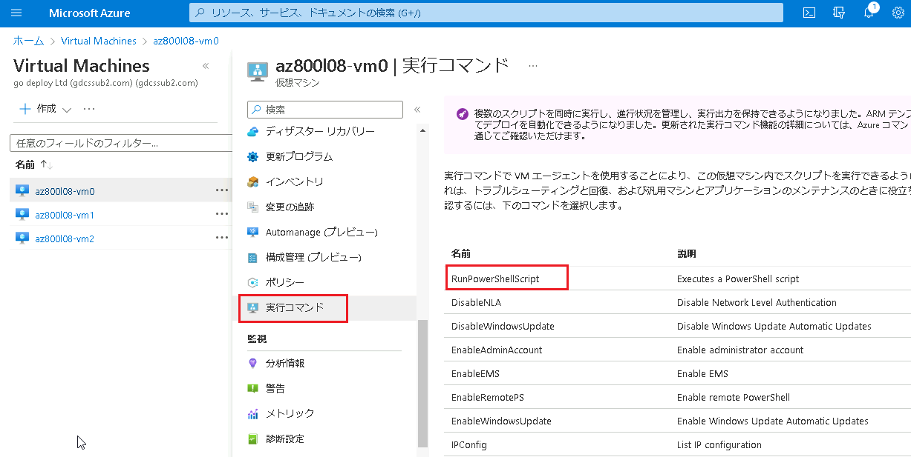

   

1.  **[実行コマンドスクリプト]** ページで、次のコマンドを入力し、 **[実行]** をクリックしてリモート アクセス Windows サーバーの役割をインストールします。

   ```powershell
   Install-WindowsFeature RemoteAccess -IncludeManagementTools
   ```

   > **注: コマンドが正常に完了したのを確認してから、次の作業に進んでください。**

1.   **[PowerShell スクリプト]** セクションで、前に入力したコマンドを次のコマンドに置き換え、**[実行]** をクリックして、ルーティング役割サービスをインストールします。

   ```powershell
   Install-WindowsFeature -Name Routing -IncludeManagementTools -IncludeAllSubFeature
   Install-WindowsFeature -Name "RSAT-RemoteAccess-Powershell"
   Install-RemoteAccess -VpnType RoutingOnly
   Get-NetAdapter | Set-NetIPInterface -Forwarding Enabled
   ```

   > **注: コマンドが正常に完了したことの確認を待ちます。**

   > **注**: 次の作業で、スポーク仮想ネットワーク上でユーザー定義のルートを作成および構成する必要があります。

   コマンドの実行が終了したのを確認したら、 **[実行コマンドスクリプト]** ページは閉じて構いません。

1.  Azure portal のツール バー **[リソース、サービス、およびドキュメントの検索] テキスト ボックス**で、 **[ルート テーブル]** を検索し、サービス一覧から **[ルートテーブル]** を選択します。

1.  **[ルート テーブル]** ページで **[ + 作成]** をクリックします。

1.  **[ルートテーブルの作成]** ページで次の設定で次の設定をします。指示がないものは規定値のままで構いません。

    | 設定 | 値 |
    | --- | --- |
    | サブスクリプション | **あらかじめ入力されているものを使用してください** |
    | リソース グループ | **AZ80x-RG** |
    | リージョン | **East US (米国東部)** |
    | 名前 | **az800l08-rt12** |
    | ゲートウェイのルートを伝達する | **No (いいえ)** |

    

1.  **[確認と作成]** をクリックし、検証に成功したことを確認してから、 **[作成]** をクリックします。

     > **注 : ルートテーブルが作成されるまで待ちます。通常、作成されるまでに約 1 分程度かかります。**

1.  **[リソースに移動]** を選択します。

1.  **az800l08 -rt12 ルート テーブル** ページの左ナビゲーションペインの **[設定]** セクションで、 **[ルート]** を選択し、 **[ + 追加]** をクリックします。

     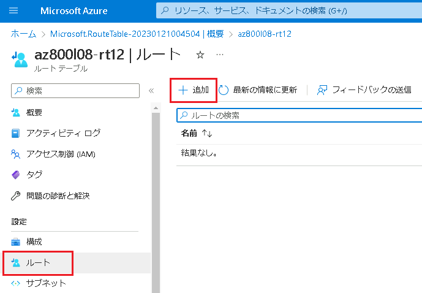

1.  **[ルートの追加]** ページで、次の設定で新しいルートを追加します。指示がないものは規定値のままで構いません。

     | 設定 | 値 |
     | --- | --- |
     | ルート名 | **az800l08-route-vnet1-to-vnet2** |
     | アドレス プレフィックス送信先 | **IP アドレス** |
     | 宛先 IP アドレス/CIDR 範囲 | **10.82.0.0/20** |
     | ネクストホップの種類 | **仮想アプライアンス** |
     | ネクストホップアドレス | **10.80.0.4** |

     > **注**: **10.80.0.4** は、**az800l08-vm0** のプライベート IP アドレスです。 

     値を設定したら、 **[追加]** をクリックします。

1.  **az800l08 -rt12 ルート** ページに戻り、左ナビゲーションペインの **[設定]** セクションから **[サブネット]** を選択し、 **[ +関連付け]** をクリックします。

     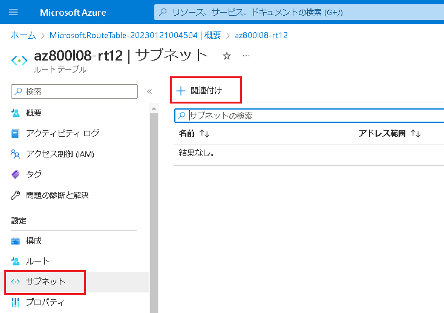


18.   **サブネットの関連付け** ページで以下の設定をして、サブネットに関連付けします。

    | 設定             | 値                 |
    | ---------------- | ------------------ |
    | 仮想ネットワーク | **az800l08-vnet1** |
    | サブネット       | **subnet 0**       |

    値を設定したら、 **[OK]** をクリックしてサブネットに関連付けしてください。

19.  **ルートテーブル** ページに戻り、 **[ + 作成]** をクリックします。

20.  **[ルートテーブルの作成]** ページで以下の値を設定し、2つめのルートテーブルを作成します。

    | 設定                           | 値                                                 |
    | ------------------------------ | -------------------------------------------------- |
    | サブスクリプション             | **あらかじめ入力されているものを使用してください** |
    | リソースグループ               | **AZ80X-RG**                                       |
    | リージョン                     | **East US (米国東部)**                             |
    | 名前                           | **az800l08-rt21**                                  |
    | ゲートウェイのルートを伝達する | **NO (いいえ)**                                    |

    値を設定したら、 **[確認および作成]** をクリックし、検証に成功したことを確認してから **[作成]** をクリックします。

> **注 : ルートテーブルが作成されるまで待ちます。通常、作成されるまでに約 1 分程度かかります。**

21.  **[リソースに移動]** をクリックします。

22.  **az800l08 -rt12 ルート テーブル** ページの左ナビゲーションペインの **[設定]** セクションで、 **[ルート]** を選択し、 **[ + 追加]** をクリックします。

23. **[ルートの追加]** ページで、次の設定で新しいルートを追加します。指示がないものは規定値のままで構いません。

    | 設定                          | 値                                |
    | ----------------------------- | --------------------------------- |
    | ルート名                      | **az800l08-route-vnet2-to-vnet1** |
    | アドレス プレフィックス送信先 | **IP アドレス**                   |
    | 宛先 IP アドレス/CIDR 範囲    | **10.81.0.0/20**                  |
    | ネクストホップの種類          | **仮想アプライアンス**            |
    | ネクストホップアドレス        | **10.80.0.4**                     |

　　値を設定したら、 **[追加]** をクリックします。

24.  **az800l08 -rt12 ルート** ページに戻り、左ナビゲーションペインの **[設定]** セクションから **[サブネット]** を選択し、 **[ +関連付け]** をクリックします。

25. **サブネットの関連付け** ページで以下の設定をして、サブネットに関連付けします。

    | 設定             | 値                 |
    | ---------------- | ------------------ |
    | 仮想ネットワーク | **az800l08-vnet2** |
    | サブネット       | **subnet 0**       |

　　値を設定したら、 **[OK]** をクリックしてサブネットに関連付けしてください。

26. Azure portal で、**Network Watcher - 接続のトラブルシューティング** ページに戻ります。

27.  **接続のトラブルシューティング** ページで、次の設定を使用してチェックを開始します。指示がないものは規定値のままで構いません。

    | 設定                             | 値                                                 |
    | -------------------------------- | -------------------------------------------------- |
    | サブスクリプション               | **あらかじめ入力されているものを使用してください** |
    | リソースグループ                 | **AZ80x-RG**                                       |
    | ソースの種類                     | **仮想マシン**                                     |
    | 仮想マシン                       | **az800l08-vm1**                                   |
    | 宛先                             | **手動で指定**                                     |
    | URI、FQDN 、IPアドレスのいずれか | **10.82.0.4**                                      |
    | プロトコル                       | **TCP**                                            |
    | 宛先のポート                     | **3389**                                           |

28.  **[チェック]** を選択し、接続チェックの結果が返されるまで待ちます。ステータスが **Reachable**であることを確認します。ネットワーク パスを確認し、トラフィックが **az800l08-nic0 ネットワーク アダプター** に割り当てられた **10.80.0.4** 経由でルーティングされたことが確認できます。


### <a name="exercise-2-implement-dns-name-resolution-in-azure"></a>演習 2: Azure で DNS 名前解決を実装する

### <a name="scenario"></a>シナリオ

Azure プライベート DNS ゾーンを使って仮想ネットワーク間の Azure 仮想マシンの DNS 名前解決を実装し、外部の名前解決のために Azure DNS ゾーンの使用を検証します。

この演習の主なタスクは次のとおりです。

1. Azure プライベート DNS 名前解決を構成する
1. Azure プライベート DNS 名前解決を検証する
1. Azure パブリック DNS 名前解決を構成する
1. Azure パブリック DNS 名前解決を検証する

### <a name="task-1-configure-azure-private-dns-name-resolution"></a>タスク 1: Azure プライベート DNS 名前解決を構成する

このタスクでは、Azure プライベート DNS ゾーンを使って、仮想ネットワーク間の DNS 名前解決を構成します。

1.  **SEA-ADM1** のAzure portal の、ツールバー **[リソース、サービス、およびドキュメントの検索]** テキスト ボックスで **[プライベート DNS ゾーン]** を検索して、サービス一覧から **[プライベートDNSゾーン]** を選択します。

1.  **[プライベートDNSゾーン]** ページで [ + 作成] をクリックします。

1.   **[プライベートDNSゾーンの作成]** ページで、次の設定をして、**[確認および作成]** をクリックします。指示がないものは規定値のままで構いません。

    | 設定 | 値 |
    | --- | --- |
    | サブスクリプション | **あらかじめ入力されているものを使用してください** |
    | リソース グループ | **[新規作成]** のリンクをクリックし、 **[AZ800-L0802-RG]** という名前のリソースグループを作成します。 |
    | インスタンスの詳細 : 名前 | **contoso.org** |
    | リソース グループの場所 | **East US (米国東部)** |

    >**注**: プライベート DNS ゾーンが作成されるまで待ちます。 これには 2 分ほどかかります。

1. 検証に成功したことを確認してから、 **[作成]** をクリックします。

    > **注: プライベート DNS ゾーンが作成されるまで待ちます。作成されるまでに、2～3分程度かかります。**

1.  **[リソースに移動]** をクリックして、**contoso.org** のDNS プライベート ゾーン ページを開きます。

1.  **contoso.orgプライベート DNS ゾーン** ページの 左ナビゲーションペイン **[設定]** セクションで、 **[仮想ネットワーク リンク]** を選択します。

    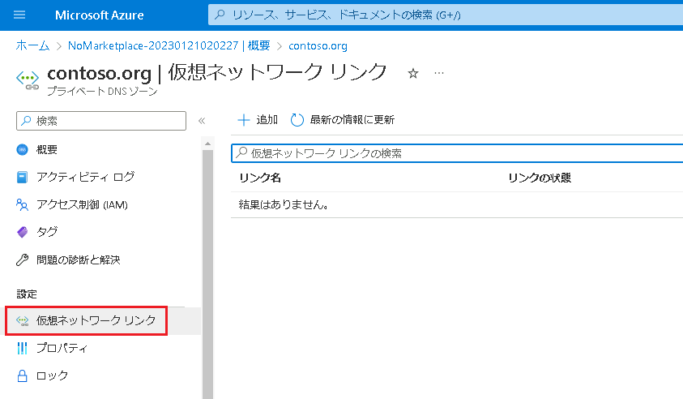

1.  **contoso.org | [仮想ネットワーク リンク]** ページで、 **[ + 追加]** をクリックし、次の値を設定します。

    指示がないものは規定値のままで構いません。

    | 設定                 | 値                                                 |
    | -------------------- | -------------------------------------------------- |
    | リンク名             | **az800l08-vnet0-link**                            |
    | サブスクリプション   | **あらかじめ入力されているものを使用してください** |
    | 仮想ネットワーク     | **az800l08-vnet0**                                 |
    | 自動登録を有効にする | **チェックボックスオン**                           |

    この設定をすることで、前の演習で作成した仮想ネットワークの、ネットワークリンクを作成することになります。

1.  [OK] をクリックして、仮想ネットワークリンクの追加を待ちます。

    > 注 : 仮想ネットワークリンクが作成されるまでに、1分程度かかります。 

1. 7の手順を繰り返し、仮想ネットワーク **az800l08-vnet1** と **az800l08-vnet2** に対し、それぞれ **az800l08-vnet1-link** および **az800l08-vnet2- link** という名前の仮想ネットワーク リンク (自動登録を有効にして) を作成します。

    3つの仮想ネットワークリンクが作成されたことを確認し、次の作業に進んでください。

    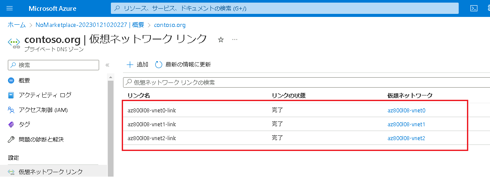


10.  **contoso.org** の **プライベート DNS ゾーン** ページで、左側のナビゲーションペインから **[概要]** を確認します。

11.  [概要] セクションで、DNS レコード セットの一覧を確認し、 **az800l08-vm0、az800l08-vm1、az800l08-vm2** のAレコードが **[自動登録済み]** として一覧に表示されていることを確認します。

    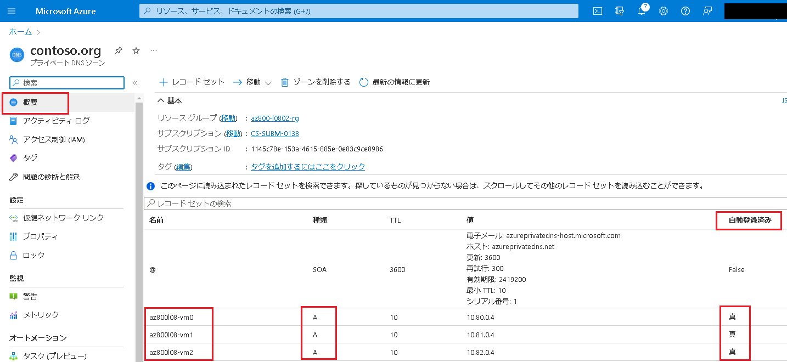

    > **注 : レコードが確認できない場合は、 [最新の情報に更新] をクリックしてください。**


### <a name="task-2-validate-azure-private-dns-name-resolution"></a>タスク2: Azure プライベート DNS 名前解決を検証する

このタスクでは、Azure プライベート DNS 名前解決を確認します。

1.  Azure portal で、 **[Network Watcher - 接続のトラブルシューティング]** ページに戻ります。
1. 次の設定でチェックを開始します (その他は既定値のままにします)。

    | 設定 | 値 |
    | --- | --- |
    | サブスクリプション | **あらかじめ入力されているものを使用してください** |
    | リソース グループ | **AZ800-L0801-RG** |
    | 送信元の種類 | **仮想マシン** |
    | 仮想マシン | **az800l08-vm1** |
    | 到着地 | **手動で指定** |
    | URI、FQDN、または IPv4 | **az800l08-vm2.contoso.org** |
    | 優先 IP バージョン | **IPv4** |
    | Protocol | **TCP** |
    | 宛先ポート | **3389** |

1. 接続チェックの結果が返されるまで待ちます。 状態が "**到達可能**" であることを確認します。 

    > **注: ターゲットの完全修飾ドメイン名 (FQDN) が Azure プライベート DNS ゾーンを介して解決可能であることから、このようになります。** 

### <a name="task-3-configure-azure-public-dns-name-resolution"></a>**タスク 3: Azure パブリック DNS 名前解決を構成する**

このタスクでは、Azure パブリック DNS ゾーンを使って外部 DNS 名前解決を構成します。

1. **SEA-ADM1** の Microsoft Edge ウィンドウで、新しいタブを開き、　`https://www.godaddy.com/domains/domain-name-search`に移動します。

1. ドメイン名検索を使って、現在使われていないドメイン名を特定します。

1. **SEA-ADM1** で、Azure portal の タブに切り替え、ツールバーの **[リソース、サービス、ドキュメントを検索]** テキスト ボックスで **[DNS ゾーン]** を検索して、サービス一覧から **[DNSゾーン]** を選択します。

1.  **[DNSゾーン]** ページで  **[ + 作成]** をクリックします。 

1.  **[DNS ゾーンの作成]**  ページで、次の値を設定します。指示がないものは規定値のままで構いません。

    | 設定 | 値 |
    | --- | --- |
    | サブスクリプション | **あらかじめ入力されているものを使用してください** |
    | リソース グループ | **AZ800-L0802-RG** |
    | 名前 | **このタスクの2.の作業で確認した DNS ドメイン名** |

    >**注**: DNS ゾーンが作成されるまで待ちます。 これには 1 分ほどかかります。

1.  **[確認および作成]** をクリックし、検証に成功したことを確認してから **[作成]** をクリックします。

    > **注 : DNS ゾーンが作成されるまで待ちます。作成されるまでに約 1 分程度かかります。**

7.  **[リソースに移動]** をクリックして、新しく作成された DNS ゾーンのページを開きます。

8.  **[DNS ゾーン]** ページで、 **[ + レコード セット]** をクリックします。

9.  [レコード セットの追加] ページで、次の値を設定します。指示がないものは規定値のままで構いません。

   | 設定                       | 値              |
   | -------------------------- | --------------- |
   | 名前                       | **www**         |
   | 種類                       | **A**           |
   | エイリアスのレコードセット | **いいえ**      |
   | TTL                        | **1**           |
   | TTLの単位                  | **時間**        |
   | IPアドレス                 | **20.30.40.50** |

   設定したら、 **[OK]** をクリックします。

>**注**: IP アドレスとそれに対応する名前は任意です。 上記の作業は、パブリック DNS レコードの実装例です。DNS レジストラーから名前空間を購入する必要があるようなシナリオの代替えではありません。

10. DNS ゾーン ページで、**ネーム サーバー 1** のFQDNを確認します。

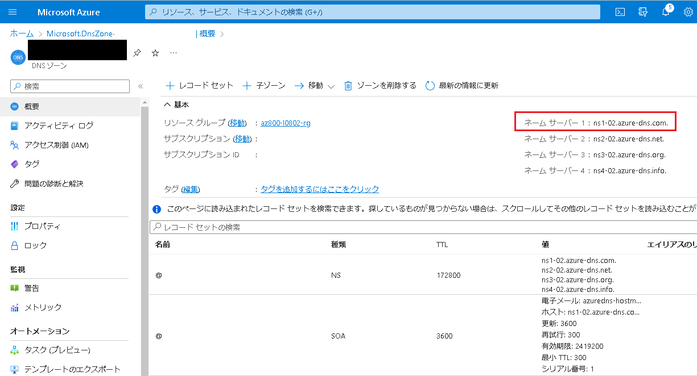

>**注**: **ネームサーバー 1** のFQDN名をメモします。 次のタスクで必要になります。

### <a name="task-4-validate-azure-public-dns-name-resolution"></a>タスク 4: Azure パブリック DNS 名前解決を検証する

このタスクでは、Azure パブリック DNS ゾーンを使って外部 DNS 名前解決を確認します。

1. **SEA-ADM1** の **[スタート]** メニューで、**Windows PowerShell** を選択します。
1. **Windows PowerShell** コンソールで次のコマンドを実行し、新しく作成した DNS ゾーンの **www** DNS レコード セットの外部名前解決をテストします (`<Name server 1>` は、前のタスクでメモしたこのタスクの**ネーム サーバー 1** の名前に置き換えます。また、`<domain name>` プレースホルダーは、前のタスクで作成した DNS ドメイン名に置き換えて実行してください)。

   ```powershell
   nslookup www.<domain name> <Name server 1>
   ```

1. 実行結果に **20.30.40.50** のパブリック IP アドレスが含まれていることを確認します。

    >**注**: **nslookup** コマンドでは、レコードのクエリを実行する DNS サーバーの IP アドレスを指定できるため、名前解決は期待どおりに動作します (ここでは `<Name server 1>` とします。 一般にアクセス可能な DNS サーバーに対してクエリを実行して名前解決を行うには、DNS レジストラーにドメイン名を登録し、Azure portal のパブリック DNS ゾーン ページに記載されているネーム サーバーを、そのドメインに対応する名前空間の権限として構成する必要があります。


### <a name="results"></a>結果

このラボを完了すると、次の作業が完了しています。

- ラボ環境をプロビジョニングしました。
- ハブ アンド スポーク ネットワーク トポロジを構成しました。
- 仮想ネットワーク ピアリングの推移性をテストしました。
- ハブ アンド スポーク トポロジでルーティングを構成しました。
- 内部の名前解決のために Azure DNS を構成しました。
- 外部の名前解決のために Azure DNS を構成しました。
